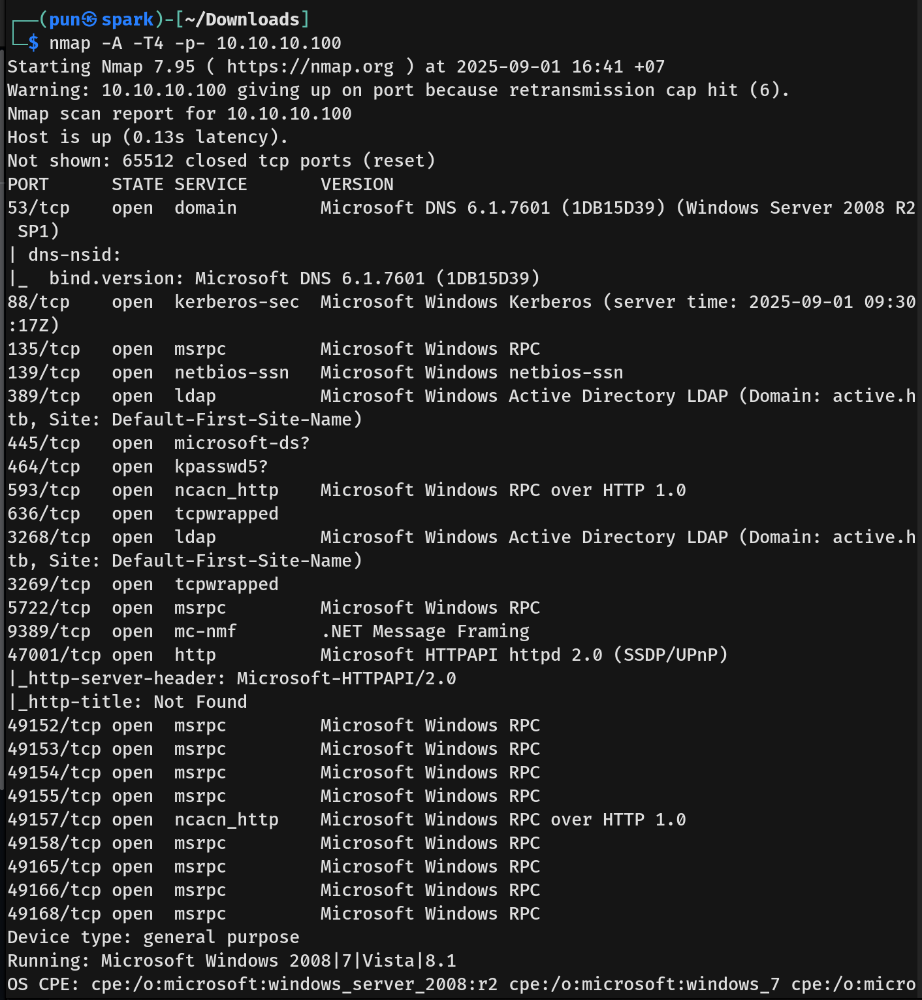
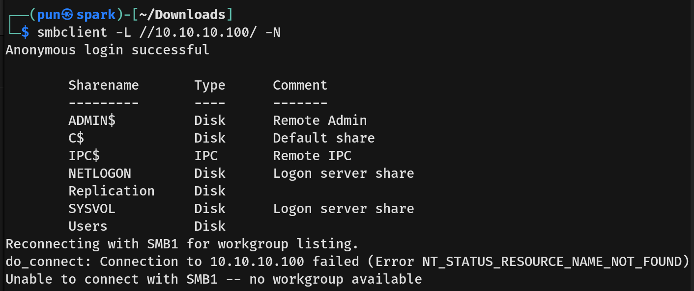
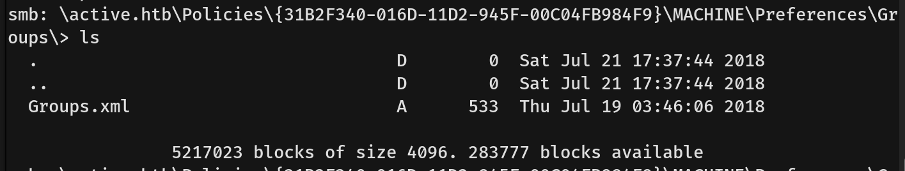
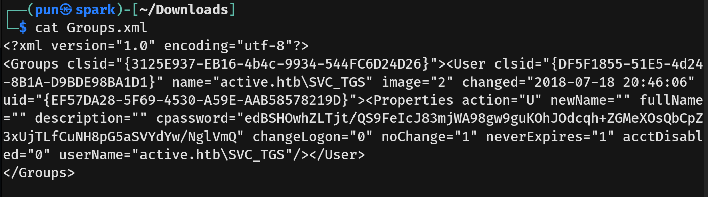
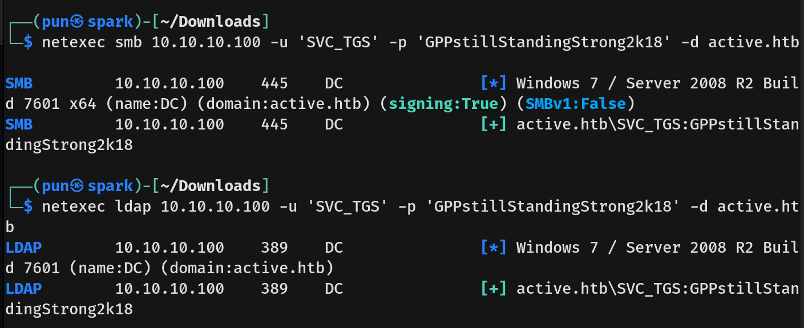
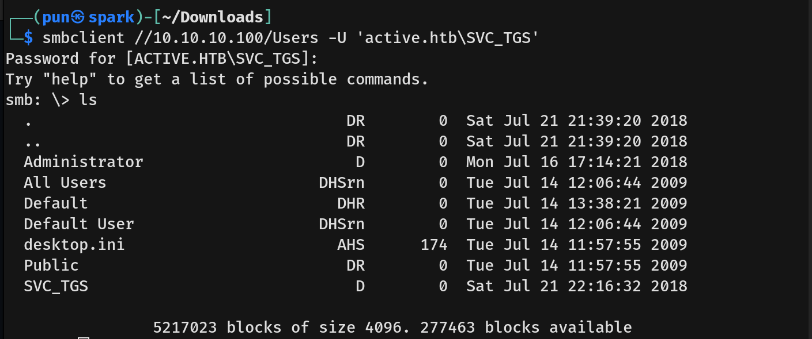
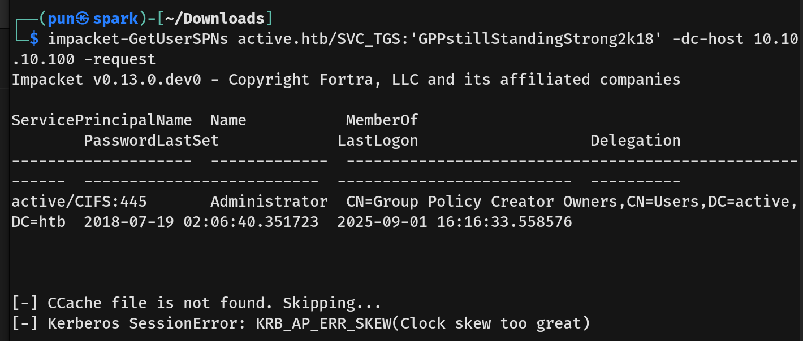
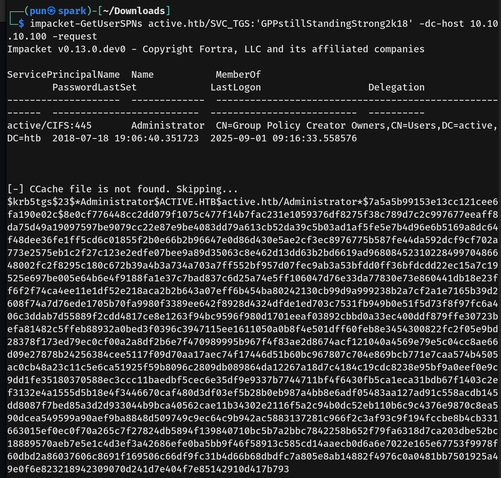
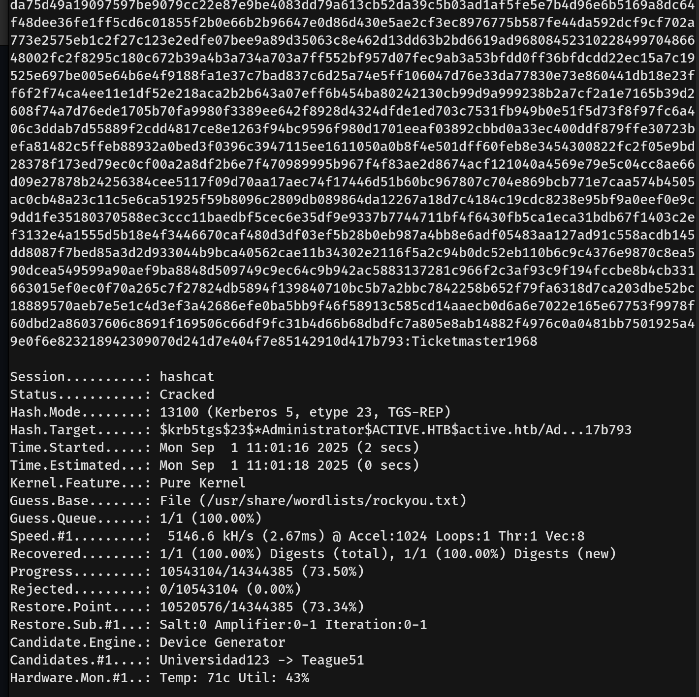
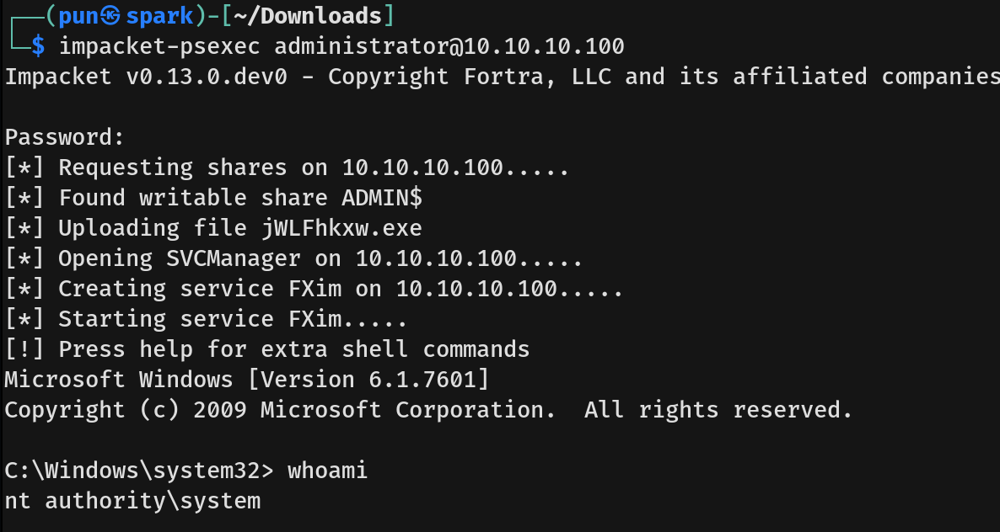

# Active Writeup - by Thammanant Thamtaranon  
- Active is an easy Windows machine hosted on Hack The Box.

## Reconnaissance  
- I started with a full TCP port scan including service/version detection and OS fingerprinting:
```bash
nmap -A -T4 -p- 10.10.10.100
```
  
- The scan showed multiple open ports:  
  - 88 (Kerberos)  
  - 135, 139, 444, 5722 (MSRPC/SMB)  
  - 389, 3268 (LDAP / Global Catalog)  
  - 464 (kpasswd5)  
  - 636, 3269 (LDAPS / Global Catalog over SSL)  
  - 593 (RPC over HTTP)  
  - 9389 (AD Web Services)  
  - 47001 (HTTP)

- I added `active.htb` to `/etc/hosts` for proper hostname resolution.

## Scanning & Enumeration  
- We connected to the SMB without password.  
  
- We tried connecting to `Replication` first.  
- In the `\active.htb\Policies\{31B2F340-016D-11D2-945F-00C04FB984F9}\MACHINE\Preferences\Groups\` we found `Group.xml`  
  
- `Group.xml` contained the username and password for user `SVC_TGS`.  


## Exploitation  
- We then decrypted the password:
```bash 
gpp-decrypt 'edBSHOwhZLTjt/QS9FeIcJ83mjWA98gw9guKOhJOdcqh+ZGMeXOsQbCpZ3xUjTLfCuNH8pG5aSVYdYw/NglVmQ'
```
  
- We tried connecting to `Users` but got `NT_STATUS_ACCESS_DENIED`.  
- Next, we tried to enumerate LDAP without credentials but got an error.  
- So we used the newly found credential to enumerate SMB and LDAP, both worked.  
  
- We then connected to SMB and read the `Users` share
  
- We captured the user flag.

## Privilege Escalation  
- We used Impacket to enumerate all accounts with SPNs (Service Principal Name set):  
```bash 
impacket-GetUserSPNs active.htb/SVC_TGS:'GPPstillStandingStrong2k18' -dc-host 10.10.10.100
```
- We found the `Administrator` account. Next, we requested a `TGS` ticket for `active/CIFS:445` using `SVC_TGS`.  
  
- We initially got an error because our clock was different from the domain controller’s clock. We fixed it by:  
  - Disabling NTP auto-update: `timedatectl set-ntp off`  
  - Setting the time to match the target: `sudo rdate -n 10.10.10.100`  
  - Running the command again.  
  
- We copied the hash into `tgs.hash` and cracked it using:  
```bash 
hashcat -m 13100 tgs.hash /usr/share/wordlists/rockyou.txt
```
  
- We then used Impacket to get a shell:
```bash 
impacket-psexec administrator@10.10.10.100
```
- We got a SYSTEM shell and captured the root flag.  

