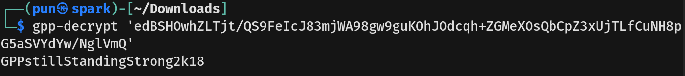

# Active Writeup - by Thammanant Thamtaranon  
- Active is an easy Windows machine hosted on Hack The Box.

## Reconnaissance  
- I started with a full TCP port scan including service/version detection and OS fingerprinting:
```bash
nmap -A -T4 -p- 10.10.10.100
```
  
- The scan showed multiple open ports:  
  - 88 (Kerberos)
  - 135, 139, 444, 5722 (MSRPC/SMB)
  - 389, 3268 (LDAP / Global Catalog)
  - 464 (kpasswd5)
  - 636, 3269 (LDAPS / Global Catalog over SSL)
  - 593 (RPC over HTTP)
  - 9389 (AD Web Services)
  - 47001 (HTTP)

- I added `active.htb` to `/etc/hosts` for proper hostname resolution.

## Scanning & Enumeration  
- We connect to the SMB without password.

- We try connect to `Replication` first.
- In the `\active.htb\Policies\{31B2F340-016D-11D2-945F-00C04FB984F9}\MACHINE\Preferences\Groups\` we found `Group.xml`

- `Group.xml` contain username and password for user `SVC_TGS`.


## Exploitation 
- We then run the need to decrypt the password: `gpp-decrypt 'edBSHOwhZLTjt/QS9FeIcJ83mjWA98gw9guKOhJOdcqh+ZGMeXOsQbCpZ3xUjTLfCuNH8pG5aSVYdYw/NglVmQ'`

- We try connect to `Users` but got `NT_STATUS_ACCESS_DENIED`.
- Now we try enumerate LDAP without credential first, but got error.
- So we use the new found credential to enumerate SMB and LDAP, both are valid.

- We will connect to SMB and try to read `Users` firts: `smbclient //10.10.10.100/Users -U 'active.htb\SVC_TGS'`

- We then capture the user flag.

## Privilege Escalation  
- We will use `Impacket` to enumerate all accounts with SPNs (service Principal Name set):  `impacket-GetUserSPNs active.htb/SVC_TGS:'GPPstillStandingStrong2k18' -dc-host 10.10.10.100 -request`
- We found `Administrator` account, next we can request a `TGS` ticket for `active/CIFS:445` using `SVC_TGS`.

- However, we got the error since our clock is too different from the domain controller’s clock. We need to change our clock:
  - First, disable the Network Time Protocol from auto-updating: `timedatectl set-ntp off`
  - Second, set the time to match the target machine: `sudo rdate -n 10.10.10.100`
  - Lastly, we run the command again.

- We then copy the hash into `tgs.hash` and run `hashcat -m 13100 tgs.hash /usr/share/wordlists/rockyou.txt`

- We then use `Impacket` to get a shell: `impacket-psexec administrator@10.10.10.100`.
- We then got a shell as SYSTEM and capture the root flag.
 
