# Administrator Writeup - by Thammanant Thamtaranon

**Administrator** is a **Medium**-difficulty Windows machine hosted on Hack The Box.

---

## Reconnaissance
- I began with a full TCP port scan to identify open services and the operating system.
  `nmap -A -T4 -p- 10.10.11.42`
  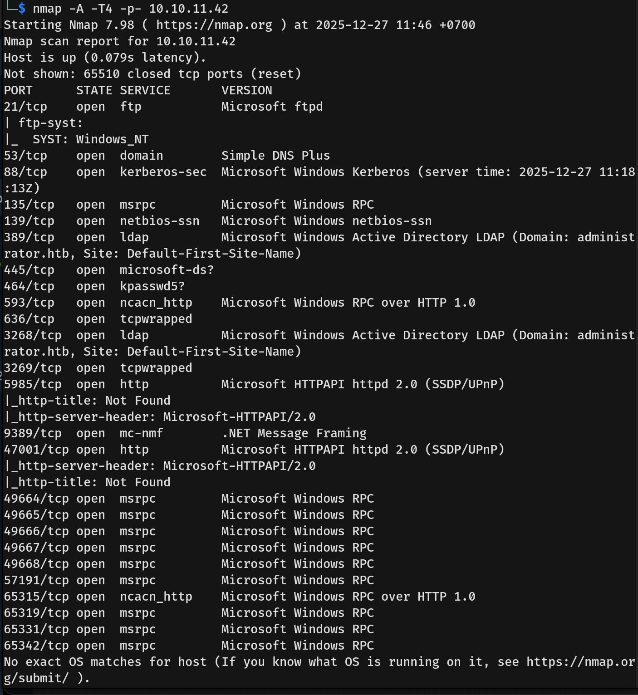
- The scan revealed the standard suite of ports for a **Domain Controller**:
  - **53** — DNS
  - **88** — Kerberos
  - **135/139/445** — RPC/SMB
  - **389/636/3268** — LDAP/LDAPS
  - **21** — FTP (Microsoft ftpd)
  - **5985** — WinRM
- The Nmap scan revealed the domain name: **administrator.htb**. I added this to my `/etc/hosts` file.

---

## Scanning & Enumeration
- We were provided with a valid credential for the user **Olivia**: `ichliebedich`. I used **NetExec (nxc)** to enumerate services using this credential.
  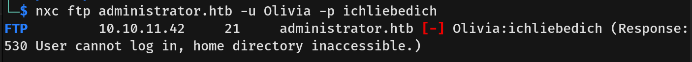
  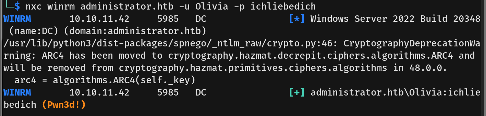
  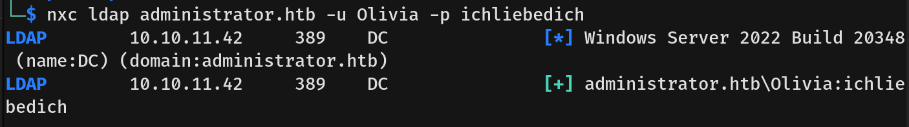
- The LDAP check confirmed the account is valid within Active Directory.
- I attempted to use **Evil-WinRM** to log in as Olivia, however nothing was found inside the machine.
- I then ran **BloodHound** to gather AD information. Initially, it failed to find the domain controller, so I added `dc.administrator.htb` to my `/etc/hosts` file to ensure proper DNS resolution.
  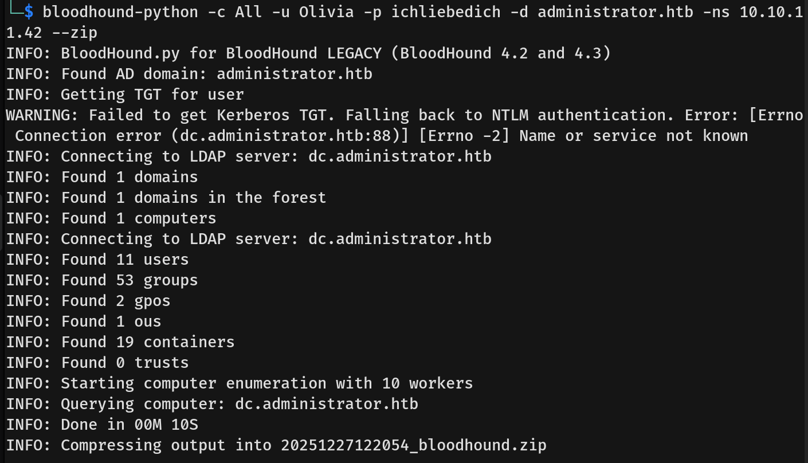
- I ran the collector again successfully.
  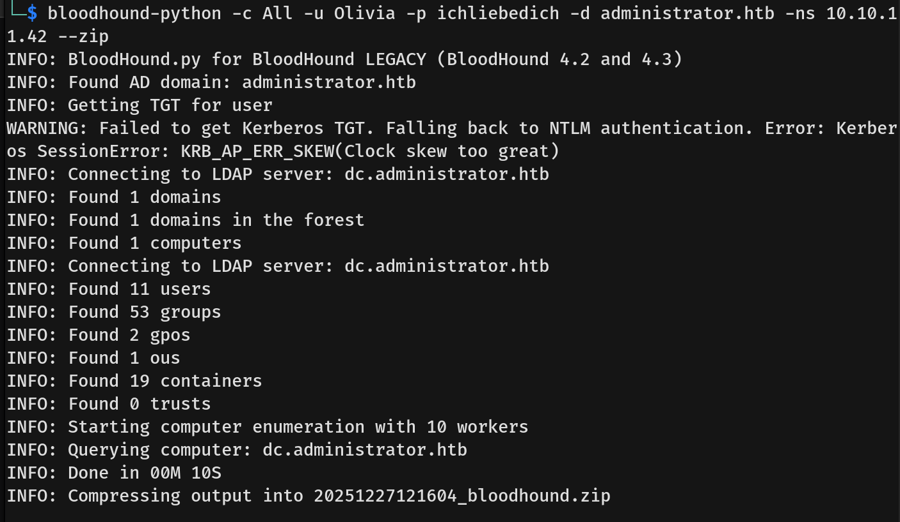
- **Attack Plan:** Analyzing the BloodHound graph, I formulated the following plan:
  1.  **Olivia** has **GenericAll** rights over **Michael**, meaning we can reset his password.
      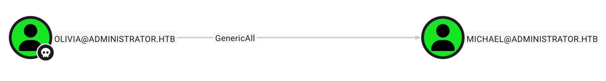
  2.  **Michael** has **ForceChangePassword** rights over **Benjamin**, allowing us to reset Benjamin's password.
      
  3.  **Benjamin** is a member of the **Share Moderators** group. Based on earlier enumeration, this group likely allows access to the FTP service.
      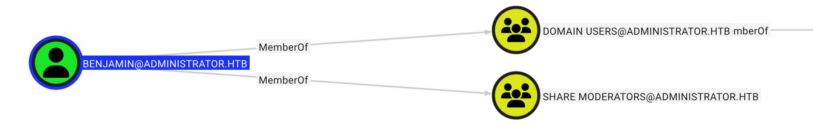

---

## Exploitation
- I proceeded to execute the attack plan using `bloodyAD` to reset the passwords for Michael and then Benjamin.
  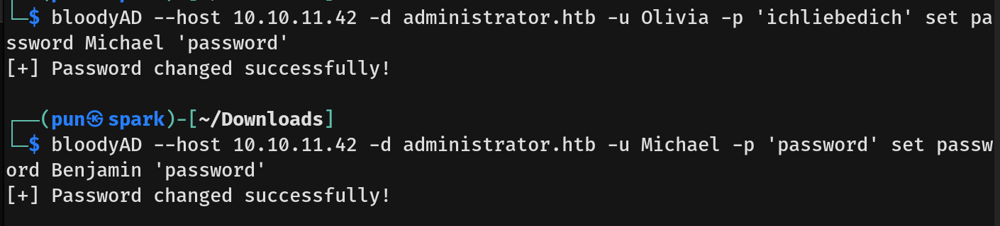
- I then verified FTP access using Benjamin's new credentials.
  
- After confirming access, I connected to the FTP server. I discovered a file named `Backup.psafe3`, which is an encrypted **Password Safe** database file.
  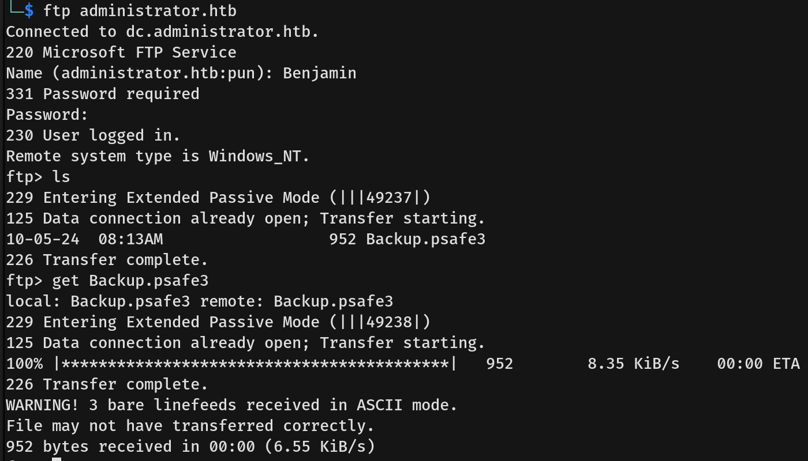
- I downloaded the file to my machine. I used `pwsafe2john` to convert the file into a hash format and then crack the master password.
  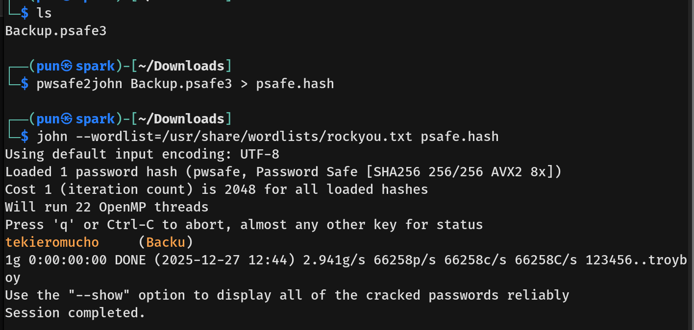
- I opened the safe file using the cracked password and found credentials for three users: Alexander, Emily, and Emma.
  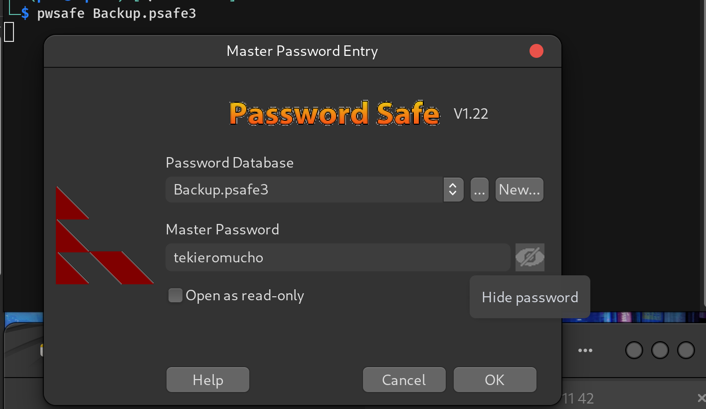
  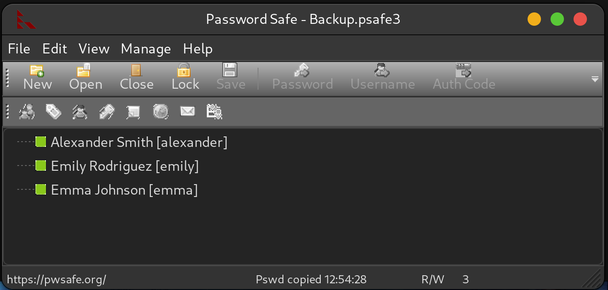
- Returning to the BloodHound graph, I analyzed the permissions and outbound control for these three accounts.
  
  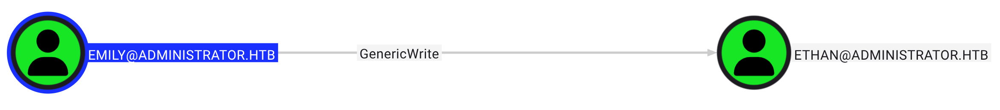
  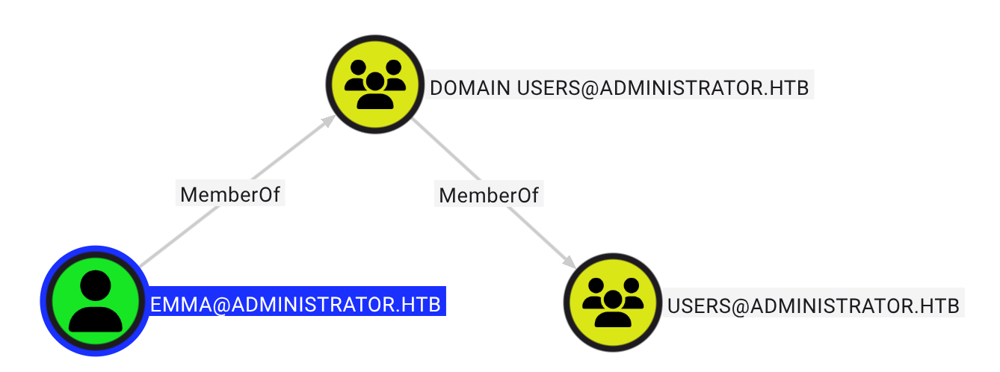
- **Emily** appeared to have the most potential, as she holds **GenericWrite** privileges over the user **Ethan**.
- Further analysis showed that **Ethan** has significant permissions over the Domain itself (likely DCSync rights), effectively giving him control over AD.
  
- I verified Emily's credentials using NetExec against WinRM.
  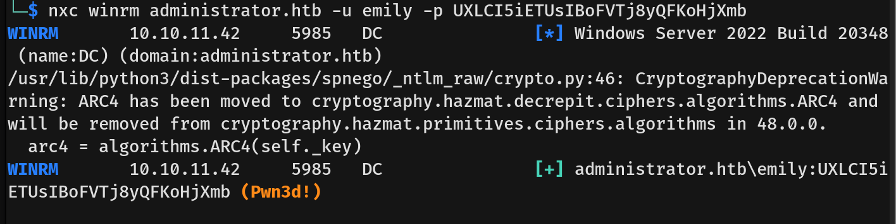
- With valid WinRM access, I logged in using **Evil-WinRM** as Emily.
- I captured the **user flag**.

---

## Privilege Escalation
- To escalate privileges, I needed to compromise the **Ethan** account using Emily's **GenericWrite** permission.
- **Targeted Kerberoasting:**
  - First, I synchronized my local machine's time with the target server to prevent Kerberos clock skew errors.
  - I used Emily's permissions to inject a fake **Service Principal Name (SPN)** into Ethan's account. This makes Active Directory treat Ethan as a service account.
  - I then requested a TGS (Service Ticket) for this new "service." This ticket is encrypted with Ethan's password hash.
  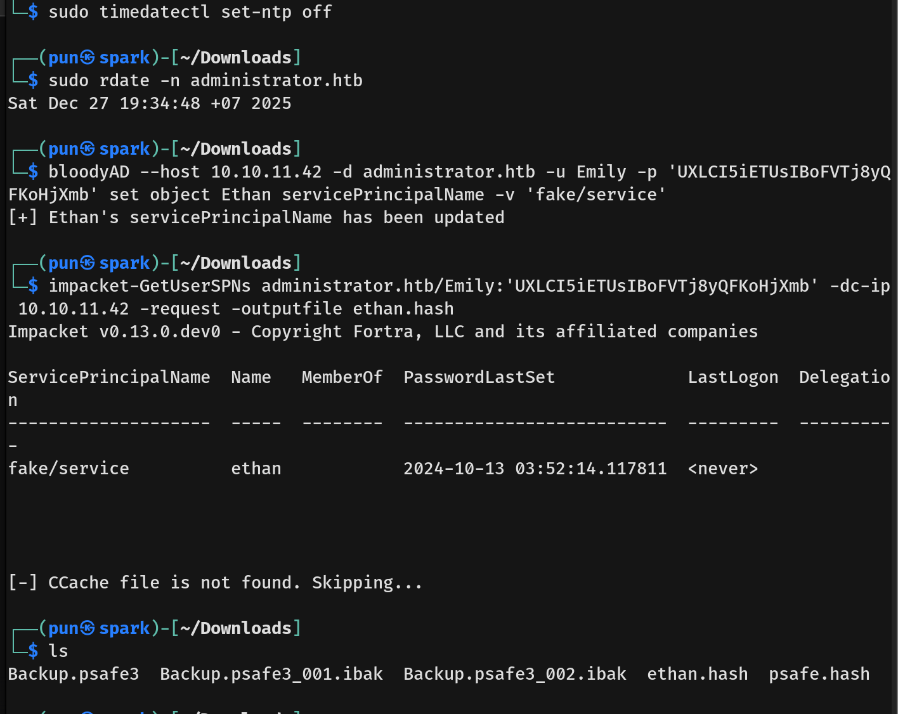
- I captured the hash and cracked it using `john` to recover Ethan's plaintext password.
  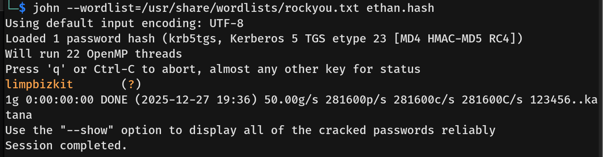
- Since Ethan has **DCSync** privileges (permission to replicate directory changes), I used `impacket-secretsdump` to dump all domain credentials, including the Administrator hash.
  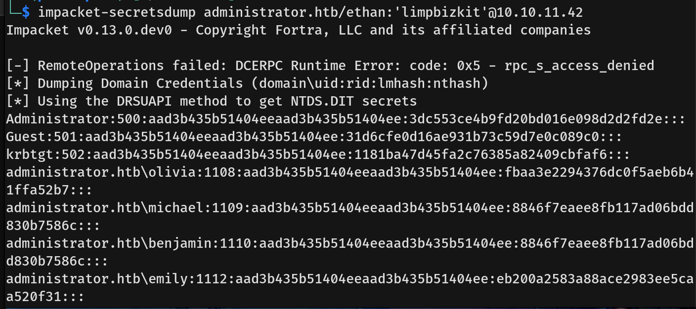
- Finally, I used **Evil-WinRM** to perform a Pass-the-Hash attack using the Administrator's NTLM hash.
  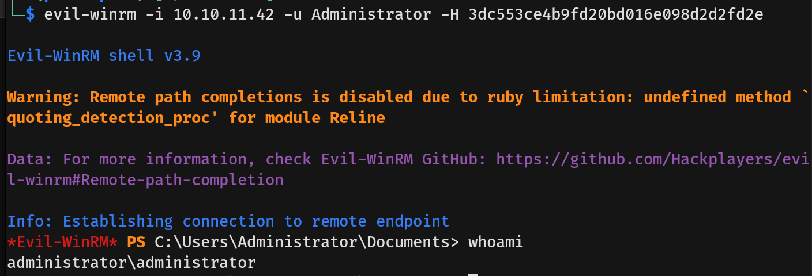
- I captured the **root flag**.
