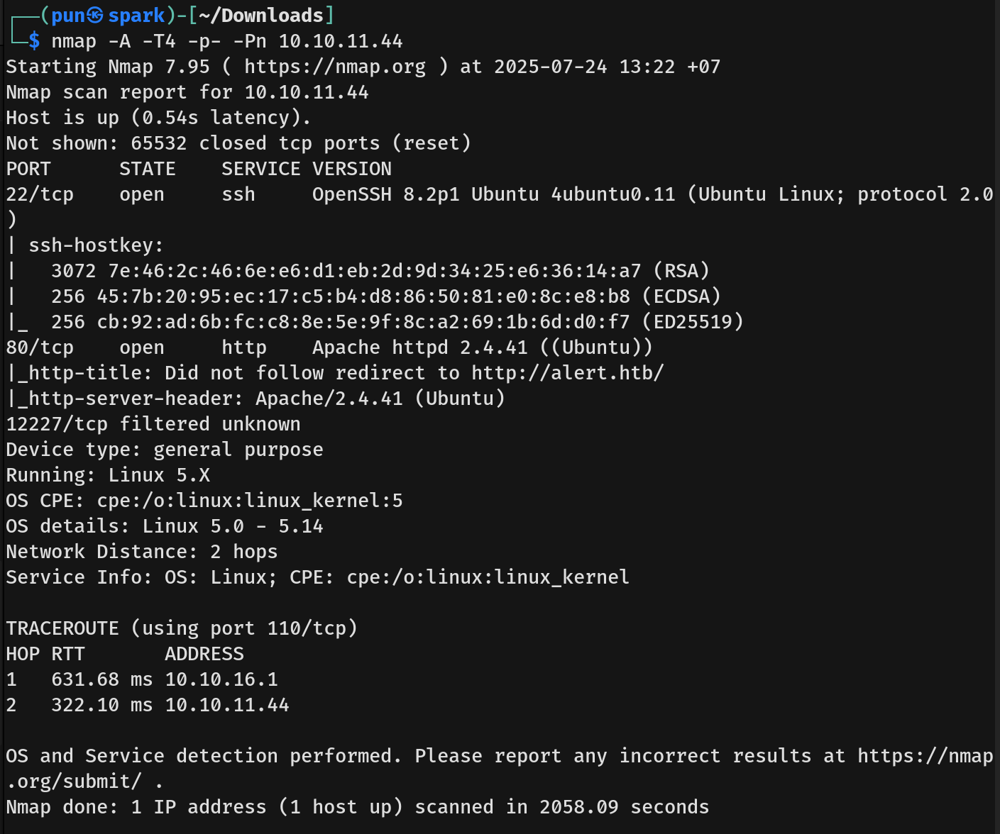

# Alert Writeup - by Thammanant Thamtaranon
  - Alert is an easy Linux machine on Hack The Box.

## Reconnaissance
  - First, we use the command `nmap -A -T4 -p- 10.10.` to check for any open TCP ports and their service information.

## Scanning & Enumeration

## Exploitation
