# Bastard Writeup - by Thammanant Thamtaranon

**Bastard** is a **Medium**-difficulty Windows machine hosted on Hack The Box.

---

## Reconnaissance
- We started the engagement with a full TCP port scan using Nmap to identify open services and determine the underlying operating system.
  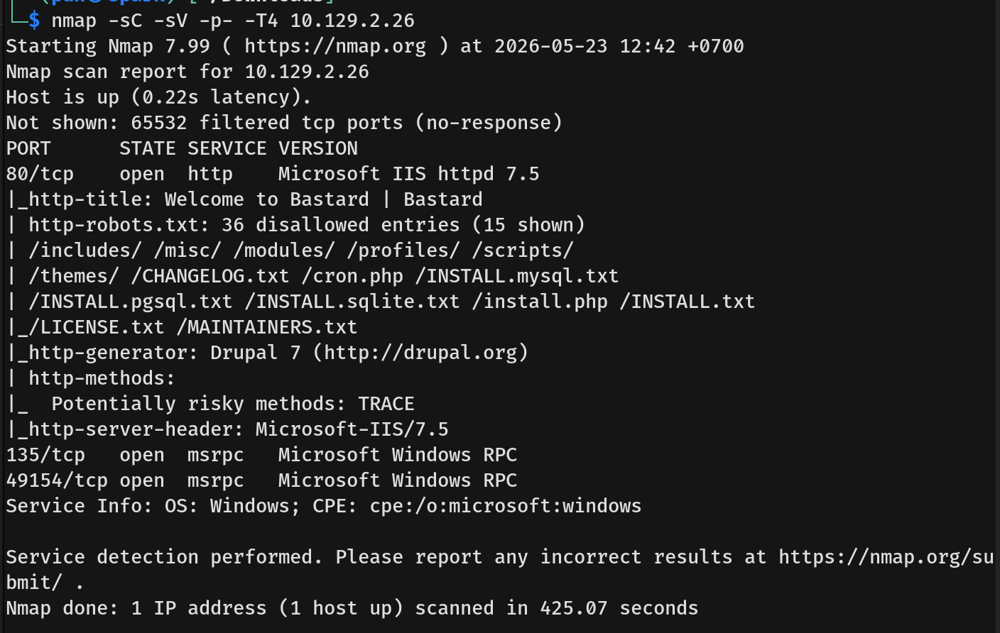
- The results indicated the following open ports:
  * **80/tcp:** HTTP (Microsoft IIS httpd 7.5)
  * **135/tcp:** msrpc (Microsoft Windows RPC)
  * **49154/tcp:** msrpc (Microsoft Windows RPC)

---

## Scanning & Enumeration
- Visiting port 80 in the browser showed a default webpage powered by a Content Management System. Our Nmap `http-generator` script specifically identified this as **Drupal 7**.
  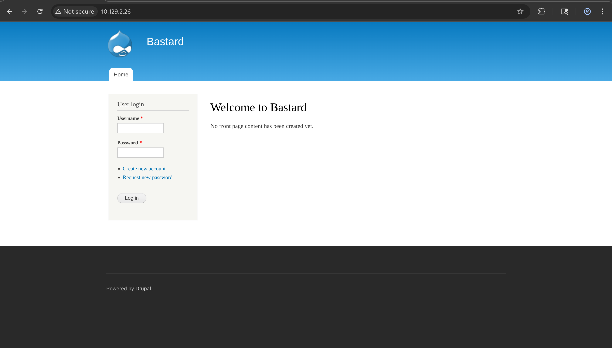
- The Nmap results also highlighted that the `robots.txt` file contained 36 disallowed entries.
  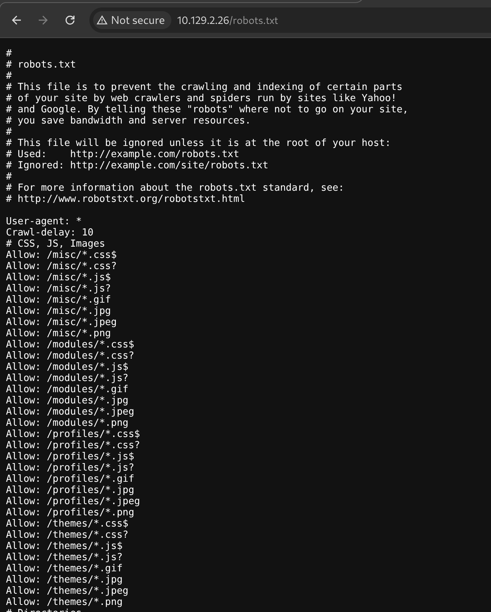
- After manually checking several of these disallowed paths, we checked `/CHANGELOG.txt` and successfully identified the exact Drupal version running on the server: **7.54**.
  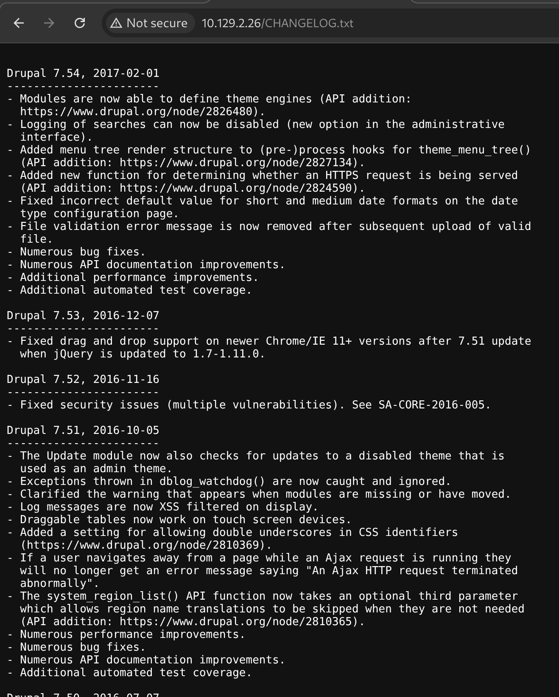

---

## Exploitation
- I used `searchsploit` to look for known vulnerabilities associated with Drupal 7.54. The search returned several options, so I selected the first unauthenticated Remote Code Execution (RCE) script.
  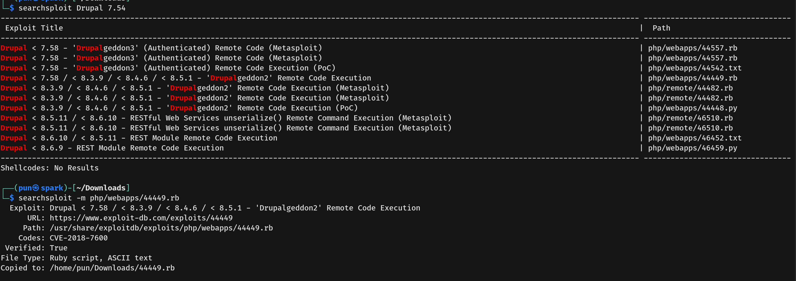
- I then executed the PoC exploit against the target server.
  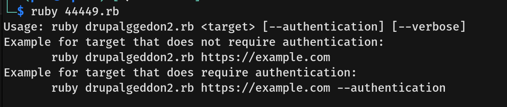
  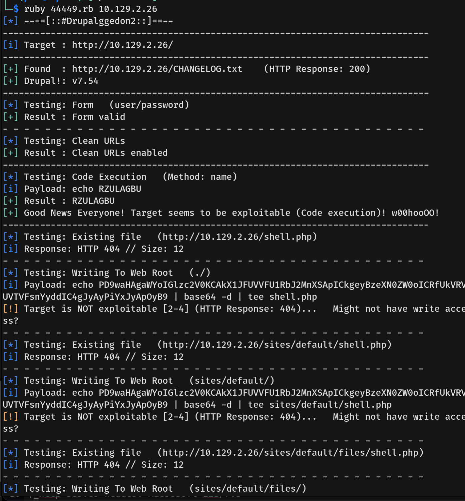
- The exploit was successful, dropping us directly into a Windows OS shell. I navigated to the `C:\Users\dimitris\Desktop` directory and captured the `user.txt` flag.
  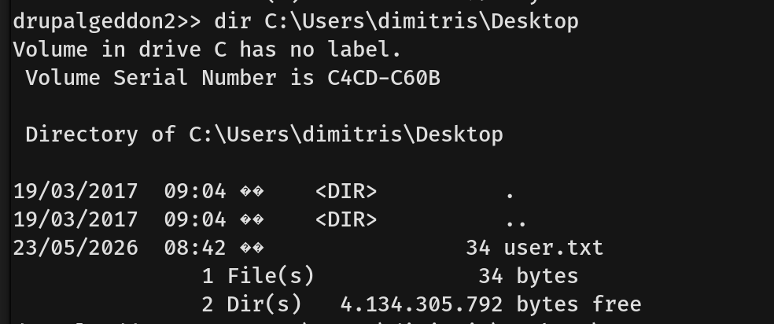

---

## Privilege Escalation
- To assess our escalation paths, I ran `whoami /priv` to check my current user's privileges and discovered that we had `SeImpersonatePrivilege` enabled.
  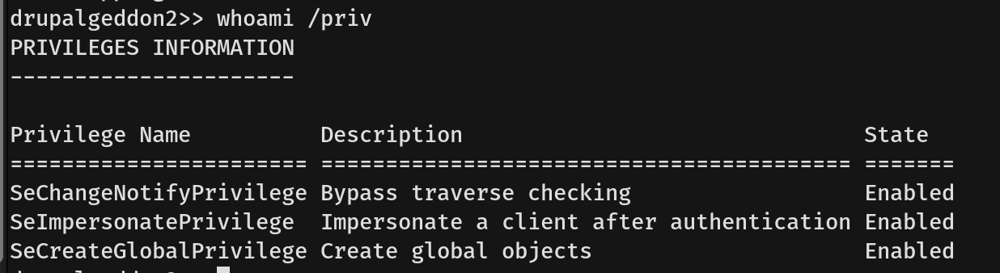
- Running the `systeminfo` command revealed the OS architecture and version (Windows Server 2008 R2), confirming that the system was a prime target for a token impersonation attack.
  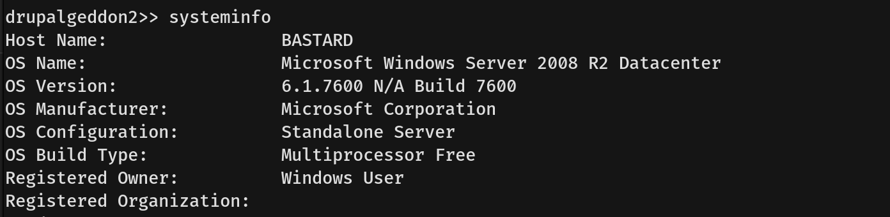
- To exploit this, I transferred the `JuicyPotato.exe` binary from my attacker machine to the target machine.
  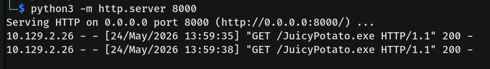
  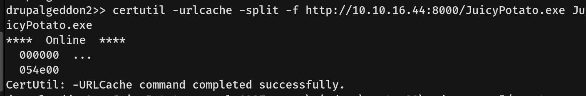
- Next, I created a custom reverse shell payload using `msfvenom`.
  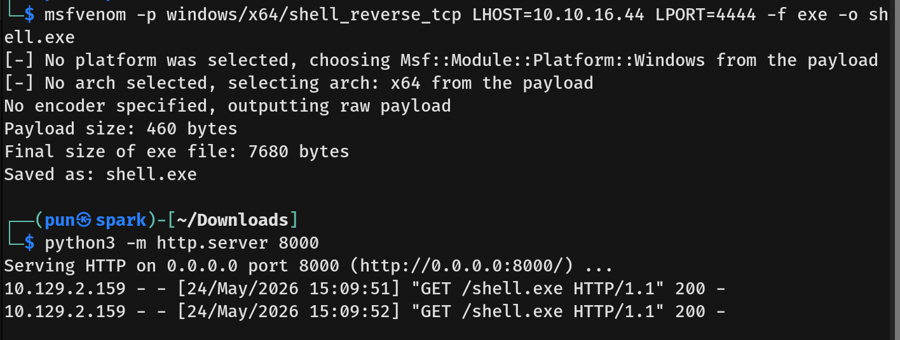
- I executed JuicyPotato with the appropriate CLSID for the OS version, configuring it to launch my payload, and waited for the callback on my listener. You can find the necessary CLSIDs for Windows Server 2008 R2 [here](https://github.com/ohpe/juicy-potato/tree/master/CLSID/Windows_Server_2008_R2_Enterprise).
  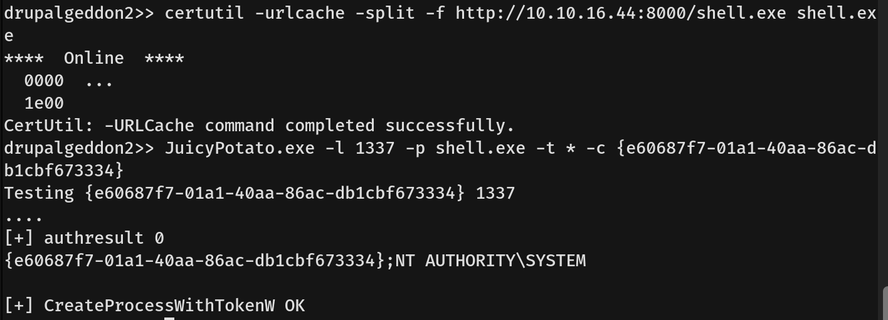
- The exploit successfully impersonated the system token, granting us a reverse shell as `NT AUTHORITY\SYSTEM`. We then navigated to the Administrator's desktop and captured the `root.txt` flag.
  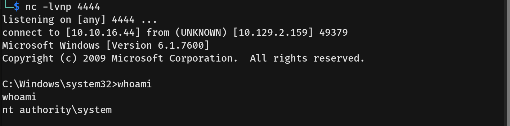
