# Blackfield Writeup - by Thammanant Thamtaranon

**Blackfield** is a **Hard**-difficulty Windows machine hosted on Hack The Box.

---

## Reconnaissance
- We began the engagement with a full TCP port scan using Nmap to identify open services and fingerprint the underlying operating system.
    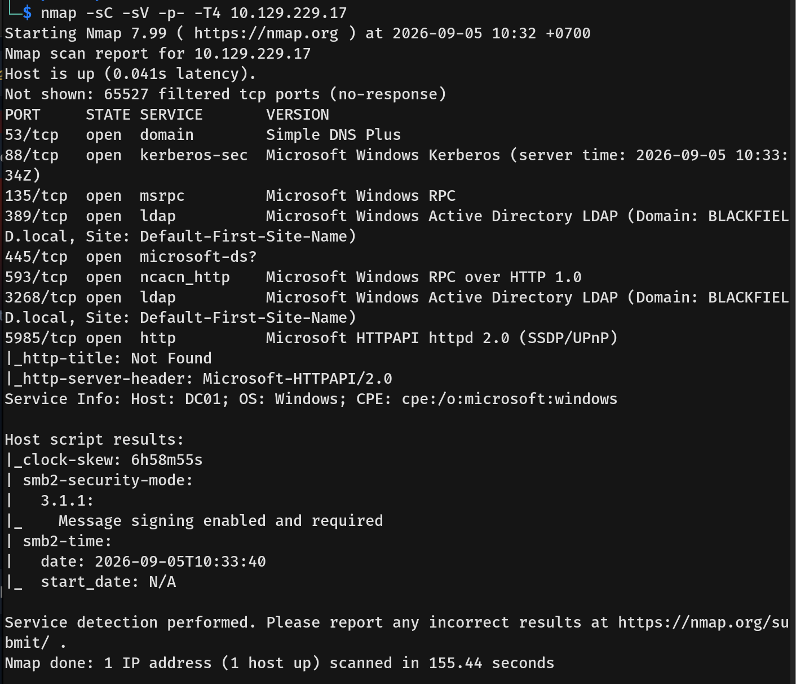
- The scan revealed several open ports:
    *   **53/tcp:** domain (Simple DNS Plus)
    *   **88/tcp:** kerberos-sec (Microsoft Windows Kerberos)
    *   **135/tcp:** msrpc (Microsoft Windows RPC)
    *   **389/tcp:** ldap (Microsoft Windows Active Directory LDAP)
    *   **445/tcp:** microsoft-ds (Windows 7 - 10)
    *   **593/tcp:** ncacn_http (Microsoft Windows RPC over HTTP 1.0)
    *   **3268/tcp:** ldap (Microsoft Windows Active Directory LDAP)
    *   **5985/tcp:** http (Microsoft HTTPAPI httpd 2.0 - WinRM)
- We then added `BLACKFIELD.local` to our `/etc/hosts` file.

---

## Scanning & Enumeration
- We started by using null and guest credentials on SMB, and the guest credential successfully granted access.
    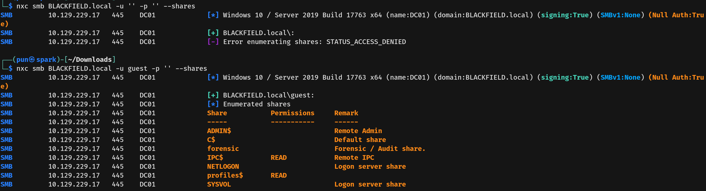
- Using the guest account, we could read the `profiles$` share, which revealed a directory list of domain users.
    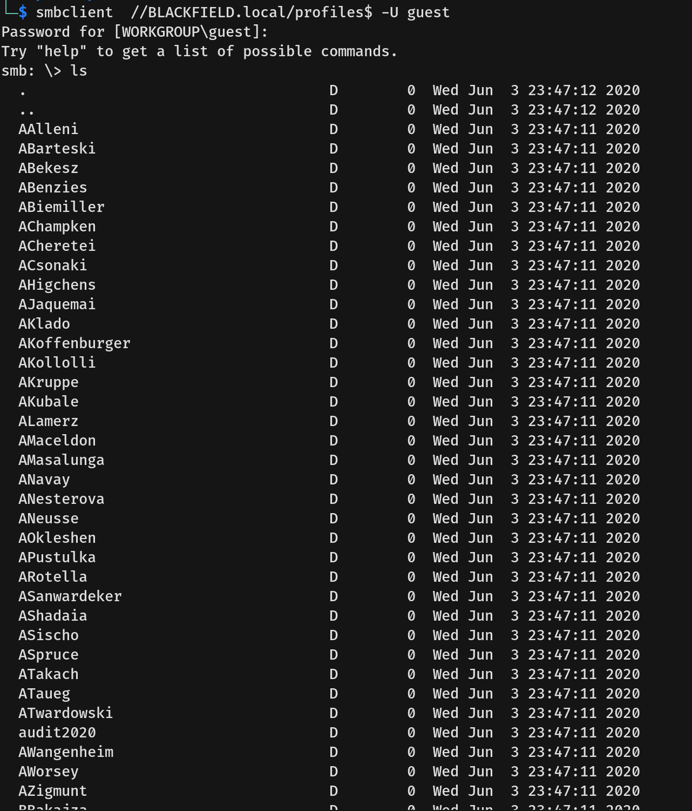

---

## Exploitation
- With this list of potential usernames, we used `nxc` to attempt an AS-REP Roasting attack to see if any user had pre-authentication disabled.
    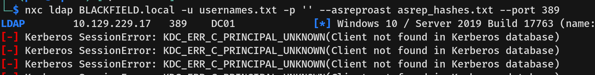
- We successfully found the AS-REP hash for the user `support`.
    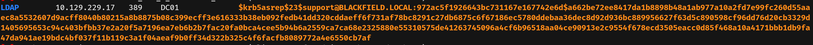
- We then used Hashcat to crack the hash and obtained the plaintext password for the `support` user.
    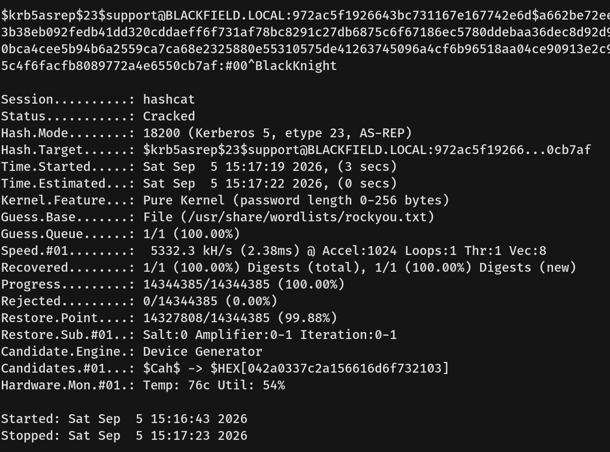
- We verified these credentials against SMB and found that the password was valid.
    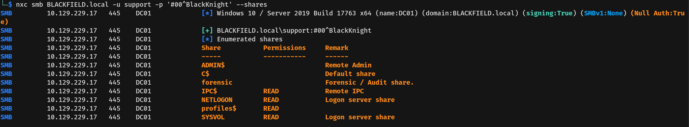
- Since the `support` user did not have access to any new interesting shares, we gathered Active Directory relationship data using Bloodhound.
    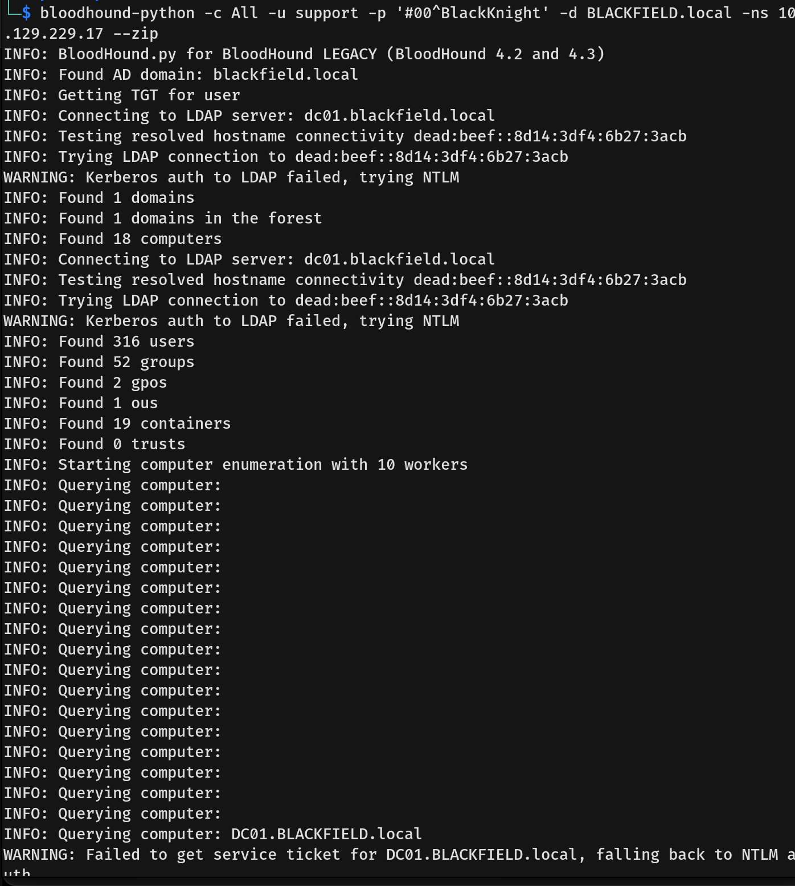
- Bloodhound revealed that the `support` user had `ForceChangePassword` permissions over the user `audit2020`.
    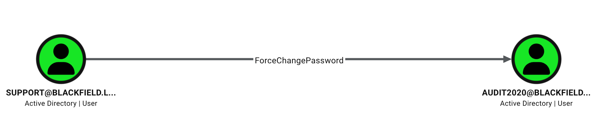

---

## Privilege Escalation
- We used `bloodyad` to force change the password of `audit2020` to `P@ssw0rd`. Validating the change via SMB showed that it worked, and `audit2020` had `READ` access to the `forensic` share.
    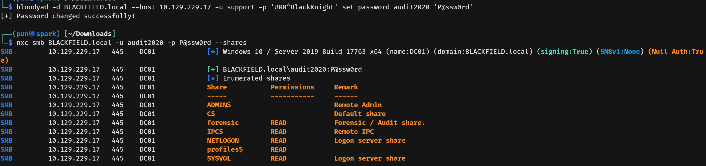
- Connecting to the `forensic` share, we found directories named `commands_output`, `memory_analysis`, and `tools`, which contained the output of memory dump tools, zipped process memory dumps, and the tools themselves.
    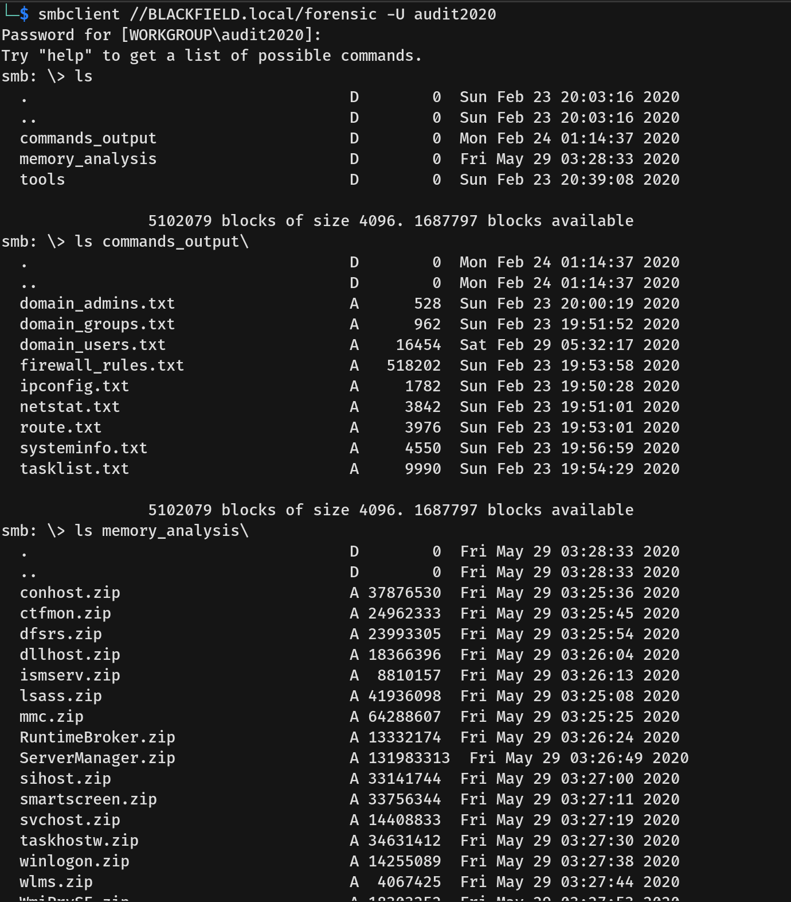
- We downloaded all the command outputs and the process memory dumps to our attacking machine. Inspecting the files, we found references to a potential domain admin user named `Ipwn3dYourCompany`.
    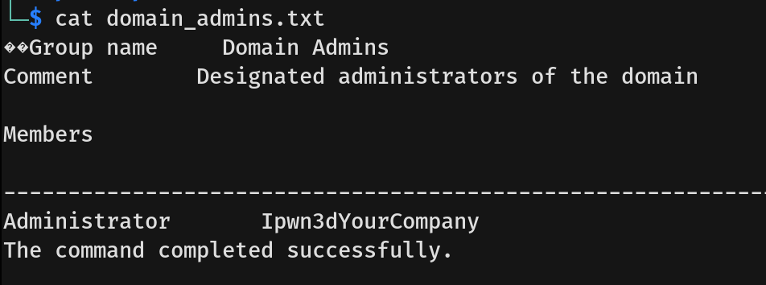
- We verified this user using Impacket's `GetNPUsers` and found that the account was likely deleted.
    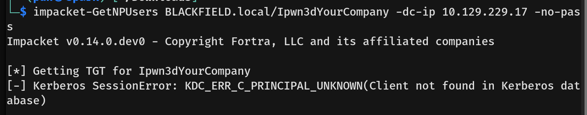
- We then examined the extracted `lsass.DMP` file. The Local Security Authority Subsystem Service (LSASS) process stores active credentials in memory (such as NTLM hashes, Kerberos tickets, and plaintext passwords) to facilitate single sign-on. Parsing this memory dump allows attackers to extract these cached credentials.
- Using `pypykatz` to parse the LSASS minidump, we successfully extracted the NTLM hash for the user `svc_backup`.
    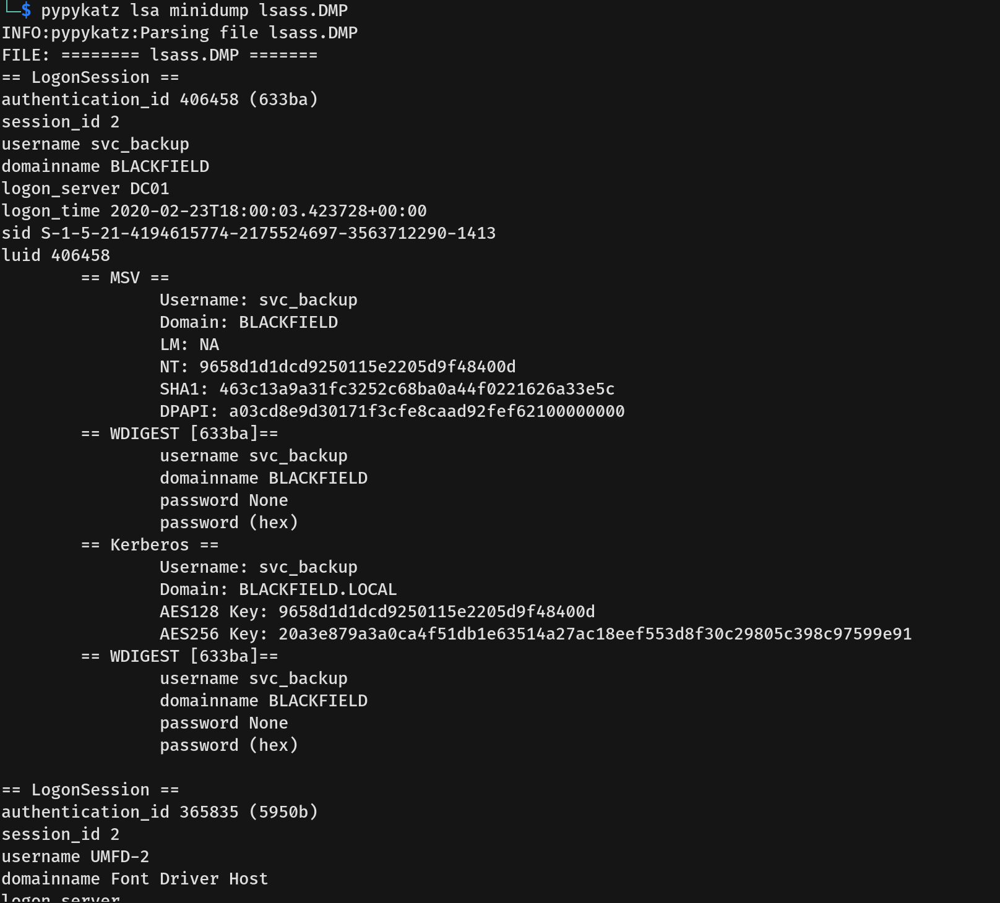
- Checking Bloodhound, we found that `svc_backup` was a member of the Remote Management Users group and the Backup Operators group.
    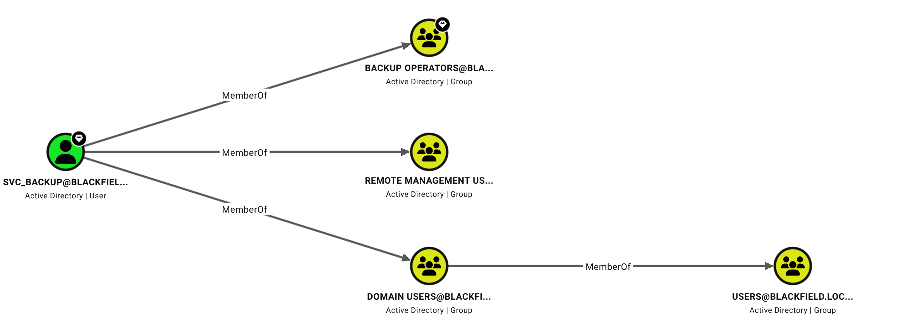
- We authenticated to the machine via Evil-WinRM using the `svc_backup` hash and captured the user flag.
    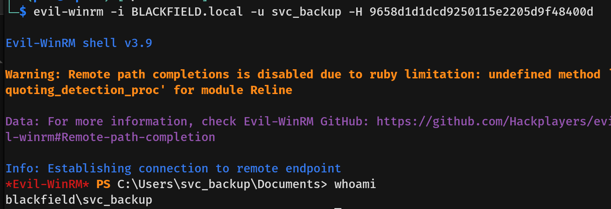
- Checking our privileges, we observed that `SeMachineAccountPrivilege` and `SeBackupPrivilege` were enabled:
    *   **SeMachineAccountPrivilege:** Can be abused in conjunction with noPac (CVE-2021-42278 and CVE-2021-42287) to spoof a Domain Controller machine account and escalate to Domain Admin.
    *   **SeBackupPrivilege:** Grants read access to all files on the system, ignoring standard ACLs. This allows copying locked critical Active Directory files like `ntds.dit` and the `SYSTEM` registry hive to dump domain credentials.
    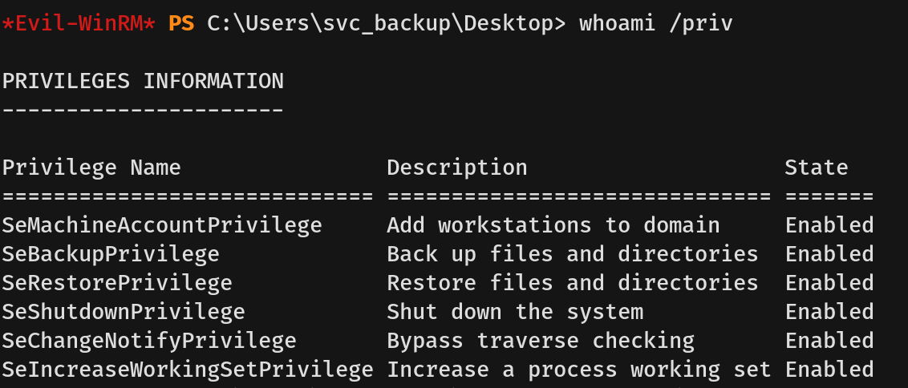
- We opted to abuse `SeBackupPrivilege`. Since the `ntds.dit` file is strictly locked by the OS, we performed the following steps using Volume Shadow Copy:
    1. Created a temporary directory at `C:\temp`.
    2. Crafted a script named `shadow.txt` containing `diskshadow` commands to create a shadow copy of `C:` and expose it as drive `Z:`.
    3. Executed `diskshadow /s C:\temp\shadow.txt` to mount the shadow volume.
    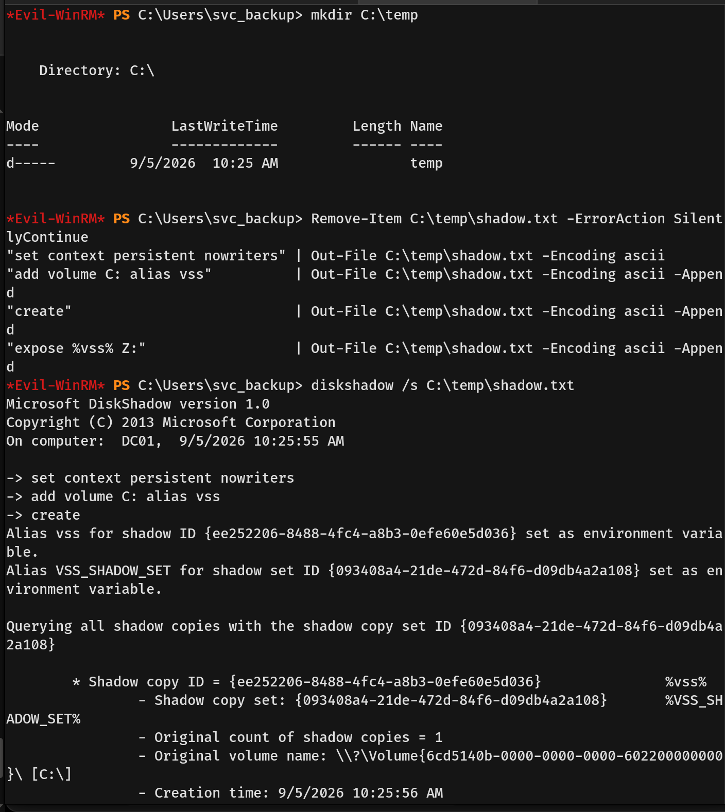
    4. Used `robocopy /b` (backup mode) to copy `Z:\Windows\NTDS\ntds.dit` into `C:\temp\`.
    5. Saved a copy of the `SYSTEM` registry hive using `reg save HKLM\SYSTEM C:\temp\system.hive`.
    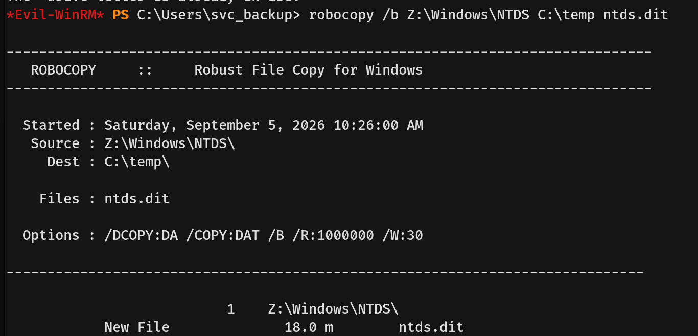
- We then downloaded `ntds.dit` and `system.hive` to our attacking machine.
    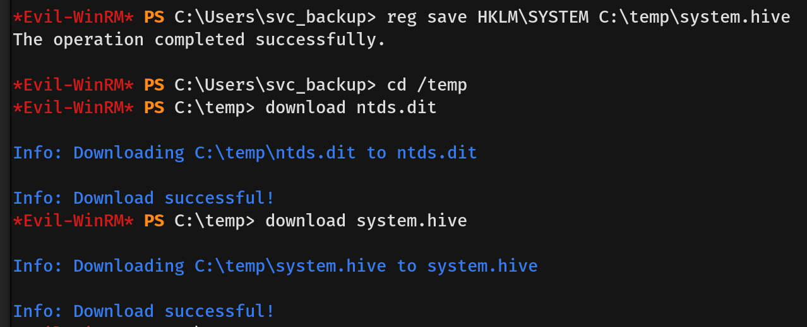
- With these files secured, we ran Impacket's `secretsdump` against them locally, dumping the NTLM hashes for all Active Directory accounts, including `Administrator`.
    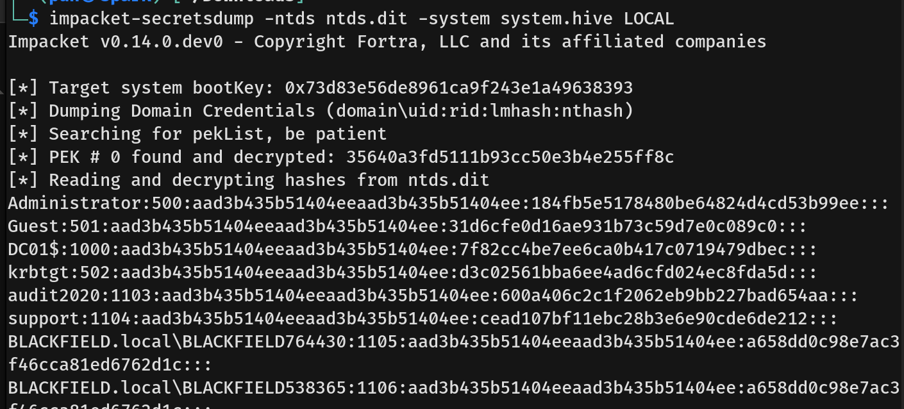
- Finally, using the Administrator hash, we connected back to the machine and captured the root flag.
    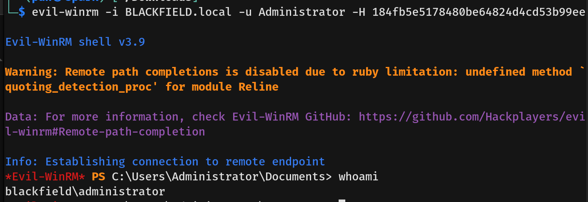
