# Blocky Writeup - by Thammanant Thamtaranon  
- Blocky is an easy Linux-based machine hosted on Hack The Box.

## Reconnaissance  
- I started with a full TCP port scan including service/version detection and OS fingerprinting:  
  `nmap -A -T4 -p- 10.10.10.37`  
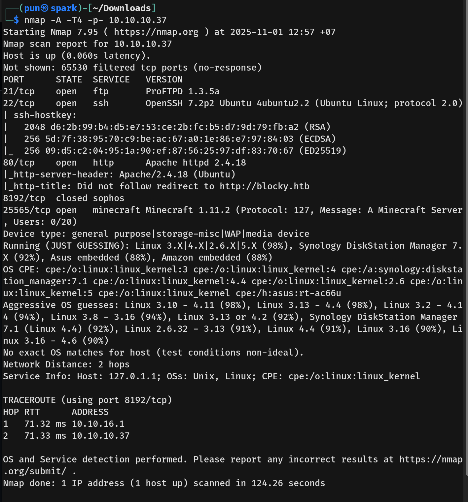  
- The scan showed two open ports:  
  - 21 (FTP)  
  - 22 (SSH)
  - 80 (HTTP)
  - 25565 (Minecraft)  
- I added `blocky.htb` to `/etc/hosts` for proper hostname resolution.

## Scanning & Enumeration  
- Looking through the website we saw the author name `Notch`, we will note that down.
- I ran a directory brute-force using `dirsearch`:  
  `dirsearch -u http://blocky.htb`  
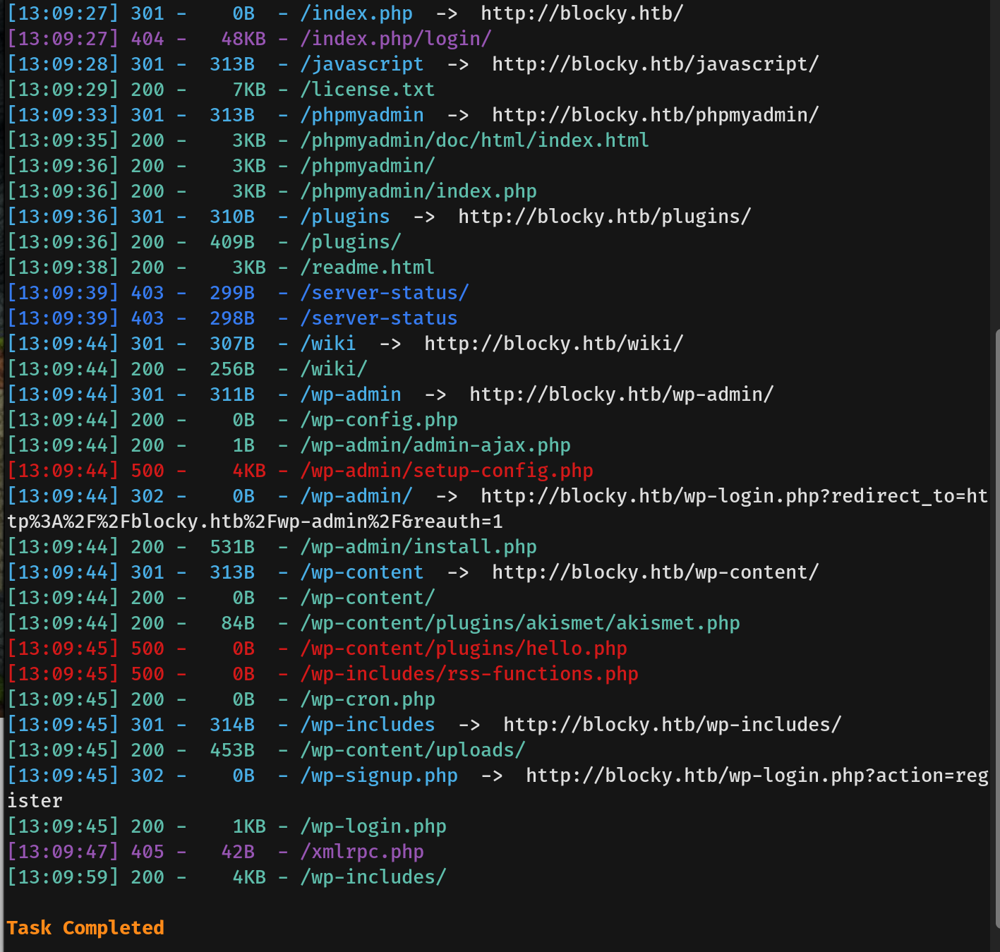
- The path `plugins` have 2 jar file.
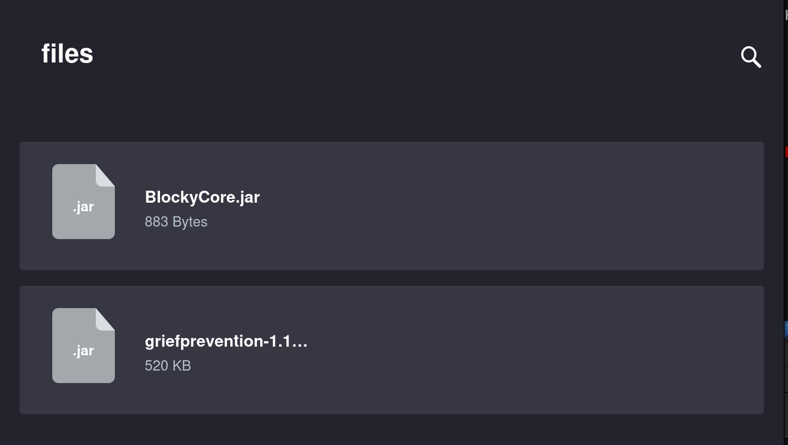
-  We then extract the file using `jar xf myfile.jar`
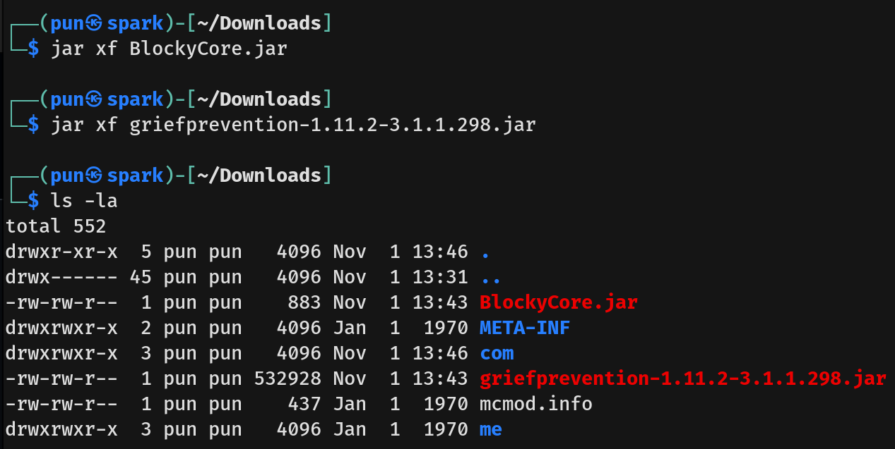
-  In `/com/myfirstplugin` using `javap -c BlockyCore.class`, we found the credential
 

- We founded that the web is using wordpress so we ran the wordpress scan: `wpscan --url blocky.htb`
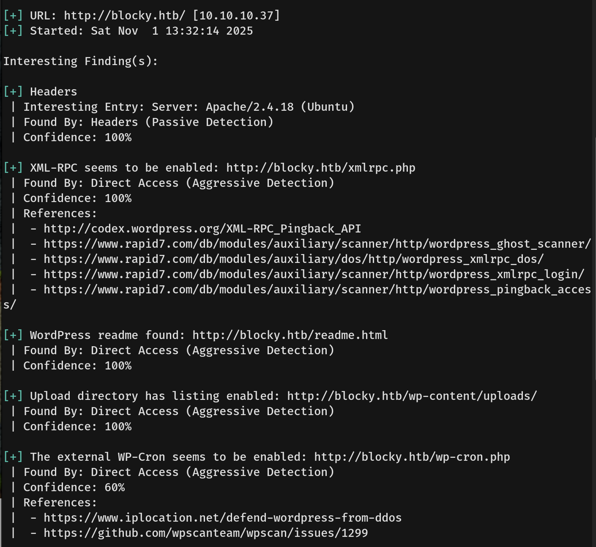
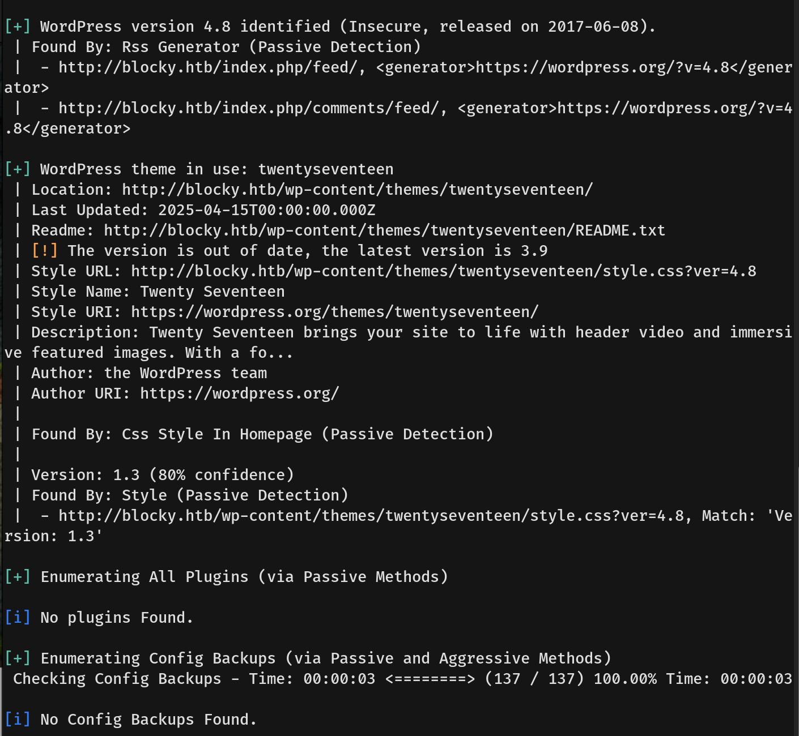
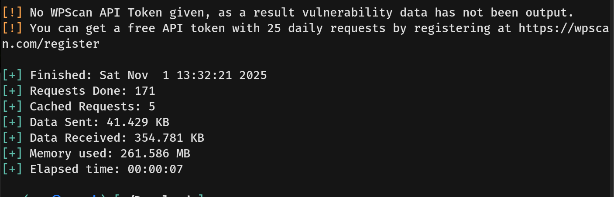
- Nothing intersting was founded

- I then enumerated virtual hosts using `ffuf`:  
  `ffuf -u http://blocky.htb -H "Host: FUZZ.blocky.htb" -w /usr/share/seclists/Discovery/DNS/subdomains-top1million-20000.txt -mc all -ac`  
- Nothing was founded.

## Exploitation  
- Using the credential we found on `http://blocky.htb/phpmyadmin/`, we are able to get it as root.
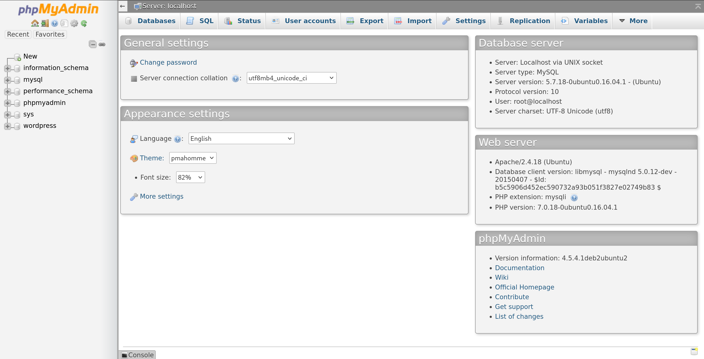
- We then found Notch's credential.
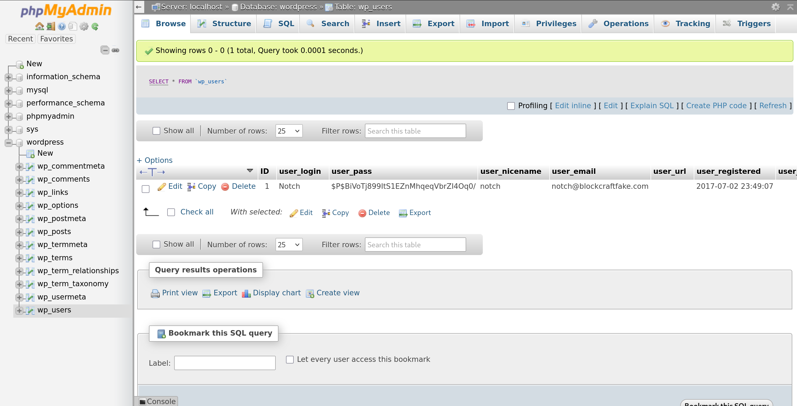
- We then change Notch's password.
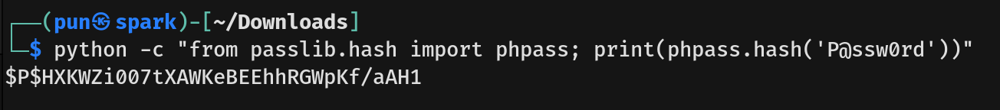
- Then we login as Notch.
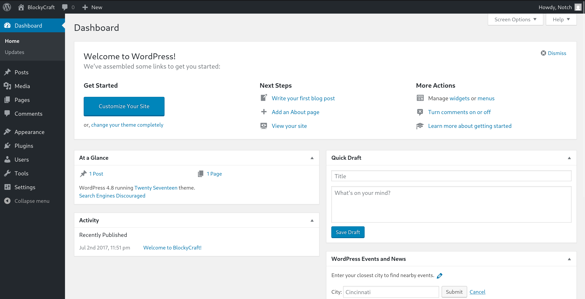
- Nothing useful were found so we will move on to the SSH.
- We then SSH into the machine using `notch:8YsqfCTnvxAUeduzjNSXe22`

- We then got the user flag.

## Privilege Escalation  
- Running `sudo -l` showed that `notch` have sudo privileges.
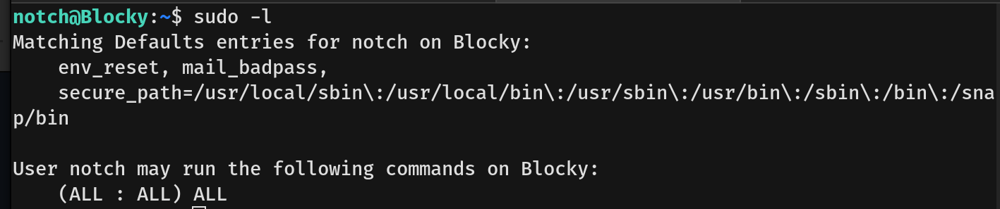
- We then run the command `sudo su -` to change the user to root.
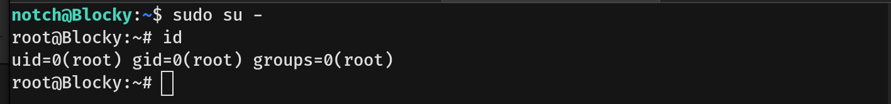
- We then capture the root flag.
