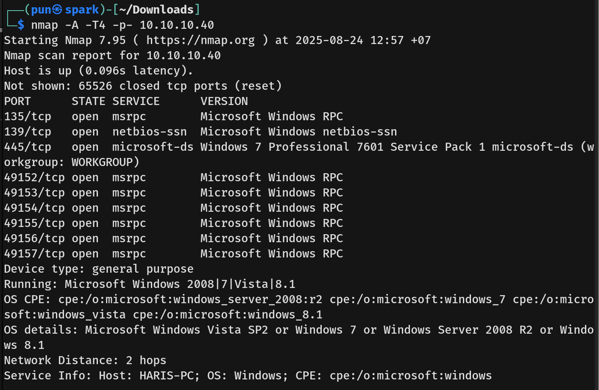
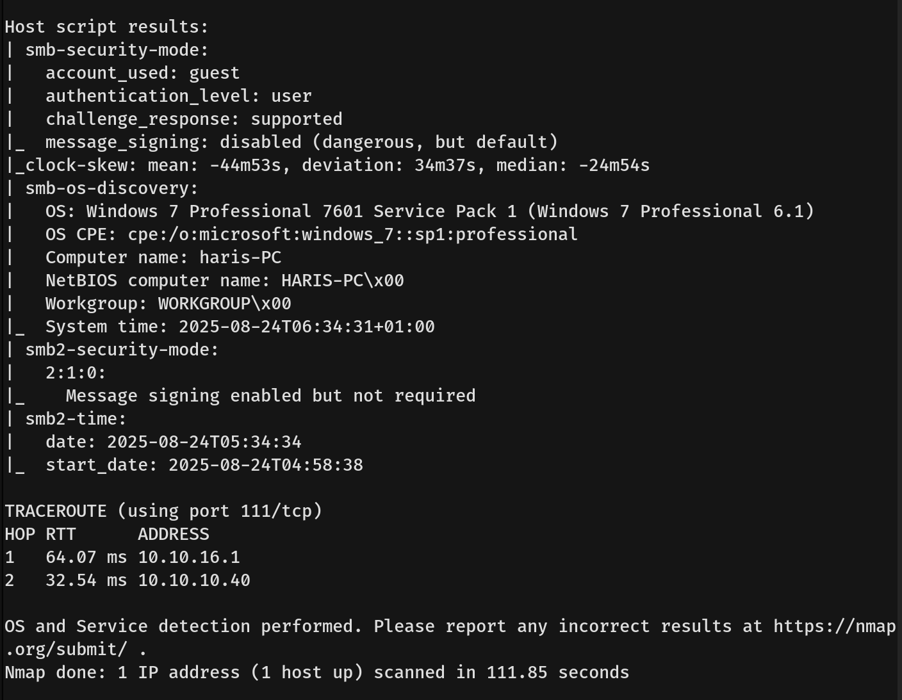
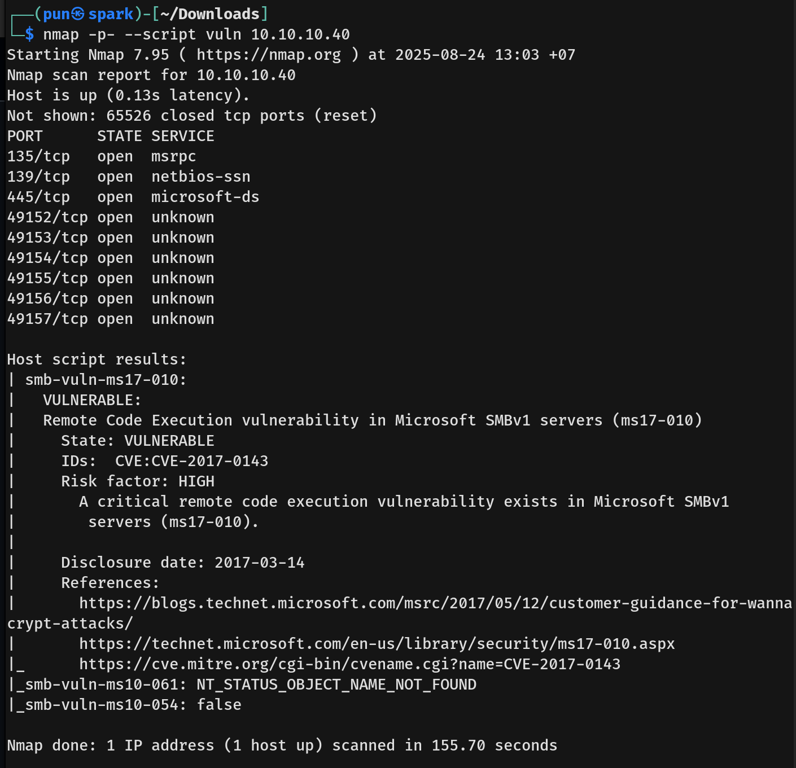
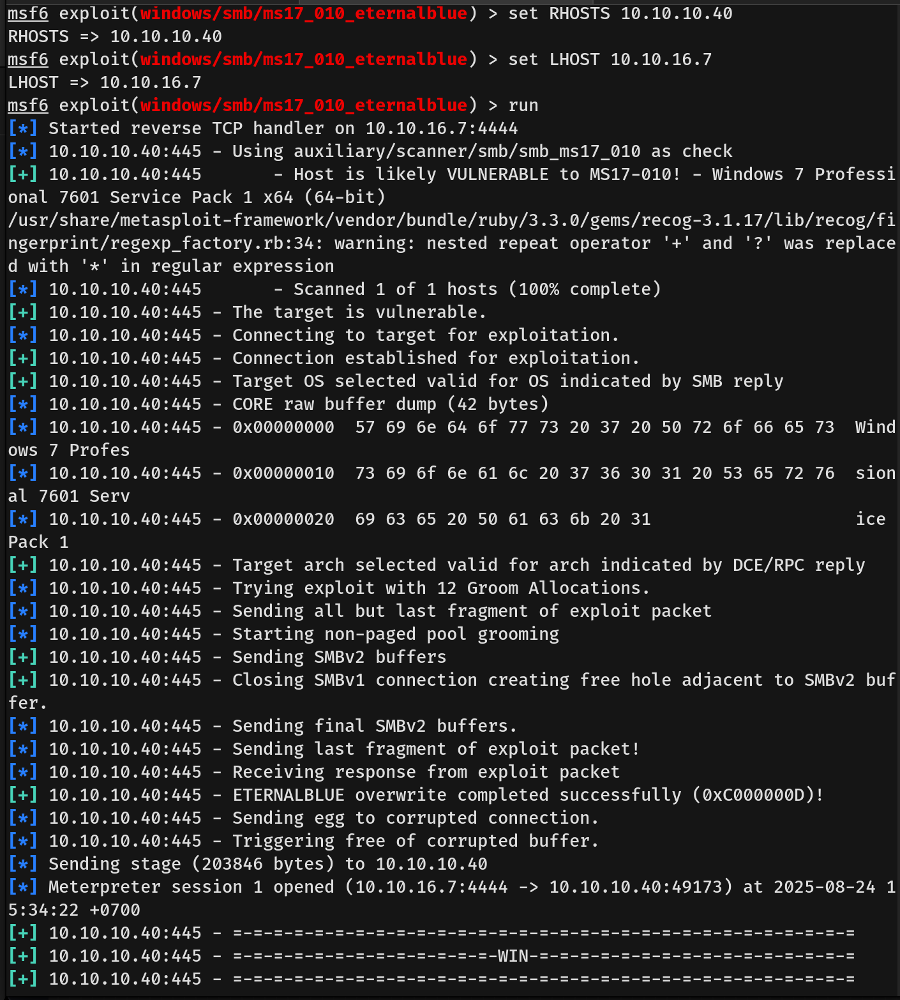

# Blue Writeup - by Thammanant Thamtaranon  
- Blue is an easy Windows machine hosted on Hack The Box.

## Reconnaissance  
- I started with a full TCP port scan including service/version detection and OS fingerprinting:  
  `nmap -A -T4 -p- 10.10.10.40`  
  
  
- The scan showed three open ports:  
  - 135 (MSRPC) 
  - 139 (NetBIOS-SSN)
  - 445 (SMB)

## Scanning & Enumeration  
- We ran a Nmap vulnerability scan:  
  `nmap -p- --script vuln 10.10.10.40`  
  
- From the Nmap vulnerability scan, we discovered that the machine is vulnerable to **CVE-2017-0143**.  
- **CVE-2017-0143** is a remote code execution vulnerability in the SMBv1 server.  
- Sending a specially crafted packet to the SMB service allows an attacker to execute arbitrary code on the target machine without authentication.

## Exploitation  
- We then ran `msfconsole`.  
- I searched for `MS17-010`, set the exploit options, and ran it.  
  
- Running the command `getuid` on the Meterpreter session confirmed that we were `NT AUTHORITY\SYSTEM`.  
- `NT AUTHORITY\SYSTEM` is a built-in Windows system account and represents the highest possible privilege on a Windows machine, higher than Administrator. It is used by Windows to run core system processes and services.  
- We then grabbed the user flag from the `haris` directory and the root flag from the `Administrator` directory.
