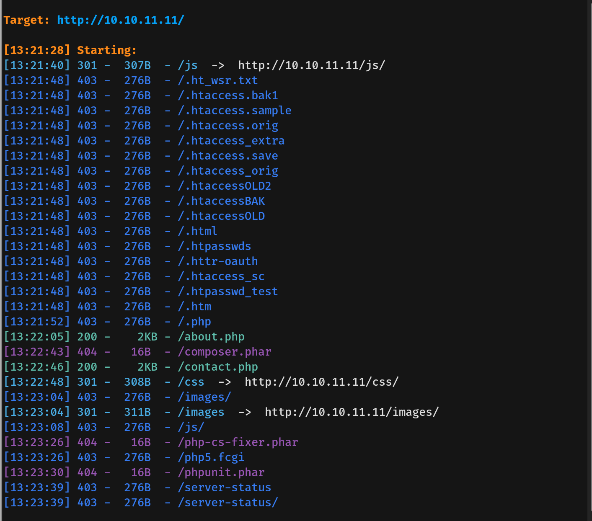
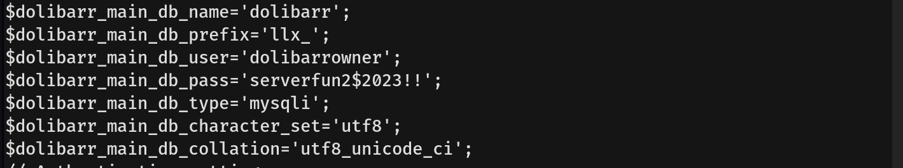

# BoardLight Writeup - by Thammanant Thamtaranon  
- BoardLight is an easy Linux-based machine hosted on Hack The Box.

## Reconnaissance  
- We began by performing a full TCP port scan with version detection and OS fingerprinting using the command:  
  `nmap -A -T4 -p- 10.10.11.11`  
  
- On the webpage, we noticed the footer text: “© 2020 All Rights Reserved By Board.htb”, indicating a potential virtual host.  
- We added `board.htb` to our `/etc/hosts` file for proper hostname resolution.

## Scanning & Enumeration  
- We enumerated web directories using:  
  `dirsearch -u http://boardlight.htb`  
  
- No useful paths were discovered.  
- We then performed virtual host enumeration using:  
  `ffuf -u http://board.htb -H "Host: FUZZ.board.htb" -w /usr/share/seclists/Discovery/DNS/subdomains-top1million-20000.txt -mc all -ac`  
  
- This revealed the subdomain `crm`, so we added `crm.board.htb` to `/etc/hosts`.

## Exploitation  
- Visiting `crm.board.htb`, we identified the application as **Dolibarr 17.0.0**.  
- We attempted default credentials `admin:admin`, which successfully granted access.  
- Researching known vulnerabilities, we found **CVE-2023-30253**, which affects Dolibarr 17.0.  
- We ran a publicly available PoC to exploit the vulnerability.  
  
- This provided a shell as the `www-data` user.  
  
- In the configuration file `conf.php`, we found the database credentials for user `dolibarrowner`.  
  
- We checked system users with:  
  `cat /etc/passwd`  
and found a valid local user: `larissa`.  
  
- Using the discovered credentials, we successfully SSH’d in as `larissa` and obtained the **user flag**.

## Privilege Escalation  
- To find potential SUID binaries, we ran:  
  `find / -perm -4000 -type f 2>/dev/null`  
  
- Among the results, we identified a binary named `linux-gnu-x86_64-0.23.1`.  
- A search revealed this binary was vulnerable to **CVE-2022-37706**.  
- We downloaded and executed a working PoC exploit.  
  
- This granted a root shell, and we obtained the **root flag**, completing the machine.
