# Bounty Writeup - by Thammanant Thamtaranon

**Bounty** is an **Easy**-difficulty Windows machine hosted on Hack The Box.

---

## Reconnaissance
- We started the engagement with a full TCP port scan using Nmap to identify open services and determine the underlying operating system.
  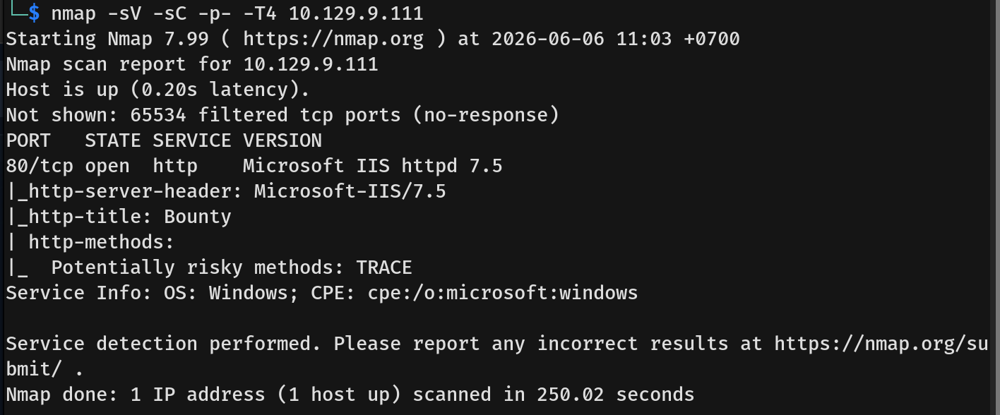
- The results indicated only one open port:
  * **80/tcp:** HTTP (Microsoft IIS httpd 7.5)

---

## Scanning & Enumeration
- Visiting port 80 in the browser showed a simple picture of the wizard Merlin and nothing else.
  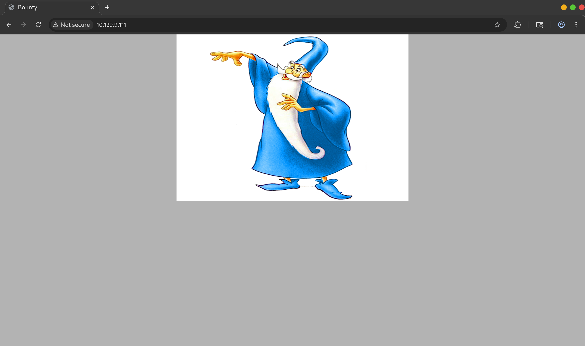
- I ran `dirsearch` to look for hidden directories and found a path returning a 500 Internal Server Error. Visiting it revealed a standard IIS configuration error, indicating that we did not have permission to view the configuration file directly.
  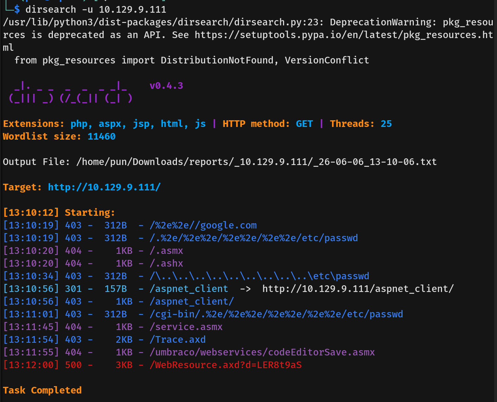
  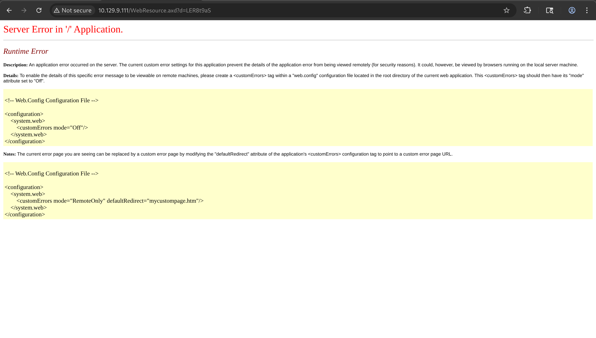
- Since the default `dirsearch` wordlist didn't reveal much else, I switched to a custom, more extensive wordlist and discovered `/Transfer.aspx`.
  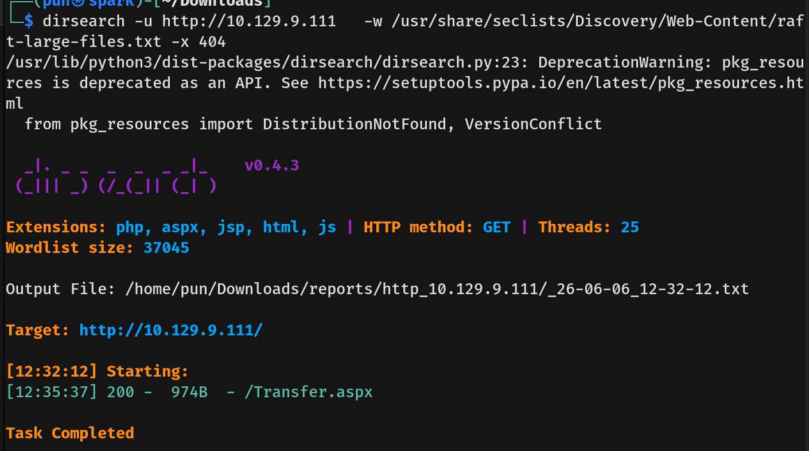
- Visiting `/Transfer.aspx` presented us with a file upload form. I tested the functionality by uploading a benign file, which was successfully processed.
  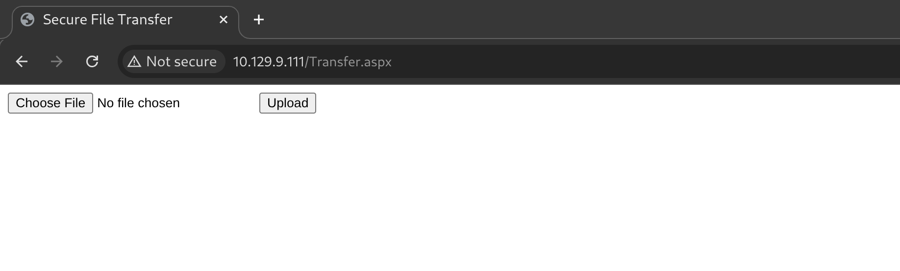
  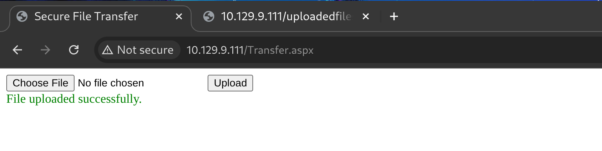
- Knowing there was a successful upload, there had to be a directory storing these files. I used another targeted wordlist to fuzz for the upload path and successfully discovered the `/uploadedfiles/` directory.
  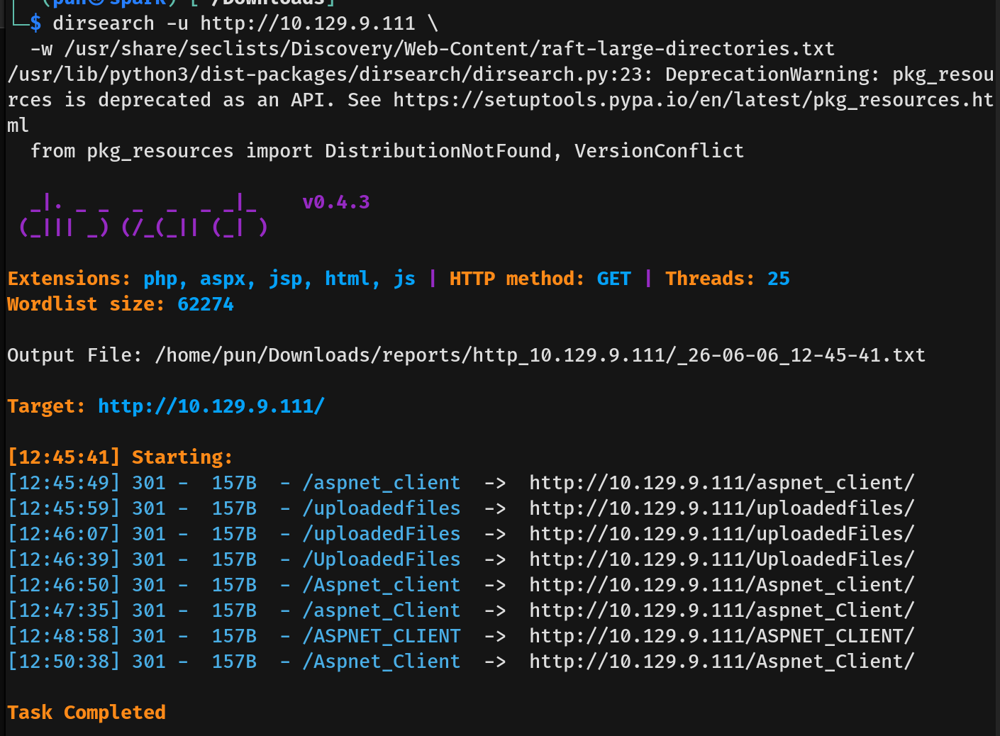
- Navigating to this directory, we could see our previously uploaded file.
  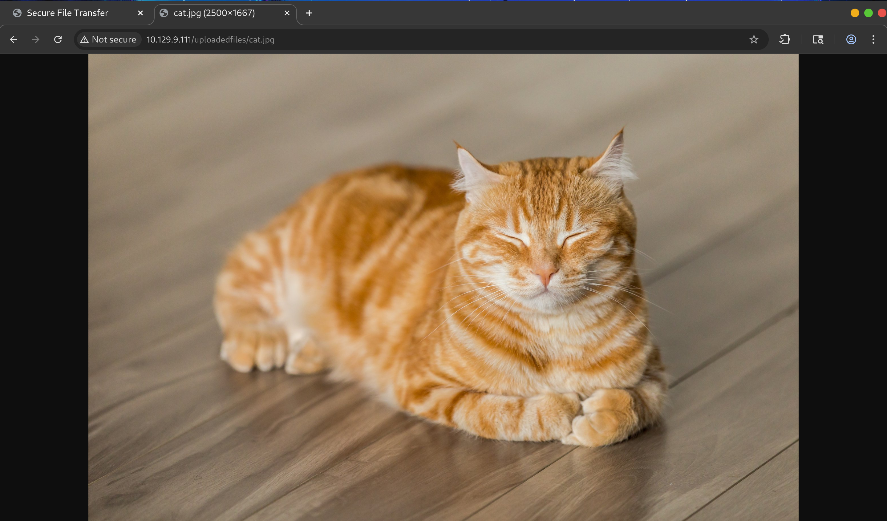
  
---

## Exploitation
- To gain code execution, I attempted to generate a `shell.aspx` reverse shell payload and upload it to the server.
  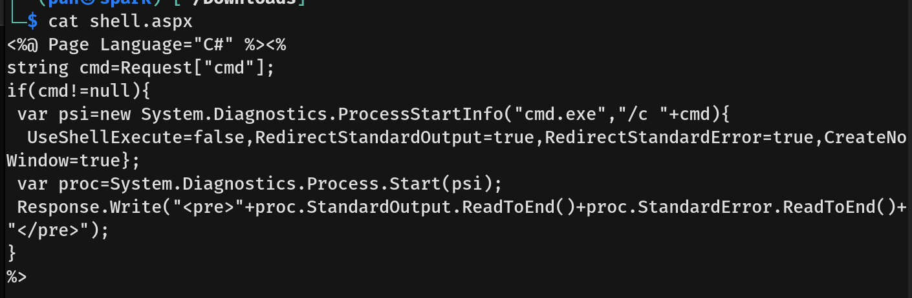
- However, the server actively blocked the `.aspx` extension.
  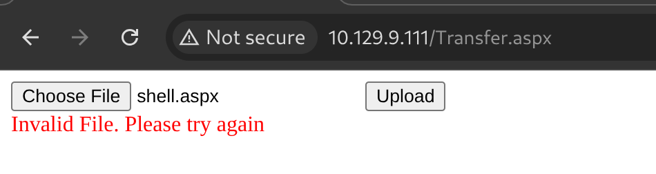
- I then tried a double-extension bypass. While the file uploaded successfully, navigating to it showed that the server processed it strictly as an image, meaning our payload did not execute.
  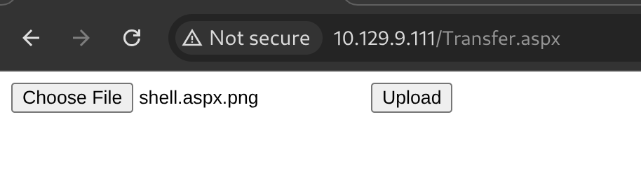
  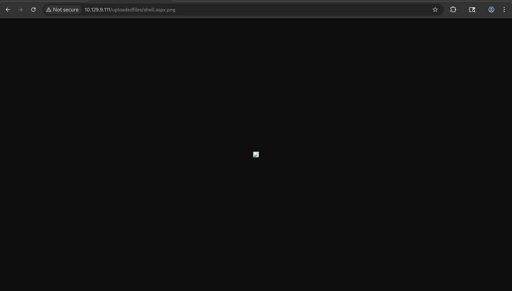
- I tested several other extensions, deducing that the server was utilizing a strict whitelist. Remembering the earlier 500 error related to the configuration file, I attempted to use the `.config` extension, which successfully bypassed the filter.
- Knowing `.config` files were allowed, I searched the internet for IIS web.config web shells and found a functional [payload from PayloadsAllTheThings](https://github.com/swisskyrepo/PayloadsAllTheThings/blob/master/Upload%20Insecure%20Files/Configuration%20IIS%20web.config/web.config).
- I uploaded the malicious `web.config` file to the server and successfully gained a web shell.
  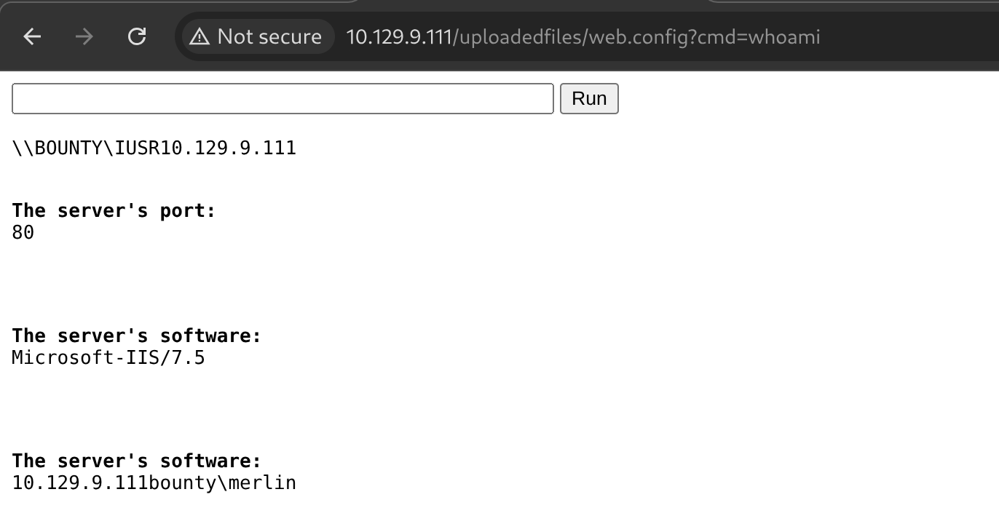
- To catch our actual reverse shell, we opted to use **Penelope**, an advanced reverse shell handler. It acts as a much more stable alternative to Netcat by automatically upgrading the connection to a fully interactive PTY.
  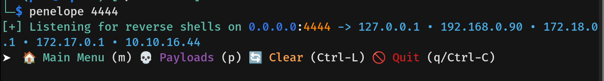
- Penelope conveniently auto-generates the necessary reverse shell payloads for your active interfaces and sets up its own standalone listener to catch the connection. 
  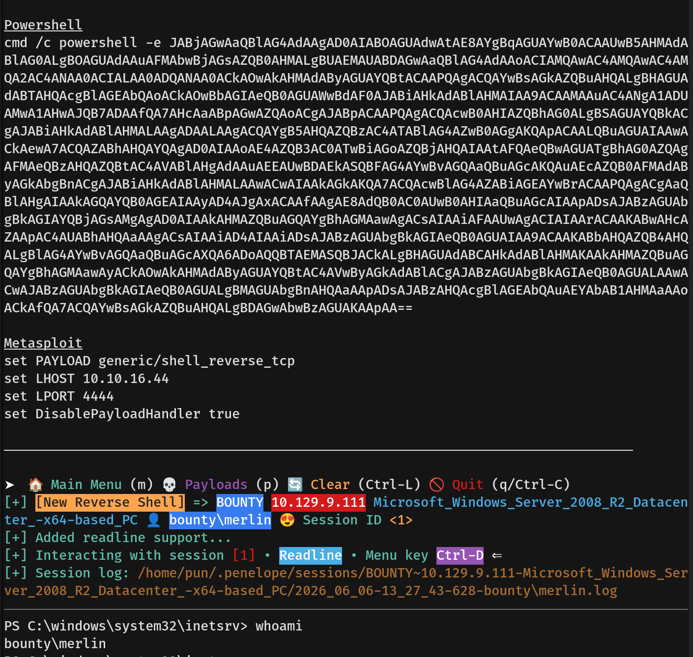
- Once the payload was executed via our web shell, Penelope caught the connection, granting us access to the machine as the user `merlin`. We then navigated to `C:\Users\merlin\Desktop` and captured the hidden `user.txt` flag.

---

## Privilege Escalation
- To assess our escalation paths, I checked our current privileges and discovered that the `merlin` user had `SeImpersonatePrivilege` enabled.
  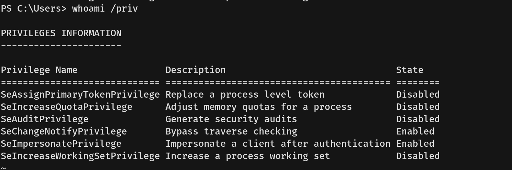
- I verified the system information to confirm the exact OS build. The results revealed the architecture and version as **Windows Server 2008 R2 Datacenter (x64)**, definitively validating that the machine was vulnerable to a token impersonation attack.
  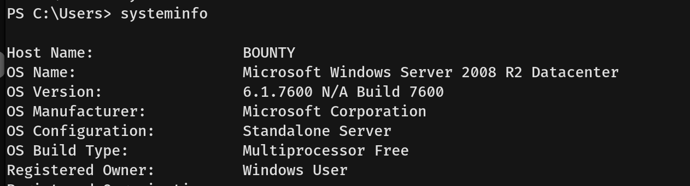
- After confirming the vulnerability, I downloaded the `JuicyPotato.exe` binary to the target machine.
  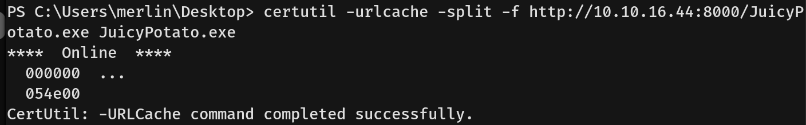
- Next, I generated a standard reverse shell executable using `msfvenom` and transferred it over to the target.
  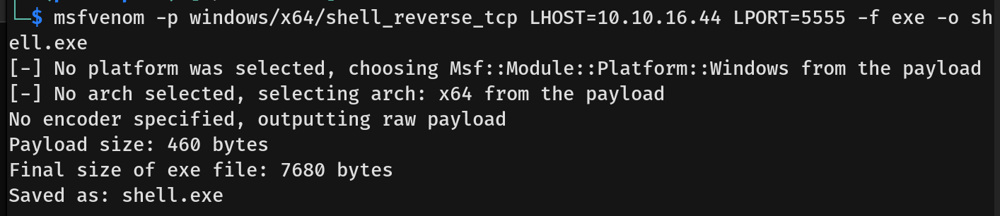
  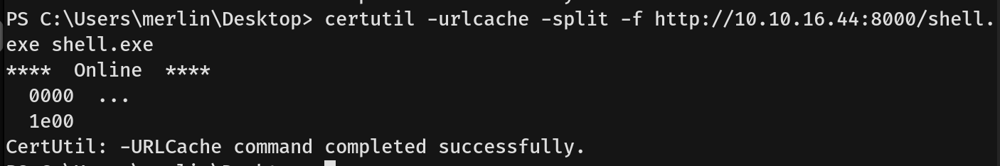
- I then executed JuicyPotato and configured it to launch our `msfvenom` payload.
  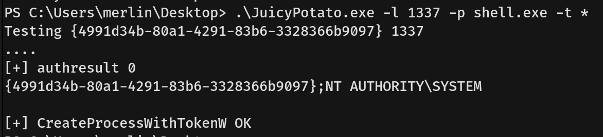
- The exploit was successful, and we caught the elevated reverse shell on our listener as `NT AUTHORITY\SYSTEM`, allowing us to capture the hidden `root.txt` flag.
  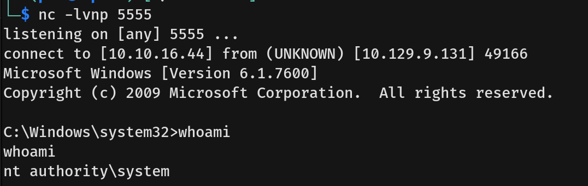
