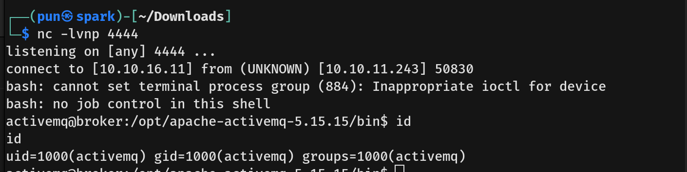
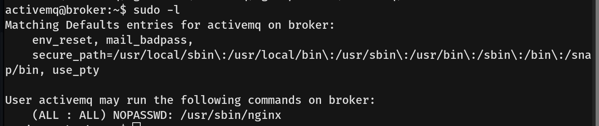

# Broker Writeup - by Thammanant Thamtaranon  
- Broker is an easy Linux-based machine hosted on Hack The Box.

## Reconnaissance  
- I started with a full TCP port scan including version detection and OS fingerprinting:  
  `nmap -A -T4 -p- 10.10.11.243`  
  
  
- Port 80 redirected to port 8161, which prompted for credentials.  
- Tried `admin:admin` and successfully logged in.  
- Other ports returned unreadable or unknown data formats.  
- Nmap revealed the server is running Jetty 9.4.39.v20210325 and ActiveMQ OpenWire transport 5.15.15.

## Scanning & Enumeration  
- The login portal on port 8161 was the main entry point.  
- No other notable services were accessible or useful.

## Exploitation  
- I searched for vulnerabilities affecting both Jetty 9.4.39 and ActiveMQ OpenWire 5.15.15.  
- Found **CVE-2023-46604**, a remote code execution vulnerability in Apache ActiveMQ due to unsafe deserialization over OpenWire protocol.  
- Grabbed the public PoC exploit and ran it against the target.  
  
  
- Successfully got a shell as the user `activemq`.  
  
- Retrieved the user flag.

## Privilege Escalation  
- Checked sudo privileges with `sudo -l`.  
  
- Created a malicious Nginx configuration file to serve the root filesystem and allow HTTP PUT requests.  
  
- Started Nginx using the crafted config with:  
  `sudo nginx -c /tmp/nginx_pwn.conf`  
- Generated an SSH key pair locally with `ssh-keygen`.  
- Uploaded the public SSH key directly to root’s authorized_keys via curl PUT request:  
  `curl -X PUT localhost:1339/root/.ssh/authorized_keys -d "$(cat .ssh/id_rsa.pub)"`  
- Because Nginx served the root filesystem and allowed uploads, this effectively gave me SSH access as root.  
- Set proper permissions on the private key (`chmod 600 id_rsa`) and connected as root:  
  `ssh root@10.10.11.243 -i id_rsa`
  
- Got the root flag and completed the box.
