# Busqueda Writeup - by Thammanant Thamtaranon

**Busqueda** is an **Easy**-difficulty Linux machine hosted on Hack The Box.

---

## Reconnaissance
- I began with a full TCP port scan to identify open services and the operating system.
  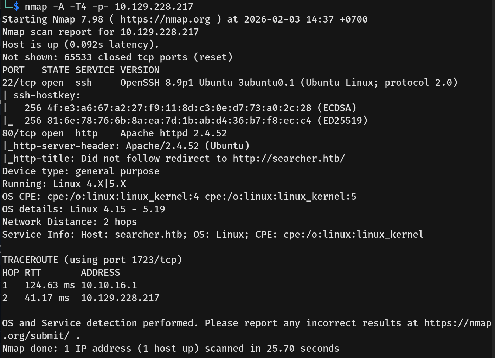
- The scan revealed two open ports:
  - **22/tcp** — OpenSSH 8.9p1
  - **80/tcp** — Apache httpd 2.4.52
- The web server on port 80 redirected to `searcher.htb`. I added this domain to my `/etc/hosts` file.

---

## Scanning & Enumeration
- Navigating to the website revealed a search tool application.
  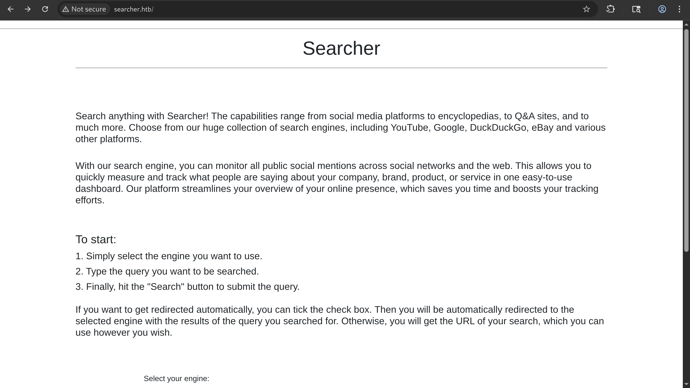
- I checked the page footer and identified the application version as **Searchor 2.4.0**.
  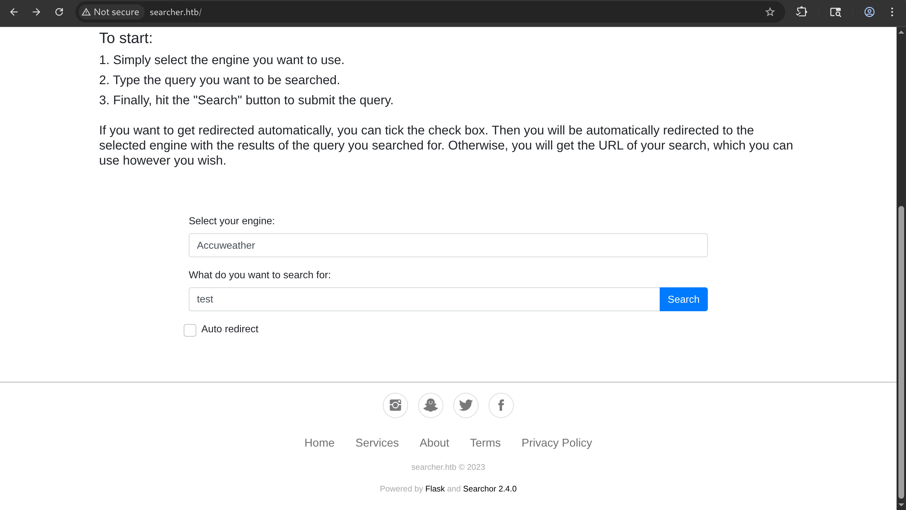
- I researched this version and found it is vulnerable to **Arbitrary Command Execution** (CVE-2023-43364).
  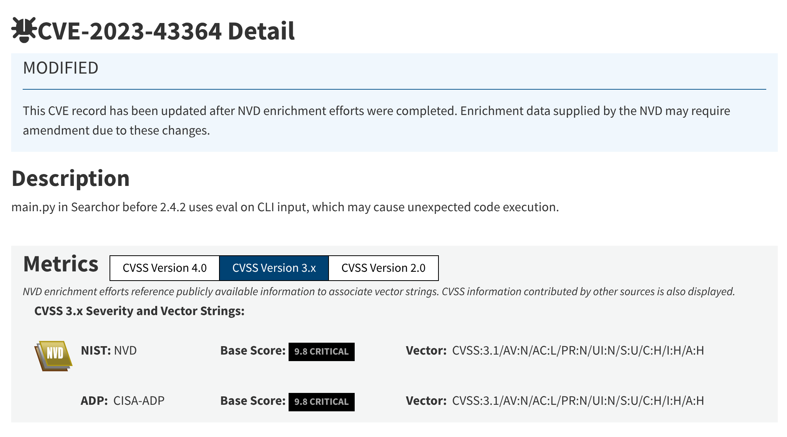
- The vulnerability exists because the application uses a Python `eval()` function insecurely when processing search queries.

---

## Exploitation
- I used `curl` to verify the vulnerability by injecting the `id` command. The server responded with `uid=1000(svc)`, confirming code execution.
  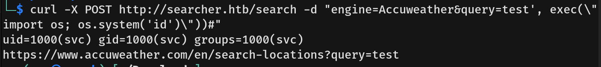
- I attempted to establish a reverse shell using a standard `/bin/bash` payload, but it was unsuccessful. I then modified the parameters to inject a Python payload designed to establish a reverse shell.
  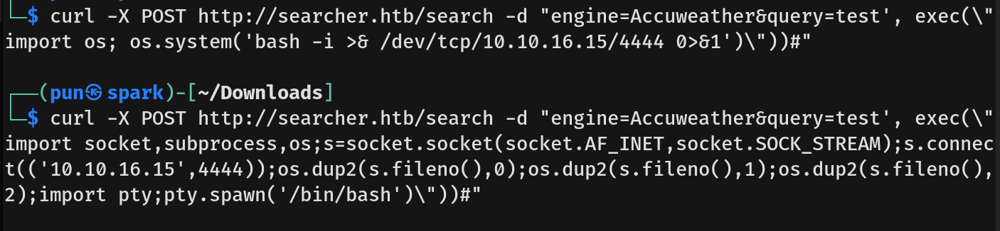
- I set up a listener and successfully received a callback, gaining initial access as the user `svc`.
  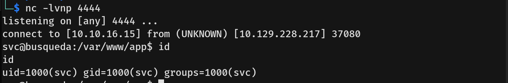
- I captured the **user flag**.

---

## Privilege Escalation
- I began enumerating the file system and found a local Git repository in the web directory.
- I inspected the configuration file inside the `.git` directory and discovered a set of credentials for the user `cody` embedded in the remote URL.
  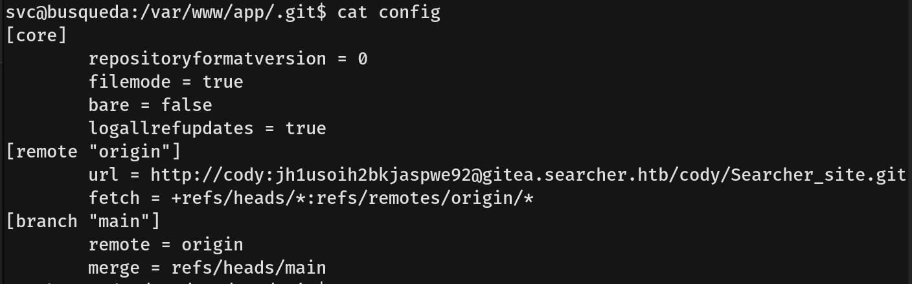
- I added `gitea.searcher.htb` to my `/etc/hosts` file.
- I navigated to `gitea.searcher.htb` but initially found nothing useful.
  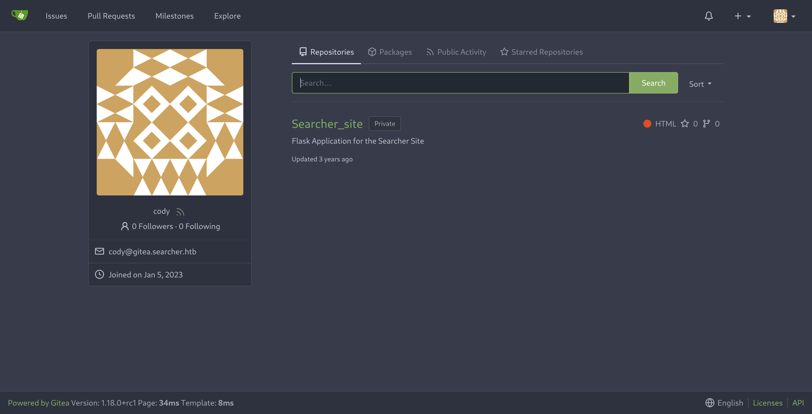
- I checked the user's sudo privileges using `sudo -l`. I successfully authenticated using the password found earlier in the Git config (password reuse).
  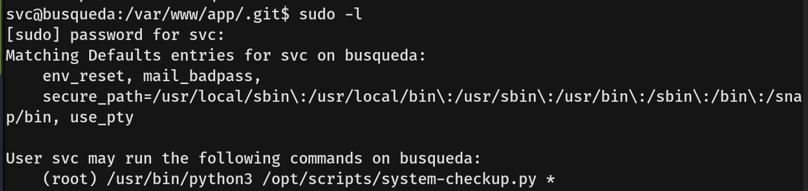
- The user `svc` can run a specific Python script `/opt/scripts/system-checkup.py` with various arguments, including `docker-ps`, `docker-inspect`, and `full-checkup`.
- I ran the script using the `docker-inspect` argument on the `mysql_db` container and piped the output to `jq` for readability.
- The output revealed environment variables containing database credentials. I found a root password `jI86kGUuj87guWr3RyF` and a Gitea password `yuiu1hoiu4i5ho1uh`.
  
- I tried these passwords on the administrator account on the Gitea login page. I successfully logged in using `yuiu1hoiu4i5ho1uh`.
  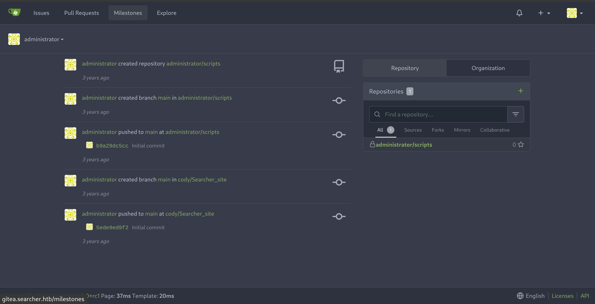
- I found a private repository named `scripts` containing various scripts.
  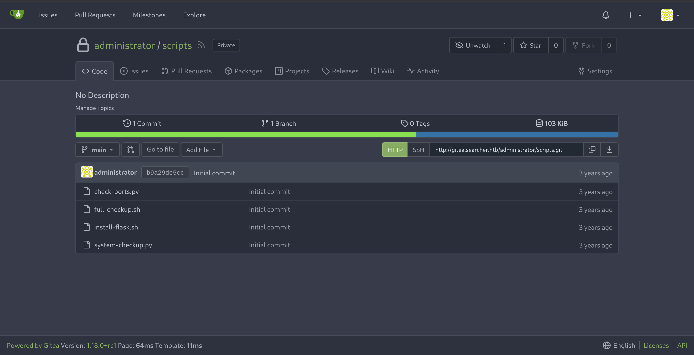
- I inspected the `system-checkup.py` code in the repository and found that the `full-checkup` option executes a script using a relative path (`./full-checkup.sh`) rather than an absolute path.
  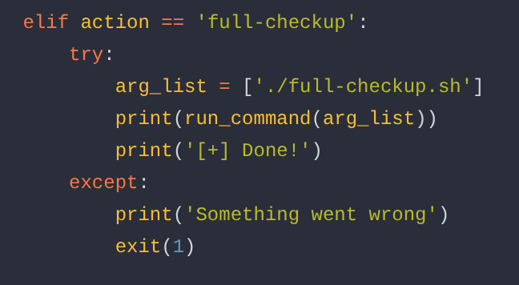
- This means we can perform path hijacking by creating our own script named `full-checkup.sh` in the current directory to execute our commands as root.
- I created the script with the command `chmod +s /bin/bash` to add SUID bits to `/bin/bash` and ran the sudo command.
  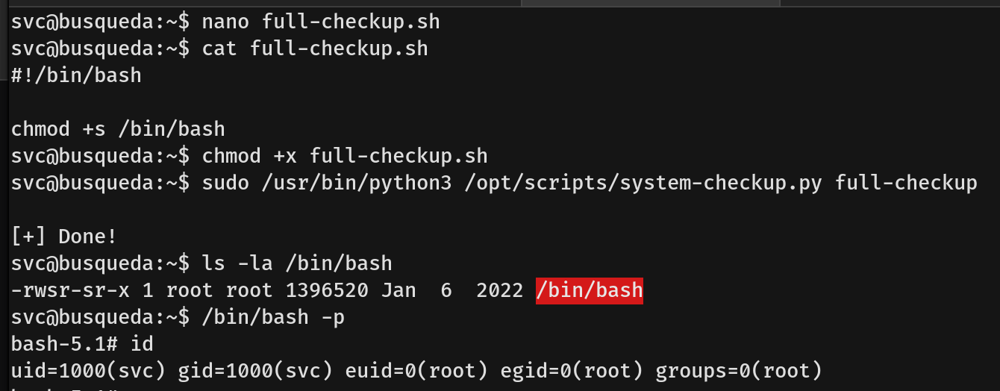
- I then obtained a root shell and captured the root flag.
