# Certified Writeup - by Thammanant Thamtaranon

**Certified** is a **Medium**-difficulty Windows machine hosted on Hack The Box.

---

## Reconnaissance
- I began with a full TCP port scan to identify open services and the operating system.
- The scan revealed the standard suite of ports for a **Domain Controller**
  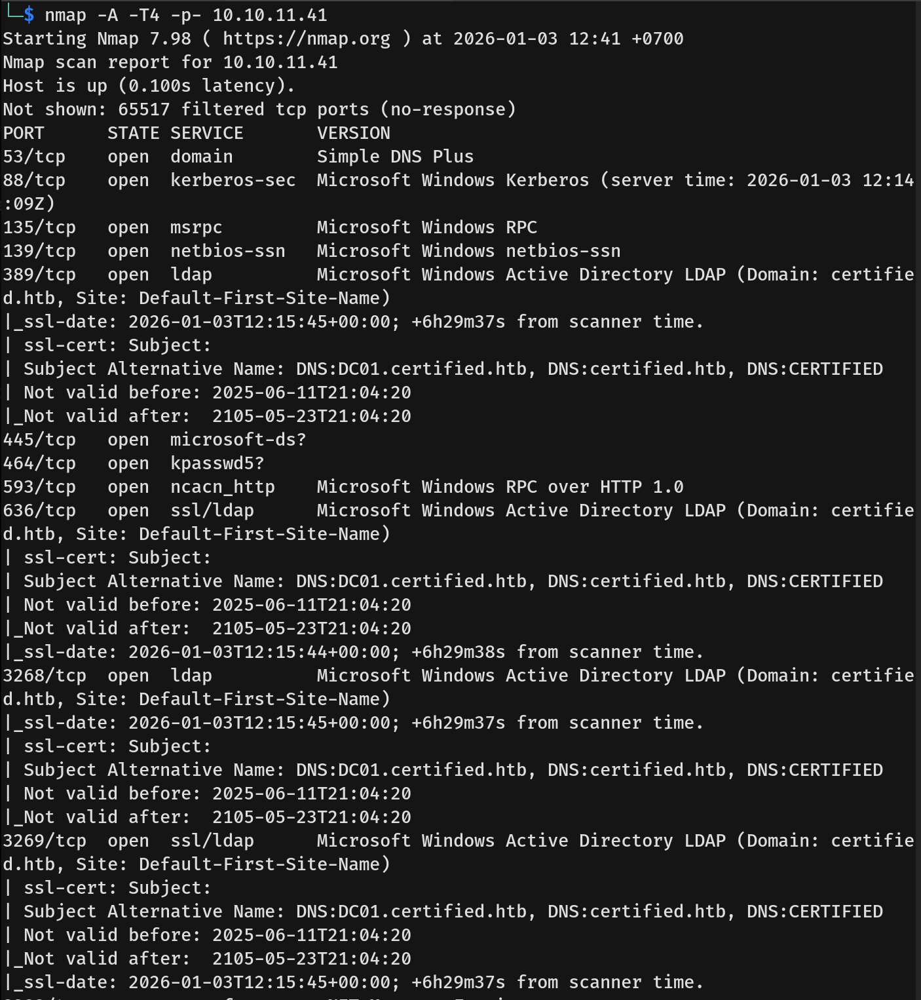
  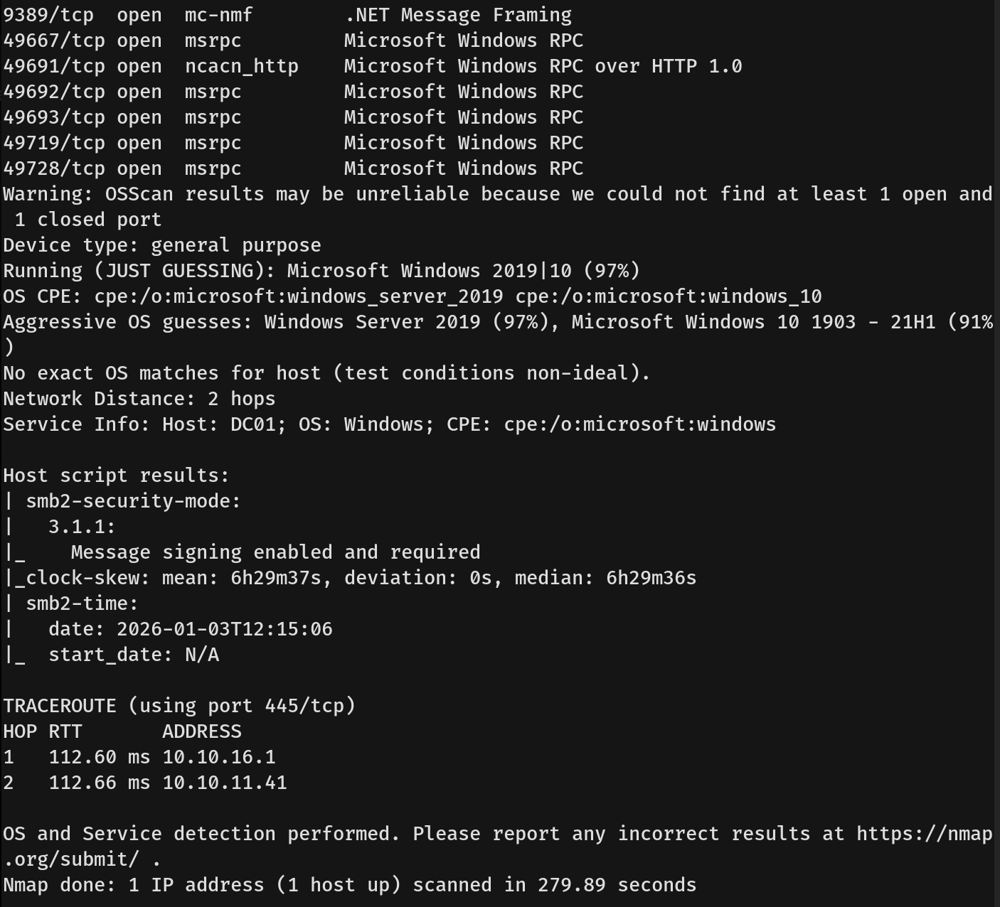
- I added **dc01.certified.htb** and **certified.htb** to my `/etc/hosts` file.

---

## Scanning & Enumeration
- We were provided with a valid credential for the user **judith.mader**: `judith09`.
- I used these credentials to check for SMB access using `NetExec` (nxc).
  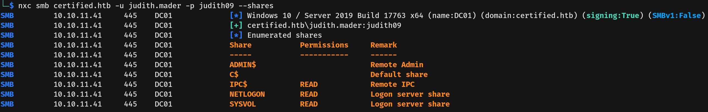
- In the **SYSVOL** share, we found a `Registry.pol` file.
  - *Note:* `Registry.pol` files are binary files used to store Windows Group Policy registry settings. In some cases, these files can leak credentials (such as in the now-deprecated Group Policy Preferences). However, upon analysis, we found no credentials in this file.
  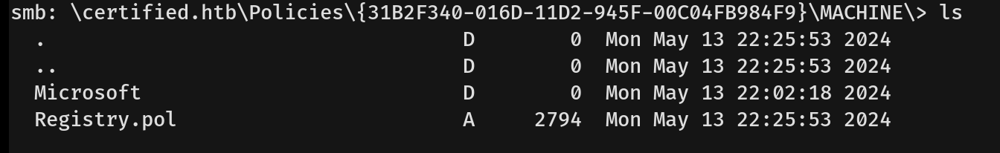
  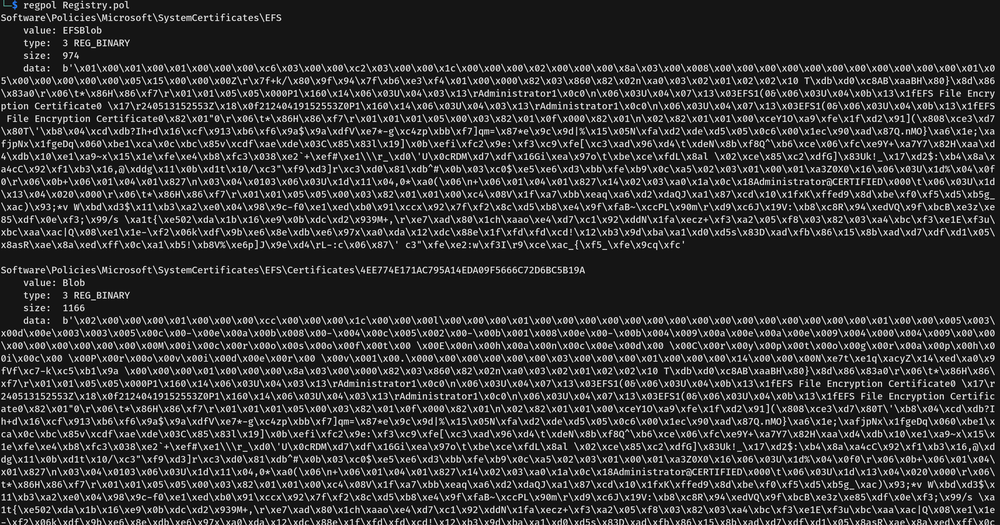
- I then used the credentials to check for LDAP access using `NetExec`.
  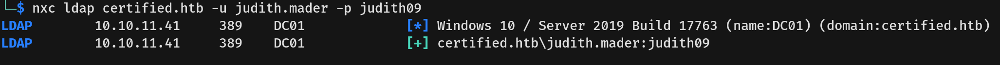
- After confirming the credential was valid in Active Directory, I synchronized my local clock with the target server to prevent Kerberos authentication errors.
- I then ran **BloodHound** to collect the domain relationships and visualize the attack path.
  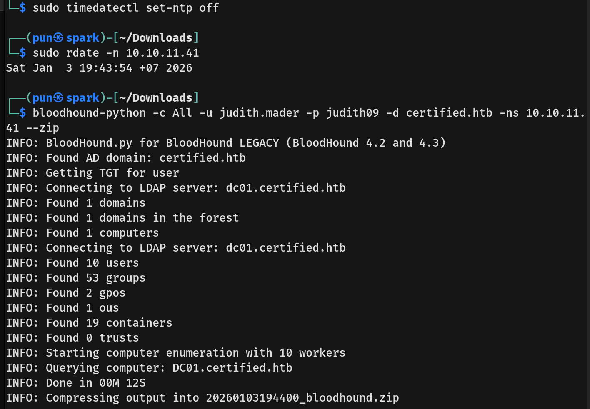
- **Attack Plan:** Analyzing the BloodHound graph, I formulated the following plan:
  1.  **Judith.Mader** has **WriteOwner** rights over the **Management** group, allowing us to take ownership and modify the group.
      
  2.  The **Management** group has **GenericWrite** over the user **MANAGEMENT_SVC**. We can abuse this using Shadow Credentials.
      
  3.  **MANAGEMENT_SVC** has **GenericAll** rights over the user **CA_OPERATOR**. We can reset this user's password.
      

---

## Exploitation
- I proceeded to execute Step 1 of the plan. I used `bloodyAD` to set the owner of the Management group to Judith, grant her GenericAll rights, and then add her to the group.
  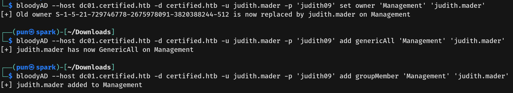
- Moving to Step 2, I abused the **GenericWrite** permission on **MANAGEMENT_SVC** using `certipy-ad` to perform a Shadow Credentials attack. This allowed us to retrieve the NTLM hash for the service account.
  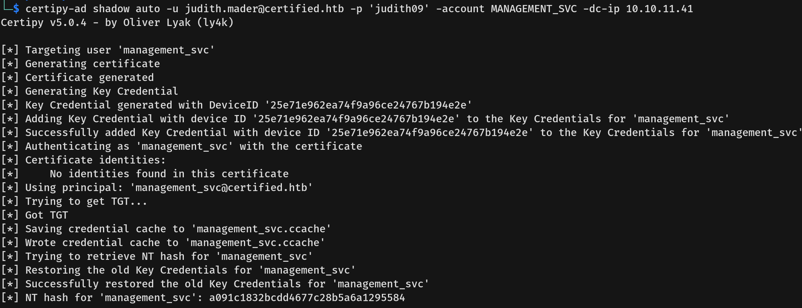
- I verified this access using **Evil-WinRM**.
  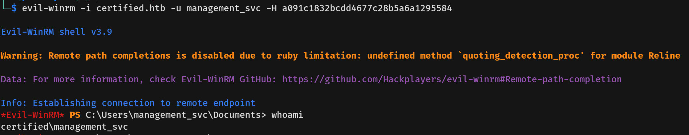
- I successfully captured the **user flag** from the user's desktop.
- For Step 3, I used `bloodyAD` and the compromised Management_SVC account to force reset the password for the user **CA_OPERATOR**.
  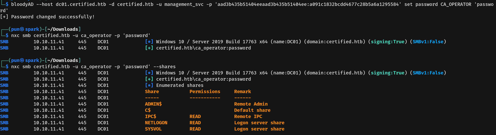
- We have successfully compromised the **CA_OPERATOR** user.

---

## Privilege Escalation
- With access to **CA_OPERATOR**, I enumerated the Certificate Authority for vulnerable templates using `certipy-ad`.
  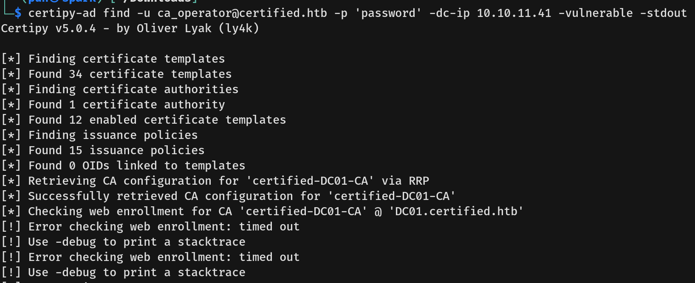
  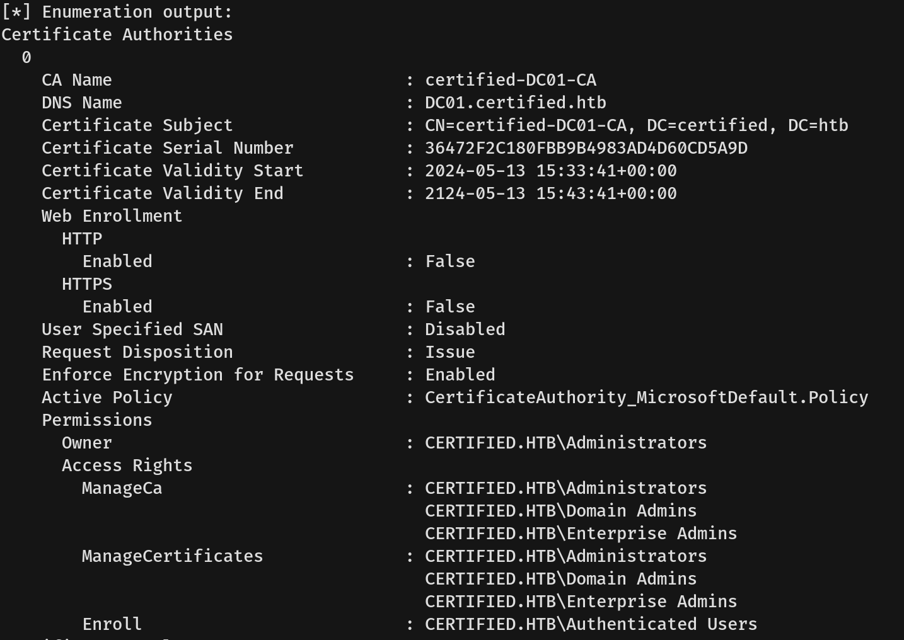
  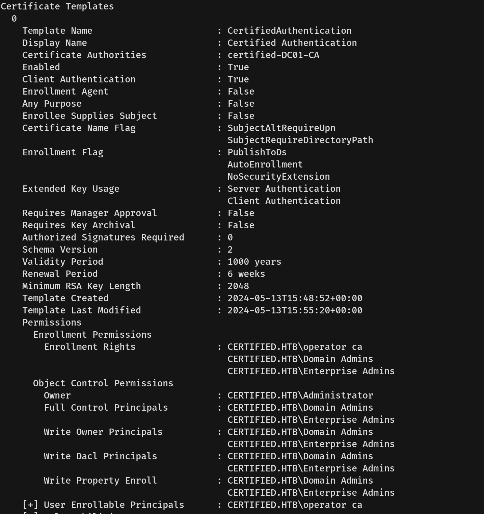
  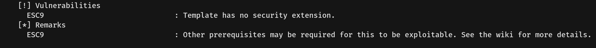
- We identified the **CertifiedAuthentication** template, which is vulnerable to **ESC9**.
  - **Vulnerability Explanation:** This vulnerability (UPN Spoofing) occurs because the template generates certificates based on the `userPrincipalName` (UPN) of the requester, but the security settings (specifically the lack of strict security extension checks) allow us to modify our own UPN to impersonate someone else.
- **UPN Spoofing Attack:**
  - First, I used the `management_svc` account (which has write rights over `ca_operator`) to change `ca_operator`'s User Principal Name (UPN) to **Administrator**.
  - Next, I requested a certificate using the **CertifiedAuthentication** template. Since the account's UPN is now "Administrator", the CA issued a certificate valid for the Administrator account.
  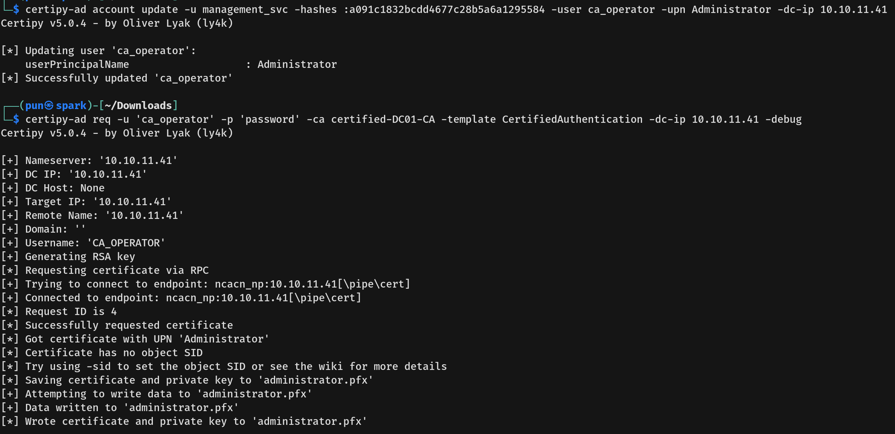
  - Immediately after obtaining the certificate (`administrator.pfx`), I reverted the UPN back to `ca_operator` to clean up the environment and avoid conflicts.
- I then authenticated to the Domain Controller using the spoofed certificate. This successfully retrieved the Administrator's NTLM hash.
  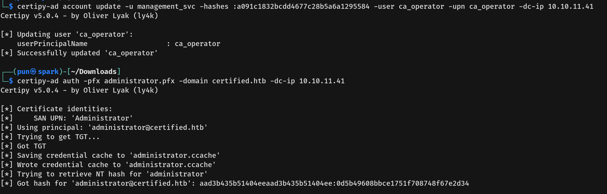
- I validated the hash using **NetExec**.
  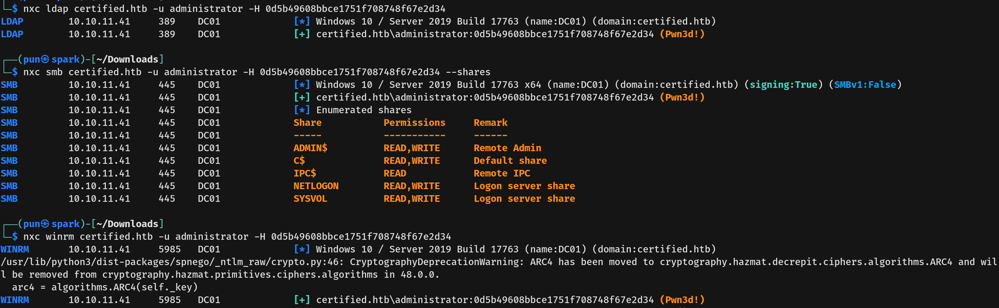
- Finally, I used **Evil-WinRM** to log in to the machine as the Administrator.
  
- We captured the **root flag**.
