# Chatterbox Writeup - by Thammanant Thamtaranon

**Chatterbox** is a **Medium**-difficulty Windows machine hosted on Hack The Box.

---

## Reconnaissance
- We started the engagement with a full TCP port scan using Nmap to identify open services and determine the underlying operating system.
  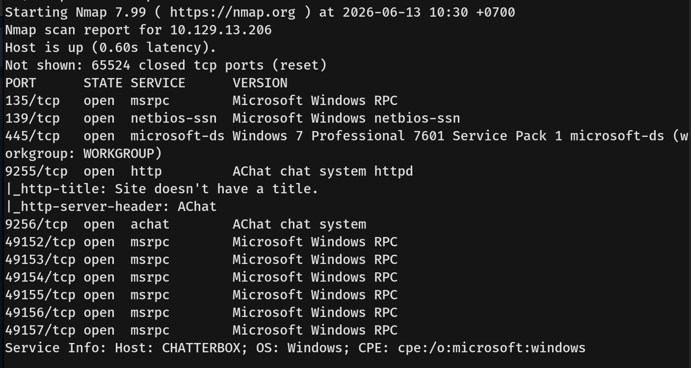
  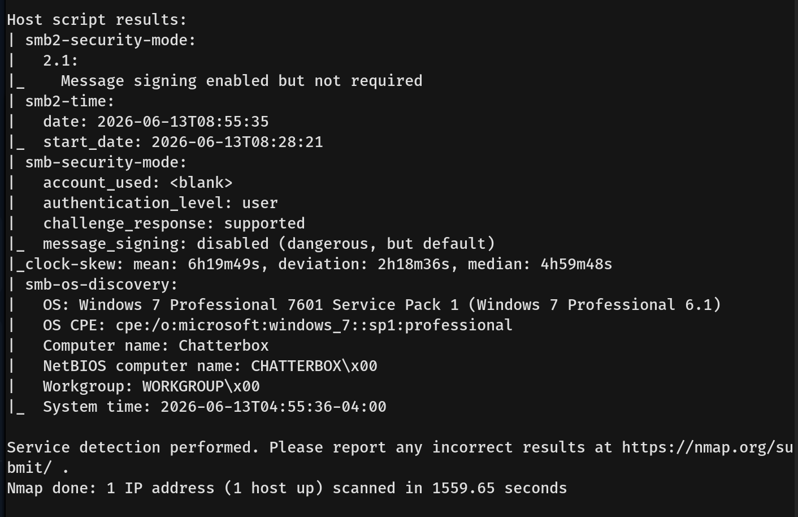
- The results indicated several open ports, revealing a Windows 7 Professional SP1 environment:
  * **135, 49152-49157/tcp:** msrpc (Microsoft Windows RPC)
  * **139/tcp:** netbios-ssn
  * **445/tcp:** microsoft-ds (SMB)
  * **9255/tcp:** HTTP (AChat chat system httpd)
  * **9256/tcp:** achat (AChat chat system)

---

## Scanning & Enumeration
- I initially tried to connect to the HTTP service on port 9255 (AChat) and ran `dirsearch`, but this revealed nothing of interest. We then switched to SMB enumeration. The SMB service did not accept null sessions or guest credentials.
  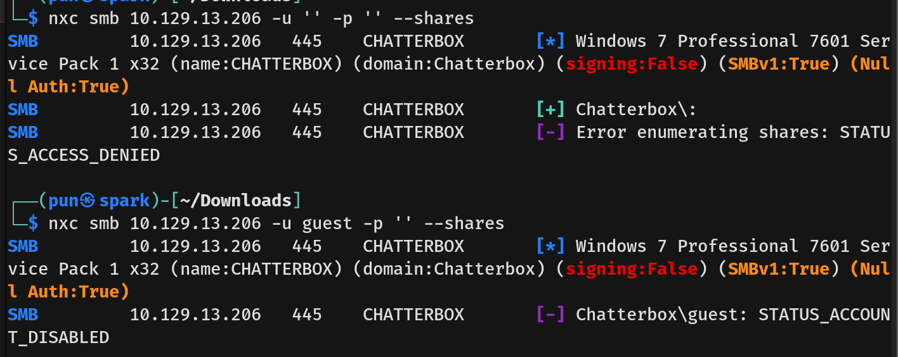
- I researched the AChat service running on ports 9255 and 9256. Using `searchsploit`, we discovered that AChat is vulnerable to a known Remote Buffer Overflow.
  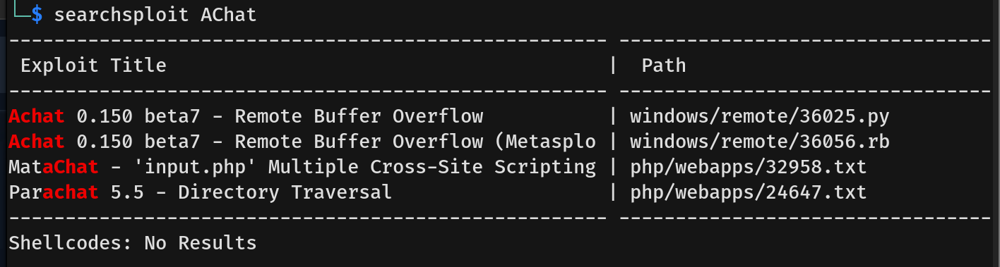
  
---

## Exploitation
- Since there is an existing Metasploit module for this specific AChat buffer overflow, I decided to use it to gain our initial foothold.
  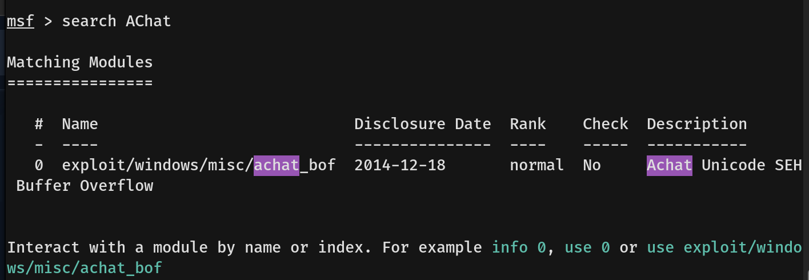
  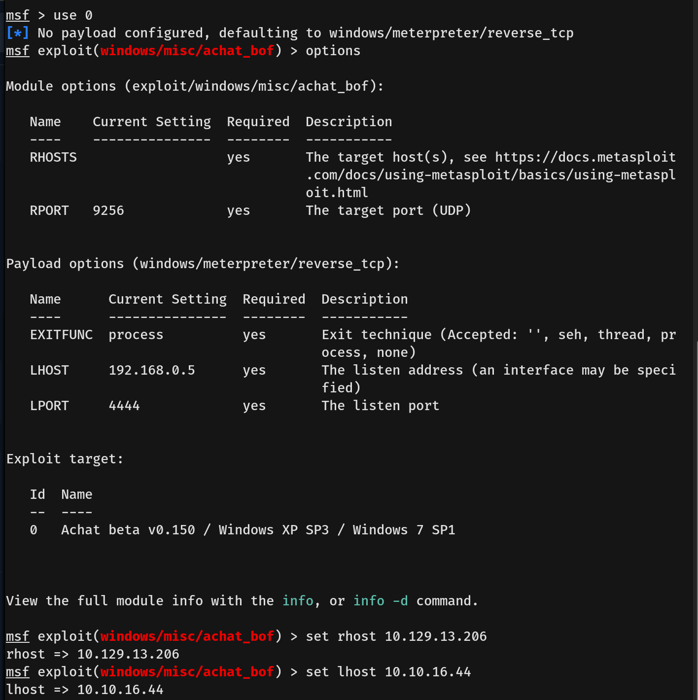
  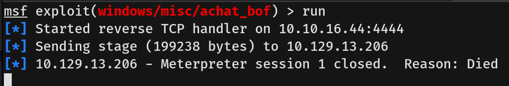
- The initial Metasploit execution failed. This often happens with the default staged payloads (like `windows/meterpreter/reverse_tcp`) because the buffer space allocated by the exploit might be too small for the stager, or the secondary payload download gets interrupted. 
- I resolved this by changing the payload to `windows/shell_reverse_tcp`. This is an **unstaged (inline)** payload, meaning the entire reverse shell code is sent in a single chunk along with the exploit, making it much more stable for this buffer overflow.
  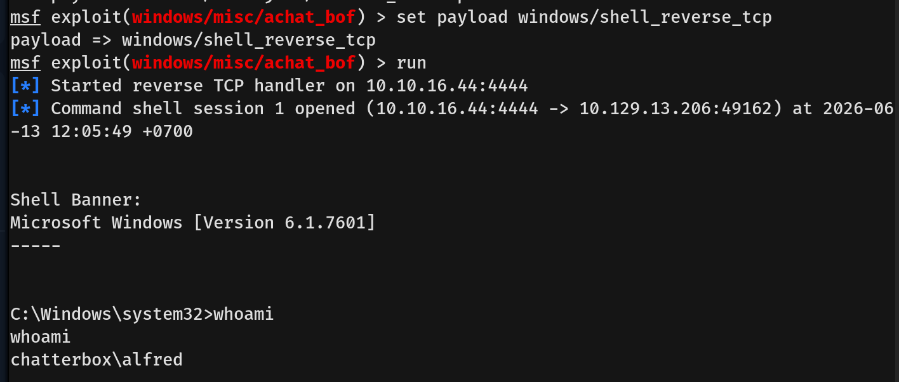
- The unstaged payload worked perfectly, and we caught a reverse shell as the user `Alfred`. We then navigated to Alfred's desktop directory and captured the `user.txt` flag.
  
---

## Privilege Escalation
- User `Alfred` did not have any interesting privileges enabled, so I enumerated the system further. By querying the Windows Registry, I discovered stored credentials in plain text.
  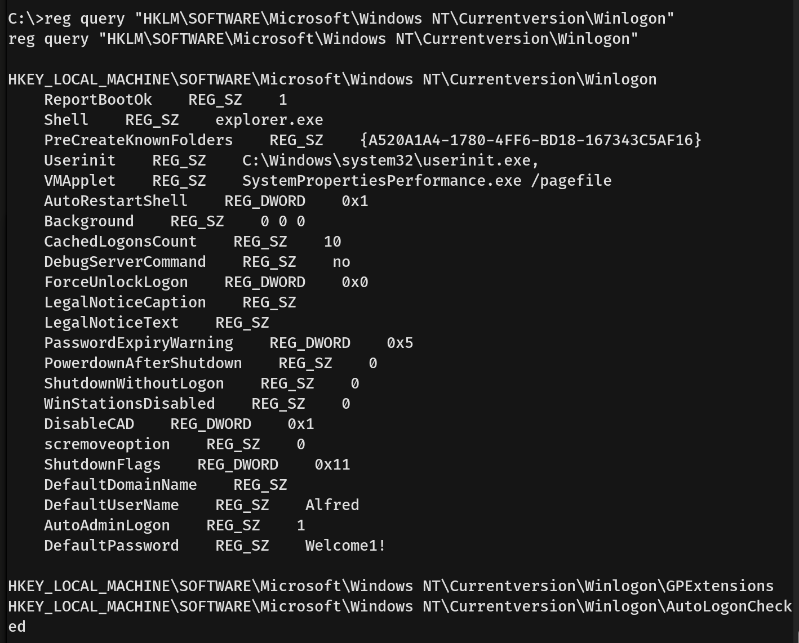
- The registry revealed the password `Welcome1!` for Alfred. Curious about password reuse, I tested these credentials against the `Administrator` account using NetExec.
  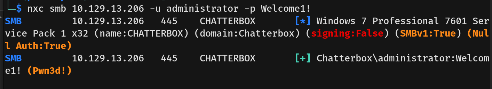
- The scan confirmed that the `Administrator` user shared the exact same password.
- Since we now had valid Administrator credentials, I used `psexec` to authenticate and successfully spawned a shell as `NT AUTHORITY\SYSTEM`.
  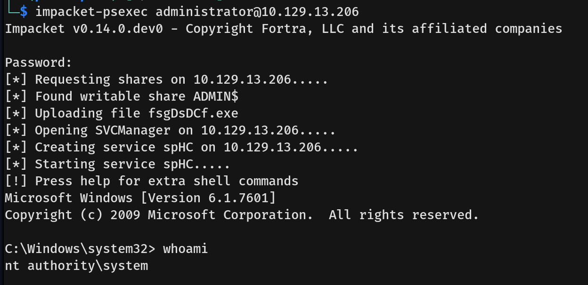
- Navigating to the Administrator's desktop, we found the `root.txt` flag, but attempting to read it using the `more` or `type` commands resulted in an "Access Denied" error. This indicated that the file's Access Control List (ACL) had been strictly configured to explicitly deny read access, even to high-privileged accounts.
  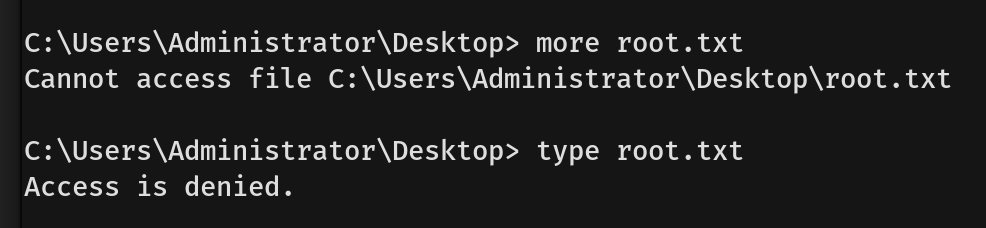
- To bypass this restriction, a two-step process was required:
  1. **Take Ownership:** Because the previous owner had stripped the permissions, we first had to force ownership of the file over to our current execution context (`SYSTEM`). As confirmed by the success output, the file was now owned by our machine account (`WORKGROUP\CHATTERBOX$`).
  2. **Grant Permissions:** Now acting as the file's legal owner, I used the command `icacls root.txt /grant SYSTEM:F` to rewrite the ACL and explicitly grant the `SYSTEM` account Full Control (`F`) over the file.
- With the permissions fully restored, we successfully read the file and captured the root flag.
  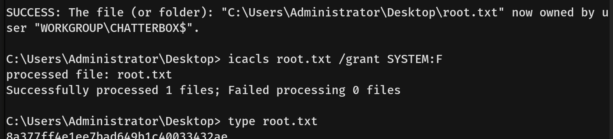
