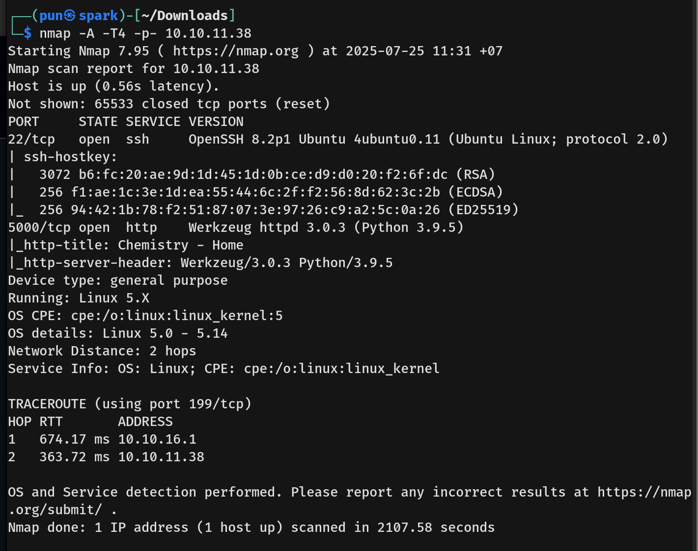
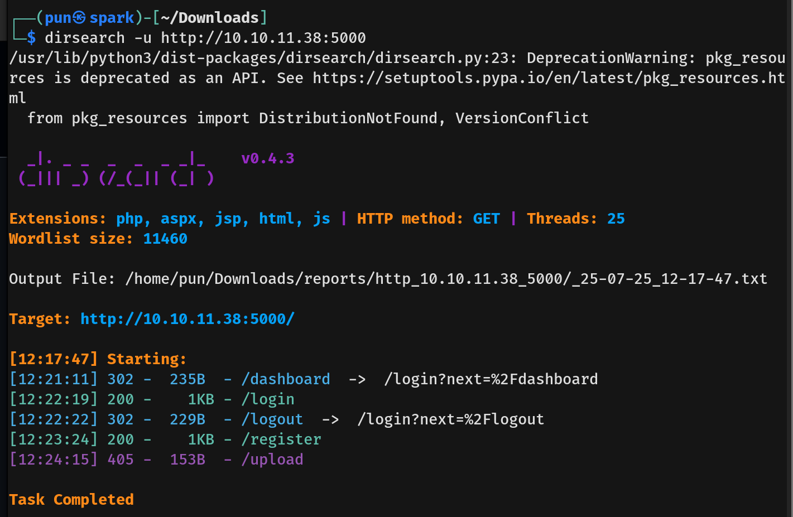

# Chemistry Writeup - by Thammanant Thamtaranon
  - Chemistry is an easy Linux machine on Hack The Box.

## Reconnaissance
  - First, we run the command `nmap -A -T4 -p- -Pn 10.10.11.58` to identify open TCP ports and their service information.  

## Scanning & Enumeration
  - With port 80 open, we use the command `dirsearch -u 10.10.11.58` to enumerate directories.  

## Exploitation
