# Chemistry Writeup - by Thammanant Thamtaranon
  - Chemistry is an easy Linux-based machine hosted on Hack The Box.

## Reconnaissance
  - Initially, we performed a full TCP port scan with version detection and OS fingerprinting using the command:
    `nmap -A -T4 -p- 10.10.11.38`  

## Scanning & Enumeration
  - Port `5000` was identified as open, typically associated with Flask or other Python-based web services. We enumerated web directories using:
    `dirsearch -u 10.10.11.38`  

## Exploitation
  - Attempts to authenticate with default or common credentials were unsuccessful.
  - A user registration feature was available, which allowed us to create an account. After logging in, analysis of the session cookie suggested it was signed using **Flask** module.
  - Further inspection revealed functionality allowing users to upload `.cif` files for processing.
  - After researching known vulnerabilities, we discovered **CVE-2024-23346**, a code execution vulnerability affecting CIF parsing in this environment.
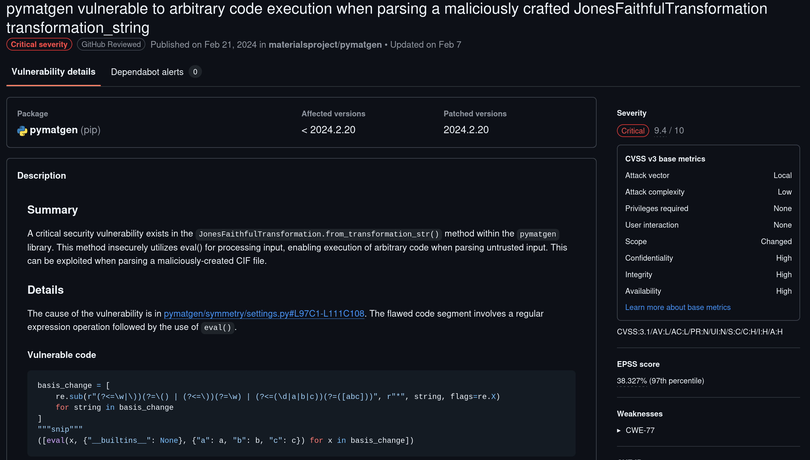
  - We crafted a malicious `.cif` payload using the published PoC.
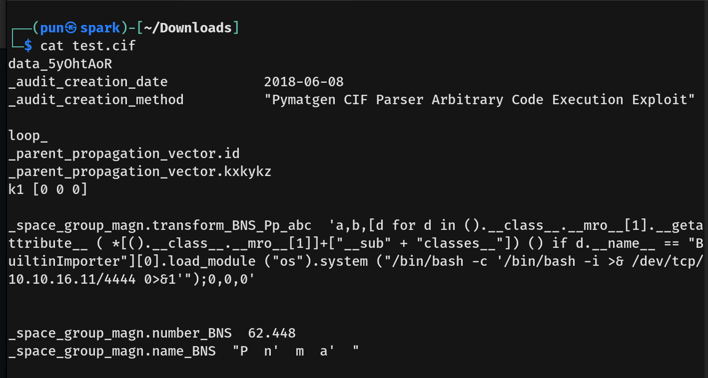
  - Upon uploading the file and triggering the "View" feature, the payload was executed, resulting in a **reverse shell** as the low-privileged user `app`.
  - Post-exploitation, we discovered a local SQLite database file named `database.db` and accessed it using:
    `sqlite3 database.db`
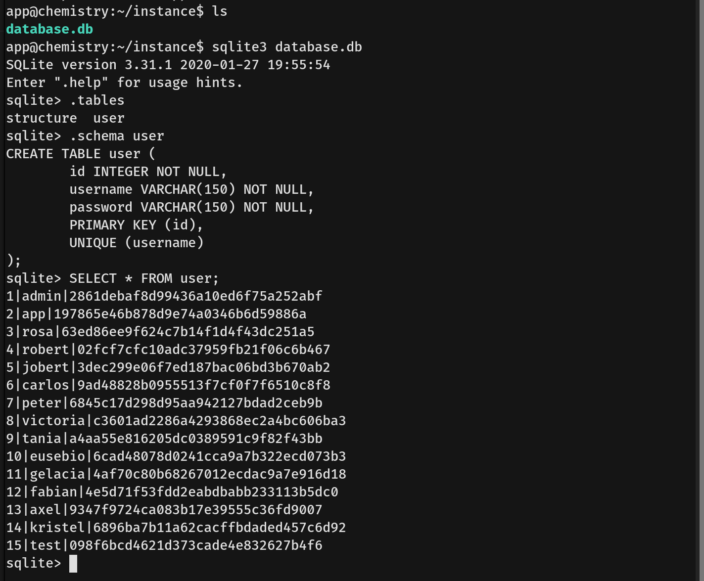
  - We enumerated local users by reading `/etc/passwd`, revealing the presence of a second user named `rosa`.
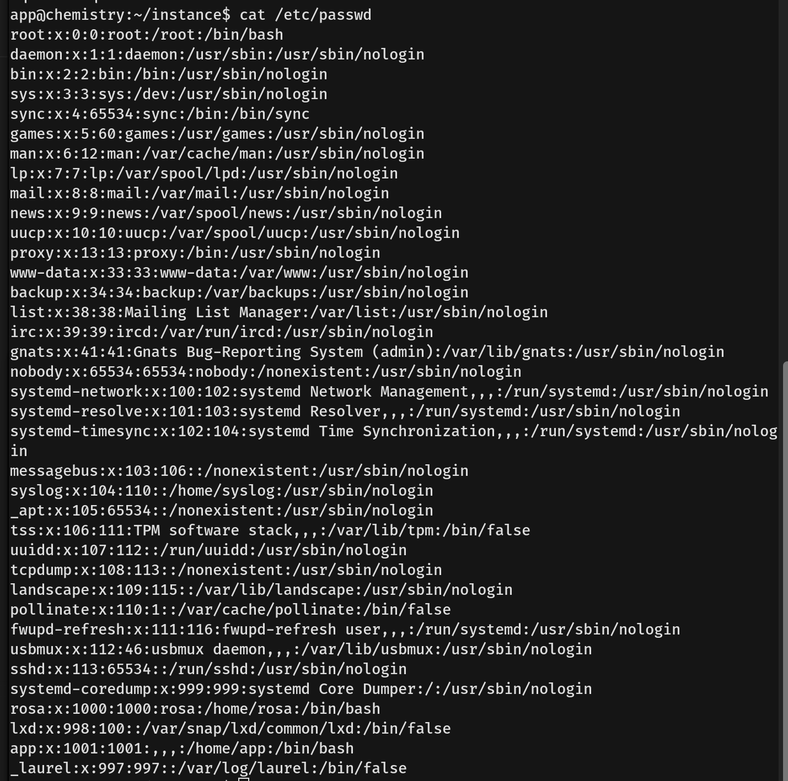
  - Extracted password hashes were cracked using **CrackStation**, successfully revealing Rosa’s plaintext credentials.
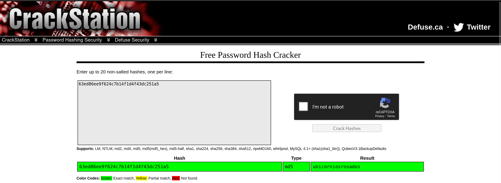
  - We initiated an SSH session using `ssh rosa@10.10.11.38` and successfully obtained the **user flag**.
  - Rosa lacked sudo privileges (`sudo -l`), so we enumerated internal services. Running `ss -tunlp` revealed a web service bound to localhost on port `8080`.
  - We established an SSH tunnel to access the internal service locally using:
    `ssh rosa@10.10.11.38 -L 8080:localhost:8080`
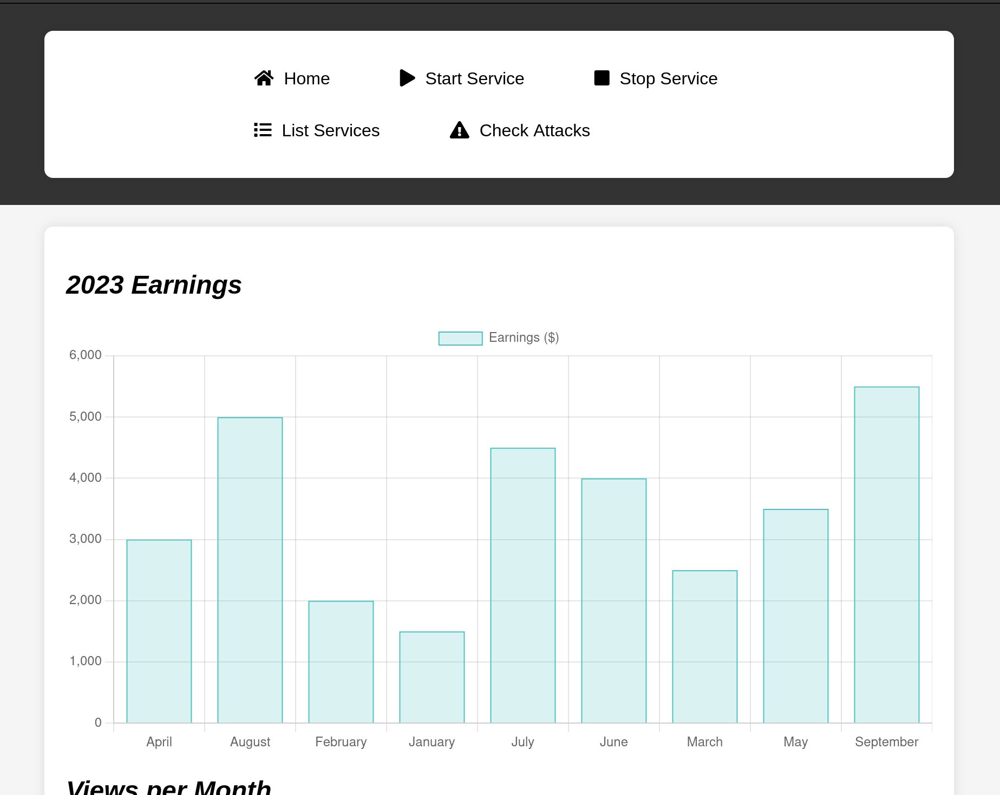
  - Accessing `http://localhost:8080` via browser, we analyzed the web traffic using the browser’s developer tools and identified the service as running **aiohttp version 3.9**.
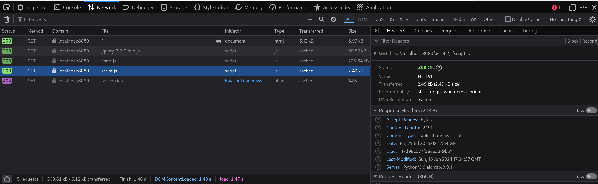
  - A known RCE vulnerability was found for this version.
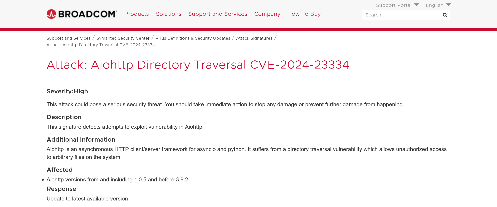
  - We executed a remote code execution PoC targeting the aiohttp service, successfully spawning a root shell.
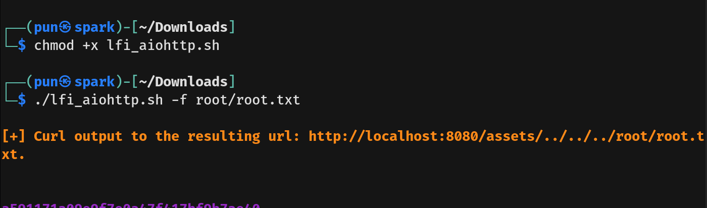
  - With root-level access, we retrieved the **root flag**.
  - We also extracted the root user's SSH private key from `/root/.ssh/id_rsa`.
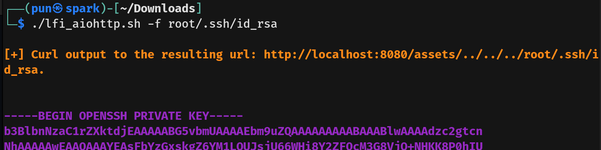
  - Using the extracted key, we established an SSH session as root and confirmed full system compromise.
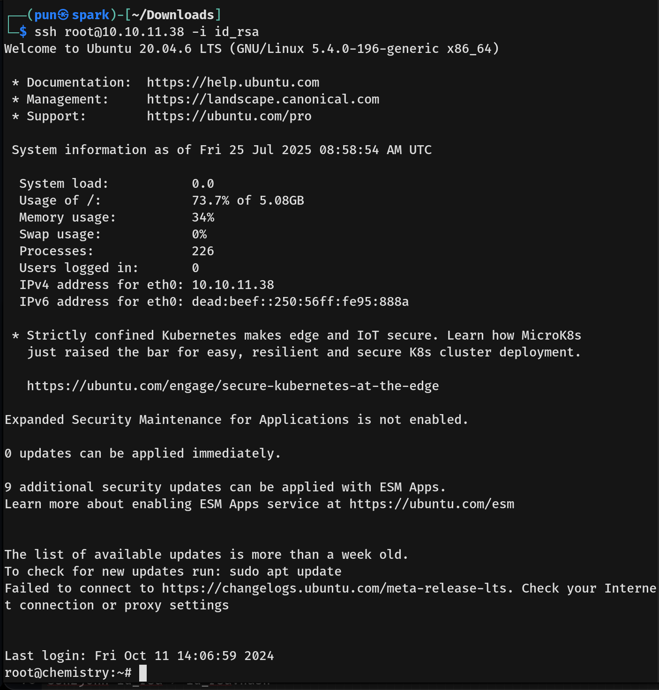
