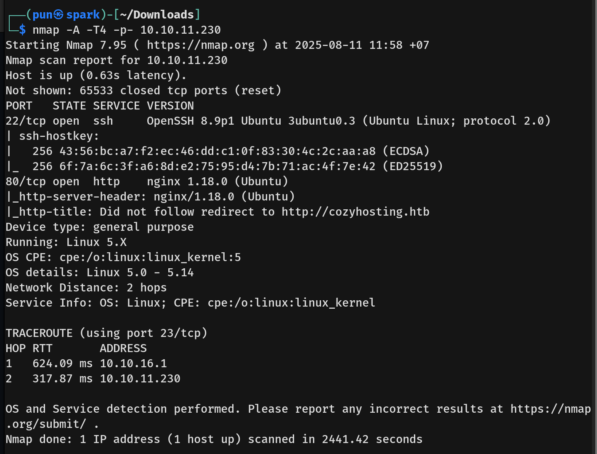

# CozyHosting Writeup - by Thammanant Thamtaranon  

- CozyHosting is an easy Linux-based machine hosted on Hack The Box.

## Reconnaissance  
- I began with a full TCP port scan including service/version detection and OS fingerprinting:  `nmap -A -T4 -p- 10.10.11.230`  

  

- The scan revealed two open ports:  
  - 22 (SSH)  
  - 80 (HTTP)  

- I added `cozyhosting.htb` to `/etc/hosts` for proper hostname resolution.

## Scanning & Enumeration  
- I performed directory brute-forcing using `dirsearch`:  `dirsearch -u http://cozyhosting.htb`  

  
  

## Exploitation  

## Privilege Escalation  
