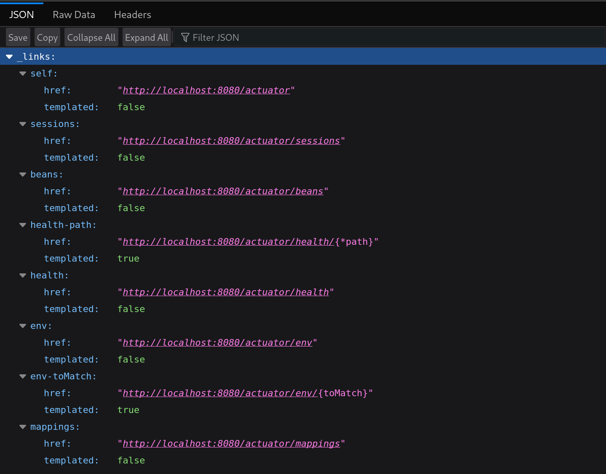
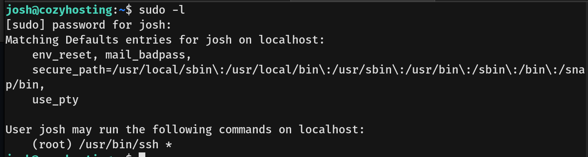

# CozyHosting Writeup - by Thammanant Thamtaranon  

- CozyHosting is an easy Linux-based machine hosted on Hack The Box.

## Reconnaissance  
- I began with a full TCP port scan including service/version detection and OS fingerprinting:  `nmap -A -T4 -p- 10.10.11.230`  

  

- The scan revealed two open ports:  
  - 22 (SSH)  
  - 80 (HTTP)  

- I added `cozyhosting.htb` to `/etc/hosts` for proper hostname resolution.

## Scanning & Enumeration  
- I performed directory brute-forcing using `dirsearch`:  `dirsearch -u http://cozyhosting.htb`  

  

- VHost enumeration yielded no results.  
- The scan revealed two interesting paths:  
  - `/actuator`  
  - `/login`  

- The `/actuator` endpoint contained multiple subpaths:  
  

- The `/actuator/sessions` endpoint revealed active session IDs:  
  

- The `/actuator/mapping` endpoint showed various application routes:  
  

- I hijacked `kanderson`'s session by modifying my `JSESSIONID` cookie, gaining access as K. Anderson:  
  

## Exploitation  
- Using Burp Suite, I tested for command injection vulnerabilities. Since whitespace was blocked, I used `${IFS}` as a separator:  
  
  

- After confirming command injection worked, I attempted to upload a reverse shell. Permission issues forced me to use the `/tmp` directory:  
  
  

- Executing the reverse shell granted access as the `app` user:  
  

- Inspecting `/etc/passwd` confirmed the existence of user `josh`:  
  

- I extracted the application JAR file:  `unzip cloudhosting-0.0.1.jar -d /tmp/extracted_jar/`  

- This revealed PostgreSQL database credentials. I connected to the database:  `psql -h localhost -U postgres -d cozyhosting -W`  

  

- The database contained hashed credentials for users `kanderson` and `admin`. Using John the Ripper, I cracked the admin hash:  
  

- The credentials allowed SSH access as `josh`:  
  

- I then retrieved the user flag.

## Privilege Escalation  
- Checking sudo permissions revealed an interesting entry:  `sudo -l`  
  

- Consulting GTFOBins revealed an SSH privilege escalation vector:  
  

- Executing the suggested command granted root access:  
  

- Finally, I obtained the root flag, completing the machine.
