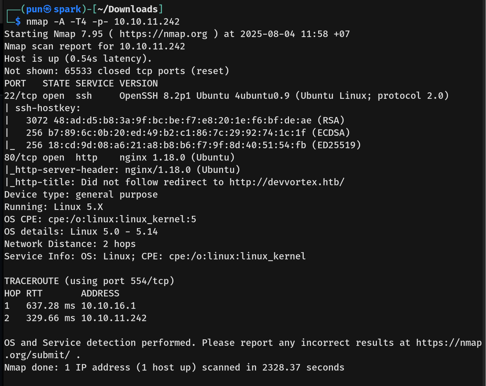
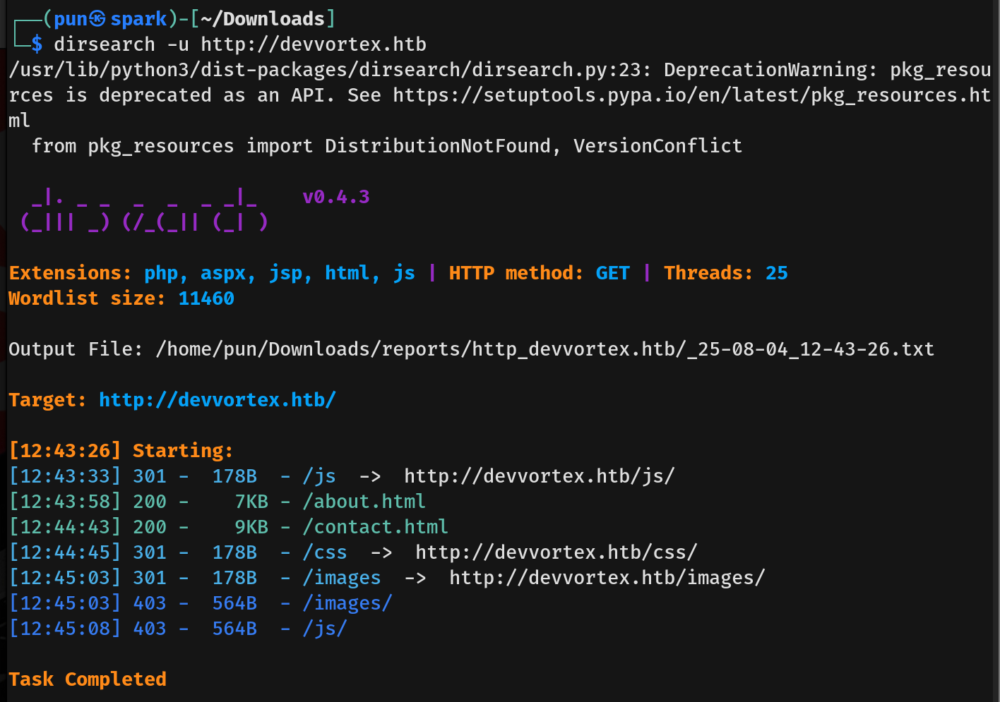
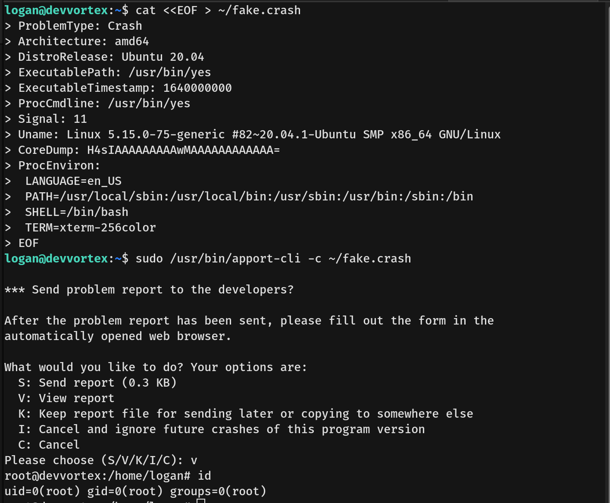

# DevVortex Writeup - by Thammanant Thamtaranon  
- DevVortex is an easy Linux-based machine hosted on Hack The Box.

## Reconnaissance  
- We began by performing a full TCP port scan with version detection and OS fingerprinting using the command:  
  `nmap -A -T4 -p- 10.10.11.253`  

## Scanning & Enumeration  
- We enumerated web directories using:  
  `dirsearch -u http://10.10.11.253`  
  
- Additional interesting paths discovered include:  
  - `/weighted-grade`  
  - `/weighted-grade-calc`  

## Exploitation  

## Privilege Escalation  
- We executed `sudo su` to escalate to root.  
- We captured the **root flag**.  

