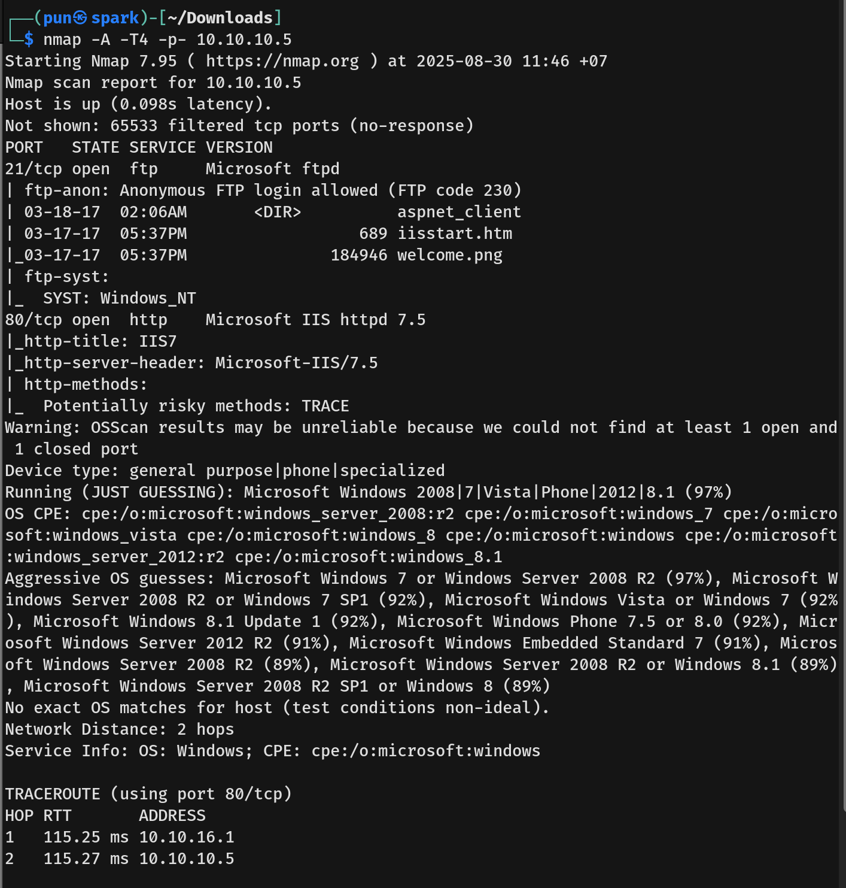

# Devel Writeup - by Thammanant Thamtaranon  
- Devel is an easy Windows machine hosted on Hack The Box.

## Reconnaissance  
- I started with a full TCP port scan including service/version detection and OS fingerprinting:  
  `nmap -A -T4 -Pn -p- 10.10.10.5`  
   
- The scan showed three open ports:  
  - 135 (MSRPC)  
  - 139 (NetBIOS)  
  - 445 (SMB)

## Scanning & Enumeration  

## Exploitation  
