# Editor Writeup - by Thammanant Thamtaranon

**Editor** is an easy-difficulty Linux-based machine hosted on Hack The Box.

## Reconnaissance
- I began with a full TCP port scan, including service/version detection and OS fingerprinting:
  `nmap -A -T4 -p- 10.10.11.80`
  
- The scan revealed the following open ports:
  - **22** — SSH
  - **80** — HTTP
  - **8080** — HTTP
- I added `editor.htb` to `/etc/hosts` for proper hostname resolution.

## Scanning & Enumeration
- I ran VHost enumeration
  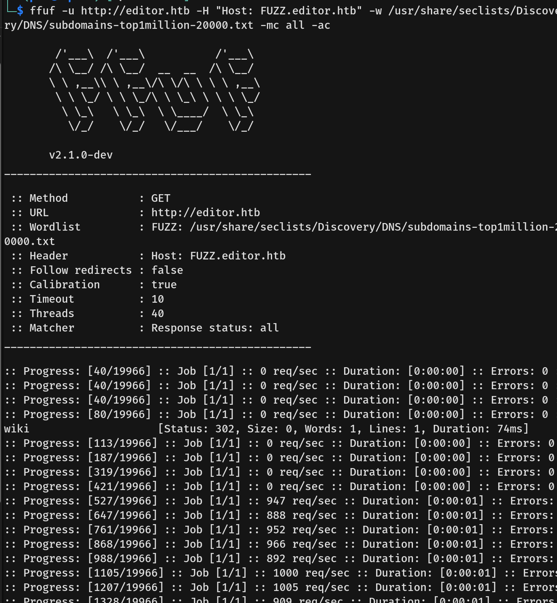
- We found `wiki.editor.htb`, so we added this to `/etc/hosts` as well.
- Port **80** is mapped to `editor.htb`, and port **8080** is mapped to `wiki.editor.htb`.
- First, we enumerated `editor.htb` using `dirsearch`.
- We found `/assets`, but visiting it resulted in a 403 Forbidden error.
  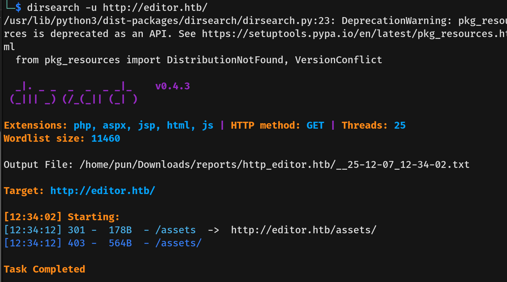
- I downloaded a `.deb` file found during enumeration to check for useful information, but it only contained binary files. Considering this is an "Easy" box, I decided against deep binary analysis at this stage.
- Moving on, we focused on `wiki.editor.htb`. Visiting the website redirected us to `http://wiki.editor.htb/xwiki/bin/view/Main/`.
  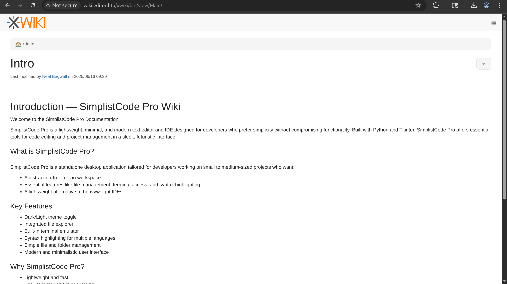
- We found the note "Last modified by Neal Bagwell," which we noted down.
- We also discovered that user **Neal Bagwell** has a history of changes.
  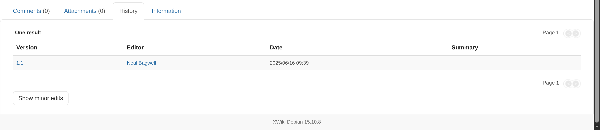
  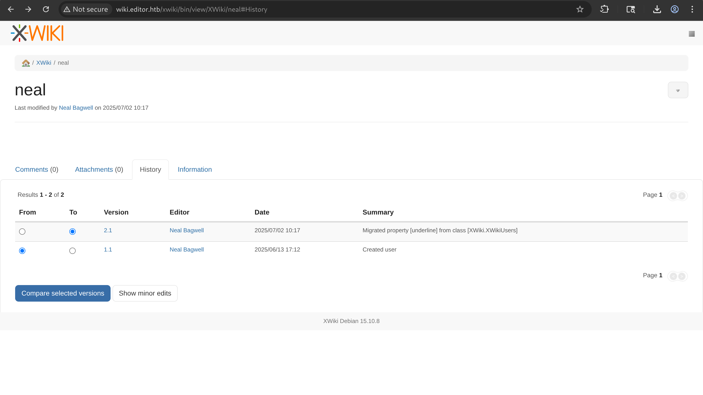
  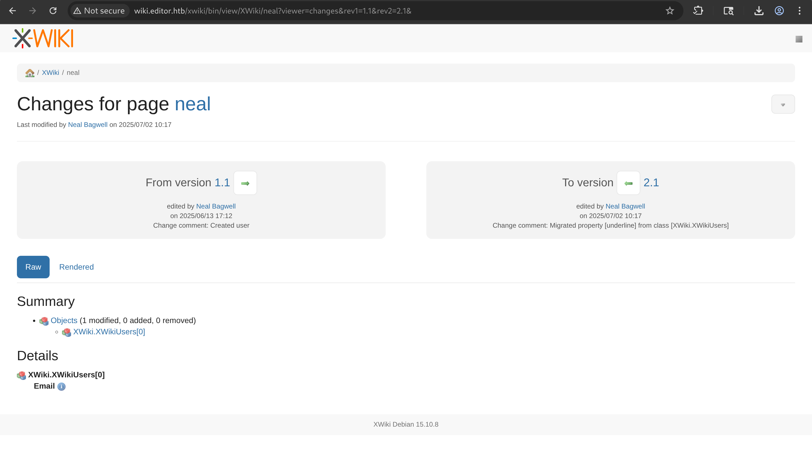
- However, we could not see the specific content that had been modified.

## Exploitation
- At the bottom of the page, we identified the version `XWiki Debian 15.10.8`, so I searched for any available CVEs.
- We found **CVE-2025-24893**, an Unauthenticated Remote Code Execution in XWiki via the SolrSearch Macro. The flaw resides in how the SolrSearch macro improperly handles Groovy expressions inside search queries. This allows unauthenticated attackers to execute arbitrary Groovy code remotely—without any authentication or prior access.
  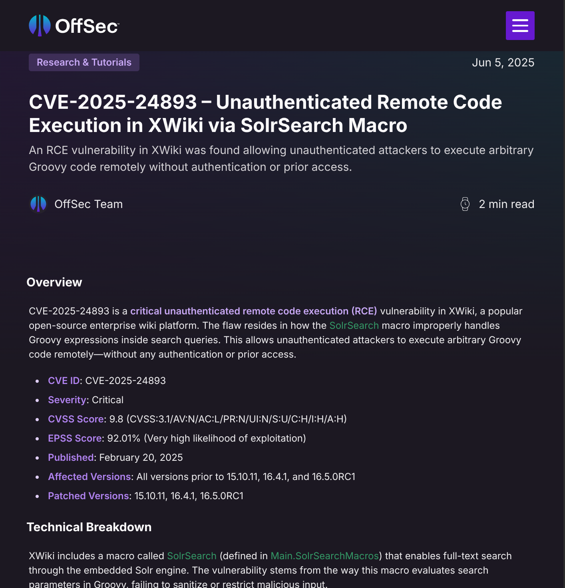
- I downloaded the PoC and ran it.
  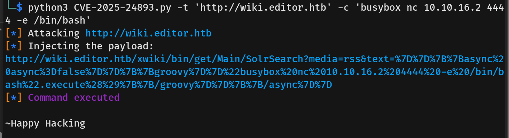
- We successfully obtained a reverse shell as user `xwiki`.
  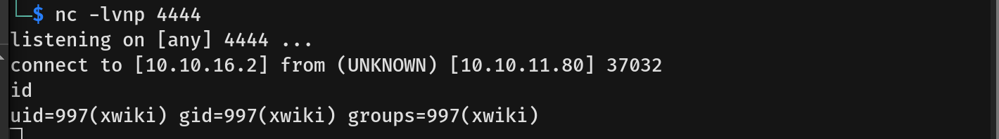
- Reading `/usr/lib/xwiki/WEB-INF/hibernate.cfg.xml`, we found database connection credentials.
  
- We read the file `/etc/passwd` and identified a user named `oliver`.
  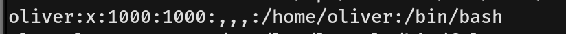
- I used the database password to attempt SSH login as user `oliver`, and the authentication was successful.
  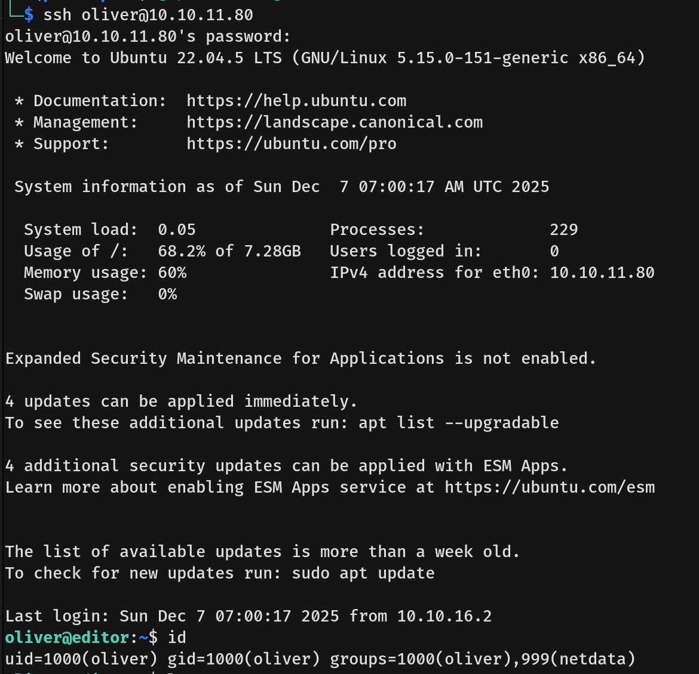
- We captured the user flag.

## Privilege Escalation
- Running `sudo -l` showed that user `oliver` cannot run sudo.
- Running `ss -tulpn` revealed many interesting internal ports.
  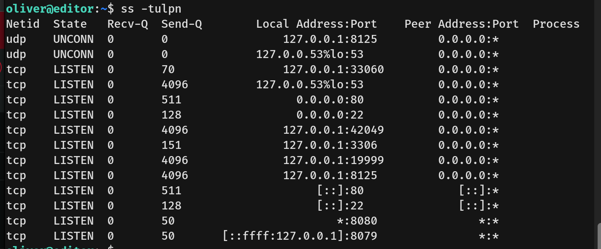
- I established an SSH tunnel to port **19999** and discovered it was running **Netdata**, which was also suggested by `oliver`'s membership in the `netdata` group.
- We found that the Netdata version is **1.45.2**.
  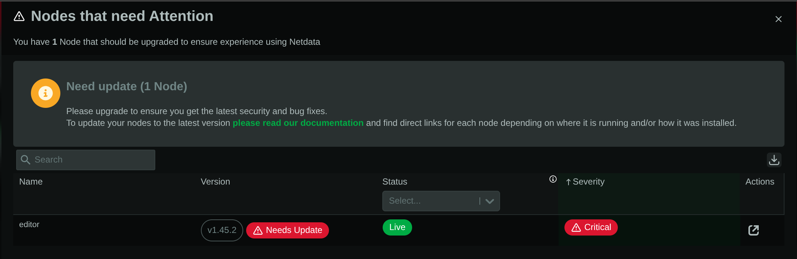
- Searching for vulnerabilities, we identified **CVE-2024-32019**. This is a critical Local Privilege Escalation (LPE) vulnerability. Netdata uses a helper program called `ndsudo` to run specific system commands (like `dmidecode`, `ip`, or `docker`) with root privileges to gather statistics. The `ndsudo` binary is "SUID Root" (runs as root), but it insecurely relies on the environment's `PATH` variable to find the commands it needs to run.
- I downloaded the PoC and ran the exploit.
- We successfully spawned a root shell and captured the root flag.
  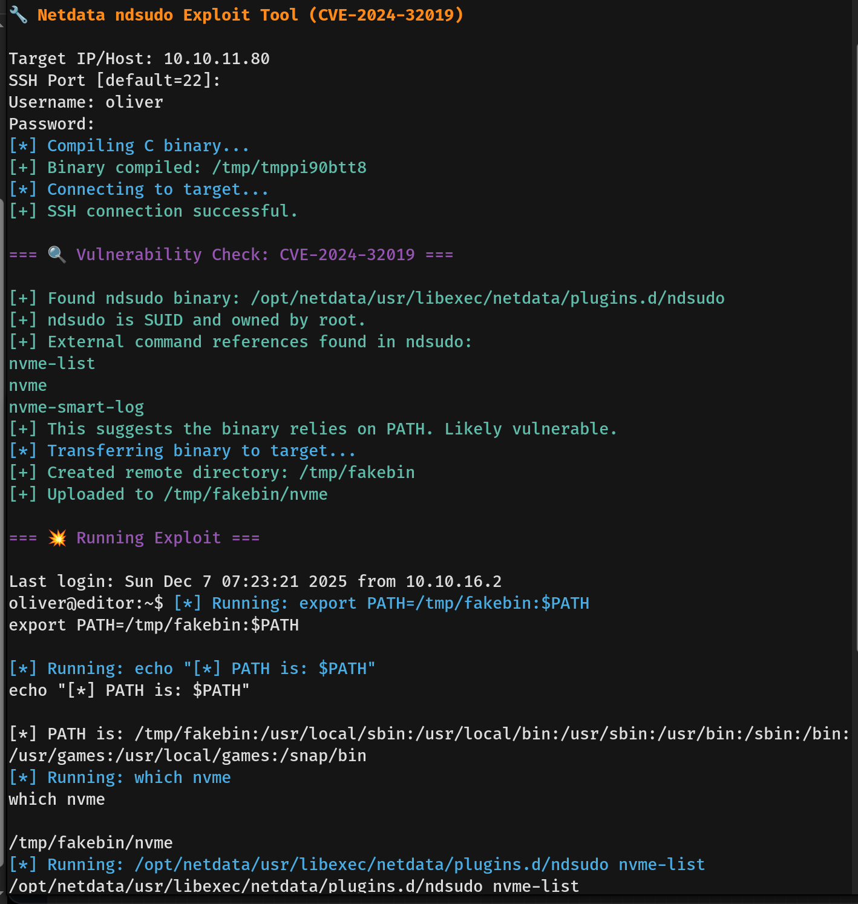
  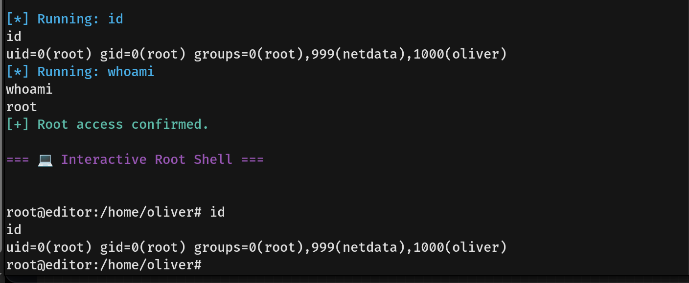
