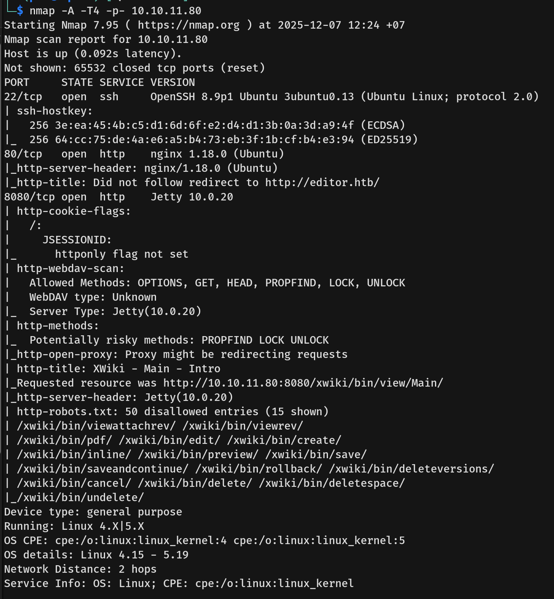

# Editor Writeup - by Thammanant Thamtaranon

**Editor** is a easy-difficulty Linux-based machine hosted on Hack The Box.

## Reconnaissance
- I began with a full TCP port scan, including service/version detection and OS fingerprinting:
  `nmap -A -T4 -p- 10.10.11.80`
  
- The scan revealed the following open ports:
  - **22** — SSH
  - **443** — HTTPS
- I added `craft.htb` to `/etc/hosts` for proper hostname resolution.

## Scanning & Enumeration

## Exploitation

## Privilege Escalation
