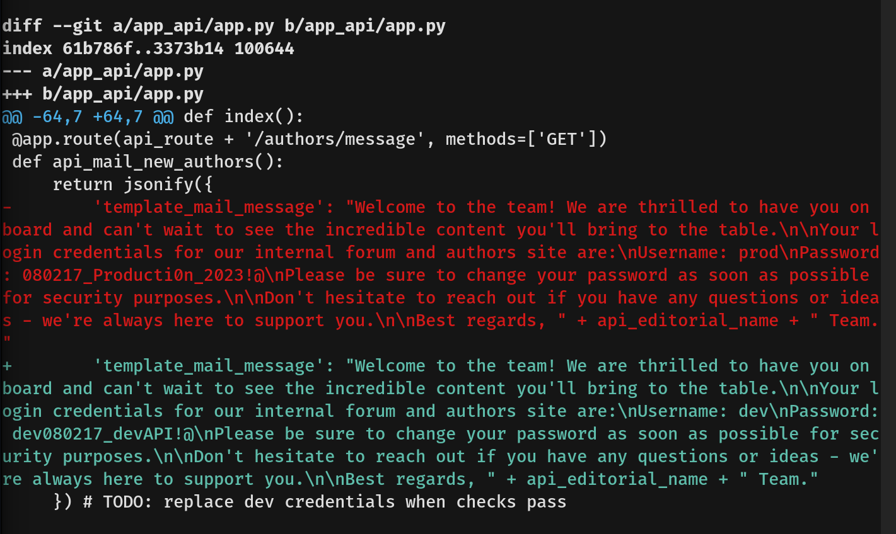
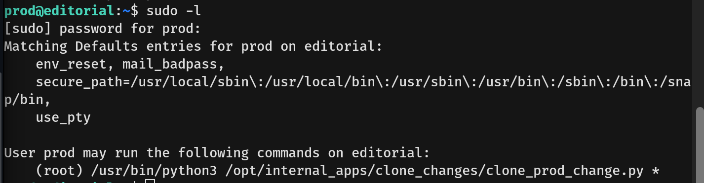
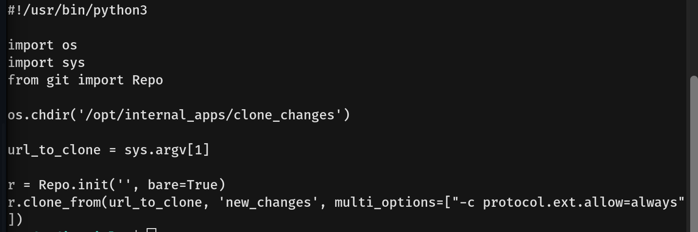
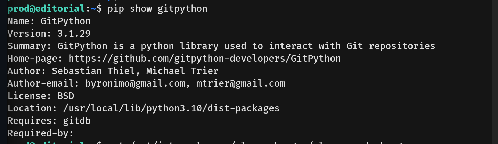
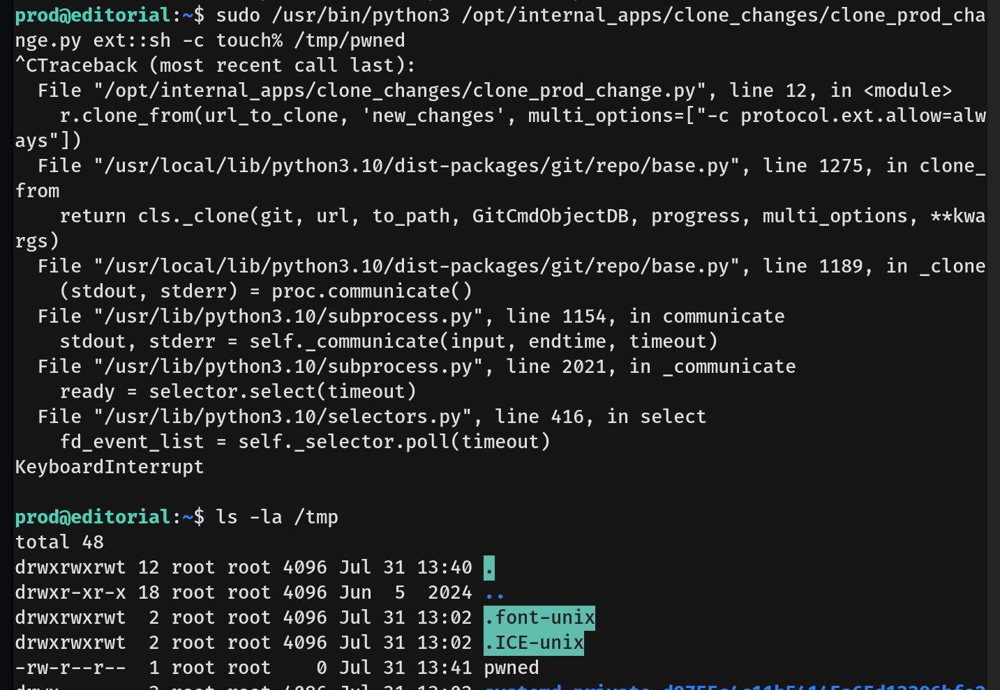
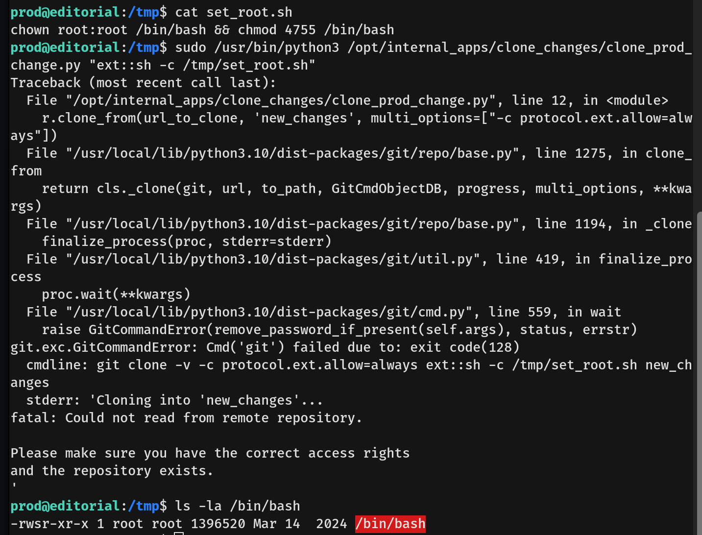
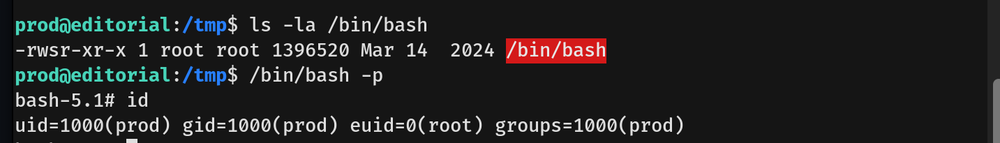

# Editorial Writeup - by Thammanant Thamtaranon  
- Editorial is an easy Linux-based machine hosted on Hack The Box.

## Reconnaissance  
- We began by performing a full TCP port scan with version detection and OS fingerprinting using the command:  
  `nmap -A -T4 -p- 10.10.11.20`  
  
- We added `editorial.htb` to our `/etc/hosts` file to enable hostname resolution.

## Scanning & Enumeration  
- We enumerated web directories using:  
  `dirsearch -u http://editorial.htb`  
  

## Exploitation  
- We attempted to upload a PHP web shell to `/upload` and clicked preview. However, the server displayed the content as plain text instead of executing it.  
- We tested the URL field by referencing a PHP file hosted on our own machine. The server fetched it, but again, it was not executed.  
  
  
- Next, we tried an XSS payload, but it did not yield any result.  
- Given that the server was making HTTP GET requests to our host, we attempted **Server-Side Request Forgery (SSRF)** by targeting internal services.  
- To aid enumeration, we generated the top 500 TCP ports from the `nmap-services` file with the command:  
  `grep -v '^#' /usr/share/nmap/nmap-services | sort -r -k3 | head -n 500 | awk '{print $2}' | cut -d'/' -f1 | sort -n | uniq > top-500-ports.txt`  
  
- We loaded this list into **Burp Suite Intruder** and initiated the attack.  
- Port 5000 stood out — it returned a path rather than an image, suggesting a service was running there.  
  
- We tested `http://localhost:5000` in the URL field, revealing a REST API.  
  
- We manually enumerated the endpoints. At `/api/latest/metadata/messages/authors`, we discovered developer credentials.  
  
- Using these credentials, we successfully SSH’d into the machine as user `dev` and obtained the **user flag**.

## Privilege Escalation  
- Running `sudo -l` revealed that user `dev` had no sudo privileges.  
- However, we found a `.git` folder in the `dev` user’s home directory.  
- Using `git log -p`, we viewed previous commits and discovered plaintext credentials for user `prod`.  
  
- We switched to user `prod` with:  
  `su prod`  
- Checking sudo privileges with `sudo -l` showed that `prod` could run:  
  `/usr/bin/python3 /opt/internal_apps/clone_changes/clone_prod_change.py`  
  
- Reviewing the script revealed it cloned Git repositories using GitPython.  
  
- We confirmed the GitPython version with:  
  `pip show gitpython`  
  
- The installed version was vulnerable to **CVE-2022-24439**, which allows command injection via malicious URLs.  
- We tested the exploit with a Proof of Concept (PoC).  
  
- Initial reverse shell attempts failed, so we created a helper script called `set_root.sh` to enable the **SUID** bit on `/bin/bash`, allowing root execution.  
  
- We executed it via the vulnerable script:  
  `sudo /usr/bin/python3 /opt/internal_apps/clone_changes/clone_prod_change.py "ext::sh -c /tmp/set_root.sh"`  
- With `/bin/bash` now SUID-enabled, we obtained a root shell using:  
  `/bin/bash -p`  
  
- We retrieved the **root flag**, completing the machine.
