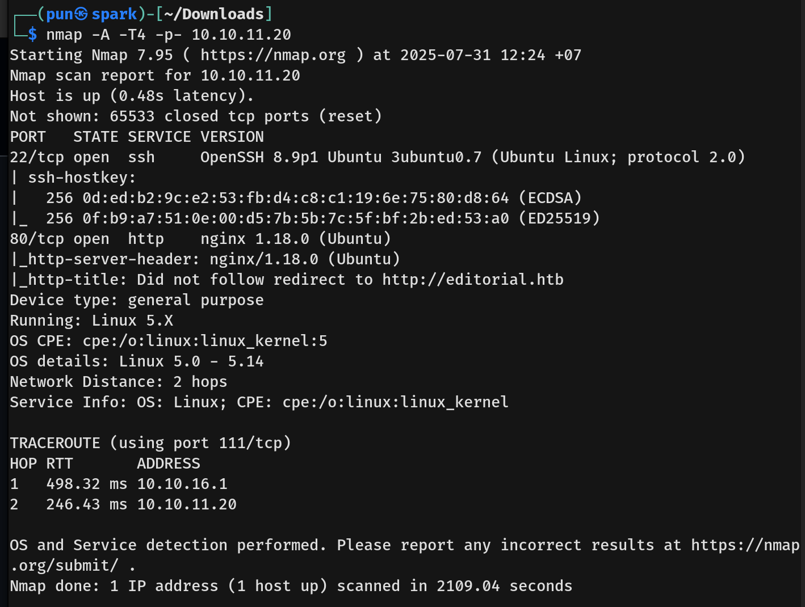
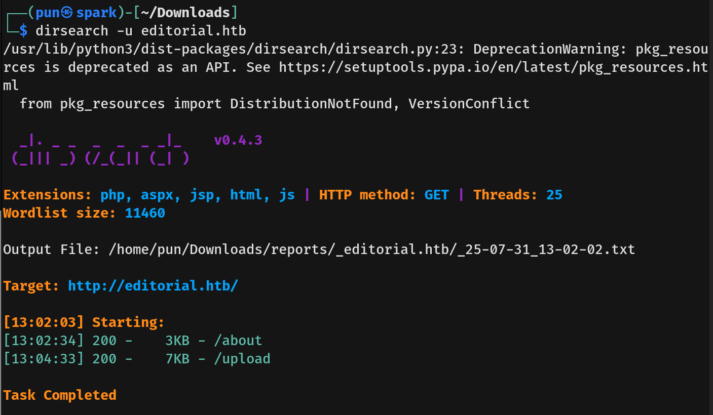
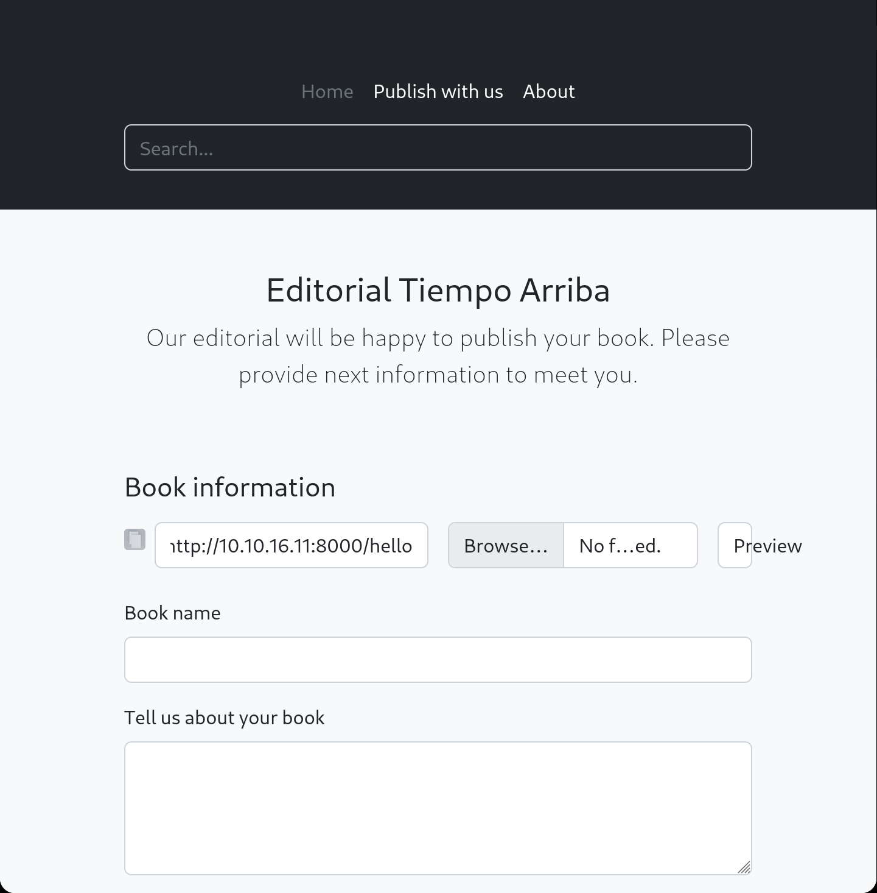
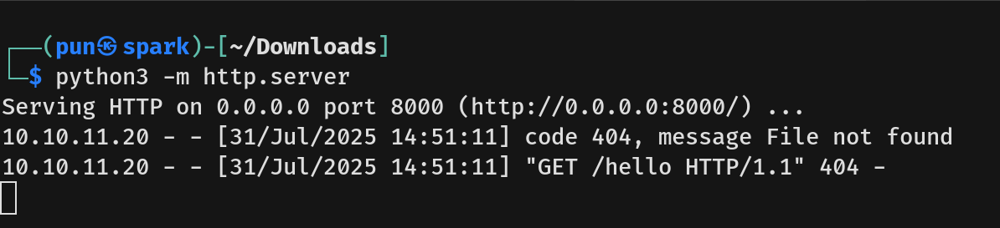
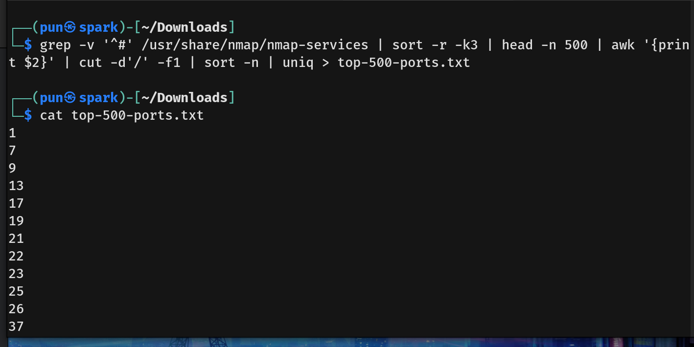
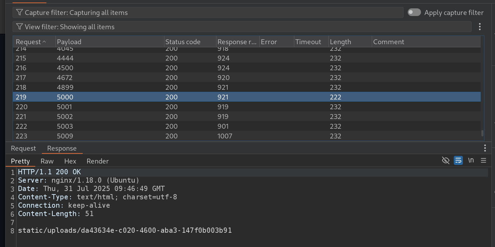
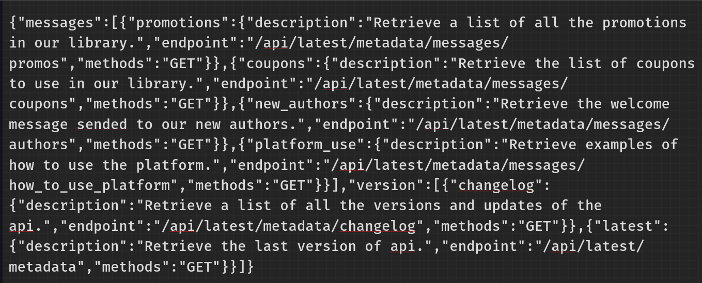
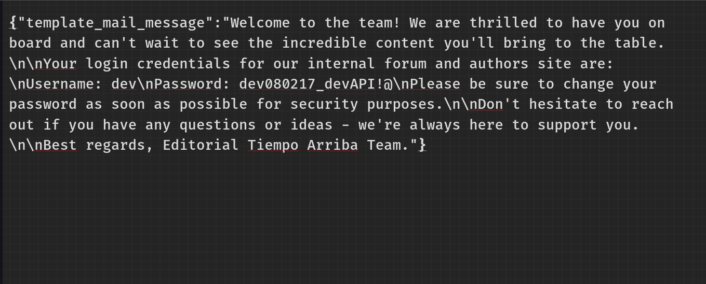

Editorial Writeup - by Thammanant Thamtaranon  
- Editorial is an easy Linux-based machine hosted on Hack The Box.

## Reconnaissance  
- We began by performing a full TCP port scan with version detection and OS fingerprinting using the command:  
  `nmap -A -T4 -p- 10.10.11.20`  
  
- We added `editorial.htb` to our `/etc/hosts` file to enable hostname resolution.

## Scanning & Enumeration  
- We enumerated web directories using:  
  `dirsearch -u editorial.htb`  
  

## Exploitation  
- We then try to uplaod the php shell to `/upload` and click preview, However it seems the server only display as text and did not execute our shell.
- We try the URL field and the server indeed get the file from our machine, but it also did not execute the file as well.

 
- So we try the XSS but to no avial it did not work.
- We try the SSRF consider the server did GET request to our machine. We use burp to sent a request with `http://localhost:port`.
- We generated the top 500 TCP port list from nmap top TCP port using command `grep -v '^#' /usr/share/nmap/nmap-services | sort -r -k3 | head -n 500 | awk '{print $2}' | cut -d'/' -f1 | sort -n | uniq > top-500-ports.txt`.
 
- Then we loaded the list into the burp suite intruder mode and start the attack.
- We found that the port 500 returnded `static/uploads/da43634e-c020-4600-aba3-147f0b003b91` instead of typical jpeg.
 
- We then input `http://localhost:5000` into the URl field.

- We try all the endpoint and at `/api/latest/metadata/messages/authors`, we found dev credential.

- We then SSH in to the machine using dev credential.
- We got the user flag.
  
### Privilege Escalation:
- 
