# Fluffy Writeup - by Thammanant Thamtaranon

**Fluffy** is an easy-difficulty Windows machine hosted on Hack The Box.

---

## Reconnaissance
- I began with a full TCP port scan, including service/version detection and OS fingerprinting:
  `nmap -A -T4 -p- 10.10.11.69`
  
  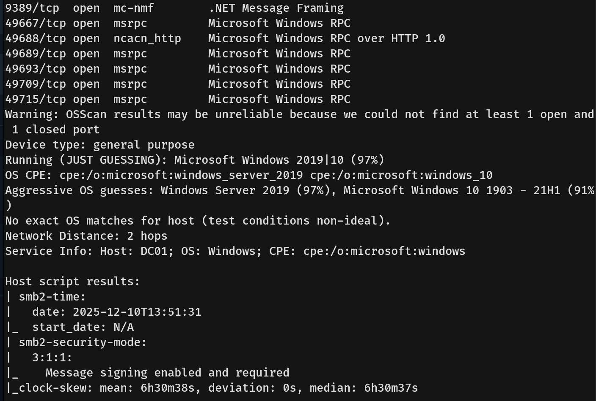
- The scan revealed the following open ports:
  - **53** — DNS (Simple DNS Plus)
  - **88** — Kerberos
  - **389** — LDAP
  - **445** — Microsoft-DS (SMB)
  - **5985** — WinRM
  - **3269** — Global Catalog LDAPS
  - **49667 - 49715** — RPC High Ports
- I added `fluffy.htb` and `dc01.fluffy.htb` to `/etc/hosts` for proper hostname resolution.

---

## Scanning & Enumeration
- We used `rpcclient` to gather user information.
  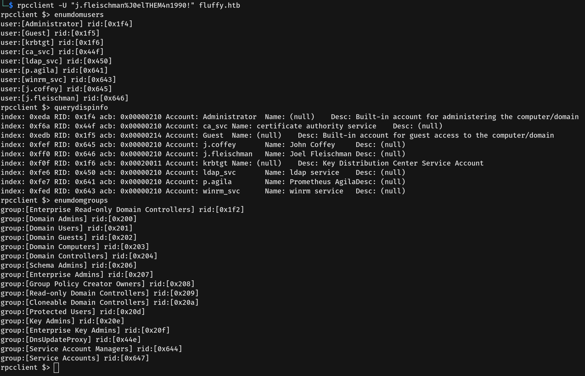
- We found two users: **j.coffey** and **p.agila**.
- I then used `nxc` (NetExec) to enumerate SMB shares.
  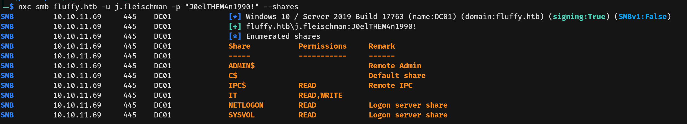
- Connecting to the **IT** share revealed several files. I copied them all locally for analysis, finding a **PDF** document to be the most critical.
  
  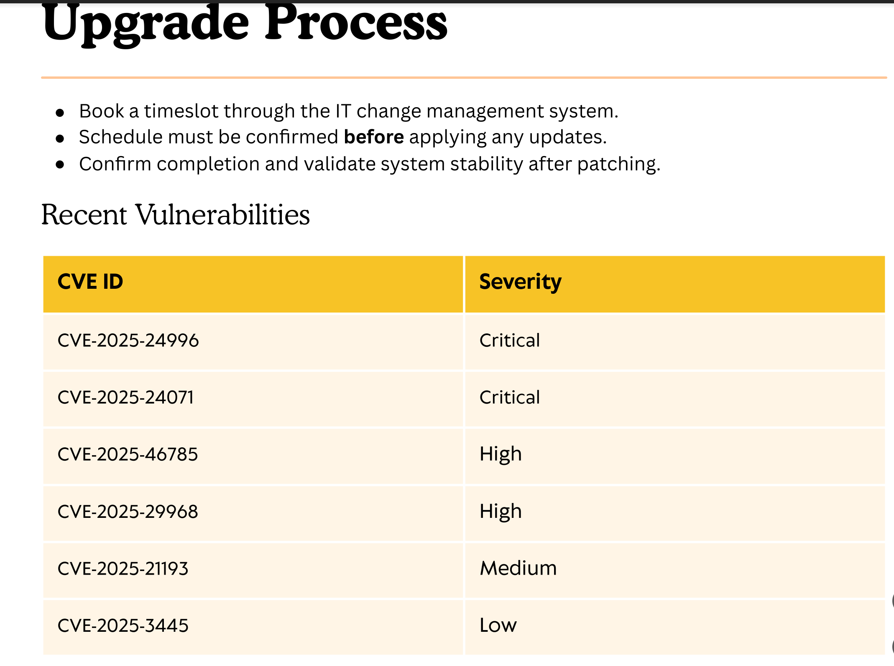

---

## Exploitation
- The PDF referenced recent vulnerabilities. After searching, I focused on **CVE-2024-24071**, an **Information Disclosure flaw** in the Microsoft Windows File Explorer.
- The vulnerability abuses how Windows File Explorer handles specific file types, particularly **Library files (.library-ms)**.
- **Attack Logic:** An attacker embeds a malicious `.library-ms` file inside an archive (like a ZIP). This file is configured to point its "library location" to a remote SMB server controlled by the attacker (e.g., `\\attacker-ip\share`). When the victim extracts the archive or views the folder containing this file, Windows File Explorer automatically attempts to authenticate to the remote SMB path using the current user's credentials. This action transmits the victim's **NTLMv2 hash** to the attacker's server.
- Knowing this, I downloaded and ran a PoC to create a malicious ZIP file pointing to our SMB listener.
  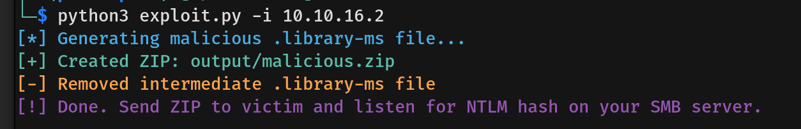
- We set up **Responder** to listen for the incoming NTLM connection.
  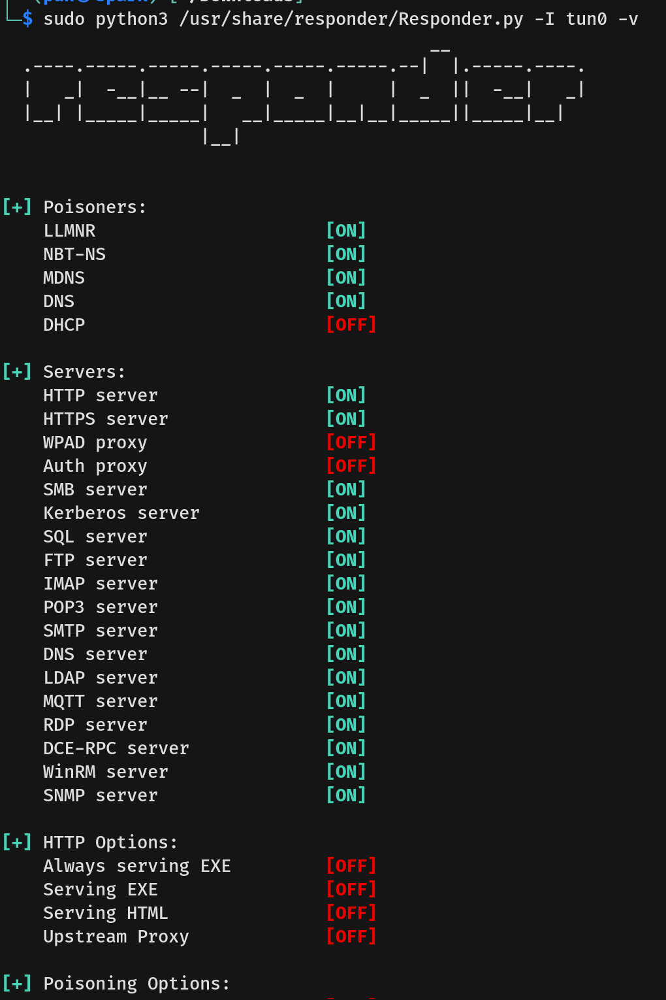
- After waiting, we successfully captured the NTLMv2 hash.
  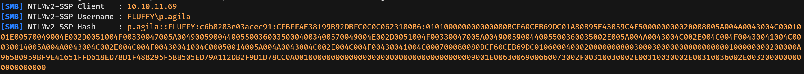
- We then used `hashcat` to crack the hash, successfully obtaining the credential for user **p.agila**.
  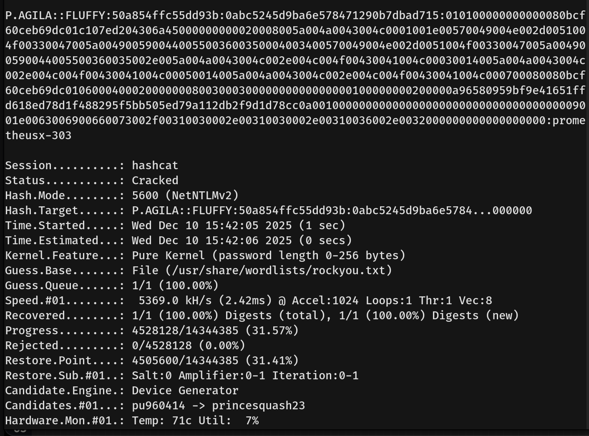

---

## Privilege Escalation
- I used `bloodhound-python` to map the relationships in the domain.
  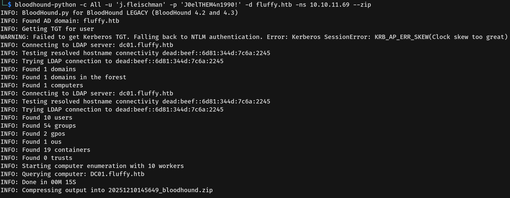
- We found that user **p.agila** is a member of the **Service Account Manager** group, and this group has **GenericAll** rights over the **Service Accounts** group.
  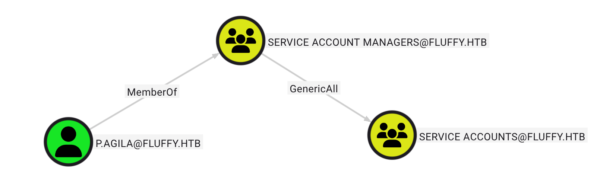
- Furthermore, the **Service Accounts** group has **GenericWrite** rights over three service user accounts: **ca_svc**, **ldap_svc**, and **winrm_svc**.
  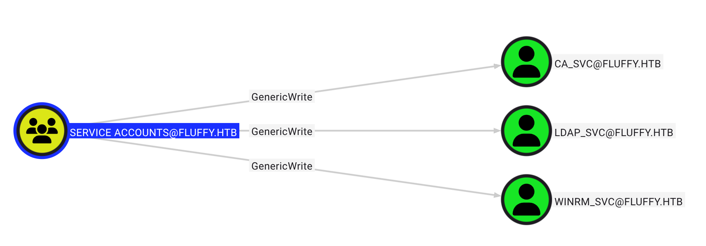
- We further investigated the group memberships of these service accounts.
  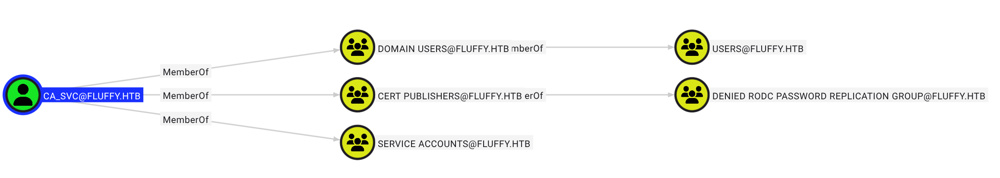
  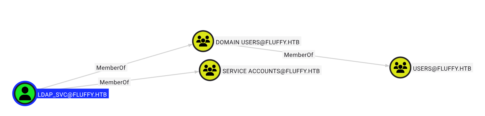
  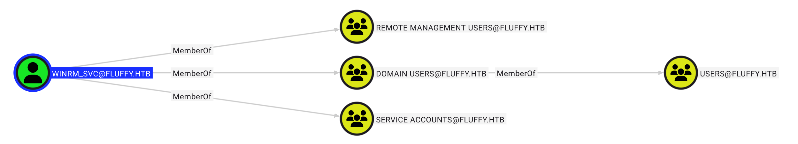
- The **ca_svc** account is a member of **Cert Publishers**, which is critical for Active Directory Certificate Services (AD CS) attacks.
- The **winrm_svc** account is a member of **Remote Management Users**, which allows for remote access via WinRM.
- We started by adding user **p.agila** to the **Service Accounts** group, leveraging our **GenericAll** rights over that group.
  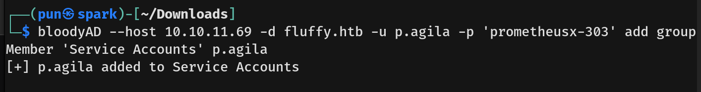
- Next, I set my clock to match the server clock to prevent the **KRB\_AP\_ERR\_SKEW** error. We then performed a **Shadow Credentials attack** on the **ca_svc** account. This attack exploits the `msDS-KeyCredentialLink` attribute. Since we have **GenericWrite** rights over `ca_svc`, we can inject our own public key, allowing us to retrieve the **NTLM hash** or a **TGT** for the account.
  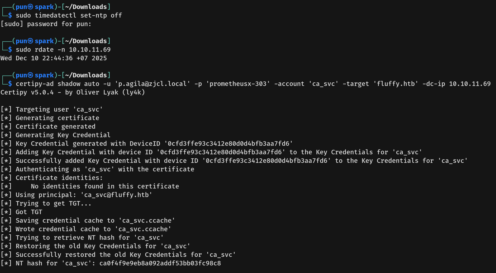
- Now that we had the `ca_svc` hash, we used `certipy-ad` to scan the domain for Certificate Authorities and Templates to locate misconfigurations (ESC vulnerabilities).
  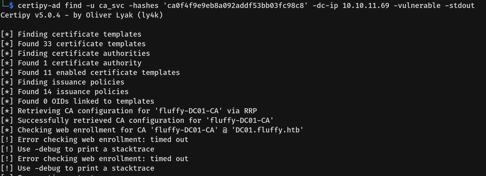
- Certipy identified this vulnerability as **ESC16 (CVE-2024-49019)**. This attack specifically targets misconfigured **Access Control Lists (ACLs)** on the **Certificate Authority (CA) object** in Active Directory.
  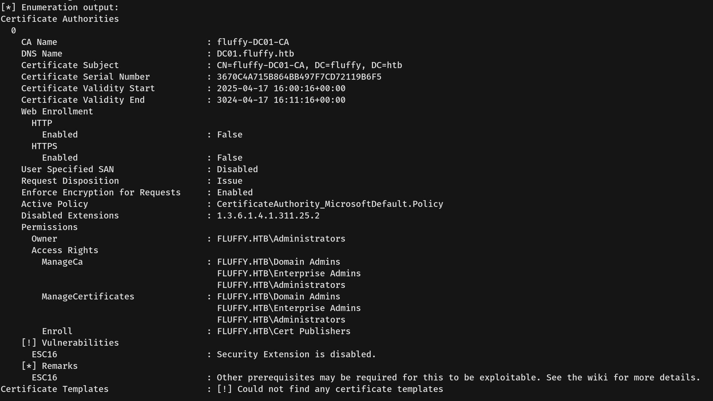
- **ESC16 Logic:** The vulnerability exists because the `ca_svc` account, through its **Cert Publishers** membership, has privileges (like `WriteDACL`) over the CA object itself. This allows us to modify the CA's permissions to map a low-privileged account to a high-privileged one, such as **Administrator**.
- **ESC16 Exploitation Steps:** Leveraging the `ca_svc` account's privileges, I proceeded with the full ESC16 attack chain. I used `certipy-ad` (as `ca_svc`) to update the `userPrincipalName` of the **ca_svc** account itself to `administrator`. This modification tricks the Certificate Authority (CA) into believing `ca_svc` is the Administrator during certificate operations.
  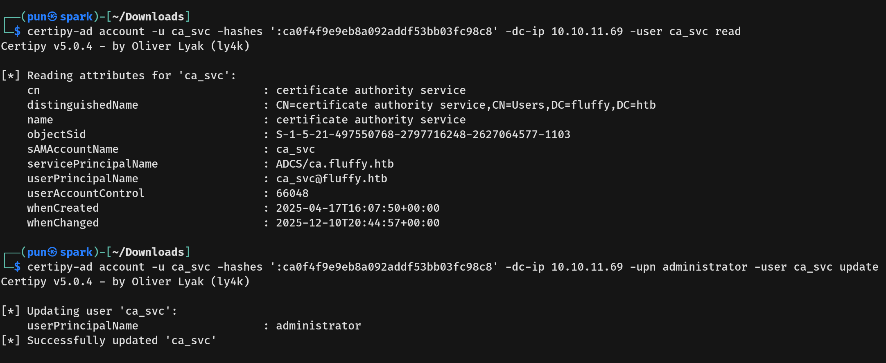
- To exploit this new identity, we executed a **Shadow Credentials** attack again on the `ca_svc` account. This allowed us to authenticate as `ca_svc` but, due to the modified UPN, request a User certificate for the **Administrator**.
  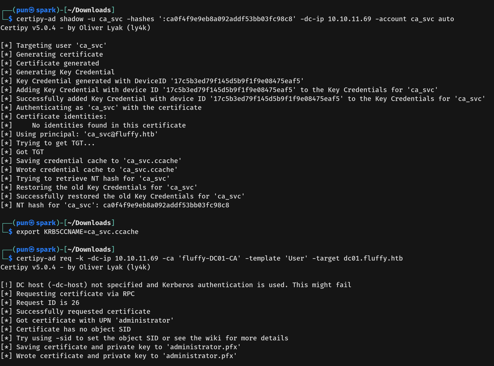
- We then successfully authenticated as the Administrator using the newly obtained certificate (saved as `administrator.pfx`) to retrieve the Administrator's NTLM hash.
  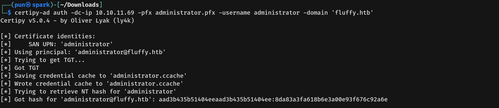
- After receiving the Administrator's hash, I used `Evil-WinRM` to connect to the machine.
  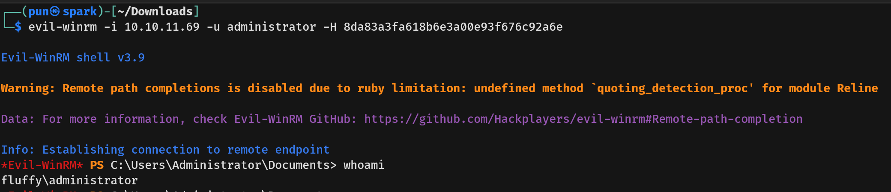
- We captured both the root flag and the user flag (from the winrm_svc directory).
