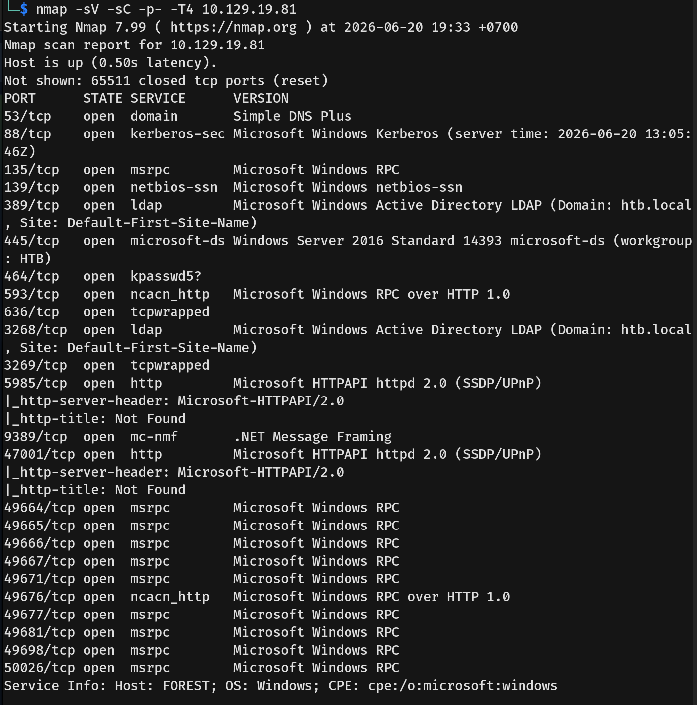
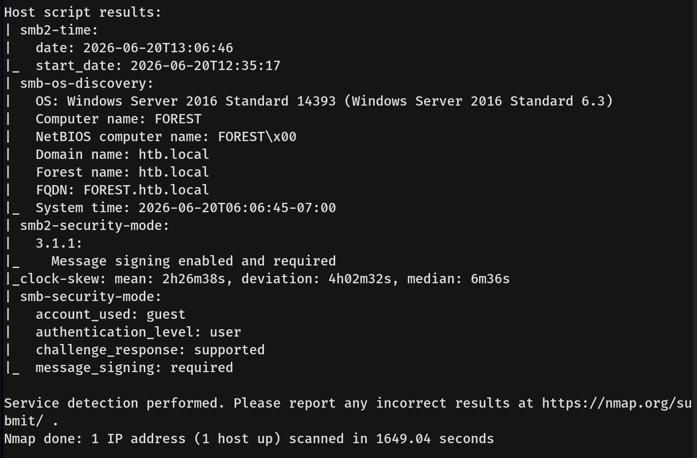
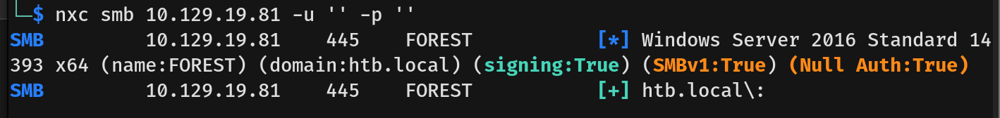
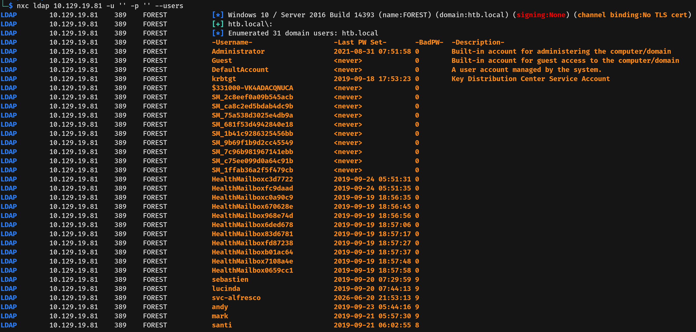
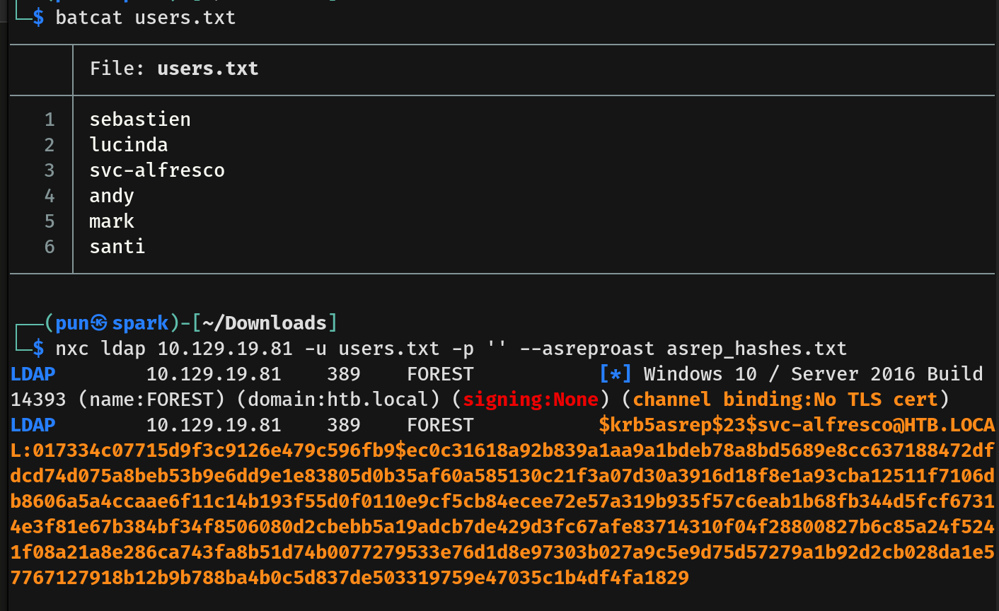
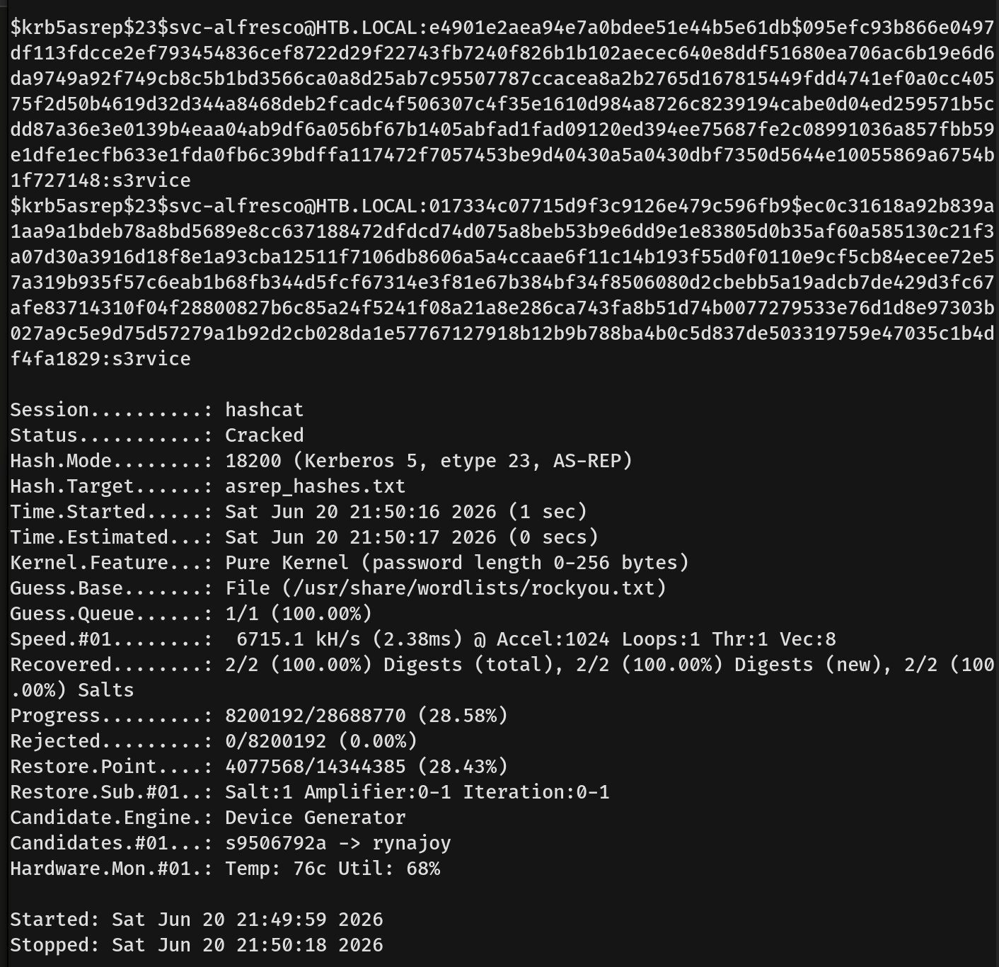
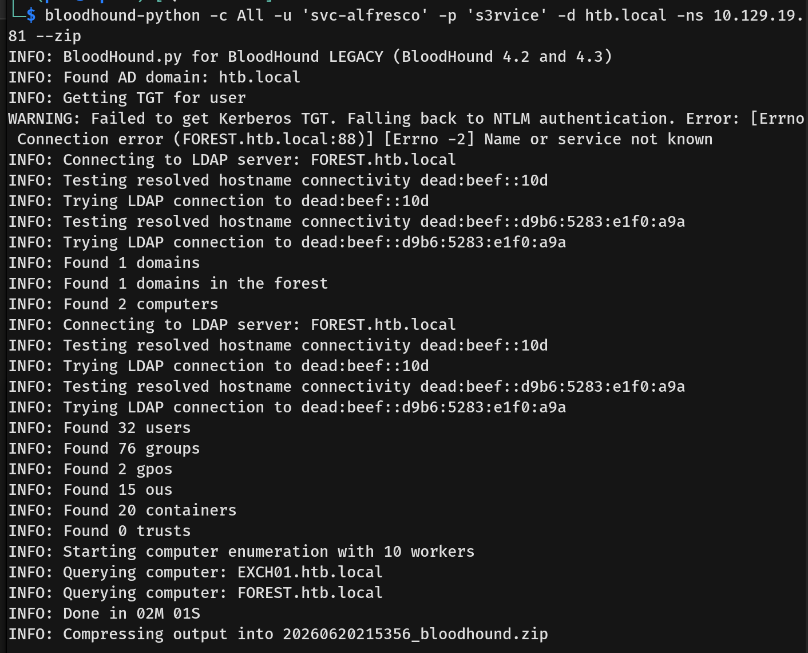
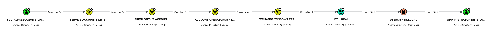
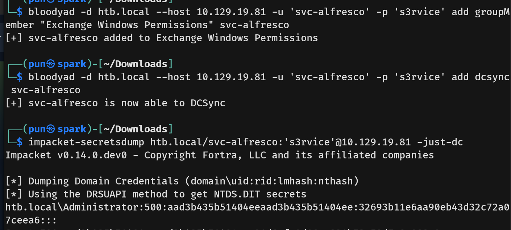
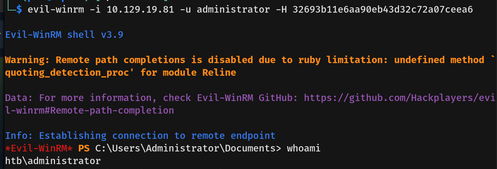

# Forest Writeup - by Thammanant Thamtaranon

**Forest** is an **Easy**-difficulty Windows machine hosted on Hack The Box.

---

## Reconnaissance
- We started the engagement with a full TCP port scan using Nmap to identify open services and determine the underlying operating system.
  
  
- The results indicated several open ports, revealing a Windows Server 2016 Standard 14393 environment on a domain named `htb.local`:
  * **53/tcp:** domain (Simple DNS Plus)
  * **88/tcp:** kerberos-sec (Microsoft Windows Kerberos)
  * **135, 49664-49698/tcp:** msrpc (Microsoft Windows RPC)
  * **139/tcp:** netbios-ssn
  * **389, 3268/tcp:** ldap (Microsoft Windows Active Directory LDAP)
  * **445/tcp:** microsoft-ds (Windows Server 2016 Standard 14393)
  * **5985/tcp:** http (Microsoft HTTPAPI httpd 2.0 - WinRM)

---

## Scanning & Enumeration
- I started with SMB guest and null credentials.
- The null authentication succeeded, but I could not list any shares.
  
- Knowing null credentials worked, I tried enumerating LDAP using null credentials via `nxc` and successfully extracted numerous domain users, including `sebastien`, `lucinda`, `svc-alfresco`, `andy`, `mark`, and `santi`.
  

---

## Exploitation
- Since we didn't have a password for any of the accounts, I attempted AS-REP roasting against the compiled list of users.
- I found that the account `svc-alfresco` had the "Do not require Kerberos preauthentication" property enabled, which allowed us to request and capture its Kerberos AS-REP hash.
  
- Now that we had the hash for the user `svc-alfresco`, we cracked it using `hashcat` and recovered the plaintext password: `s3rvice`.
  
- We used these credentials to gain access and capture the user flag in the `svc-alfresco` Desktop directory.

---

## Privilege Escalation
- Since we now had valid credentials, I ran the BloodHound python ingestor using the `svc-alfresco` account to map the Active Directory environment.
  
- After collecting all the relationship data using BloodHound, I planned a path for an Administrator account takeover.
  
- From the relationship mapping, our user is nested within groups that ultimately have `GenericAll` privileges over the `Exchange Windows Permissions` group, meaning we will first add ourselves to that group.
- Next, the `Exchange Windows Permissions` group has `WriteDacl` rights over the `HTB.LOCAL` domain. 
- We will add `DCSync` privileges to our account to grant us the rights to replicate directory changes, allowing us to perform a DCSync attack and dump the domain hashes.
- Using `bloodyad`, I executed this plan by adding `svc-alfresco` to the `Exchange Windows Permissions` group, and then explicitly granting `dcsync` rights to the account.
- Lastly, we dumped the domain credentials using `impacket-secretsdump` to obtain the Administrator's NTLM hash and used this hash in a Pass-The-Hash attack via `evil-winrm` to connect to the machine.
  
  
- We then captured the root flag in the Administrator's Desktop directory.
