# Fuse Writeup - by Thammanant Thamtaranon

**Fuse** is a **Medium**-difficulty Windows machine hosted on Hack The Box.

---

## Reconnaissance
- We started the engagement with a full TCP port scan using Nmap to identify open services and determine the underlying operating system.
  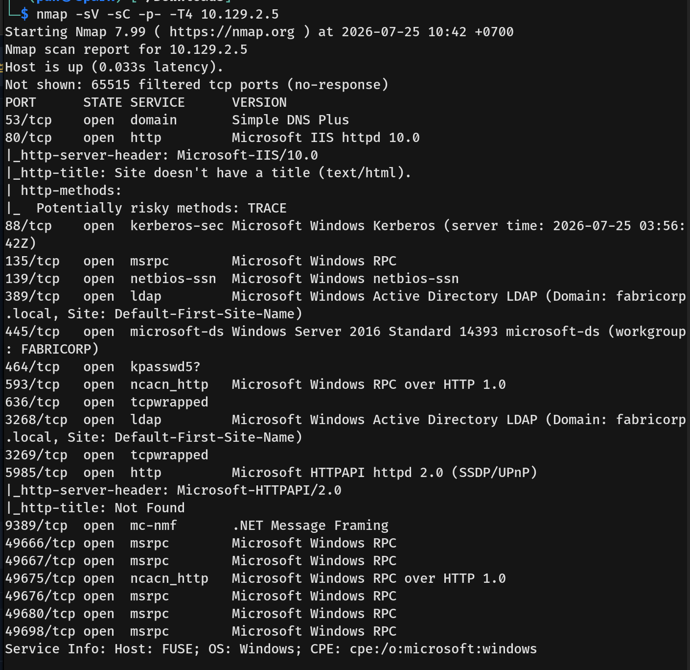
  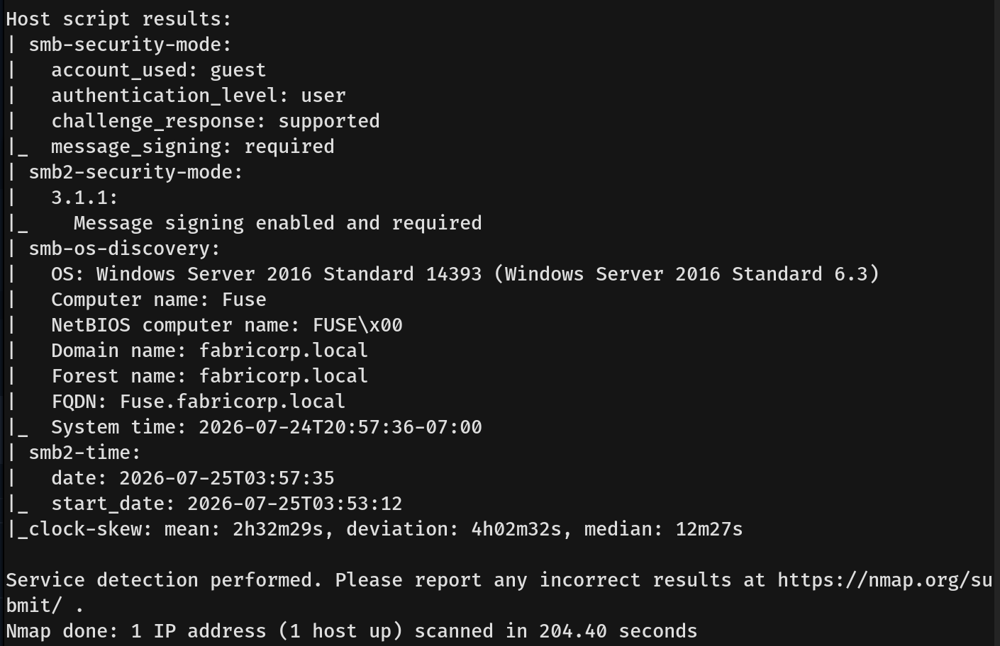
- The results indicated an Active Directory Domain Controller environment for the `fabricorp.local` domain, with the hostname `Fuse`. Several key services were available:
  * **53/tcp:** domain (DNS)
  * **80/tcp:** http (Microsoft IIS httpd 10.0)
  * **88/tcp:** kerberos-sec
  * **135/tcp:** msrpc
  * **139/tcp & 445/tcp:** netbios-ssn / microsoft-ds (SMB)
  * **389/tcp & 636/tcp:** ldap / tcpwrapped
  * **5985/tcp:** http (WinRM remote management)
- With this information, we added `fabricorp.local` and `fuse.fabricorp.local` to our `/etc/hosts` file.
  
---

## Scanning & Enumeration
- We started by visiting port 80 and found a PaperCut Print Logger page containing document names and the users who printed them.
  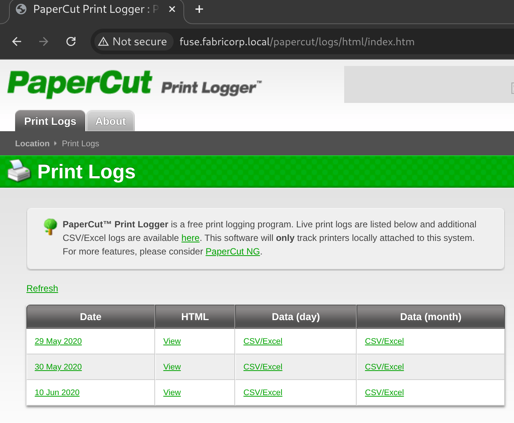
- Using this information, we compiled a list of valid usernames.
  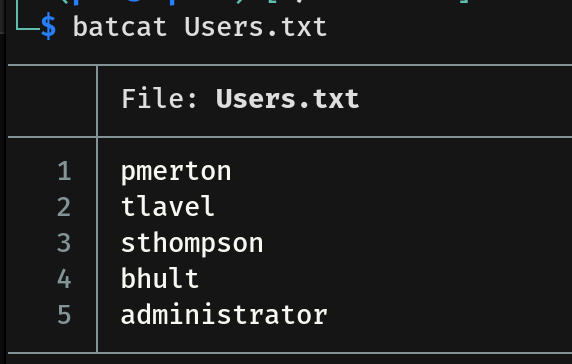
- We also created a potential passwords list based on keywords found on the page.
  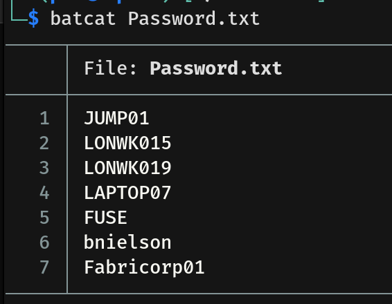
- We tried enumerating SMB using guest and null credentials, but were unsuccessful.

---

## Exploitation
- Since we did not have valid credentials, we attempted password spraying against SMB using our generated user and password lists.
  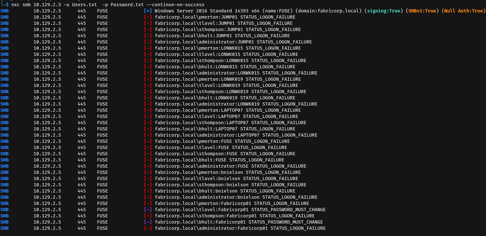
- We found that the users `tlavel` and `bhult` returned a `STATUS_PASSWORD_MUST_CHANGE` error when sprayed with the password `Fabricorp01`. This status confirms that `Fabricorp01` is their correct current password, but it has either expired or an administrator has set their accounts to require a password change at the next logon.
- Because we now know their current password, we can use `impacket-changepasswd` to change their passwords remotely. The tool takes the old password and the new one, and bypasses the logon restriction by binding with a null session over RPC to perform the password change operation.
  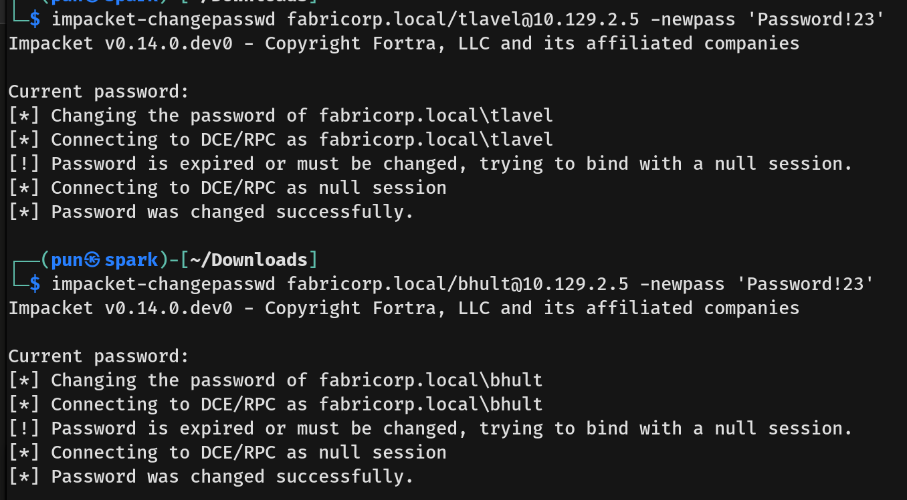
- The change was successful, and we then used the new passwords to enumerate the SMB shares.
  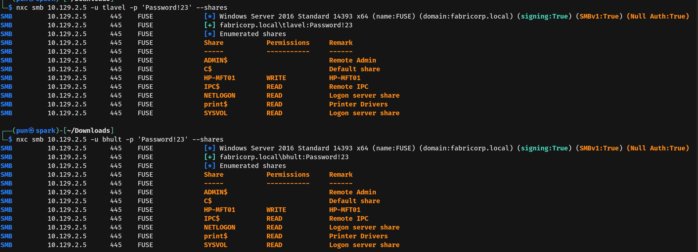
- We tried using `nxc ldap` with the `--users` flag but failed. Using `nxc smb --rid-brute` also failed, so we moved on to enumerating the RPC service.
  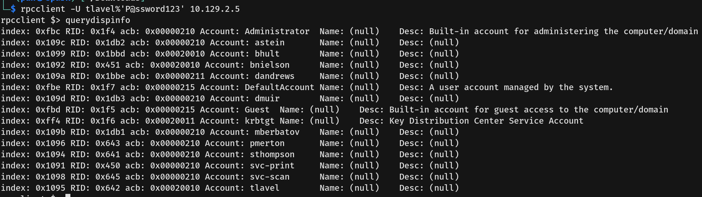
- With the newly discovered users from RPC, we updated our `Users.txt` wordlist.
- We then ran the `enumprinters` command via `rpcclient`, as the web application hinted at printing services. This revealed a hardcoded password in the description of a printer for an unknown user.
  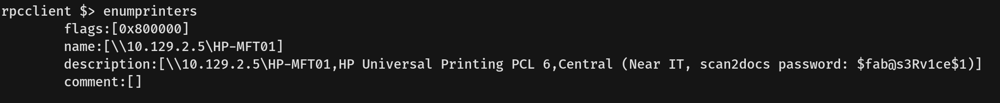
- With the updated `Users.txt`, we sprayed the newly found password against SMB and found that it was valid for the users `svc-print` and `svc-scan`.
  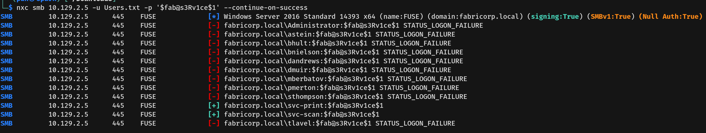
- We then checked WinRM and found that the user `svc-print` had remote access enabled.
  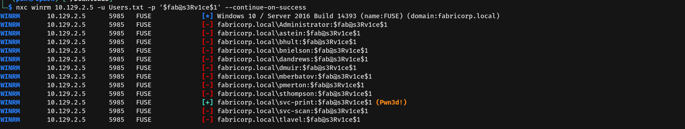
- Using `evil-winrm`, we connected to the machine as `svc-print` and captured the user flag.
  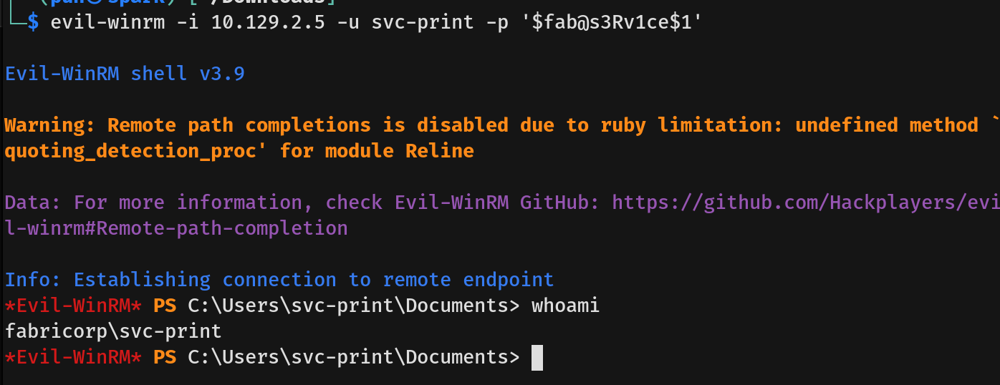

---

## Privilege Escalation
- Checking our privileges with `whoami /all`, we found that the user `svc-print` has `SeLoadDriverPrivilege` enabled. This privilege allows a user to dynamically load and unload device drivers on the system, which can be abused to load a vulnerable driver into the kernel and execute code with Ring 0 privileges to escalate to `NT AUTHORITY\SYSTEM`.
  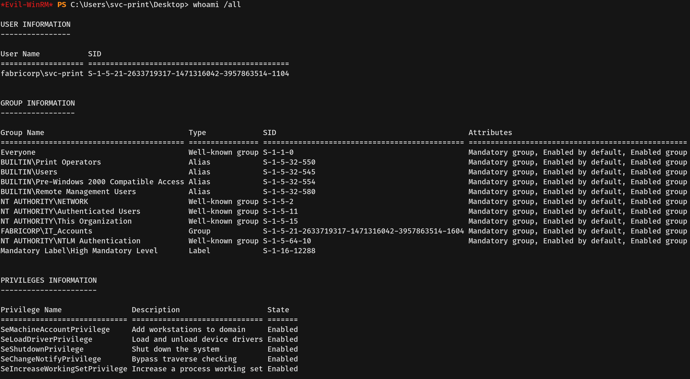
- Searching the internet for ways to abuse this privilege, we found an exploit repository [here](https://github.com/JoshMorrison99/SeLoadDriverPrivilege).
- We followed these steps to gain an `NT AUTHORITY\SYSTEM` shell:
- **First**, we cloned the repository to our attack machine and generated a reverse shell executable payload using `msfvenom`.
  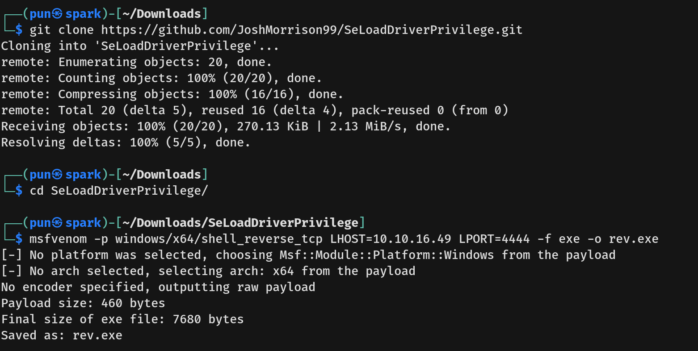
- **Second**, we downloaded the required exploit files (`Capcom.sys`, `LoadDriver.exe`, `ExploitCapcom.exe`) and our generated reverse shell (`rev.exe`) onto the target machine using `certutil`.
  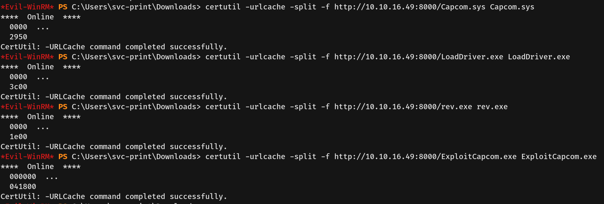
- **Third**, we executed the `LoadDriver.exe` tool to load the vulnerable `Capcom.sys` driver into the system registry.
  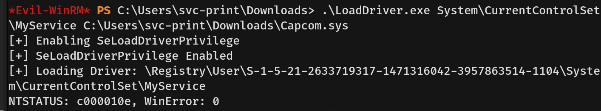
- **Finally**, we ran `ExploitCapcom.exe` to trigger the exploit and execute our payload (`rev.exe`). This successfully launched a reverse shell as `NT AUTHORITY\SYSTEM`.
  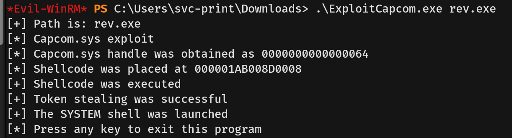
- We then captured the root flag.
  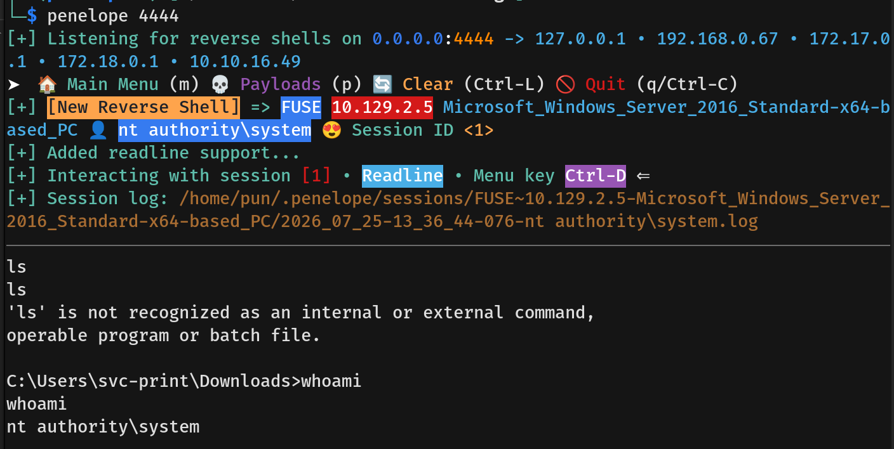
