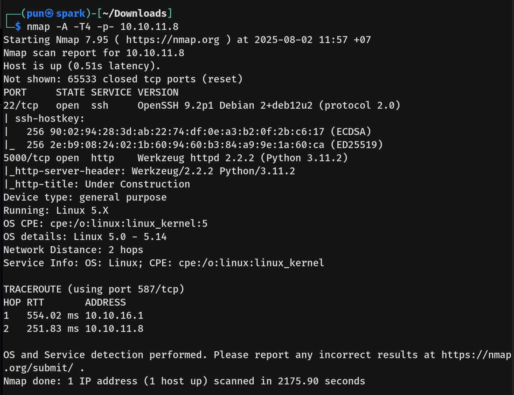
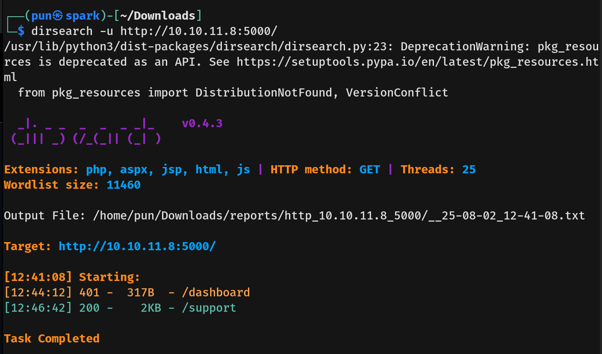

# Headless Writeup - by Thammanant Thamtaranon  
- Headless is an easy Linux-based machine hosted on Hack The Box.

## Reconnaissance  
- We began by performing a full TCP port scan with version detection and OS fingerprinting using the command:  
  `nmap -A -T4 -p- 10.10.11.11`  
  
- On the webpage, we noticed the footer text: “© 2020 All Rights Reserved By Board.htb”, indicating a potential virtual host.  
- We added `board.htb` to our `/etc/hosts` file for proper hostname resolution.

## Scanning & Enumeration  
- We enumerated web directories using:  
  `dirsearch -u http://boardlight.htb`  
  

## Exploitation  

## Privilege Escalation  
