# Heist Writeup - by Thammanant Thamtaranon

**Heist** is an **Easy**-difficulty Windows machine hosted on Hack The Box.

---

## Reconnaissance
- We started the engagement with a full TCP port scan using Nmap to identify open services and determine the underlying operating system.
  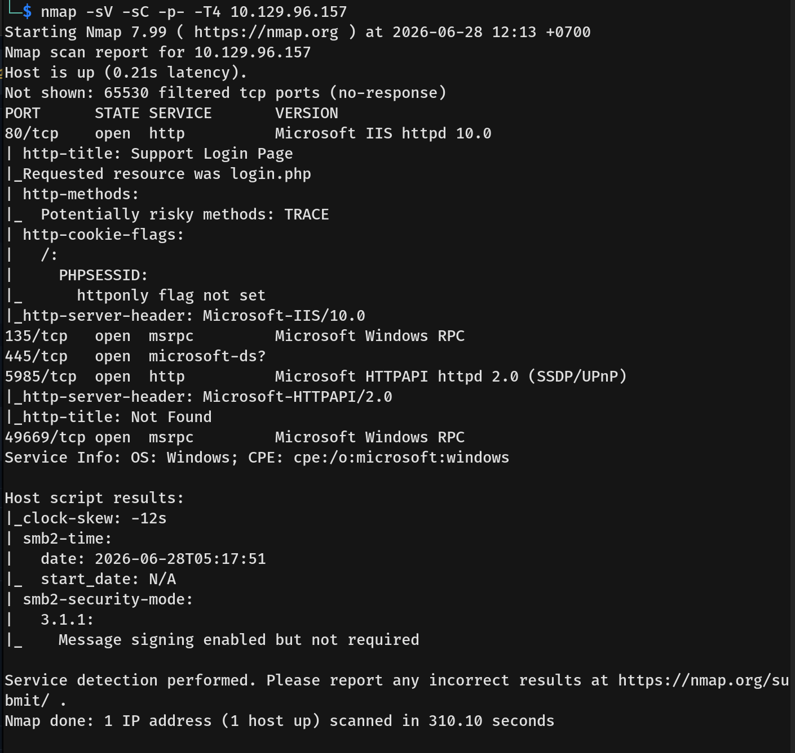
- The results indicated several open ports, revealing a Windows Server environment with the following services available:
  * **80/tcp:** http (Microsoft IIS httpd 10.0)
  * **135/tcp:** msrpc (Microsoft Windows RPC)
  * **445/tcp:** microsoft-ds (Microsoft-DS for SMB file sharing)
  * **5985/tcp:** http (Microsoft HTTPAPI httpd 2.0 - WinRM remote management)

---

## Scanning & Enumeration
- I started by enumerating SMB using null credentials and the guest account with no password, but was unsuccessful in finding any information.
- Next, I visited port 80 and found a support login page.
  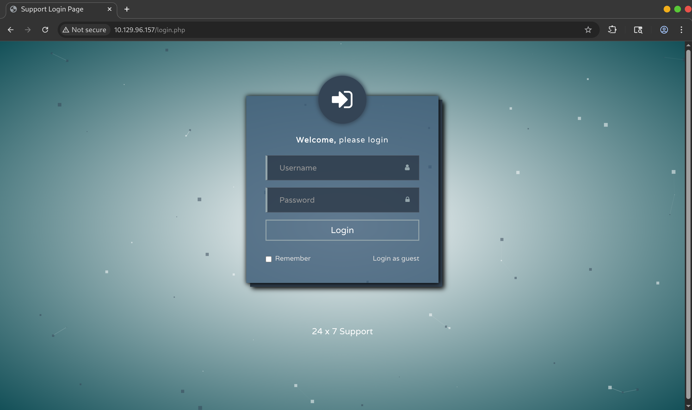
- Logging in as a guest, we found an "Issues" menu where a user named `Hazard` was talking with the Support Admin about a Cisco router problem. There was also an attachment included in the chat.
  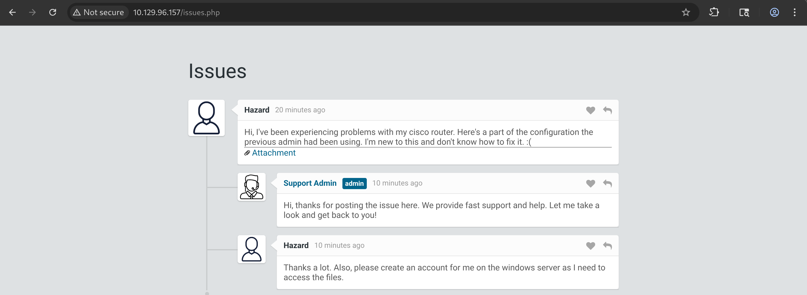
- The attachment was a configuration file containing a Type 5 password (MD5-hashed) and Cisco Type 7 passwords.
  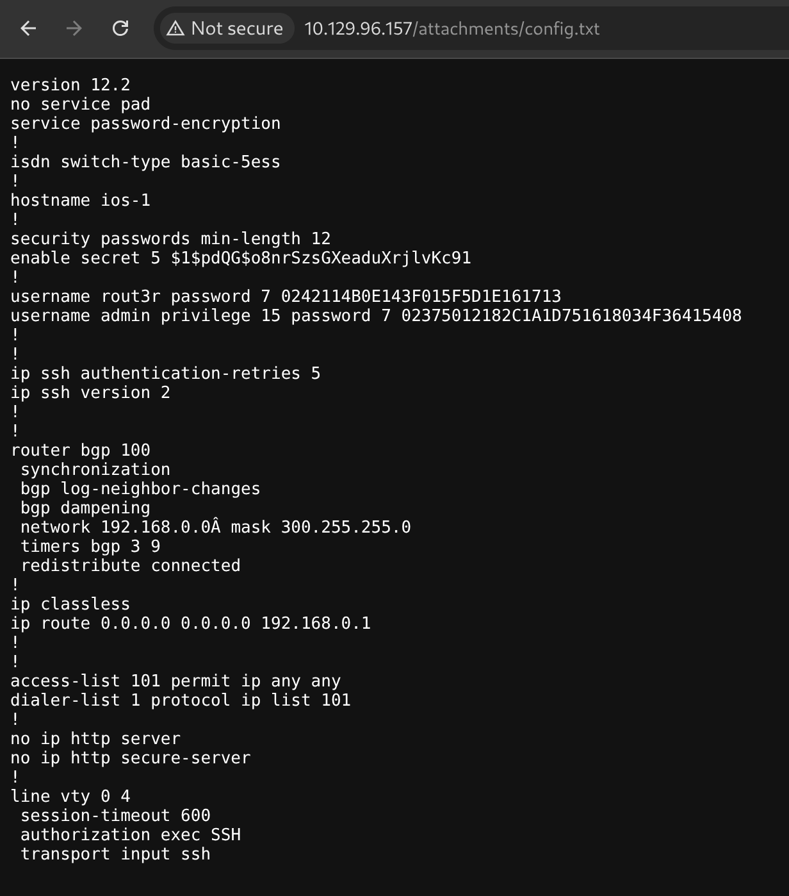

---

## Exploitation
- By cracking the MD5 password, we found a plaintext password for an unknown user.
  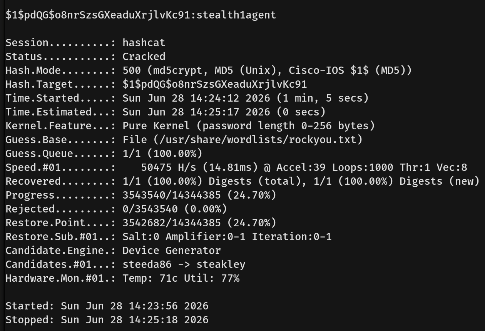
- For the Cisco Type 7 passwords, I wrote a custom Python script, which you can find here: [cisco7.py](cisco7.py).
  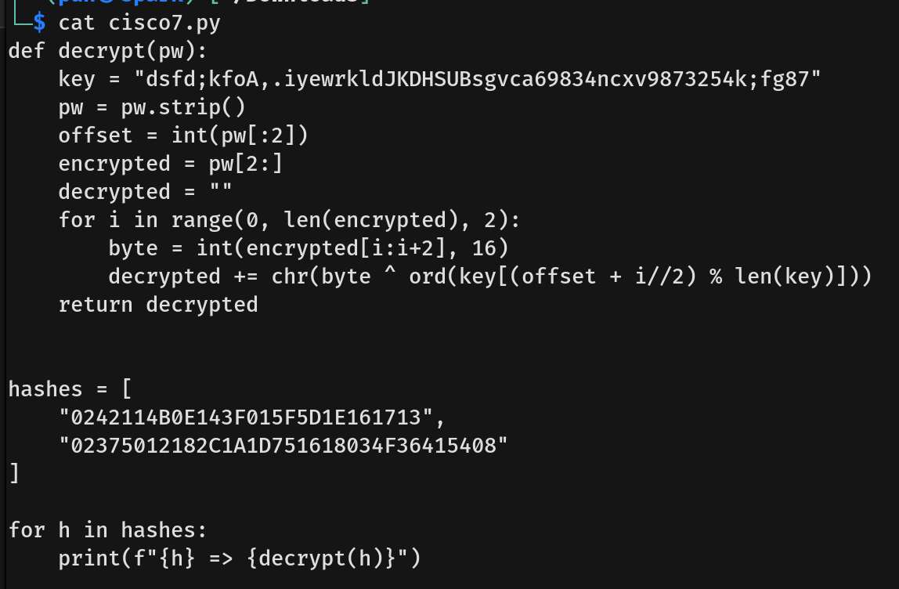
- Running the script successfully decrypted the passwords for the `rout3r` and `admin` accounts.
  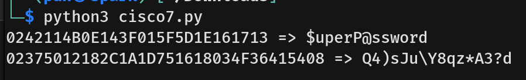
- Since we did not know the exact Windows users for these passwords, I tried all the available usernames and found a match for the user `Hazard`.
  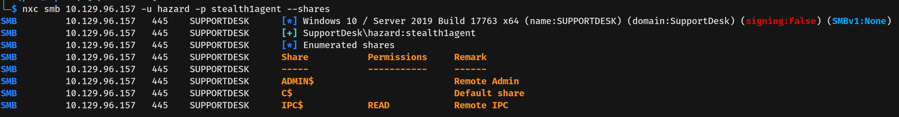
- I tried using Hazard's credentials to connect to the machine via WinRM, but the connection failed.
- On SMB, Hazard only had read permissions and there were no interesting shares. However, I was able to use Hazard's authenticated account to enumerate a full list of system usernames.
  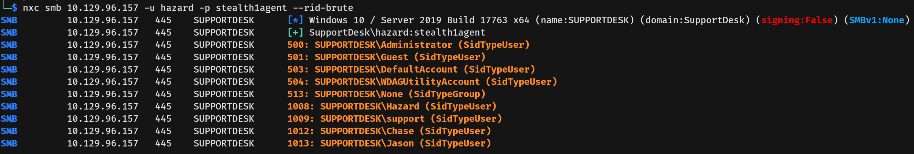
- With this new information, I created a list containing all the usernames and passwords we had found so far for further enumeration.
  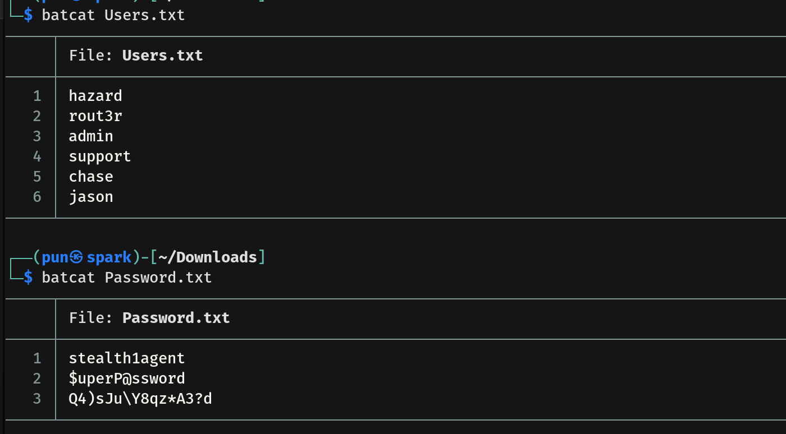
- Spraying this username and password list revealed valid credentials for another user, `Chase`.
  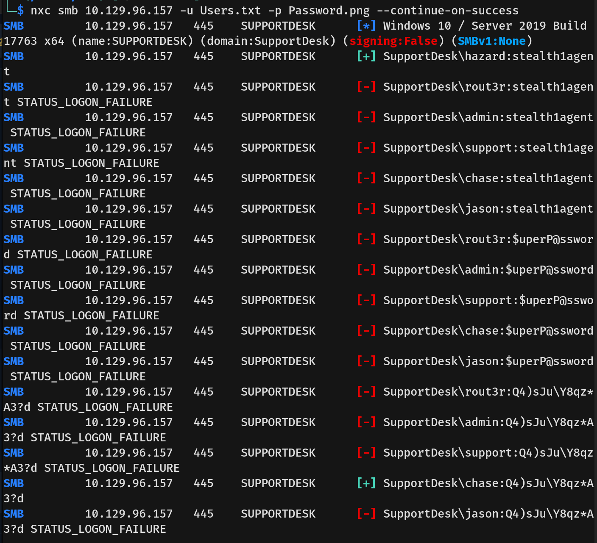
- Chase also only had read permissions on SMB.
  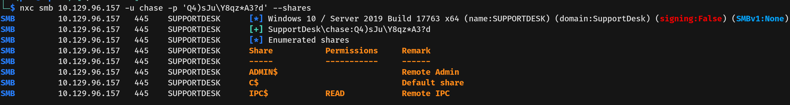
- I used `evil-winrm` to connect to the machine as Chase and captured the user flag.
  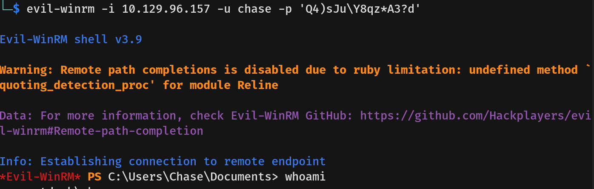

---

## Privilege Escalation
- On user Chase's desktop, there was a `todo.txt` file.
  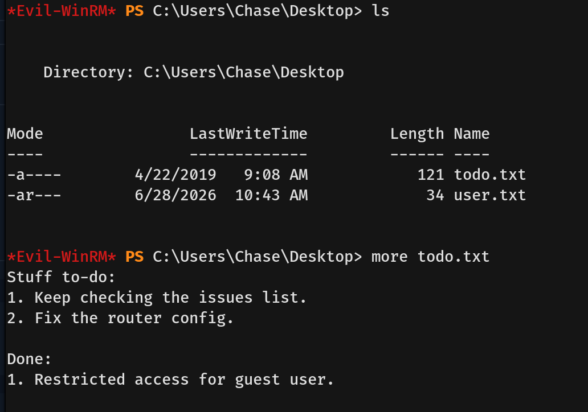
- The note mentioned to check the issue list. I enumerated the system for any text files or programs that could be holding this list but found nothing obvious on the filesystem.
- I then checked the current running processes to determine if any active applications could be tied to the note.
  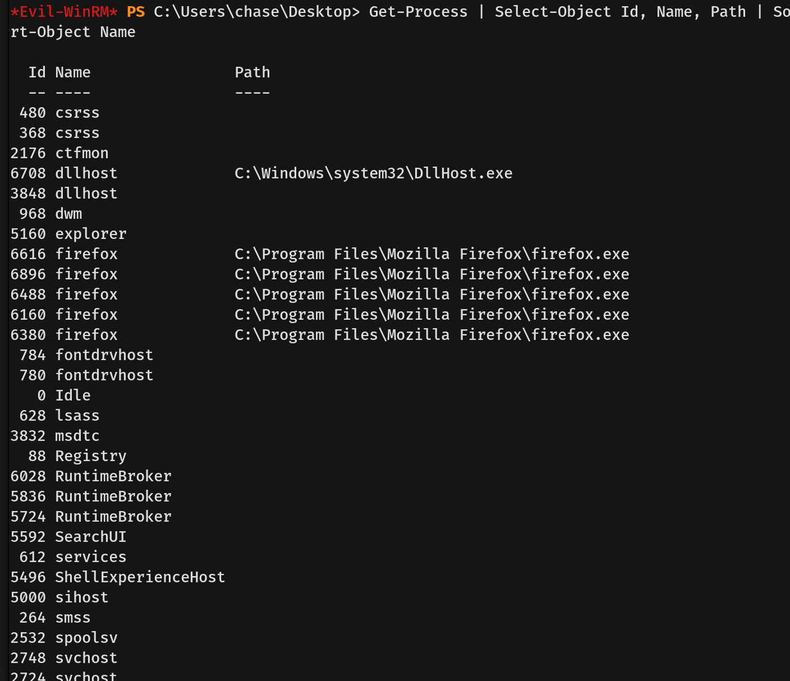
- Since there were no other suspicious programs running, I concluded that the user must be viewing the issue list via the Firefox web browser.
- To investigate further, I copied `procdump64.exe` from my machine to the target. I then used it to dump the active memory of the Firefox process. By doing this, I could inspect the browser's RAM for sensitive information that the application temporarily holds while the user is logged in.
  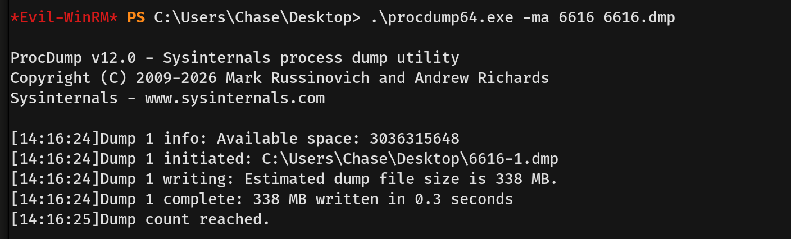
- After the dumping was successful, I initially tried to transfer the dump file back to my machine. However, the file size was too large and taking too much time, so I opted to search for strings locally on the target machine instead.
- Searching through the memory dump revealed the plaintext password for the `Administrator` user. I verified these credentials against SMB, and the authentication was successful.
  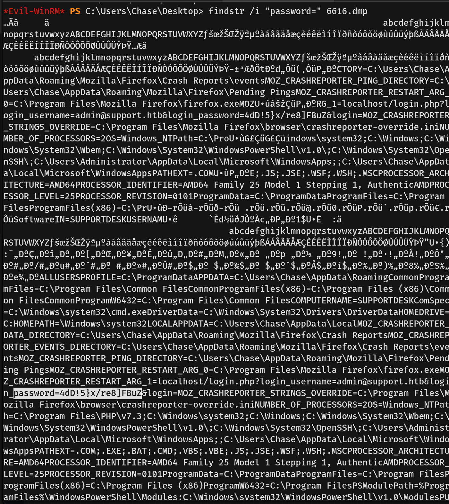
  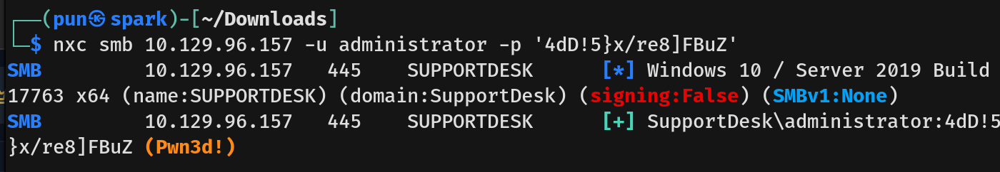
- Finally, I connected to the machine as `Administrator` using WinRM and captured the root flag.
  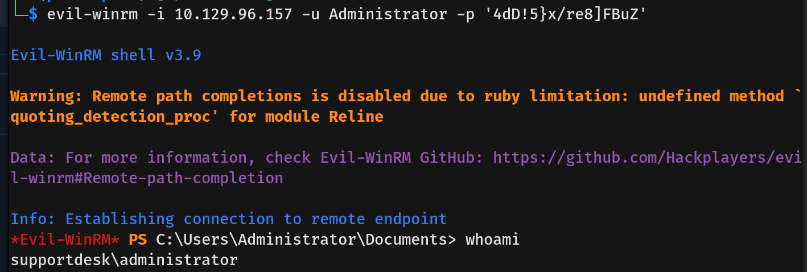
