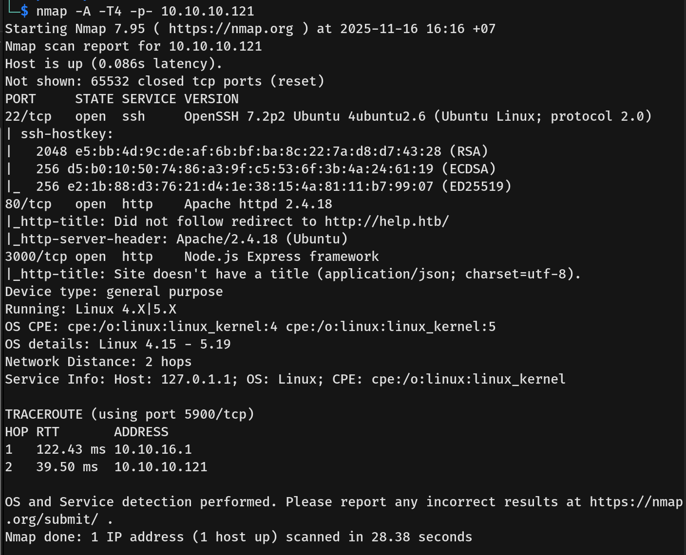

# Help Writeup - by Thammanant Thamtaranon  
- Help is an easy Linux-based machine hosted on Hack The Box.

## Reconnaissance  
- I began with a full TCP port scan including service/version detection and OS fingerprinting:  
  `nmap -A -T4 -p- 10.10.10.37`  
    
- The scan revealed the following open ports:  
  - **21** — FTP  
  - **22** — SSH  
  - **80** — HTTP  
  - **25565** — Minecraft  
- I added `Help.htb` to `/etc/hosts` for proper hostname resolution.

## Scanning & Enumeration  
- While reviewing the website we observed the author name **Notch** and recorded it as an intelligence lead.  
- I performed a directory brute-force using `dirsearch`: `dirsearch -u http://blocky.htb`  
    
- The `plugins` directory contained two JAR files.  
    
- We extracted the JAR for inspection: `jar xf myfile.jar`  
    
- In the extracted tree, under `/com/myfirstplugin`, I disassembled `BlockyCore.class` using `javap -c BlockyCore.class` and recovered embedded credentials.  
  

- We identified that the site is running WordPress and executed a WordPress enumeration scan:  
  `wpscan --url blocky.htb`  
    
    
    
- The WordPress scan did not return any actionable findings.

- We then enumerated virtual hosts using `ffuf`:  
  `ffuf -u http://blocky.htb -H "Host: FUZZ.blocky.htb" -w /usr/share/seclists/Discovery/DNS/subdomains-top1million-20000.txt -mc all -ac`  
- No additional virtual hosts were discovered.

## Exploitation  
- Using the credential recovered from the JAR, I authenticated to phpMyAdmin at `http://blocky.htb/phpmyadmin/` and gained access to the application database.  
    
- Within phpMyAdmin we found Notch's credentials.  
    
- I updated Notch's password in the database and verified the new credentials by logging in as Notch.  
    
    
- The WordPress instance did not yield further privilege escalation, so we shifted focus to system access via SSH. Using the recovered credentials: `notch:8YsqfCTnvxAUeduzjNSXe22`
- I established an SSH session to the target and obtained the user flag.  

## Privilege Escalation  
- We enumerated sudo privileges with `sudo -l` and found that the `notch` user had sudo rights.  
  
- To escalate, I executed the permitted sudo command to obtain a root shell: `sudo su -`  
  
- After escalation we captured the root flag.
