# Help Writeup - by Thammanant Thamtaranon  
- Help is an easy Linux-based machine hosted on Hack The Box.

## Reconnaissance  
- I began with a full TCP port scan including service/version detection and OS fingerprinting:  
  `nmap -A -T4 -p- 10.10.10.121`  
    
- The scan revealed three open ports:  
  - **22** — SSH  
  - **80** — HTTP  
  - **3000** — HTTP  
- We added `Help.htb` to `/etc/hosts` for proper hostname resolution.

## Scanning & Enumeration  
- We ran Vhost enumeration using  
  `ffuf -u http://help.htb -H "Host: FUZZ.help.htb" -w /usr/share/seclists/Discovery/DNS/subdomains-top1million-20000.txt -mc all -ac`, but nothing was found.
- Next, we used `dirsearch` on both port 80 and 3000:  
  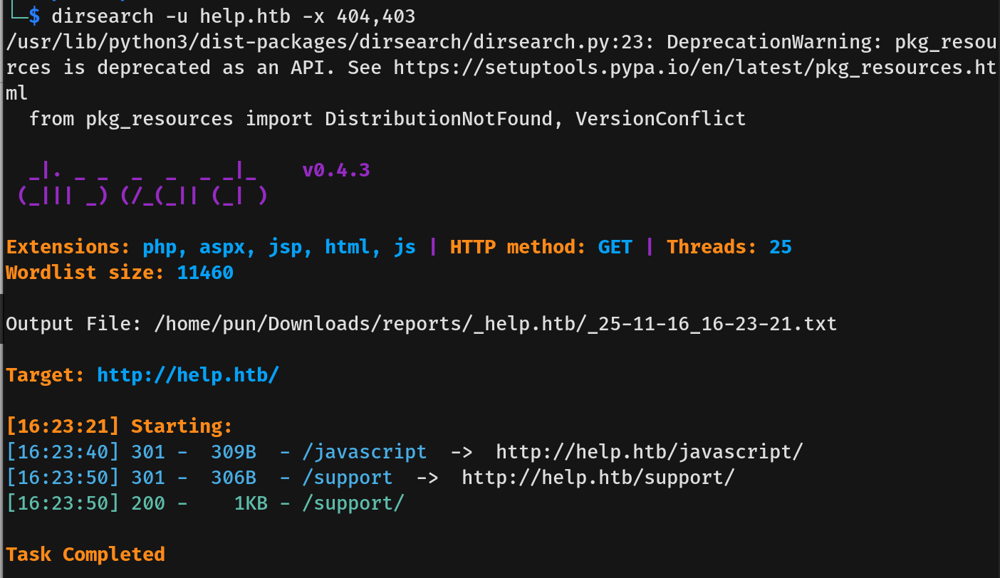  
  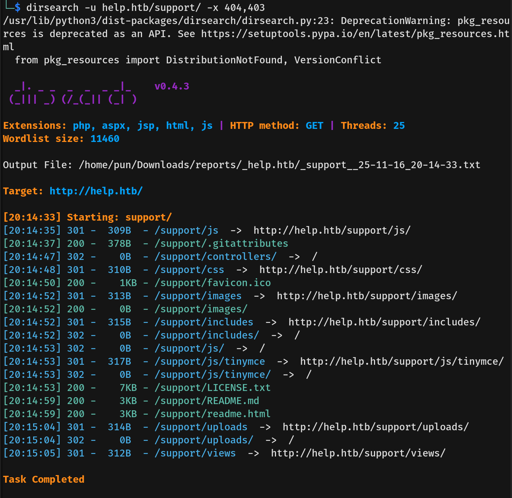  
  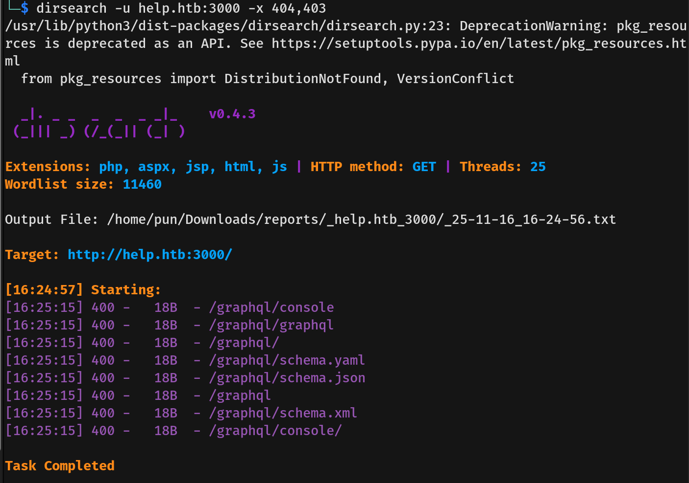
- Visiting `http://htb.help/support/` revealed a site using `HelpDeskZ`.  
  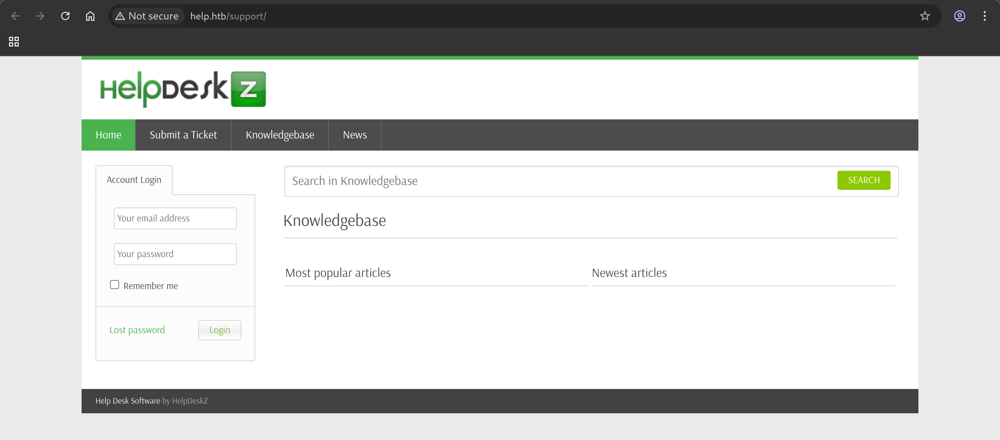
- Visiting `http://help.htb/support/README.md` confirmed it was running `HelpDeskZ` version 1.0.2.
- Heading over to `http://htb.help:3000`, we discovered a message for user `Shiv`.  
  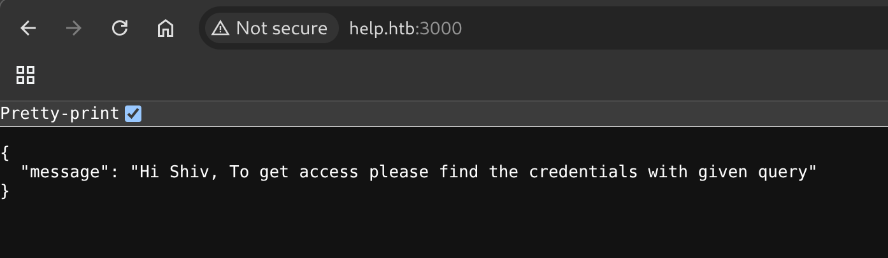
- Checking `http://help.htb:3000/graphql/` showed `GET query missing.`—a solid hint toward a GraphQL API.

## Exploitation  
- We looked up CVEs for `HelpdeskZ 1.0.2` and found two relevant vulnerabilities.  
  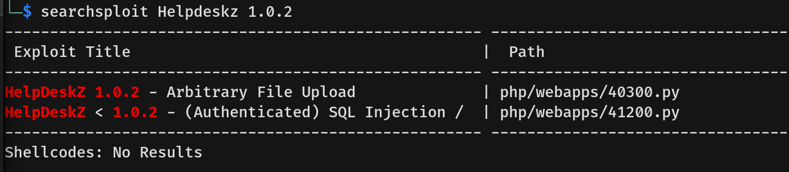
- We attempted the first exploit (Arbitrary File Upload) but it failed.  
  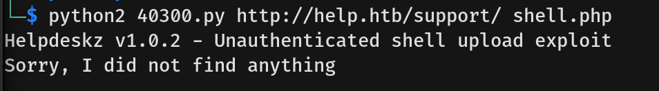
- We shifted our focus to port 3000.
- After tweaking the request, we fired off a test GraphQL query.  
  
- This confirmed that the API endpoint was active and responding.
- We then used an introspection query:  
  `{
  "query": "query IntrospectionQuery { __schema { queryType { name fields { name type { name } } } mutationType { name fields { name type { name } } } types { name fields { name type { name kind } } } } }"
}`  
  This gave us complete visibility into the internal schema.
- We noticed a `User` data type with `username` and `password` fields.  
  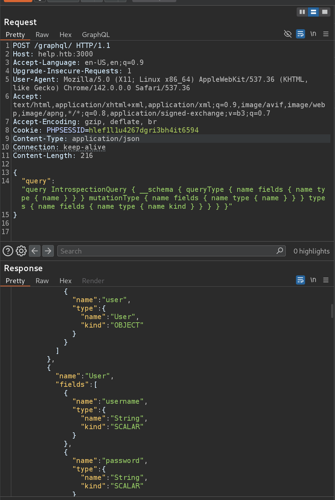
- We updated the query to extract the credentials:  
  `{
  "query": "query { user { username password } }"
}`  
  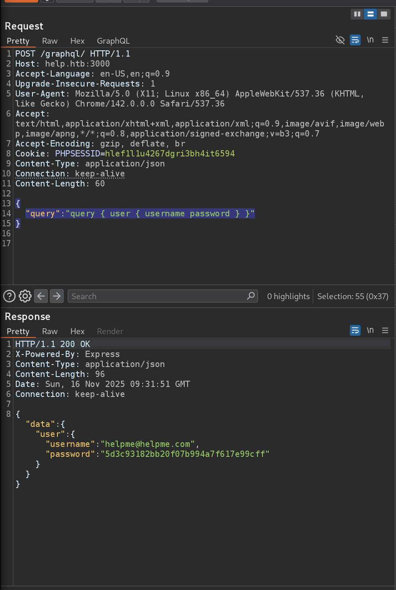
- We submitted the password to CrackStation and successfully recovered Helme’s password.  
  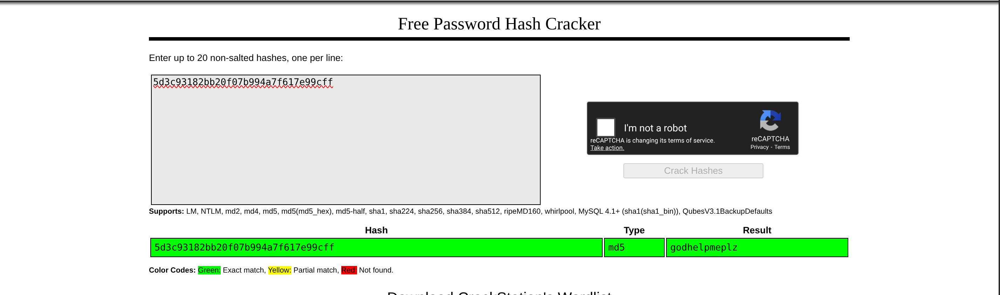
- With these credentials, we logged into HelpDeskZ.  
  
- Now authenticated, we moved on to the second exploit.
- After reviewing the vulnerability details, we learned we needed to log in and create a ticket with an attachment.  
  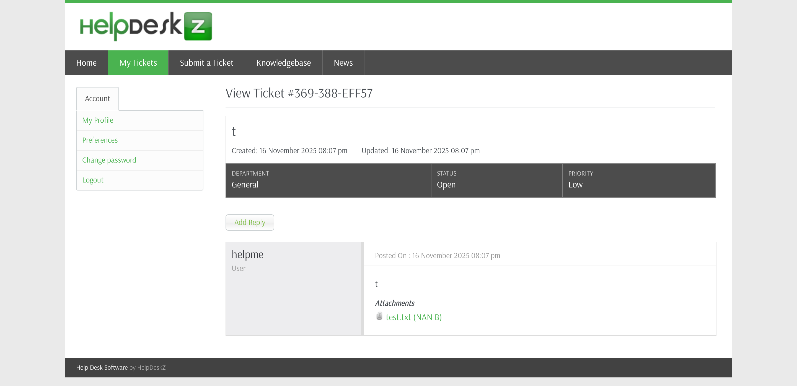
- The attachment download URL was:  
  `http://help.htb/support/?v=view_tickets&action=ticket&param[]=4&param[]=attachment&param[]=1&param[]=6`  
  We tested for SQLi using:  
  - `...6 and 1=2-- -`  
  - `...6 and 1=1-- -`  
  The first returned an error, while the second worked—confirming SQL injection.  
  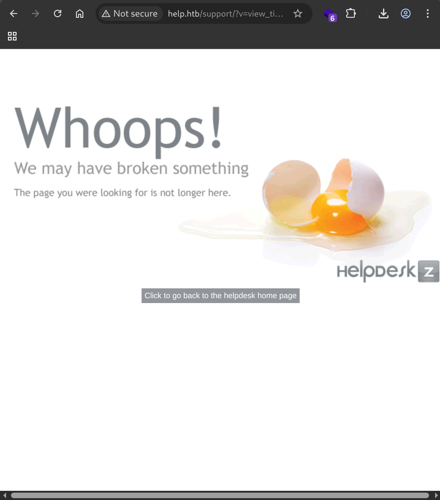
- We saved the request to `req.txt`.  
  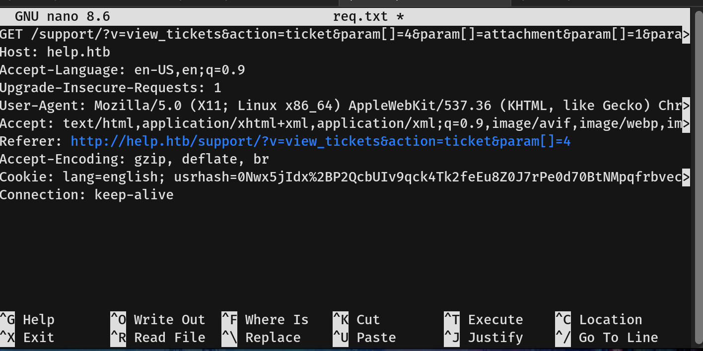
- Running sqlmap with `sqlmap -r req.txt --batch` gave us full database access.  
  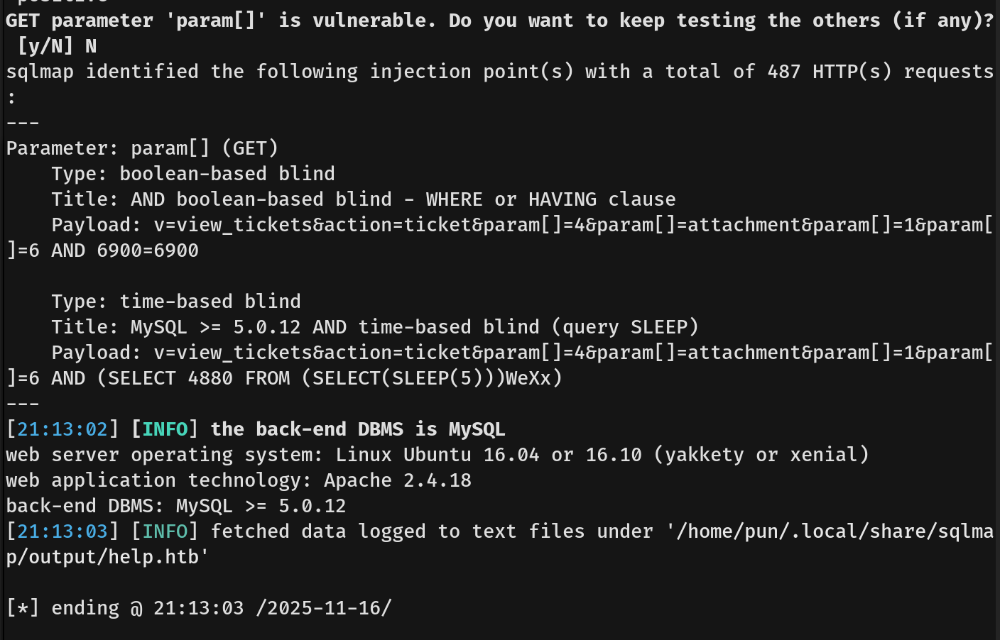  
  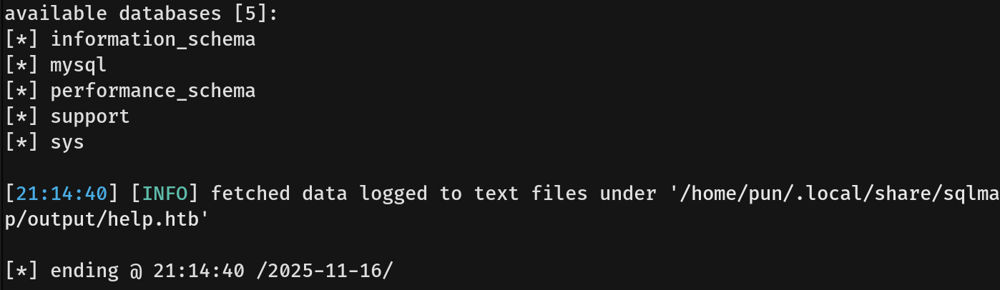  
  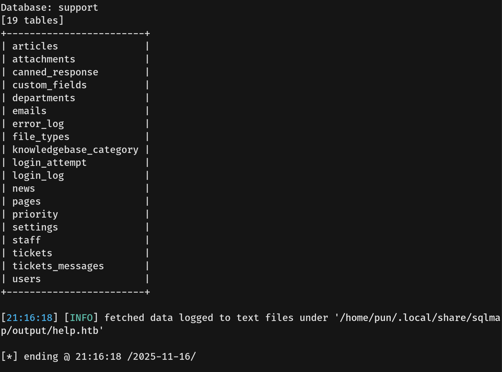
- We eventually recovered the admin credentials.  
  
- Trying SSH with each user, we finally got in as user `help`.  
  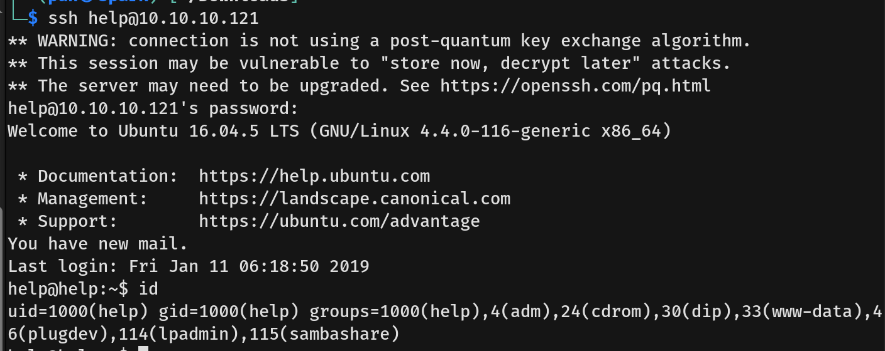
- We captured the user flag.

## Privilege Escalation  
- Running `sudo -l` confirmed we had no sudo permissions.
- Checking `/var/mail`, we found a mail addressed to help.  
  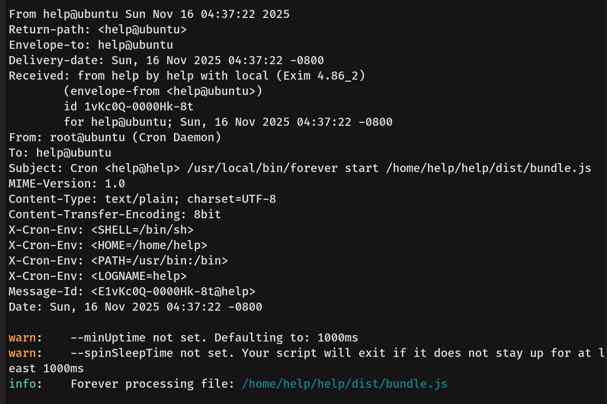
- The mail was an automated Cron email, but still executed with help’s permissions.
- After several attempts to find misconfigurations, we began considering kernel exploits as a last resort.
- Running `uname -a` revealed the kernel version: Linux 4.4.0-116-generic.
- We found a suitable local privilege escalation: `CVE-2017-16995`.
- We copied the exploit from ExploitDB, compiled it, and executed it—gaining root access.  
  
- We captured the root flag.
