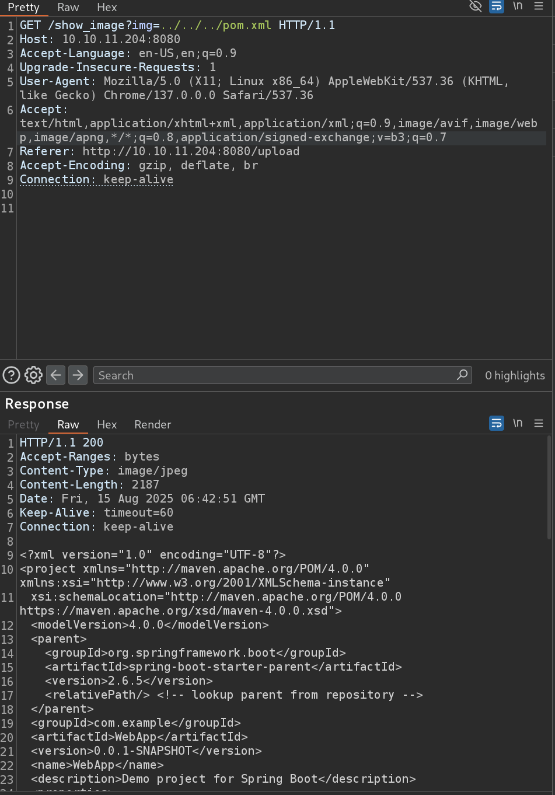

# Inject Writeup - by Thammanant Thamtaranon  
- Analytics is an easy Linux-based machine hosted on Hack The Box.

## Reconnaissance  
- I started with a full TCP port scan including service/version detection and OS fingerprinting:  
  `nmap -A -T4 -p- 10.10.11.204`  
  
- The scan showed two open ports:  
  - 22 (SSH)  
  - 8080 (HTTP)  

## Scanning & Enumeration  
- I ran a directory brute-force using `dirsearch`:  
  `dirsearch -u 10.10.11.204:8080`  
  
- We found the `/upload` path, when upload the file there will be a link to view the uploaded image. The path is `show_image?img=`.
- I try path traversal with `/show_image?img=../../../../../../../etc/passwd`.
 
- We then confirm user phil.
- We then try to read config file to determine what language or framework is being used. We found pom.xml which indicated java and spring boot.

- We then search in the internet for these CVE and found **CVE-2022-22963**.
- 

## Exploitation  

## Privilege Escalation  
