# Jeeves Writeup - by Thammanant Thamtaranon

**Jeeves** is a **Medium**-difficulty Windows machine hosted on Hack The Box.

---

## Reconnaissance
- We began the engagement with a full TCP port scan using Nmap to identify open services and fingerprint the underlying operating system.
    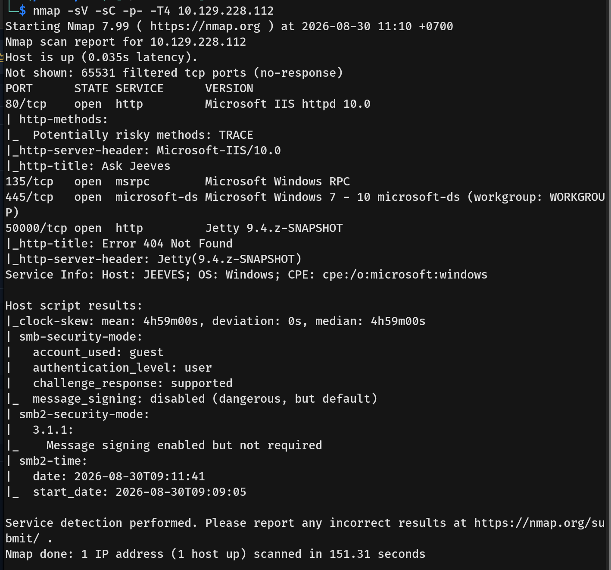
- The scan revealed four open ports:
    *   **80/tcp:** HTTP (Microsoft IIS httpd 10.0)
    *   **135/tcp:** msrpc (Microsoft Windows RPC)
    *   **445/tcp:** microsoft-ds (Windows 7 - 10)
    *   **50000/tcp:** HTTP (Jetty 9.4.z-SNAPSHOT)

---

## Scanning & Enumeration
- Visiting port 80 revealed a website featuring a search engine.
    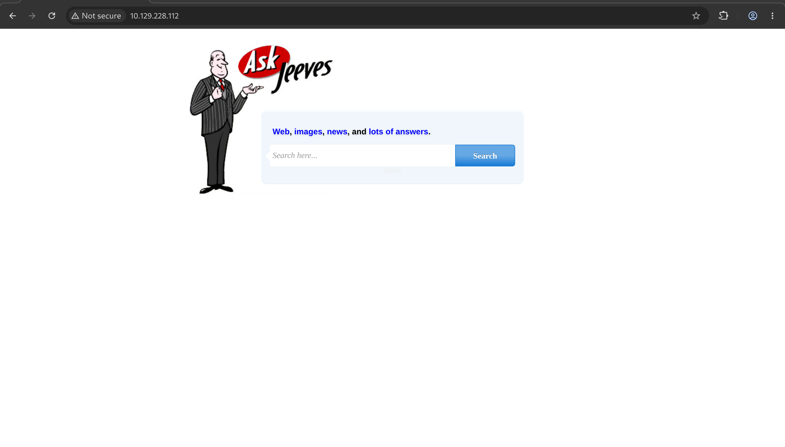
- Any input resulted in an error, and enumerating the directory yielded no results.
    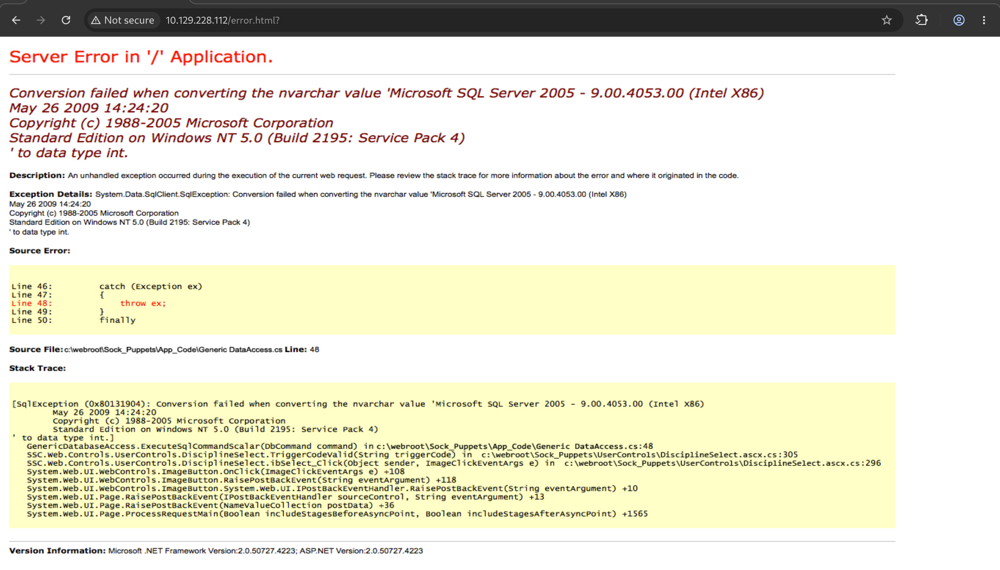
- We then moved on to port 50000.
    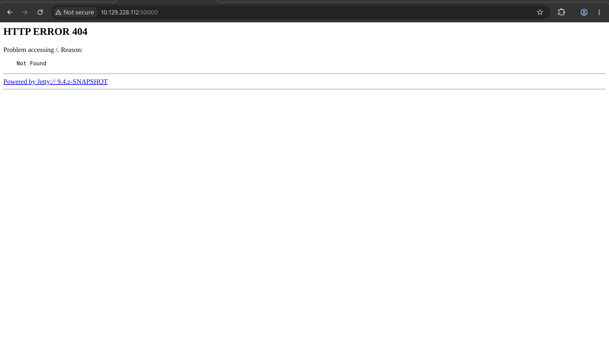
- Enumerating port 50000 uncovered the `/askjeeves` directory.
    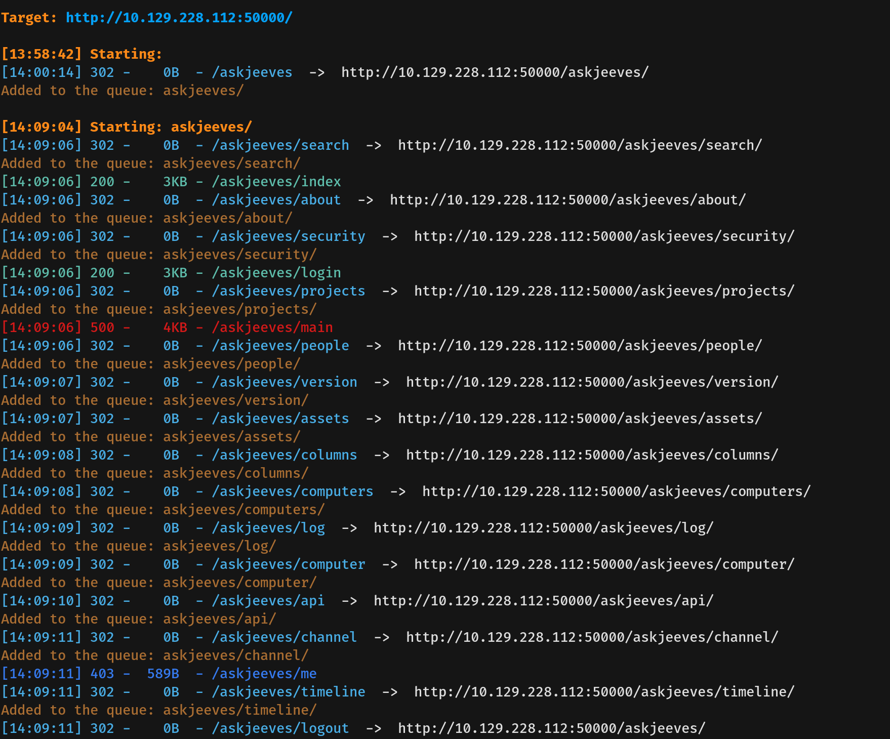
- Navigating to `/askjeeves` revealed an unauthenticated Jenkins dashboard.
    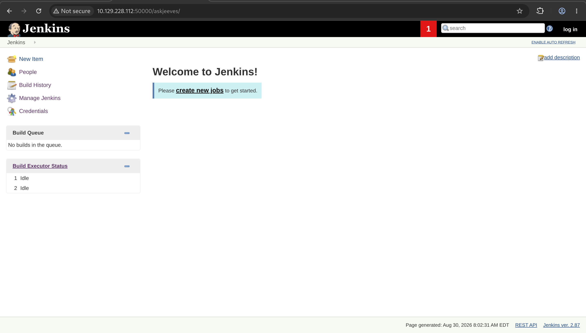
  
---

## Exploitation
- Since the Jenkins page allowed unauthenticated access, we navigated to **Manage Jenkins -> Script Console**.
    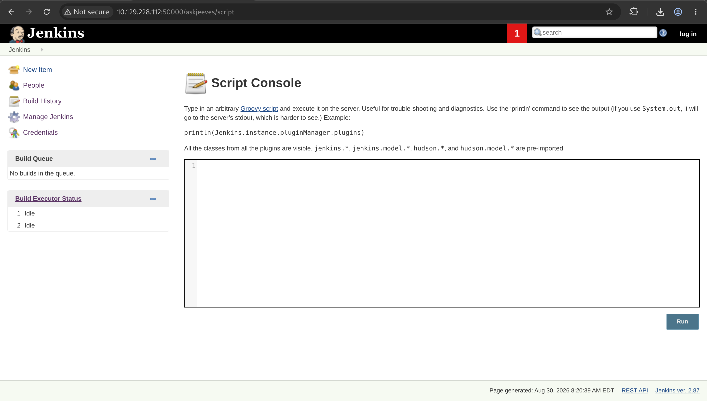
- The script console executes Groovy scripts, so I ran a command to execute `whoami`. We found ourselves operating as the user `kohsuke`.
    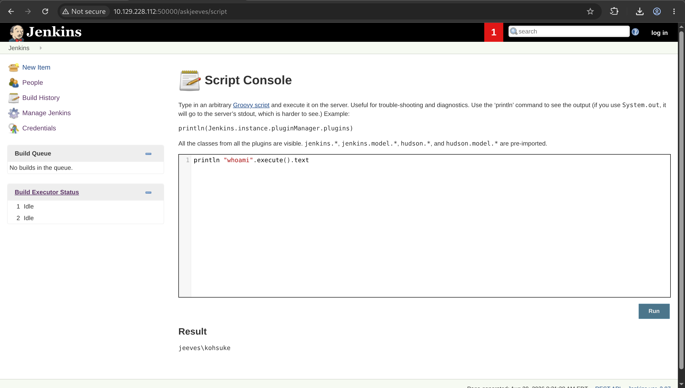
- With command execution confirmed, I updated the script to execute a reverse shell payload and gained access.
    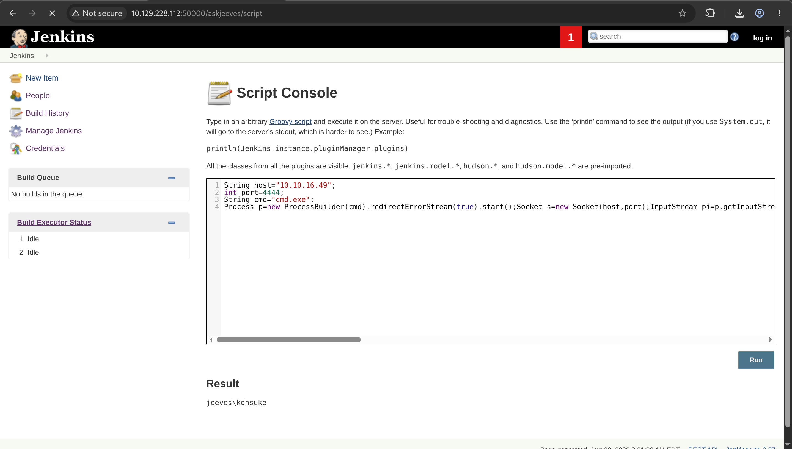
    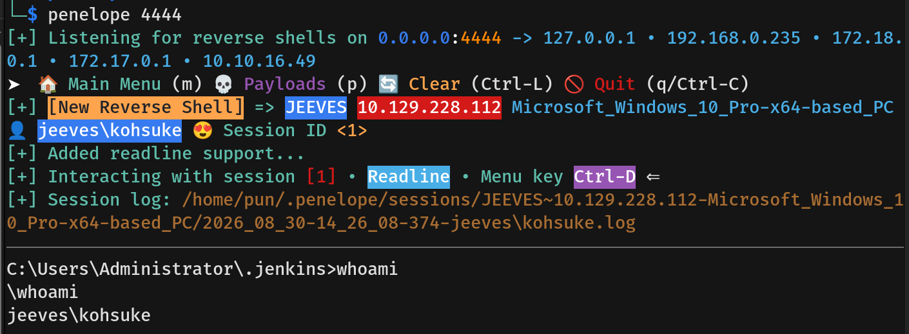
- We then captured the user flag.
  
---

## Privilege Escalation
- Running `whoami /priv` showed that our account had `SeImpersonatePrivilege` enabled.
    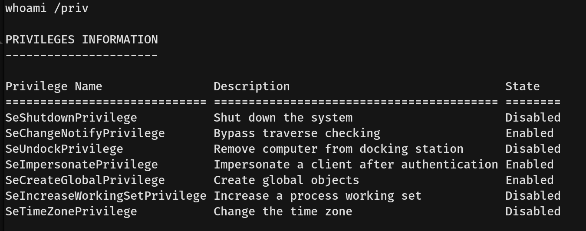
- I verified system information to check if the machine was vulnerable to a `SeImpersonatePrivilege` attack, confirming a Microsoft Windows 10 Pro environment.
    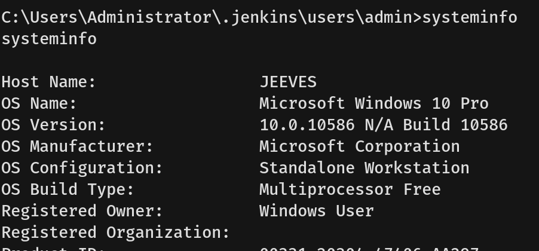
- After confirming vulnerability, we transferred `JuicyPotato.exe` from our attacking machine to the target using PowerShell, as `certutil` was not available on this host.
    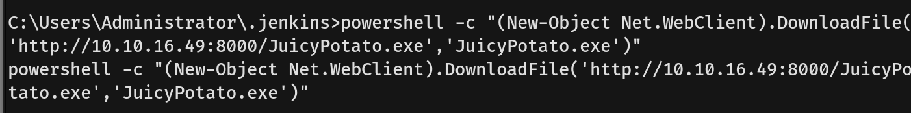
    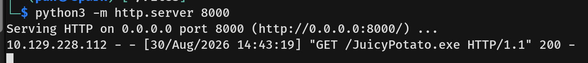
- We executed JuicyPotato with the `whoami` command and verified successful execution as `NT AUTHORITY\SYSTEM`.
    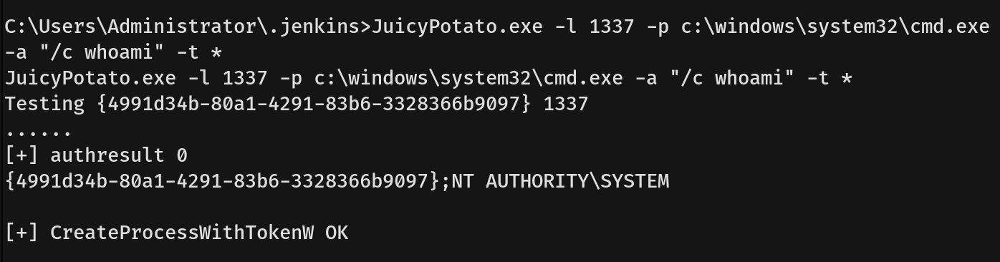
- Next, we used JuicyPotato to create a new user named `Tester` with the password `P@ssw0rd123` and added `Tester` to the local `Administrators` group.
    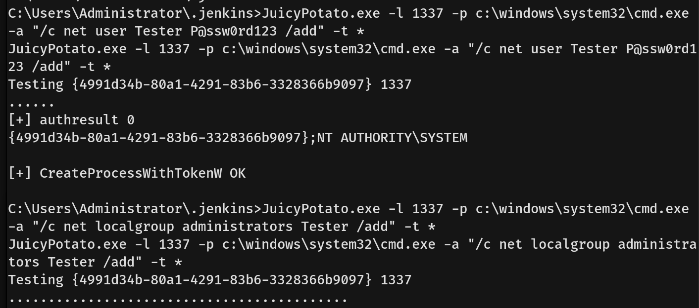
- We confirmed that `Tester` was successfully added to the `Administrators` group.
    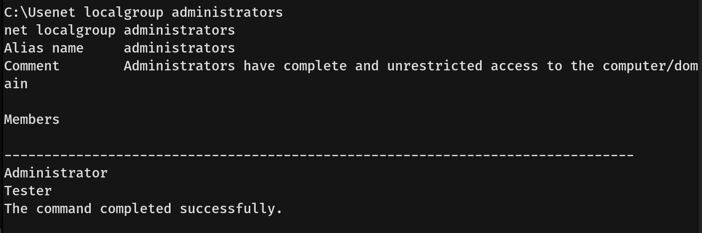
- Because WinRM was not open on this machine, I used `RunasCs.exe` to switch user contexts. We downloaded `RunasCs.exe` from our attacking machine to the target.
    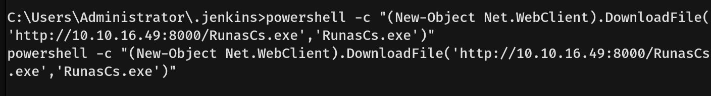
    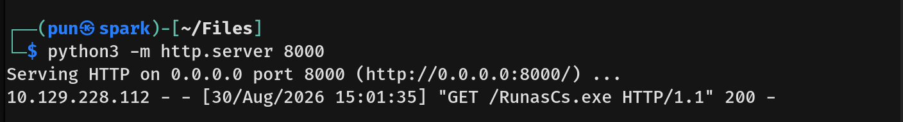
- We then executed `RunasCs.exe` to spawn a reverse shell connecting back to our listener under the context of the `Tester` user.
    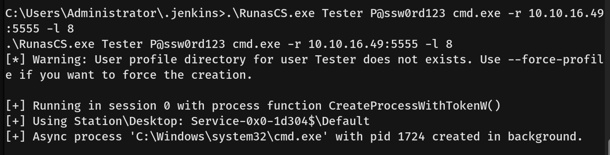
- We caught the reverse shell as `Tester`, obtaining full administrative rights.
    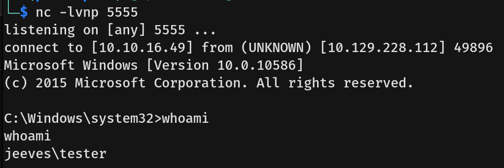
- However, the root flag was hidden inside an Alternate Data Stream (ADS). By running `dir /R` inside `C:\Users\Administrator\Desktop`, we identified the hidden stream `hm.txt:root.txt:$DATA` and read it using `more < hm.txt:root.txt` to capture the root flag.
    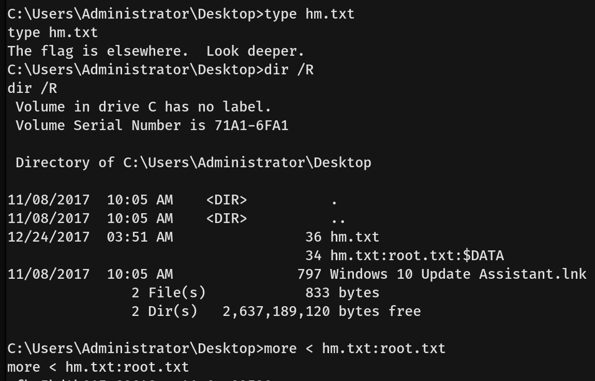
