# Json Writeup - by Thammanant Thamtaranon

**Json** is a **Medium**-difficulty Windows machine hosted on Hack The Box.

---

## Reconnaissance
- The engagement began with a full TCP port scan to identify open services and determine the underlying operating system.
  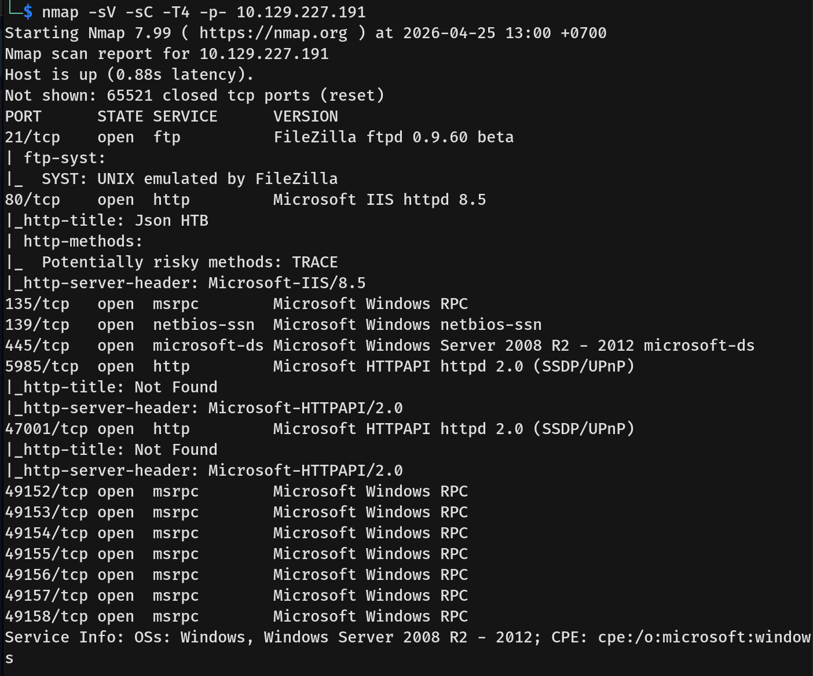
  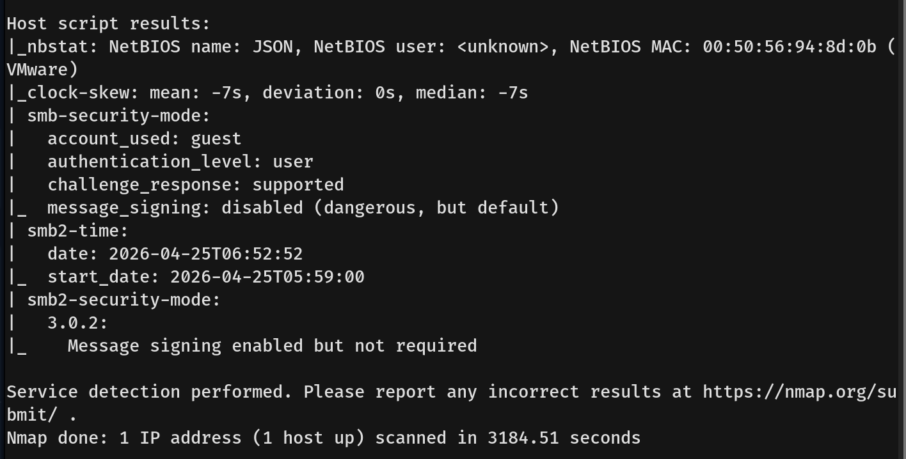
- The results indicated the following open ports:
  * **21/tcp:** FTP (FileZilla ftpd 0.9.60 beta)
  * **80/tcp:** HTTP (Microsoft IIS httpd 8.5)
  * **135/tcp:** MSRPC
  * **139/tcp & 445/tcp:** SMB (Windows Server 2008 R2 - 2012)
  * **5985/tcp:** HTTPAPI (WinRM)
  * **47001/tcp & 49152-49158/tcp:** MSRPC and related services

---

## Scanning & Enumeration
- Navigating to port 80 in the browser revealed the primary web application.
  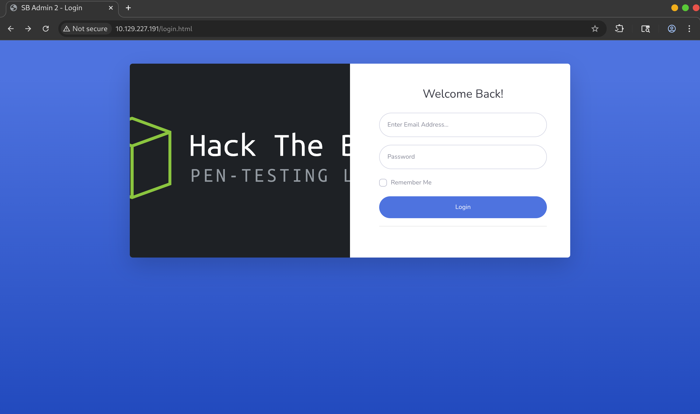
- I tried logging in with default credentials (`admin:admin`) and successfully authenticated as an administrator.
  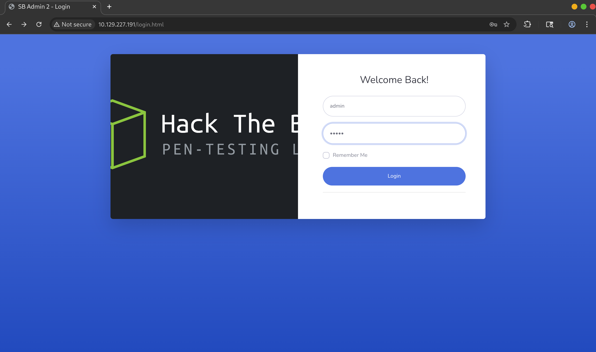
  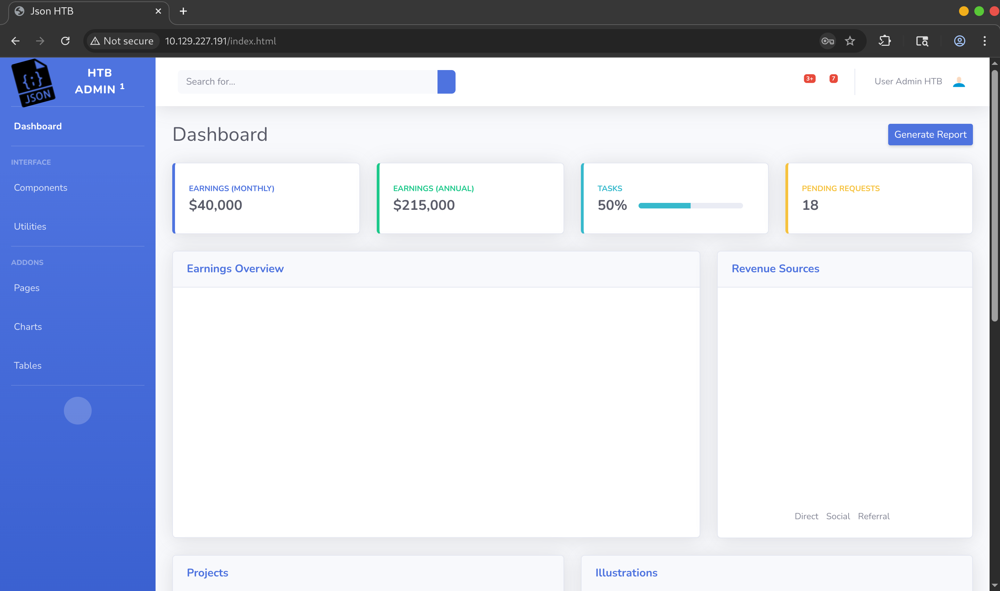
- Further manual enumeration of the application's interface didn't reveal much. However, intercepting the HTTP traffic revealed an API request made after a successful login that returned JSON data.
  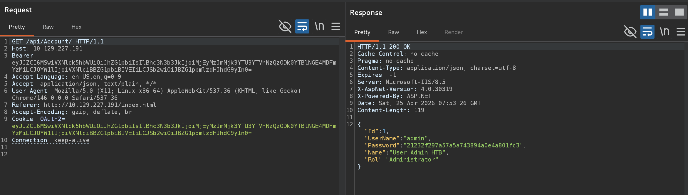
- I decoded the session token and noticed that the data returned by the server matched the serialized data contained within the token we sent. Because this is a .NET application (indicated by IIS), parsing user-supplied JSON objects in this manner strongly indicates a **JSON Deserialization** vulnerability.
  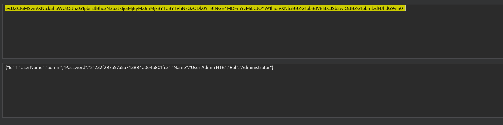

---

## Exploitation
- To exploit this, I first generated a base64-encoded PowerShell reverse shell payload.
  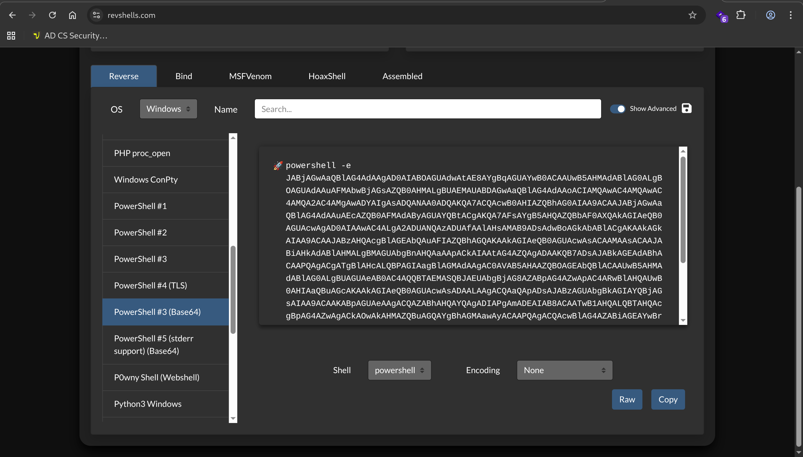
- Next, I used `ysoserial` to craft the deserialization exploit. Since `ysoserial.exe` is a Windows binary, I used `wine` to run it directly from my Kali Linux attacking machine. 
  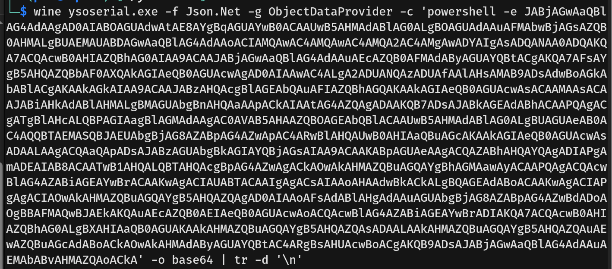
- I configured the tool to generate a payload using the `Json.Net` formatter, embedding my base64 PowerShell reverse shell inside it.
- Once I had the generated payload, I attempted to inject it by replacing the HTTP Cookie header, but nothing happened. I then replaced the `Bearer` token in the Authorization header with the payload, and it executed successfully.
  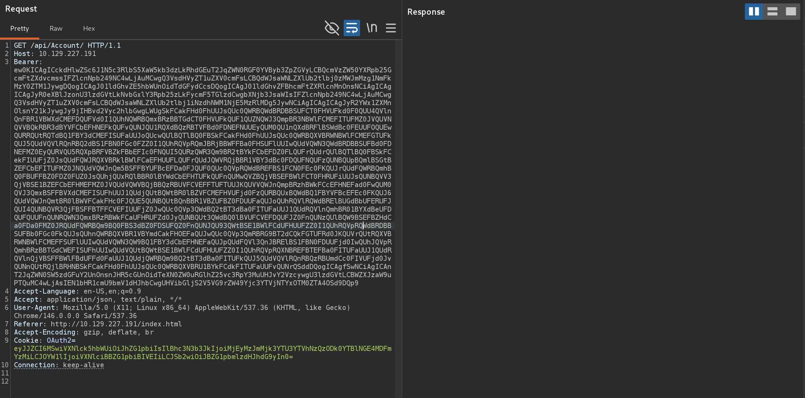
- The payload triggered the reverse shell, and I gained initial access as the `userpool` user. I then captured the `user.txt` flag.
  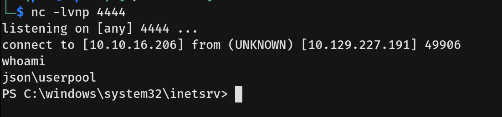
---

## Privilege Escalation
- Since we were on a Windows machine, I checked our current user's privileges using `whoami /priv`. The output revealed that `SeImpersonatePrivilege` was enabled.
  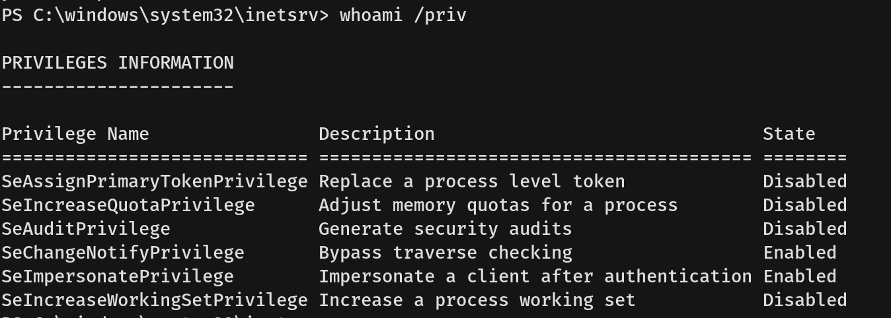
- I checked the system information to verify the exact OS build and confirmed that the machine was vulnerable to a **JuicyPotato** token impersonation attack.
  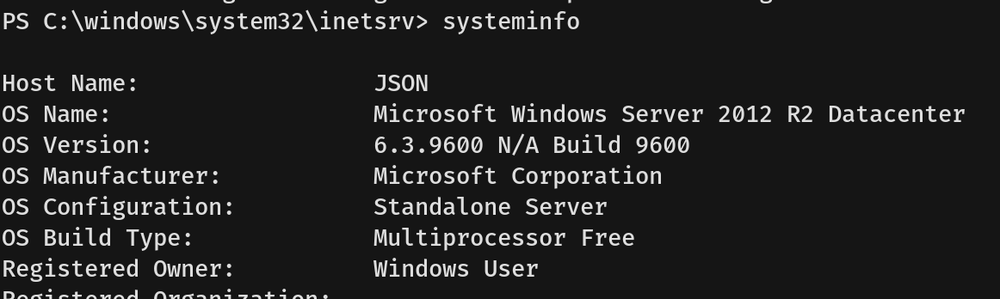
- I set up a Python HTTP server on my attacking machine to host the `JuicyPotato.exe` binary.
  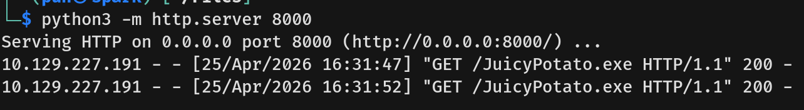
- From the target Windows machine, I downloaded the `JuicyPotato.exe` binary into a writable directory.
  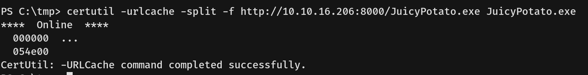
- I tested the exploit by running JuicyPotato with a test command, confirming that we could successfully execute commands as `NT AUTHORITY\SYSTEM`.
  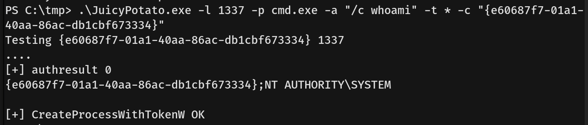
- Instead of catching a second reverse shell, I used JuicyPotato to execute a command that reset the local Administrator's password to `Password123!`.
  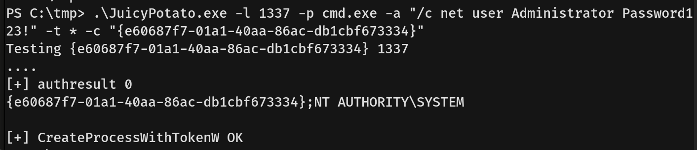
- With the Administrator password successfully changed, I utilized `evil-winrm` to connect directly to the machine via WinRM on port 5985. I logged in as the Administrator and captured the `root.txt` flag located on the `superadmin` Desktop.
  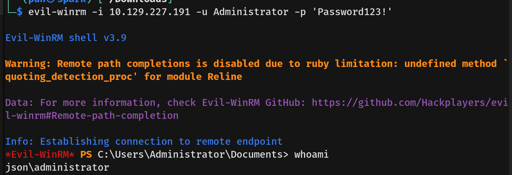
