# Keeper Writeup - by Thammanant Thamtaranon

**Keeper** is an **Easy**-difficulty Linux machine hosted on Hack The Box.

---

## Reconnaissance
- I began with a full TCP port scan to identify open services and the operating system.
  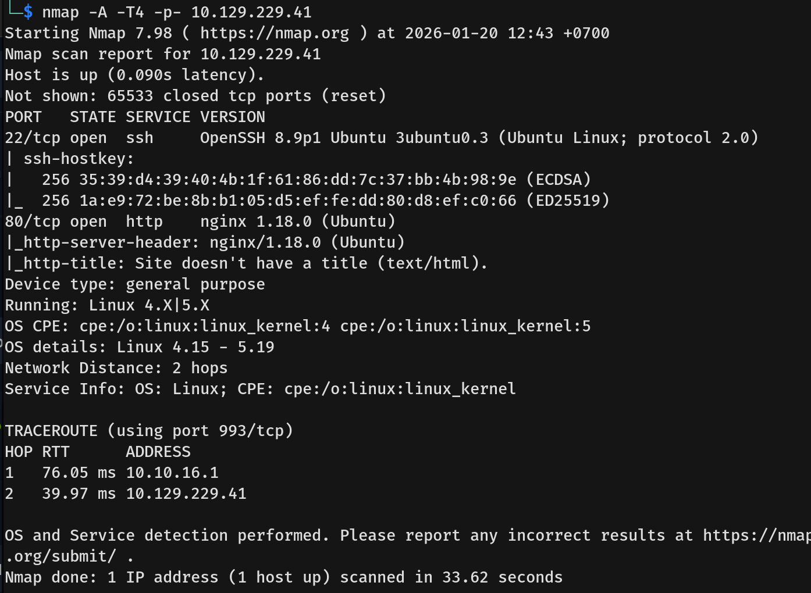
- The scan revealed two open ports:
  - **22/tcp** — OpenSSH 8.9p1
  - **80/tcp** — nginx 1.18.0
- Visiting port 80 revealed a generic page with a link to the ticketing system.
  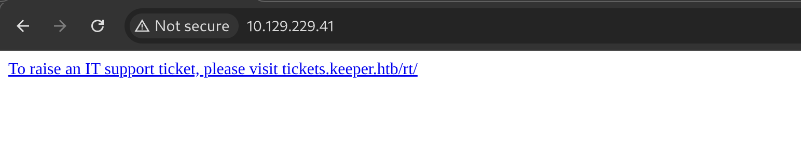
- I added both `keeper.htb` and `tickets.keeper.htb` to my `/etc/hosts` file.

---

## Scanning & Enumeration
- I navigated to `http://tickets.keeper.htb/rt/`, which presented a login page for **Request Tracker (RT)**.
  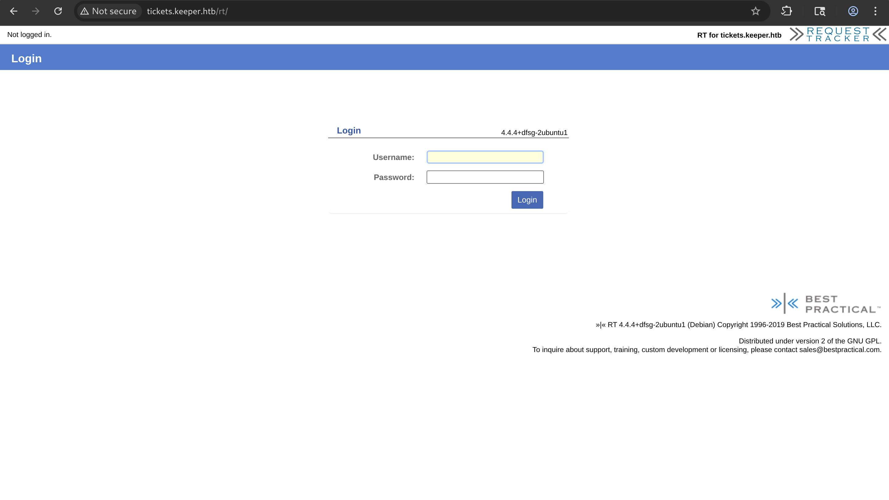
- I searched for default credentials for Request Tracker and successfully logged in using `root` : `password`.
  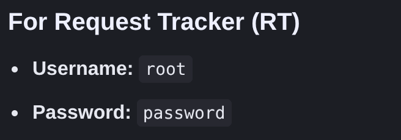
  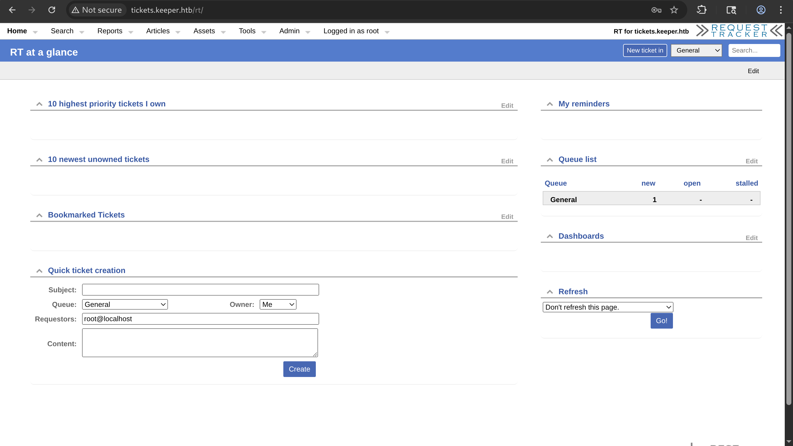
- Inside the dashboard, I navigated to **Admin > Users > Select** to enumerate existing users on the system.
  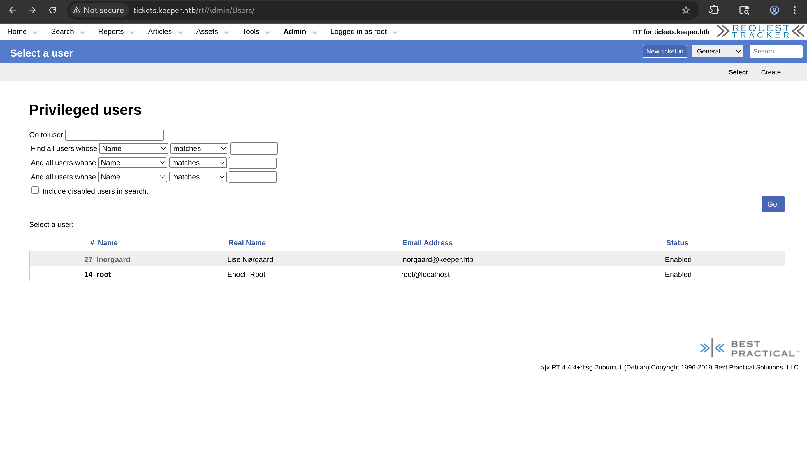
- I identified a user named **lnorgaard** and clicked on the username to view their profile details.
- In the "Comments" section of the user's profile, I found a password explicitly written in plain text: `Welcome2023!`.
  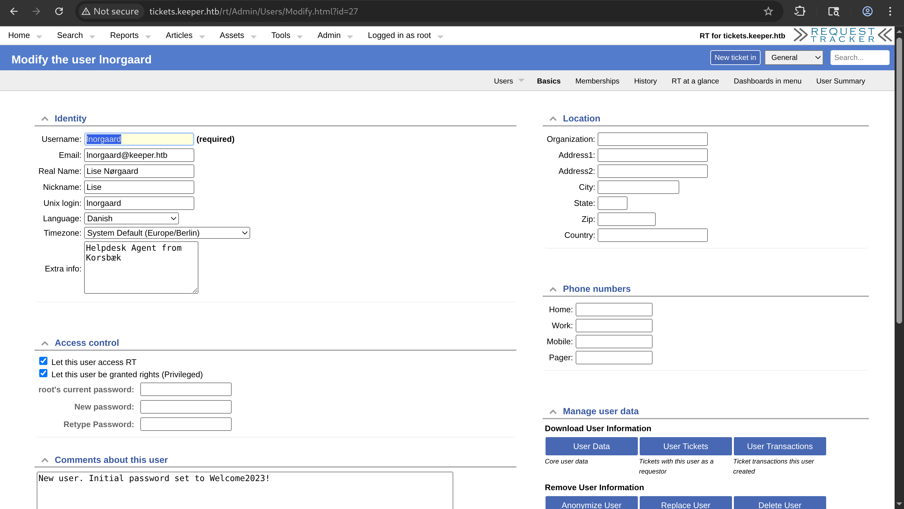

---

## Exploitation
- I verified these credentials by attempting to log in via SSH.
- The login was successful, and I gained initial access to the system as `lnorgaard`.
  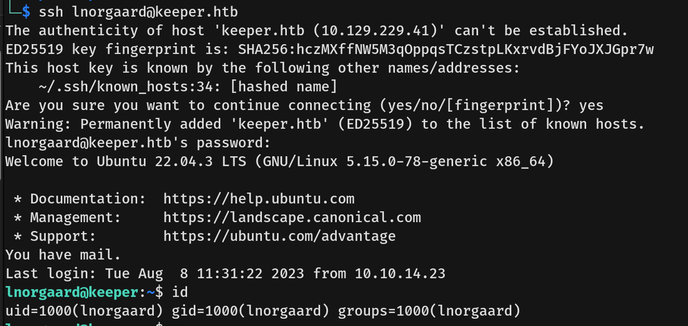

---

## Privilege Escalation
- I explored the user's home directory and found a zip file named `RT30000.zip`.
- After unzipping it, I found a KeePass database file (`passcodes.kdbx`) and a memory dump file (`KeePassDumpFull.dmp`).
  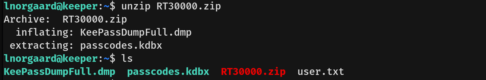
- I identified that this version of KeePass is vulnerable to **CVE-2022-32784**. This vulnerability allows an attacker to recover the master password (in plaintext) from the process memory dump, except for the first character.
  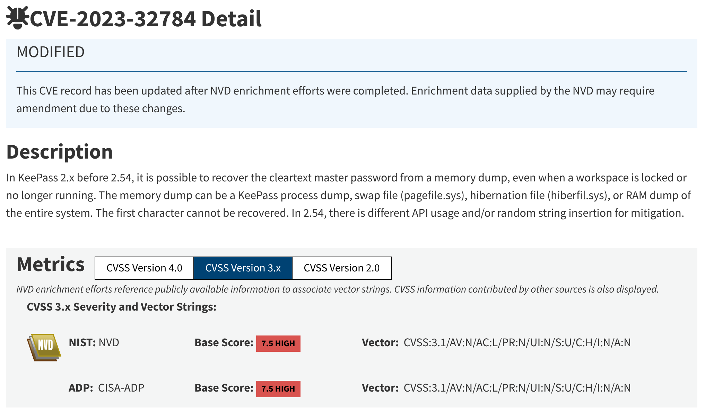
- I transferred the dump file to my machine and ran a POC tool to analyze the dump.
  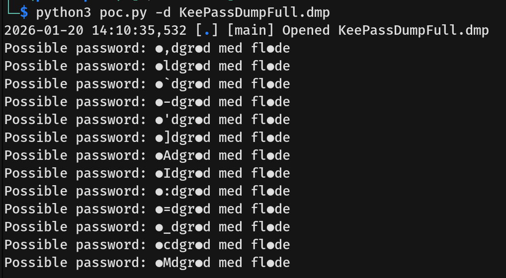
- The tool reconstructed the potential characters of the master password, and a Google search suggested the phrase was related to "rødgrød med fløde".
  
  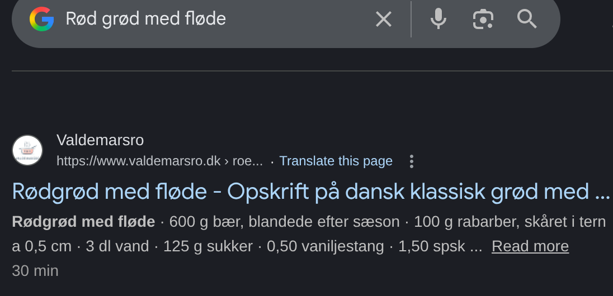
- I used this password (`rødgrød med fløde`) to open the `passcodes.kdbx` file using KeePassXC.
  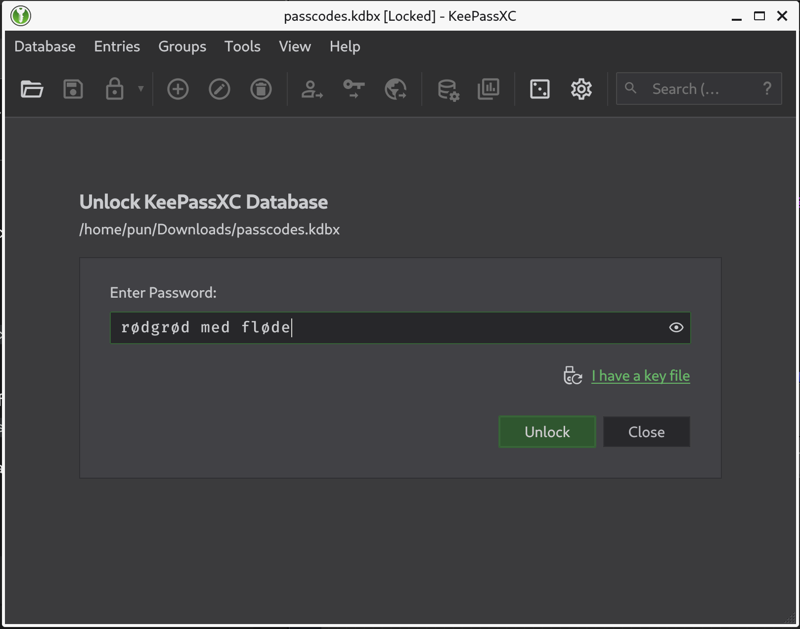
  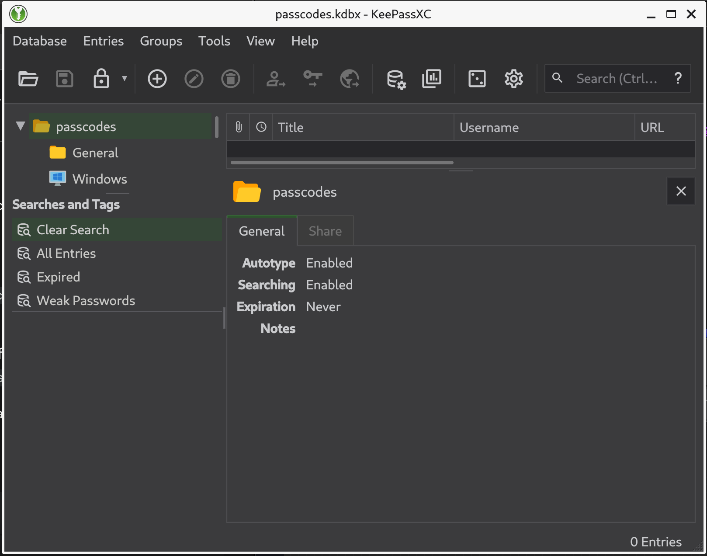
- Inside the database, I found an entry for **root**. It contained an SSH Private Key in PuTTY (`.ppk`) format in the notes section.
  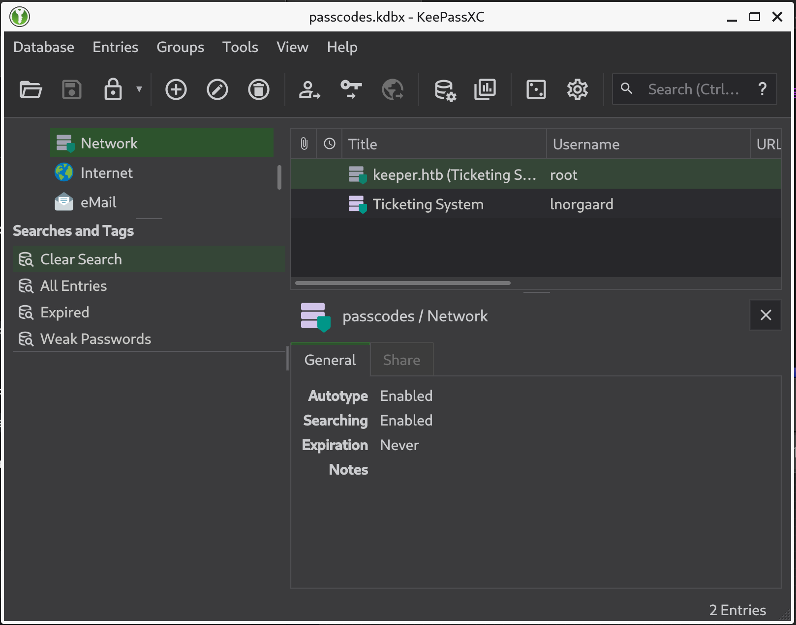
  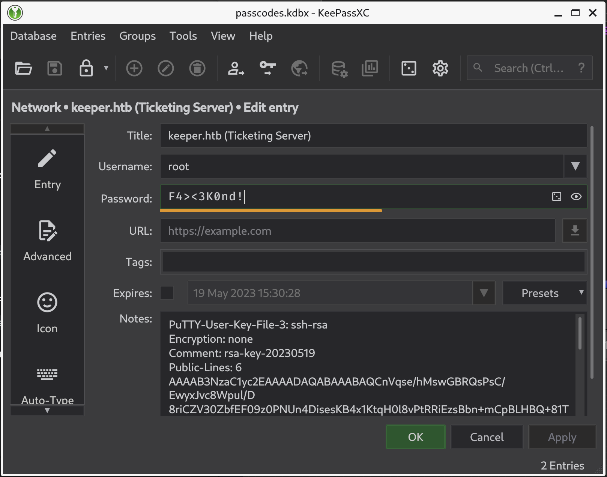
- I attempted to SSH into the machine using the root password found in the database, but it failed.
  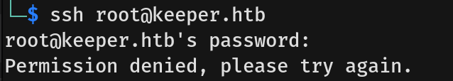
- I saved the key content to a file named `root.ppk` and used `puttygen` to convert it to the standard OpenSSH format.
  
  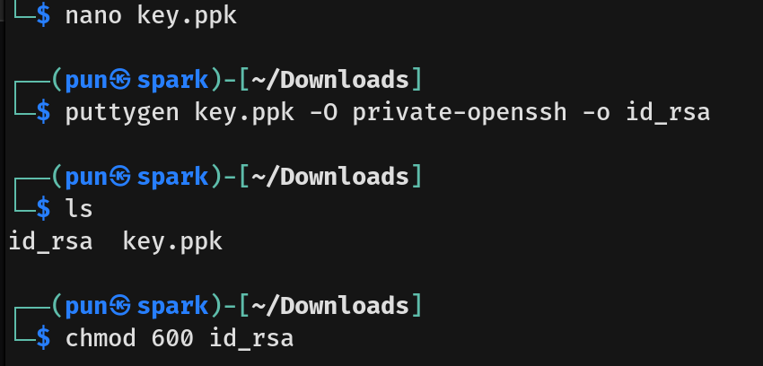
- Finally, I used the converted key to SSH into the machine as **root**.
  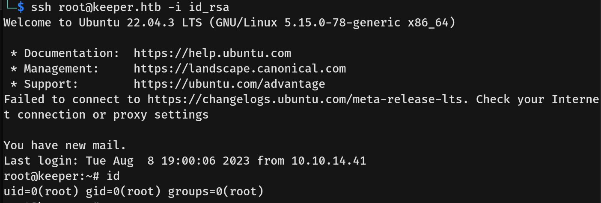
- I captured the **root flag**.
