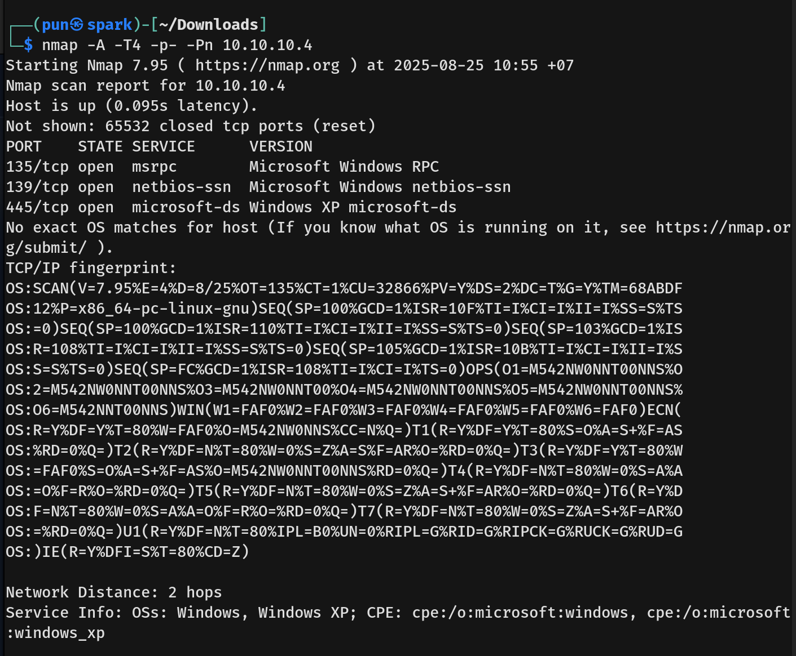
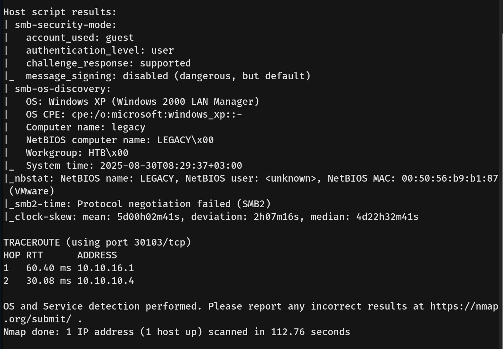
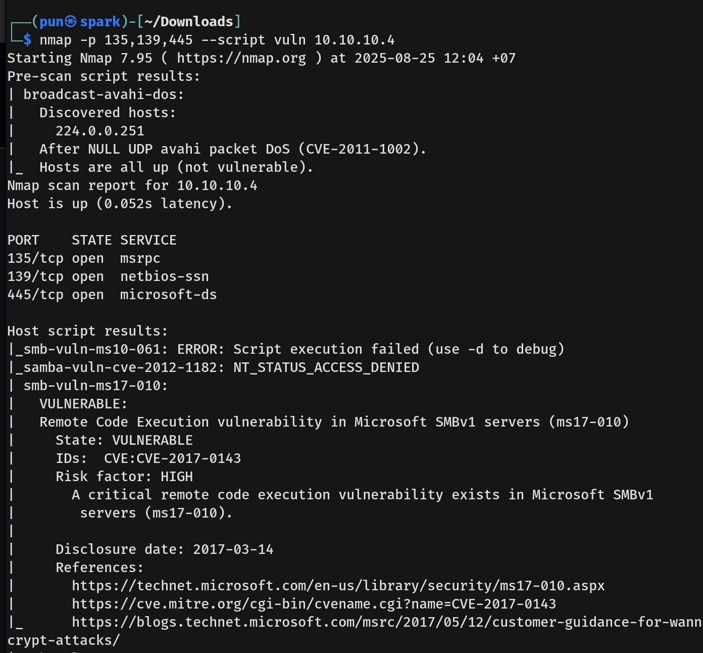
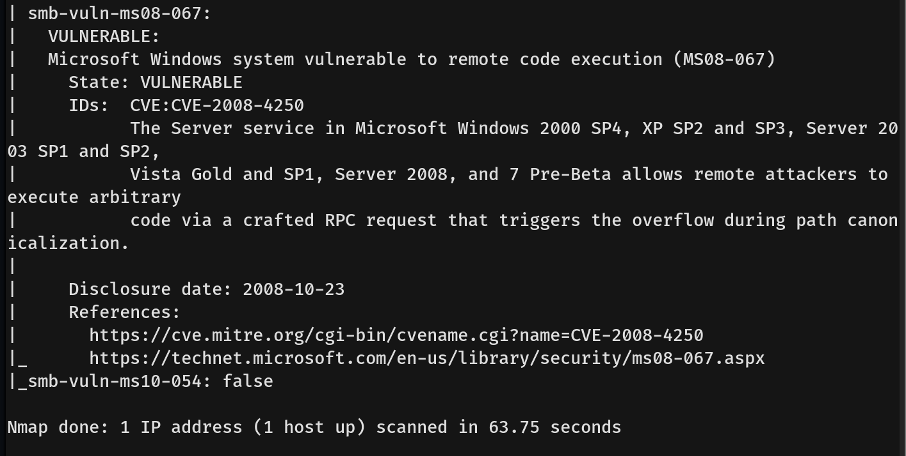
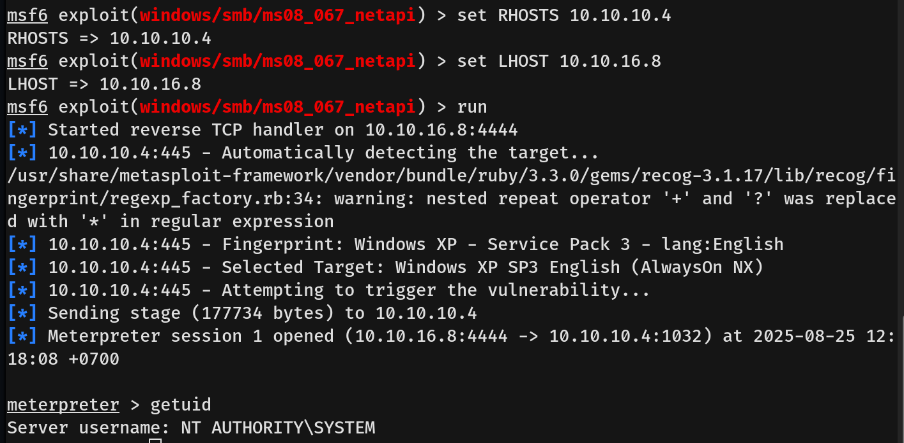

# Legacy Writeup - by Thammanant Thamtaranon  
- Legacy is an easy Windows machine hosted on Hack The Box.

## Reconnaissance  
- I started with a full TCP port scan including service/version detection and OS fingerprinting:  
  `nmap -A -T4 -Pn -p- 10.10.10.4`  
  
  
- The scan showed three open ports:  
  - 135 (MSRPC)  
  - 139 (NetBIOS)  
  - 445 (SMB)

## Scanning & Enumeration  
- We then ran an Nmap script scan for vulnerabilities:  
  `nmap -p 135,139,445 --script vuln 10.10.10.4`  
  
  
- We found **CVE-2008-4250** and **CVE-2017-0143 (EternalBlue)**. Since we already exploited EternalBlue on the Blue machine, we focused on **CVE-2008-4250** this time.  
- **CVE-2008-4250** is a remote code execution vulnerability in the Server service (`srvsvc.dll`) on Windows.  
- A crafted RPC request is sent to the Server Service over SMB/RPC. Due to improper bounds checking, the function overflows memory (buffer overflow), allowing an attacker to inject arbitrary shellcode and execute it with SYSTEM privileges.

## Exploitation  
- We then ran `msfconsole`, searched for `CVE-2008-4250`, filled in the exploit options, and ran it.  
  
- We then retrieved the user flag from John’s Desktop and the root flag from the Administrator’s Desktop.
